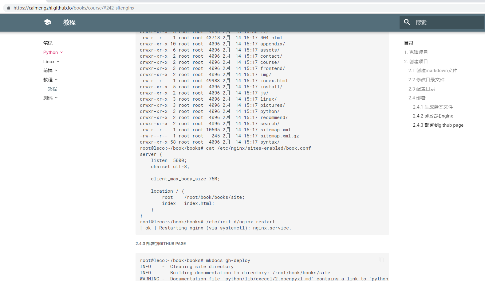

### 1. 克隆项目

```
root@leco:/tmp/leco# git clone git@github.com:caimengzhi/books.git
正克隆到 'books'...
remote: Enumerating objects: 1879, done.
remote: Counting objects: 100% (1879/1879), done.
remote: Compressing objects: 100% (237/237), done.
remote: Total 6365 (delta 835), reused 1800 (delta 782), pack-reused 4486
接收对象中: 100% (6365/6365), 5.58 MiB | 24.00 KiB/s, 完成.
处理 delta 中: 100% (2938/2938), 完成.
检查连接... 完成。
root@leco:/tmp/leco# cd books/
root@leco:/tmp/leco/books# ls
docs  mkdocs.yml  README.md  site
root@leco:/tmp/leco/books# cd ..
root@leco:/tmp/leco# tree . -L 3
.
└── books
    ├── docs
    │   ├── appendix
    │   ├── contact.md
    │   ├── frontend
    │   ├── img
    │   ├── index.md
    │   ├── install
    │   ├── js
    │   ├── linux
    │   ├── pictures
    │   ├── python
    │   ├── recommend.md
    │   └── syntax
    ├── mkdocs.yml
    ├── README.md
    └── site
        ├── 404.html
        ├── appendix
        ├── assets
        ├── contact
        ├── frontend
        ├── img
        ├── index.html
        ├── install
        ├── js
        ├── linux
        ├── pictures
        ├── python
        ├── recommend
        ├── search
        ├── sitemap.xml
        ├── sitemap.xml.gz
        └── syntax

25 directories, 9 files

```
> 解释

- 1 整体说明
```
root@leco:/tmp/leco/books# tree . -L 1
.
├── docs         # 笔记总入口
├── mkdocs.yml   # 总配置文件
├── README.md    
└── site         # 静态文件，以后部署到类似nginx

2 directories, 2 files

```
- 2 细节说明
```
root@leco:/tmp/leco# tree . -L 3
.
└── books
    ├── docs
    │   ├── appendix     # 忽视先别改
    │   ├── contact.md   # 忽视先别改
    │   ├── frontend     # 忽视先别改
    │   ├── img          # 忽视先别改
    │   ├── index.md     # 忽视先别改
    │   ├── install      # 忽视先别改
    │   ├── js           # 忽视先别改
    │   ├── linux        # 新创建的写Linux相关笔记总入口
    │   ├── pictures     # 记录所有笔记的文档入口
    │   ├── python       # 类型上面linux，
    │   ├── recommend.md # 忽视先别改
    │   └── syntax       # 忽视先别改
    ├── mkdocs.yml       # 总配置文件，写目录结构文件
    ├── README.md   
    └── site             # 执行静态文件
        ├── 404.html
        ├── appendix
        ├── assets
        ├── contact
        ├── frontend
        ├── img
        ├── index.html
        ├── install
        ├── js
        ├── linux
        ├── pictures
        ├── python
        ├── recommend
        ├── search
        ├── sitemap.xml
        ├── sitemap.xml.gz
        └── syntax

25 directories, 9 files
```
??? note "生成静态文件"
	```text
	mkdocs build
	然后就在项目的文件夹下生成site静态文件，以后nginx的家目录指定到这个目录下即可
	```

### 2. 创建项目
#### 2.1 创建markdown文件

```
root@leco:~/book/books/docs# cd course/
root@leco:~/book/books/docs/course# ls
index.md
root@leco:~/book/books/docs/course# cat index.md
### 1. 克隆项目
root@leco:/tmp/leco# git clone git@github.com:caimengzhi/books.git
正克隆到 'books'...
remote: Enumerating objects: 1879, done.
remote: Counting objects: 100% (1879/1879), done.
remote: Compressing objects: 100% (237/237), done.
remote: Total 6365 (delta 835), reused 1800 (delta 782), pack-reused 4486
接收对象中: 100% (6365/6365), 5.58 MiB | 24.00 KiB/s, 完成.
处理 delta 中: 100% (2938/2938), 完成.
检查连接... 完成。
root@leco:/tmp/leco# cd books/
root@leco:/tmp/leco/books# ls
docs  mkdocs.yml  README.md  site
root@leco:/tmp/leco/books# cd ..
root@leco:/tmp/leco# tree . -L 3
.
└── books
```
#### 2.2 修改目录文件
```
文件内容其他省略
root@leco:~/book/books# egrep -irn  course mkdocs.yml
107:          - 教程: course/index.md
```

#### 2.3 配置目录

配置相关信息，提交代码
```
root@leco:~/book/books/docs/course# cd ..
root@leco:~/book/books/docs# ls
appendix  contact.md  course  frontend  img  index.md  install  js  linux  mysql  pictures  python  recommend.md  syntax
root@leco:~/book/books/docs# cd ..
root@leco:~/book/books# ls
docs  mkdocs.yml  README.md  site
root@leco:~/book/books# ls
docs  mkdocs.yml  README.md  site
root@leco:~/book/books# git add .
root@leco:~/book/books# git commit -m 'add course how to use mkdocs'
[master 205de67] add course how to use mkdocs
 98 files changed, 10137 insertions(+), 4377 deletions(-)
 create mode 100644 docs/course/index.md
 create mode 100644 site/course/index.html
 rewrite site/search/search_index.json (64%)
root@leco:~/book/books# git tag v1.0
root@leco:~/book/books# git push
对象计数中: 215, 完成.
Delta compression using up to 4 threads.
压缩对象中: 100% (28/28), 完成.
写入对象中: 100% (215/215), 152.75 KiB | 173.00 KiB/s, 完成.
Total 215 (delta 97), reused 195 (delta 83)
remote: Resolving deltas: 100% (97/97), completed with 13 local objects.
To git@github.com:caimengzhi/books.git
   0de48fc..205de67  master -> master
```
#### 2.4 部署
##### 2.4.1 生成静态文件
```
root@leco:~/book/books# mkdocs build
```
> 执行 mkdocs build的时候必须在这目录下因为会去找配置文件，执行后此时会生成静态文件site

##### 2.4.2 site结和nginx
```
root@leco:~/book/books# ll site
总用量 176
drwxr-xr-x 16 root root  4096 2月  14 15:17 ./
drwxr-xr-x  5 root root  4096 2月  13 16:36 ../
-rw-r--r--  1 root root 43718 2月  14 15:17 404.html
drwxr-xr-x 10 root root  4096 2月  14 15:17 appendix/
drwxr-xr-x  6 root root  4096 2月  14 15:17 assets/
drwxr-xr-x  2 root root  4096 2月  14 15:17 contact/
drwxr-xr-x  2 root root  4096 2月  14 15:17 course/
drwxr-xr-x  3 root root  4096 2月  14 15:17 frontend/
drwxr-xr-x  2 root root  4096 2月  14 15:17 img/
-rw-r--r--  1 root root 49983 2月  14 15:17 index.html
drwxr-xr-x  5 root root  4096 2月  14 15:17 install/
drwxr-xr-x  2 root root  4096 2月  14 15:17 js/
drwxr-xr-x  3 root root  4096 2月  14 15:17 linux/
drwxr-xr-x  3 root root  4096 2月  14 15:17 pictures/
drwxr-xr-x  3 root root  4096 2月  14 15:17 python/
drwxr-xr-x  2 root root  4096 2月  14 15:17 recommend/
drwxr-xr-x  2 root root  4096 2月  14 15:17 search/
-rw-r--r--  1 root root 10505 2月  14 15:17 sitemap.xml
-rw-r--r--  1 root root   245 2月  14 15:17 sitemap.xml.gz
drwxr-xr-x 58 root root  4096 2月  14 15:17 syntax/
root@leco:~/book/books# cat /etc/nginx/sites-enabled/book.conf
server {
    listen  5000;
    charset utf-8;

    client_max_body_size 75M;

    location / {
        root    /root/book/books/site;
        index   index.html;
    }
}
root@leco:~/book/books# /etc/init.d/nginx restart
[ ok ] Restarting nginx (via systemctl): nginx.service.

```

展示效果


##### 2.4.3 部署到github page
```
root@leco:~/book/books# mkdocs gh-deploy
INFO    -  Cleaning site directory
INFO    -  Building documentation to directory: /root/book/books/site
WARNING -  Documentation file 'python/lib/execel/2.openpyxl.md' contains a link to 'python/lib/execel/或list(sheet.columns)[index]' which is not found in the documentation files.
INFO    -  Copying '/root/book/books/site' to 'gh-pages' branch and pushing to GitHub.
INFO    -  Your documentation should shortly be available at: https://caimengzhi.github.io/books/
```

#### 2.5 配置快捷命令

```
root@leco:~/book/books/docs/course# egrep -irn 'cmz' /root/.bashrc
84:alias cmzb='cd /root/book/books;mkdocs build;cd -'
85:alias cmzd='cd /root/book/books;mkdocs gh-deploy;cd -'
```
下次登录root用户的时候，在任何目录下都可以执行cmzb。

```
root@leco:~/book/books/docs/course# cmzd
INFO    -  Cleaning site directory
INFO    -  Building documentation to directory: /root/book/books/site
WARNING -  Documentation file 'python/lib/execel/2.openpyxl.md' contains a link to 'python/lib/execel/或list(sheet.columns)[index]' which is not found in the documentation files.
INFO    -  Copying '/root/book/books/site' to 'gh-pages' branch and pushing to GitHub.
INFO    -  Your documentation should shortly be available at: https://caimengzhi.github.io/books/
```

#### 2.6 配置文件
把截取的图片上传到指定的目录下

```
root@leco:~/book/books/docs/course# ls ~/book/books/docs/pictures/course/1.png
/root/book/books/docs//course/1.png
```

展示效果


??? note "注意图片相对位置"
	```text
	1.  期中图片的位置是../pictures/course/1.png是根据markdown文件所在位置去找图片的相对位置
        root@leco:~/book/books/docs/course# ls
        index.md
        root@leco:~/book/books/docs/course# ls ../pictures/course/1.png
        ../pictures/course/1.png

	2. 我试过绝对路径不行，你们试试看
	```

