<center><h1> CSS </h1></center>

## 1. CSS介绍
&#160; &#160; &#160; &#160;层叠样式表(英文全称：Cascading Style Sheets)是一种用来表现HTML（标准通用标记语言的一个应用）或XML（标准通用标记语言的一个子集）等文件样式的计算机语言。CSS不仅可以静态地修饰网页，还可以配合各种脚本语言动态地对网页各元素进行格式化，CSS 能够对网页中元素位置的排版进行像素级精确控制，支持几乎所有的字体字号样式，拥有对网页对象和模型样式编辑的能力。

&#160; &#160; &#160; &#160; 首先强调一点CSS在前端页面中的地位。HTML代码写完后。CSS对HTML进行修缮，也就是传说的"美容师"。如我们在浏览器上看到的页面中的字体颜色，字体大小，段落格式，图片，视频显示，而Js的作用就是我们让页面动起来。比如 我们鼠标点击，拖动等，动作都是js起到作用。


## 2. CSS 引入
### 2.1 特性

&#160; &#160; &#160; &#160; 概念：层叠样式表或者级联样式表（Cascading style sheets）

&#160; &#160; &#160; &#160; 层叠：CSS的特性

&#160; &#160; &#160; &#160; 作用：设置网页结构样式(改变html标签样式)，通过CSS给HTML标签属性达到改变标签样式。

### 2.2 引入方式
#### 2.2.1 内嵌方法
&#160; &#160; &#160; &#160;css样式写在html文件head内。
```
<head>
    <style type="text/css">
        样式表内容|CSS代码
   </style>
</head>
```
样式只作用于当前文件，没有真正实现结构表现分离。
#### 2.2.2 外链方法
&#160; &#160; &#160; &#160;css样式为单独的文件，然后html文件链接到此css文件，极力推荐这样写。

```
<head>
    <link rel="stylesheet" href="header.css">
<head>
```
作用于链接到它的文件，范围广，真正实现结构表现分离。

#### 2.2.3 行内方法
&#160; &#160; &#160; &#160;直接写在标签内的样式。

```
<body>
    <h1 style="font-size:30px; color:red;">博客</h1>
</body>
```
作用范围仅限于当前标签，范围小，结构表现混在一起。


## 3. 选择器
&#160; &#160; &#160; &#160;在 CSS 中，选择器是一种模式，用于选择需要添加样式的元素。选择器 {属性：值;}
选择器：选择标签的过程

1. 标签选择器
1. 类选择器
1. D选择器
1. 通配符选择器

交集选择器（标签指定式）

1. 后代选择器
1. 自带选择器
1. 并集选择器

补充选择器
1. 伪类选择器
1. 属性选择器
1. 伪元素选择器

### 3.1 选择器介绍
&#160; &#160; &#160; &#160;"CSS" 列指示该属性是在哪个 CSS 版本中定义的。（CSS1、CSS2 还是 CSS3。


选择器|例子	|例子描述	|CSS版本
---|---|---|---
.class	|.intro	选择 |class="intro" 的所有元素。	|1
#id	|#firstname	选择 |id="firstname" 的所有元素。	|1
*	|*	|选择所有元素。	|2
element	|p	|选择所有 <p> 元素。	|1
element,element	|div,p	|选择所有 <div> 元素和所有 <p> 元素。	|1
element element	|div p	|选择 <div> 元素内部的所有 <p> 元素。	|1
element>element	|div>p	|选择父元素为 <div> 元素的所有 <p> 元素。	|2
element+element	|div+p	|选择紧接在 <div> 元素之后的所有 <p> 元素。	|2
[attribute]	|[target]	|选择带有 target 属性所有元素。	|2
[attribute=value]	|[target=_blank]	|选择 target="_blank" 的所有元素。	|2
[attribute~=value]	|[title~=flower]	|选择 title 属性包含单词 "flower" 的所有元素。	|2
[attribute|=value]	|[lang|=en]	|选择 lang 属性值以 "en" 开头的所有元素。	|2
:link	|a:link	|选择所有未被访问的链接。	|1
:visited|	|a:visited	|选择所有已被访问的链接。	|1
:active	|a:active|	选择活动链接。	|1
:hover|	a:hover|	选择鼠标指针位于其上的链接。	|1
:focus|	input:focus|	选择获得焦点的 input 元素。	|2
:first-letter|	p:first-letter	|选择每个 <p> 元素的首字母。	|1
:first-line|	p:first-line	|选择每个 <p> 元素的首行。	|1
:first-child|	p:first-child	|选择属于父元素的第一个子元素的每个 <p> 元素。	|2
:before	|p:before|	在每个 <p> 元素的内容之前插入内容。	|2
:after	|p:after|	在每个 <p> 元素的内容之后插入内容。	|2
:lang(language)	|p:lang(it)	|选择带有以 "it" 开头的 lang 属性值的每个 <p> 元素。	|2
element1~element2|	p~ul	|选择前面有 <p> 元素的每个 <ul> 元素。	|3
[attribute^=value]|	a[src^="https"]	|选择其 src 属性值以 "https" 开头的每个 <a> 元素。	|3
[attribute$=value]|	a[src$=".pdf"]	|选择其 src 属性以 ".pdf" 结尾的所有 <a> 元素。	|3
[attribute*=value]|	a[src*="abc"]	|选择其 src 属性中包含 "abc" 子串的每个 <a> 元素。	|3
:first-of-type	|p:first-of-type	|选择属于其父元素的首个 <p> 元素的每个 <p> 元素。	|3
:last-of-type	|p:last-of-type	|选择属于其父元素的最后 <p> 元素的每个 <p> 元素。	|3
:only-of-type	|p:only-of-type	|选择属于其父元素唯一的 <p> 元素的每个 <p> 元素。	|3
:only-child	|p:only-child	|选择属于其父元素的唯一子元素的每个 <p> 元素。	|3
:nth-child(n)	|p:nth-child(2)	|选择属于其父元素的第二个子元素的每个 <p> 元素。	|3
:nth-last-child(n)	|p:nth-last-child(2)	|同上，从最后一个子元素开始计数。	|3
:nth-of-type(n)	|p:nth-of-type(2)	|选择属于其父元素第二个 <p> 元素的每个 <p> 元素。	|3
:nth-last-of-type(n)	|p:nth-last-of-type(2)	|同上，但是从最后一个子元素开始计数。	|3
:last-child	|p:last-child	|选择属于其父元素最后一个子元素每个 <p> 元素。	|3
:root	|:root	|选择文档的根元素。	|3
:empty	|p:empty	|选择没有子元素的每个 <p> 元素（包括文本节点）。	|3
:target	|#news:target	|选择当前活动的 #news 元素。	|3
:enabled	|input:enabled	|选择每个启用的 <input> 元素。	|3
:disabled	|input:disabled	|选择每个禁用的 <input> 元素	|3
:checked	|input:checked	|选择每个被选中的 <input> 元素。	|3
:not(selector)	|:not(p)	|选择非 <p> 元素的每个元素。	|3
::selection	|::selection	|选择被用户选取的元|3

### 3.2 标签选择器
&#160; &#160; &#160; &#160;Html标签名 {属性：值;} ，常用的属性:

属性 | 描述
---|---
color           			|前景色（文字颜色）
backgroud-color  			|背景色
font-size         			|设置文字大小
width           			|设置宽度
height           			|设置高度
text-align left|right|center 	|内容（文字图片）显示。只能使用块级使用
text-indent 					|首行缩进 
text-indent: 2em; 			|首行缩进两个汉字
text-indent: 20px; 			|首行缩进20像素

### 3.3 单位介绍

属性 | 描述
---|---
px | 像素 20px----20像素点
em | 1em=1个文字大小，nem=n个文字大小

### 3.4 颜色
#### 3.4.1 直接使用颜色的名词   

- background-color:	red;

#### 3.4.2 使用16进制表示    
- background-color: 	#000000;

#### 3.3.3 使用三原色表示
```
rgb
  	r: red  		(0-255)取值范围
   	g:green	    	(0-255)取值范围
   	b:blue         	(0-255)取值范围
	background-color: 	rgb(23,56,89);
    1. 半透明：
       background-color:	 rgba(23,56,89,0.2); #最后一位取值0到1
    2. 使用opacity实现半透明
       background-color: 	red;
	   opacity: 	0.5;     会让文字也半透明
```
解决IE低版本不兼容问题

```
background-color:	 red;
opacity: 			 0.5;
filter: 			 Alpha(opacity=50);

```

### 3.5 类选择器
首先，类 选择器前面有一个 . 号 也称为棋点号。
#### 3.5.1 自定义类名
自定义类名 {属性：值;} - 通过.自定义类名 定义一个类样式 .p_red{  }

#### 3.5.2 调用
标签通class属性调用类样式 

```
<p class="p_red">文字2</p>
.p_red{
    	color: red;
	} 
<p class="p_red">文字2</p>
```
此时会将标签p中class是p_red的选中

#### 3.5.3 特点
1. 一个样式可以被多个标签调用

```
<p class="p_red">文字2</p>
<div class="p_red">文字2</div>
```
2. 一个标签可以同时调用多个类样式(中间加空格)

```
<div class="p_red public">文字2</div>
```
#### 3.5.4 命名规范

1. 顾名思义
    就是根据作用起对应的名字。比如排头滚动的标语，可以选择banner
2. 通用类名

中文名| 英文名
---|---
头    |header
内  容|content/container
尾    |footer
导  航|nav
侧  栏|sidebar
栏  目|column
标  志| logo
广  告|banner
热  点|hot
新  闻|news
下  载|download
菜  单|menu
搜  索|search
页  脚|footer
版  权|copyright
滚  动|scroll
内  容|content
友情链接|friendlink
子导  航|subnav
页面主体|main
左中  右|left right center
登录  条|loginbar
页面外围控制整体布局宽度|wrapper

以下是不推荐的写法

- 不能使用以数字开头
- 不推荐使用中文定义类名（虽然可以使用）
- 不能使用以特殊字符开头的
- 个人不推荐使用标签名作为定义类名 比如div作为class值的

### 3.6 ID 选择器
#### 3.6.1 ID选择器语法
&#160; &#160; &#160; &#160;在某些方面，ID 选择器类似于类选择器，不过也有一些重要差别。首先，ID 选择器前面有一个 # 号 - 也称为棋盘号或井号。语法如下

```
语法： #自定义名称 {属性: 值;}
```

#### 3.6.2 使用

1.	首先通过#自定义名称 定义一个id选择器样式

```
#color {
        color: red;
    }
```

2.	标签通过id属性调用id样式

```
<div class="one" id="color">caimengzhi</div>
```

3.	ID选择器和类选择器区别

```
1. 页面中的ID选择器值必须唯一，而类选择器可以重复。
2. 一个标签只能调用一个样式
    <div class="p_red public">caimengzhi</div>  是对的
    <div id="p_red public">caimengzhi</div>  是错误
```

### 3.7 通配符选择器
&#160; &#160; &#160; &#160;通配选择器用一个星号（*）表示。单独使用时，这个选择器可以与文档中的任何元素匹配，就像一个通配符。
语法

```
语法： *  {属性: 值;.....}
```
使用：该选择器会将页面中所有标签都选中

```
*  {
       color: red;
 }
```
会在样式初始化时候使用。

### 3.7 font 属性介绍
```
1. font-size        文字大小
2. font-weight      文字加粗
    1.	normal  	字体正常
    2.	700  		文字加粗
    3.	bold 		文字加粗
    4.	400 		正常显示
3.	font-style      文字斜体
1.	normal          正常
2.	italic          斜体
4. font-family 
    1.	font-family: "微软雅黑";
    2. 	文字字体表示方式
       1.  直接设置字体对应名称，（宋体，黑体）
       2.  设置字体对应的英文方式   
       3.  设置字体对应的unicode的编码
       4.  font-family 一次可以设置多个字体，字体字体之间用逗号隔开
       5.  line-height 设置文字行高 
```


### 3.8 font 属性连写
&#160; &#160; &#160; &#160;

```
1. font: font-weight font-style font-size/line-height font-family
  font: 700 italic 30px/20px 微软雅黑;
```

!!! note "注意"
    ```python
    1.  属性联写中必须设置font-size  font-family
    2.  属性联写中font-szie必须放到font-family之前
    3.  如果font属性联写中的属性都要设置，那么按照上述属性去设置
    ```

### 3.9 复合选择器
&#160; &#160; &#160; &#160;复合选择器是由两个或多个基础选择器，通过不同的方式组合而成的,目的是为了可以选择更准确更精细的目标元素标签

#### 3.9.1 标签指定式选择器
语法：

```
标签名.类名 {属性: 值;}  或者 标签名#id名 {属性: 值;}
```
关系

```
既。。。。又。。。。
```
如下图所有

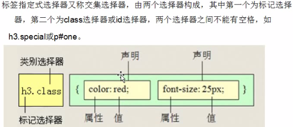

```
div.one{
    color:  red;
}
<div class="one">div中的文字</div>
<p class="one">p中的文字</p>
<div class="two">cmz</div>
```

#### 3.9.2 后代选择器
&#160; &#160; &#160; &#160;后代选择器（descendant selector）又称为包含选择器。后代选择器可以选择作为某元素后代的元素。

```
语法：
  选择器 选择器 ...{属性: 值;}
```

!!! note "注意"
    ```python
    1.	后代选择器标签之间必须是嵌套关系
    2.	选择器与选择器之间必须使用空格隔开
    3.	后代选择器只能选中后代元素(所有后代)
    ```

```
div span {
    color: red;
}
<div class="one">
    <span>文字1</span>
    <p>
        <span>文字2</span>
    </p>
</div>
<p class="tree">没有父元素p</p>
```
显示效果如下


#### 3.9.3 并集选择器
&#160; &#160; &#160; &#160;CSS并集选择器也叫群选择器，是由多个选择器通过逗号连接在一起的，这些选择器分别是：标签选择器、类选择器或id选择器等。

&#160; &#160; &#160; &#160;在声明各种CSS选择器时，如果某些选择器的风格完全相同，或者部分相同，便可以利用并集选择器同时声明这些风格相同的CSS选择器。

&#160; &#160; &#160; &#160;并集选择器允许同时给多个选择器应用同一种样式。

```
语法：
选择器,选择器...{属性: 值;}
```

!!! note "注意"
    ```python
    1.	选择器与选择器之间是有逗号隔开
    2.	选择器标签之间的结构可以是任何一种关系
    ```

```
div,p,span {
    color: blue;
}
<div class="one">123</div>
<p class="one">456</p>
<span>adsdsd</span>

```

#### 3.9.4 子代选择器
&#160; &#160; &#160; &#160;与后代选择器相比，子元素选择器（Child selectors）只能选择作为某元素子元素的元素,如果您不希望选择任意的后代元素，而是希望缩小范围，只选择某个元素的子元素，请使用子元素选择器（Child selector）。

```
语法：
选择器>选择器{属性: 值;} ---->子代就是儿子关系（下一代）
```

!!! note "注意"
    ```python
    1.  子代选择器之间必须是嵌套结构
    2.  子代选择器只能选择直接后代元素,也就是儿子那一代，
    3.  后代选择器可以选中所有后代元素
    ```

```
.one>span{
    color: red;
}
<div class="one">
    <span>直接后代后者直接子代</span>
    <p>
        <span>后代元素</span>
    </p>
</div>

```

显示效果如下


#### 3.9.5 属性选择器
&#160; &#160; &#160; &#160;可以为拥有指定属性的 HTML 元素设置样式，而不仅限于 class 和 id 属性。


```
语法：
[属性名]{属性: 值;
```
> 把具有id属性和class属性的标签选中


```
[id][class] {
    color: blue;
}
<div class="one">123</div>
<div class="one" id="two">456</div>
<div class="one" name="username">789</div>
```
显示效果如下


&#160; &#160; &#160; &#160; 属性选择器其他选择方式


##### 3.9.5.1 属性选择器 `=` 
```
1.	[属性=值]{
}


/*属性赋值*/
[class="two"]{
    color: crimson;
}

选择有class属性器属性值为two的标签
```

##### 3.9.5.2 属性选择器 `^=`

```
2.	[属性^=值]
[class^="two"] {
    color: darkblue;
}
选择有calss属性且以two开头的标签
```

##### 3.9.5.3 属性选择器 `$=`

```
[class$="two"] {
    color: darkblue;
}
选择有calss属性且以two结束的标签
```

##### 3.9.5.4 属性选择器 `*=`

```
[class*="two"] {
    color: darkblue;
}
选择有class属性且只要标签中包含two就行
```

### 3.10 伪类选择器
&#160; &#160; &#160; &#160; 结构伪类是CSS3新增的类型选择器，利用DOM树实现元素过滤，通过文档结构的相互关系来匹配元素，可以减少class和id属性的定义，使文档变得更加简洁

#### 3.10.1 root
&#160; &#160; &#160; &#160;选择元素所在文档的根元素。在(X)HTML文档中，根元素始终是html元素。
#### 3.10.2 not
&#160; &#160; &#160; &#160;否定选择器，和jQuery中的:not选择器一模一样，可以选择除某个元素之外的所有元素。 

```
<body>
    <div id="header">页头</div>
    <div id="page">页体</div>
    <div id="footer">页脚</div>
</body>

div{
  padding: 10px 20px;
  min-height: 50px;
}
div:not([id="footer"]){
  background: pink;
}
```


#### 3.10.3 empty
&#160; &#160; &#160; &#160;用来选择没有任何内容的元素，这里没有内容指的是一点内容都没有，哪怕是一个空格都不行

```
<body>
    <div>我这里有内容</div>
    <div> </div><!-- 我这里有一个空格 -->
    <div></div><!-- 我这里任何内容都没有 -->
</body>

div {
  min-height: 30px;
}

div:empty {
 background-color: green;
}
```

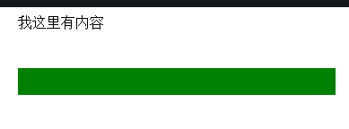

#### 3.10.4 first-child
&#160; &#160; &#160; &#160;选择F的第一个子元素(所有第一个子元素都会被选择) ,这里作为F(selector1)的第一个子元素的有 span、div里的p、ul的第一个li 

```
<body>
    <div id="selector1">
        <span>我是第一个span</span>
        <p>我是第一个p，在span后面</p>
        <div><p>第二个p</p></div>
        <p>第三个p</p>
        <p>第四个p</p>
        <em>I am em</em>
        <p>iewnvk</p>
        <ul>
            <li>1</li>
            <li>2</li>
            <li>3</li>
            <li>4</li>
            <li>5</li>
        </ul>
    </div> 
</body>

#selector1 :first-child{
    color: pink;
}
```
> first-child的冒号要与前面的元素有一个空格的距离，否则它会把父元素里所有的子元素都选上


#### 3.10.5 last-child
&#160; &#160; &#160; &#160;选择最后一个子元素 
各种变化和:first-child一样，不再举例。

#### 3.10.6 nth-child(n)
&#160; &#160; &#160; &#160;用来定位某父元素的一个或多个特定的子元素。其中“n”是参数，可以是整数值(1,2,3,4)，也可以是表达式(2n+1、-n+5)和关键词(odd、even)，参数n的起始值始终是1。也就是说，参数n的值为0时，选择器将选择不到任何匹配的元素。

- tr:nth-child(2n+1):匹配奇数行的tr
- tr:nth-child(2n):匹配偶数行的tr
- tr:nth-child(odd):匹配奇数行的tr
- tr:nth-child(even):匹配偶数行的tr
- tr:nth-child(4):匹配第四行的tr

```
<body>
    <ol>
      <li>item1</li>
      <li>item2</li>
      <li>item3</li>
      <li>item4</li>
      <li>item5</li>
      <li>item6</li>
      <li>item7</li>
      <li>item8</li>
      <li>item9</li>
      <li>item10</li>
    </ol>
</body>

ol > li:nth-child(2n-1){
  background: pink;
}
```


#### 3.10.7 nth-child(n)
&#160; &#160; &#160; &#160;选择在其父元素中倒数第n个位置的元素或特定某元素。 
计算顺序与:nth-child不同，其余用法相同，不再举例。

#### 3.10.8 first-of-type
&#160; &#160; &#160; &#160;选择器类似于“:first-child”选择器，不同之处就是指定了元素的类型,其主要用来定位一个父元素下的某个类型的第一个子元素。 
在E:first-of-type功能类似于E:nth-of-type(1) 

```
<body>
    <div class="wrapper">
      <p>我是第一个段落</p>
      <p>我是第二个段落</p>
      <div>我是第一个Div元素</div>
      <div>我是第二个Div元素</div>
      <p>我是第三个段落</p>
      <p>我是第四个段落</p>
      <div>我是第三个Div元素</div>
      <div>我是第四个Div元素</div>
    </div>
</body>

.wrapper > p,
.wrapper > div {
  margin: 10px 0;
  background:#89c3eb;
  color: #fff;
  padding: 5px;
}

.wrapper > div:first-of-type {
  background: #928178;
}

```


#### 3.10.9 last-of-type
&#160; &#160; &#160; &#160;选择器和“:first-of-type”选择器功能是一样的，不同的是他选择是父元素下的某个类型的最后一个子元素。不再举例


#### 3.10.10 nth-of-type(n)
&#160; &#160; &#160; &#160;选择器和“:nth-child(n)”选择器非常类似，不同的是它只计算父元素中指定的某种类型的子元素[即E:nth-of-type(n)]。当某个元素中的子元素不单是同一种类型的子元素时，使用“:nth-of-type(n)”选择器来定位于父元素中某种类型的子元素是非常方便和有用的。在“:nth-of-type(n)”选择器中的“n”和“:nth-child(n)”选择器中的“n”参数也一样，可以是具体的整数，也可以是表达式，还可以是关键词。 

```
<body>
    <div class="wrapper">
      <div>我是一个Div元素</div>
      <p>我是一个段落元素</p>
      <div>我是一个Div元素</div>
      <p>我是一个段落</p>
      <div>我是一个Div元素</div>
      <p>我是一个段落</p>
      <div>我是一个Div元素</div>
      <p>我是一个段落</p>
      <div>我是一个Div元素</div>
      <p>我是一个段落</p>
      <div>我是一个Div元素</div>
      <p>我是一个段落</p>
      <div>我是一个Div元素</div>
      <p>我是一个段落</p>
      <div>我是一个Div元素</div>
      <p>我是一个段落</p>
    </div>
</body>

.wrapper > div:nth-of-type(odd),
.wrapper > p:nth-of-type(even){
  background: #59b9c6;
}
```


#### 3.10.11 nth-last-of-type(n)
&#160; &#160; &#160; &#160;选择器和“:nth-of-type(n)”选择器是一样的，选择父元素中指定的某种子元素类型，但它的起始方向是从最后一个子元素开始，而且它的使用方法与“:nth-last-child(n)”选择器一样，不再举例。

#### 3.10.12 only-child
&#160; &#160; &#160; &#160;匹配的元素的父元素中有且仅有一个子元素。【E:only-child】 

```
<body>
    <ul>
      <li>Item1</li>
      <li>Item2</li>
      <li>Item3</li>
    </ul>
    <ul>
      <li>Item1</li>
    </ul>
    <ol>
      <li>Item1</li>
    </ol>
    <ol>
      <li>Item1</li>
      <li>Item2</li>
      <li>Item3</li>
    </ol>
</body>

li {
  background: #84b9cb;
  padding: 10px;
  margin-bottom: 5px;
}
li:only-child {
  background: #a99e93;
}
```


#### 3.10.13 only-of-type
&#160; &#160; &#160; &#160;选择其父元素只包含一个同类型的子元素 
【表示一个元素有很多个子元素，而其中只有一种类型的子元素是唯一的，使用“:only-of-type”选择器就可以选中这个元素中的唯一一个类型子元素。】

```
<body>
    <div class="wrapper">
      <p>我是一个段落</p>
      <p>我是一个段落</p>
      <p>我是一个段落</p>
    </div>

    <div class="wrapper">
      <p>我是一个段落</p>
    </div>

    <div class="wrapper">
      <div>我是一个Div元素</div>
      <p>我是一个段落</p>
      <div>我是一个Div元素</div>
    </div>
</body>

.wrapper {
  border: 1px solid #ccc;
  padding: 10px;
  width: 500px;
  margin: 10px auto;
}

.wrapper p:only-of-type{
  background: #84b9cb;
}
```


#### 3.10.14 link_visited
&#160; &#160; &#160; &#160;:link表示未访问的超链接，visite表示已访问的。 

```
<body>
    <a href="#">我未访问</a>
    <a href="##">我已访问</a>
</body>

a:link{
    color: pink;
    font-size: 20px;
}
a:visited{
    color: #7b8d42;
    font-size: 20px;
}
```
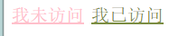

#### 3.10.15 hover
&#160; &#160; &#160; &#160;鼠标移动到链接，不仅限于链接，可用于页面中的任何元素（IE6中仅可用于链接） 

```
<body> 
    <input type="text" />
</body>

input:hover{
    height: 100px;
    background-color: #c099a0;
 }
```
鼠标未放上去效果


鼠标放上去效果

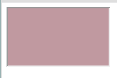

#### 3.10.16 active
&#160; &#160; &#160; &#160;被激活时的状态，不仅限于链接，可用于任何具有tabindex属性的元素， 
对a标签来说就是鼠标按下去的时候 
在CSS中，a:hover必须置于a:link和a:visited后才生效，a:active必须置于a:hover后才生效。

```
<body> 
    <a href="#">我是链接</a>
</body>

a:active  {color:yellow;}
```


#### 3.10.17 focus
&#160; &#160; &#160; &#160;用于设置获取焦点时的样式，不仅限于链接 

```
<body> 
    <input type="text" />
</body>

input:focus{
    background-color: #93ca76;
}
```
未获取焦点时：

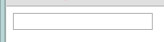

获取焦点后：


#### 3.10.18 enabled/disabled
&#160; &#160; &#160; &#160;在Web的表单中，有些表单元素有可用（“:enabled”）和不可用（“:disabled”）状态，比如输入框，密码框，复选框等。在默认情况之下，这些表单元素都处在可用状态。那么我们可以通过伪选择器“:enabled”对这些表单元素设置样式。 

```
<body>
    <form action="#">
      <div>
        <label for="enabled">可用输入框:</label>
        <input type="text" id="enabled" />
      </div>
      <div>
        <label for="disabled">禁用输入框:</label>
        <input type="text" id="disabled" disabled="disabled" />
      </div>
     </form>  
 </body>

div {
  margin: 30px;
}
input[type="text"]:enabled{
  border:3px solid #8491c3;
  box-shadow: 0 0 5px #8491c3;
}

input[type="text"]:disabled{
  box-shadow: none;
}
```


#### 3.10.19 checked
&#160; &#160; &#160; &#160;在表单元素中，单选按钮和复选按钮都具有选中和未选中状态。在CSS3中可以通过状态选择器“:checked”配合其他标签实现自定义样式。而“:checked”表示的是选中状态。 

```
<form action="#">
  <div class="wrapper">
    <div class="box">
      <input type="radio" checked="checked"  id="boy" name="1" /><span></span>
    </div>
    <label for="boy">男</label>
  </div>

  <div class="wrapper">
    <div class="box">
      <input type="radio"  id="girl" name="1"  /><span></span>
    </div>
    <label for="girl">女</label>
  </div>
</form> 

form {
  border: 1px solid #ccc;
  padding: 20px;
  width: 300px;
  margin: 30px auto;
}
.wrapper {
  margin-bottom: 10px;
}
.box {
  display: inline-block;
  width: 30px;
  height: 30px;
  margin-right: 10px;
  position: relative;
  background: orange;
  vertical-align: middle;
  border-radius: 100%;
}
.box input {
  opacity: 0;
  position: absolute;
  top:0;
  left:0;
  width: 100%;
  height:100%;
  z-index:100;/*使input按钮在span的上一层，不加点击区域会出现不灵敏*/
}

.box span { 
  display: block;
  width: 10px;
  height: 10px;
  border-radius: 100%;
  position: absolute;
  background: #fff;
  top: 50%;
  left:50%;
  margin: -5px 0  0 -5px;
  z-index:1;
}

input[type="radio"] + span {
  opacity: 0;

}
input[type="radio"]:checked + span {
  opacity: 1;
}
```


#### 3.10.20 read-only
&#160; &#160; &#160; &#160; 用来指定处于只读状态元素的样式。 

```
<form action="#">
  <div>
    <label for="name">姓名:</label>
    <input type="text" name="name" id="name" placeholder="大漠" />
  </div>
  <div>
    <label for="address">地址:</label>
    <input type="text" name="address" id="address" placeholder="中国上海" readonly="readonly" />
  </div>
  <div>
    <label for="comment">评论：</label>
    <textarea name="comment" id="" cols="30" rows="10" readonly="readonly"></textarea>
  </div>
</form>

form {
  width: 300px;
  padding: 10px;
  border: 1px solid #ccc;
  margin: 50px auto;
}
form > div {
  margin-bottom: 10px;
}
input[type="text"]{
  border: 1px solid orange;
  padding: 5px;
  background: #fff;
  border-radius: 5px;
}
input[type="text"]:-moz-read-only{
  border-color: #ccc;
}
input[type="text"]:read-only{
  border-color: #ccc;
}
textarea:-moz-read-only{
  border: 1px solid #ccc;
  height: 50px;
  resize: none;
  background: #eee;
}
textarea:read-only {
  border: 1px solid #ccc;
  height: 50px;
  resize: none;
  background: #eee;
}
```


#### 3.10.21 read-write
&#160; &#160; &#160; &#160; 用来指定当元素处于非只读状态时的样式。

```
<form action="#">
  <div>
    <label for="name">姓名:</label>
    <input type="text" name="name" id="name" placeholder="大漠" />
  </div>
  <div>
    <label for="address">地址:</label>
    <input type="text" name="address" id="address" placeholder="中国上海" readonly="readonly" />
  </div>
</form> 

form {
  width: 300px;
  padding: 10px;
  border: 1px solid #ccc;
  margin: 50px auto;
}
form > div {
  margin-bottom: 10px;
}
input[type="text"]{
  border: 1px solid orange;
  padding: 5px;
  background: #fff;
  border-radius: 5px;
}
input[type="text"]:-moz-read-only{
  border-color: #ccc;
}
input[type="text"]:read-only{
  border-color: #ccc;
}
input[type="text"]:-moz-read-write{
  border:2px solid red;
}

```


## 4. CSS 其他
### 4.1 元素显示方式
块级元素，行内元素，行内块元素
#### 4.1.1 块级元素

```
代表：
    div,p,ul,ol,dl,li,dd,dt,h1...h6...
  
特点:
1. 块级元素要独占一行显示
2. 块级元素默认宽度与父元素的宽度一致
3. 块级元素可以设置宽度和高度
```

#### 4.1.2 行内元素
```
代表：
    span,a,font,strong,i,s....

特点：
1. 行内元素可以在一行上显示
2. 行内元素不能设置高度和宽度
3. 设置宽度width 无效。
4. 设置高度height 无效，可以通过line-height来设置。
5. 设置margin 只有左右margin有效，上下无效。
6. 设置padding 只有左右padding有效，上下则无效。注意元素范围是增大了，但是对元素周围的内容是没影响的。
```
#### 4.1.3 行内块元素

```
代表：
    img,input.....

特点：
1. 行内元素可以在一行上显示
2. 行内元素可以设置高度和宽度
```
### 4.2  元素转换
#### 4.2.1 转化为块级元素
&#160; &#160; &#160; &#160;转化为块级元素（以块级元素的方式去显示）,语法如下：
```
display：block；
```
例子

```
a {
    width: 300px;   #是不生效的，因为a是行内元素，不能设置高度和宽度
    height: 300px;  #是不生效的，因为a是行内元素，不能设置高度和宽度
    background-color: red;
}
<a href="#">行内元素</a>

```


```
改之后
a {
    width: 300px;
    height: 300px;
    background-color: red;
/*转化为块元素*/
    display: block;  #将行内元素a转为块级元素，就可以设置高度和宽度
}
<a href="#">行内元素</a>
<a href="#">行内元素</a>
```
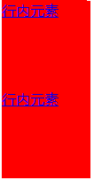

#### 4.2.2 转化为行内块元素
语法：

```
display：inline-block；
```
例子

```
a {
    width: 300px;   #是不生效的，因为a是行内元素，不能设置高度和宽度
    height: 300px;  #是不生效的，因为a是行内元素，不能设置高度和宽度
    background-color: red;
}
<a href="#">行内元素</a>
```


```
a { 
    width: 300px;
    height: 300px;
    background-color: red;
/*转化为块元素*/
    display: inline-block;  #将行内元素a转为行内块级元素，就可以设置高度和宽度
}
<a href="#">行内元素</a>
<a href="#">行内元素</a>
```


#### 4.2.3 转化为行内元素
语法:

```
display：inline；
```
例子

```
a{
    width: 100px;
    height: 100px;
    background-color: red;
    /*转化为块元素*/
    /*display: block;*/
    /*display: inline-block;*/
    display: inline;
}
div{
background-color: red;
    display: inline;
    width: 100px;   #都不启作用了，因为div被转为行内元素了
    height: 100px;  #都不启作用了，因为div被转为行内元素了
}
<div>我是行内元素</div> 
#原本这个div是要独占一行的，但是div被上面css改为行内元素了，所以和其他行内元素在一行显示
<a href="#">行内元素</a>
<a href="#">行内元素</a>
```
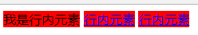

!!! python "注意"
    ```python
    1.	可以把行内元素，块元素转化成任何一直元素
    2.	行内块元素转化成行内元素没有效果 
    3.	一般情况下会将行内元素转换
    ```
#### 4.2.4 行内/块元素区别

- 块级：块级元素会独占一行，默认情况下宽度自动填满其父元素宽度,
- 行内：行内元素不会独占一行，相邻的行内元素会排在同一行。其宽度随内容的变化而变化。
- 块级：块级元素可以设置宽高
- 行内：行内元素不可以设置宽高
- 块级：块级元素可以设置margin，padding
- 行内：行内元素水平方向的margin-left; margin-right; padding-left; padding-right;可以生效。但是竖直方向的margin-bottom; margin-top; padding-top; padding-bottom;却不能生效。
- 块级：display:block;
- 行内：display:inline;可以通过修改display属性来切换块级元素和行内元素

### 4.3 CSS特性
#### 4.3.1 层叠性
&#160; &#160; &#160; &#160;在权重相同的情况下，用一个标签中样式发生冲突，后面的样式会将前面的样式给覆盖掉。样式与定义的顺序有关，与调用的顺序无关

```
 .one{
            color: red;
     }
     .two{
            color: blue;
     }
     <div class="one two">文字</div>
```
> 只跟CSS中调用的样式.one 和 .two的顺序有关和div的class后面的one和two顺序无关，调试网页的时候发下样式表格中的red模式已经被删除了。


#### 4.3.2 继承性

- 在默认情况下，如果子元素没有设置样式，那么子元素会继承父元素的样式
- 只能发生在标签嵌套结构中
- 宽度和高度不能被继承，只是块元素特点。

---

可继承的属性

- color
- 与font属相相关的都可以继承如font-sizes
- line-height可以被继承
- text-align可以被继承

#### 4.3.3 继承性中特殊标签

- a标签不能直接接受父元素中的文字颜色影响
- 标题标签(h1~h6)不能直接接受父元素中的文字大小影响，h1变为2em（2倍文字大小）

#### 4.3.4 权重

```
1. 	优先权（权重）
    标签选择器< 类选择器< ID选择器<行内样式<!important
    权重值 10         100        1000     10000    10000+
    
2. 	继承权重为0
    没有自己样式就继承，有自己样式就覆盖
    
3.  权重可以叠加
```

```
div p{
  color: red;
}
p{
  color:blue;
}
```
最终会是red，因为div加p的权重大于p的权重。

!!! tip "总结"
    ```python
    1.	通过选择器指向的是同一个标签，如果权重不一样，那么只要考虑优先级。
    2.	通过选择器指向的是同一个标签，如果权重一样，那么只考虑层叠性。
    ```

### 4.4 背景
#### 4.4.1 背景颜色

```
background-color 设置颜色
默认值是：transparent 透明色
```
#### 4.4.2 背景图片

```
background-image 设置背景图片
1.	none/url（使用绝对或者相对路径）
	background-image: url("1.png");
```
#### 4.4.3 背景平铺

```
background-repeat 设置背景图片平铺
1.	repeat    默认值
2.	no-repeat 不平铺
3.	repeat-x   横向平铺
4.	repeat-y   纵向平铺
```
#### 4.4.4 背景定位

```
background-position 设置背景图片位置
1. length   百分比|有浮点数字和单位标识符组成的长度
2. position  top|center|bottom|left|right
    background-position: right top; 设置背景图片为右上角
```

!!! note "注意"
```python
	1. 当背景图片设置一个值的时候，第二个默认是center。
       background-position: right； 此时图片就是右中显示
    2. 当背景图片位置出现具体数字的时候，第一个值代表水平方向，第二只代表垂直方向。
```

#### 4.4.5 背景图片连写

```
background: red url("logo.png") no-repeat right top;
注意：
1.  该属性联写中没有个数限制
2.  该属性中没有顺便限制
```

### 4.5 行高
#### 4.5.1 行高特性

- 行高属于文字的属性 
- 行高=文字大小+上间距+下间距（默认行高是18px,文字大小是16px，上间距和下间距都是1px）

- 行高的作用：
    1.	设置文字垂直方向中有间距
    2.	文字垂直居中(让行高=容器的高度就可以了)

- 影响行高
    1.	文字大小可以改变行高
    2.	文字字体也可以改变行高


#### 4.5.2 行高单位

- 如何给单独一个标签设置行高

```
px       ：行高值就是设置的大小,与文字大小没有关系    推荐使用 
em       ：行高值=设置的行高*文字大小
百分比   : 行高值=设置的行高*文字大小
不带单位 : 行高值=设置的行高*文字大小
```

- 如果给父元素设置行高，子元素行高特点

```
父px       ：子元素的行高=父元素的行高               推荐使用
父em       ：子元素的行高=父元素的行高*父元素文字大小（先计算后继承）
父百分比   : 子元素的行高=父元素的行高*父元素文字大小（先计算后继承）
父不带单位 : 子元素的行高=父元素的行高*子元素文字大小（先继承后计算）
```

### 4.6 盒子模型
#### 4.6.1 作用
实现网页布局（在网页里面画盒子）

#### 4.6.2 组成

```
边框  	border
内边距	padding   盒子中的内容和盒子边框的距离
外边界	margin	  盒子与盒子之间的距离
```

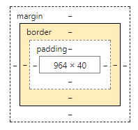

#### 4.6.3 边框
##### 4.6.3.1 边框基本设置
```
1.   border-style:  none; 默认没有边框
    a)	solid     实线
    b)	dotted    点线
    c)	dashed    虚线
    d)	none      没有边框

2.   border-width:  边框宽度
3.   border-color:  边框颜色
4.   border属性联写中
    a)	必须设置border-style
    b)	没有书序限制
5.	其他写法
    border-left: 2px dotted green;        #左边框
    border-right: 5px dashed yellow;      #右边框
    border-top: 3px dotted red;           #上边框
    border-bottom:5px dashed darkcyan;    #下边框
    border-left: 5px dashed pink;
    等价于
    border-left-color: pink;
    border-left-style: dashed;
    border-left-width: 5px;
```

##### 4.6.3.2 去边框

```
border：0 none； #0 加上主要是兼容性需要
```

##### 4.6.3.3 去轮廓

```
outline-style: none; 如input
```

导航条练习例子

```
.nav{
    height: 50px;
    border-top: 1px solid red ;
    border-bottom: 1px solid pink ;
    background-color: #ddd;
}
.nav a{
    text-decoration: none;
    heighte: 50px;
    display: inline-block;
/*设置行高*/
    line-height: 50px;  
}
.nav a:hover{
    background-color: #ccc;
    color: red;
}
<a href="#">首页</a>
<a href="#">设置为首页</a>
```


Label for id 通过label来当用户点击标签名也可以输入

```
<label for="um">用户名: </label>
<input type="text" class="username" id="um"><br><br>
```

#### 4.6.4 内边框

定义：内容与边框之间的距离

注意：padding值只能移动盒子里面内容。

```
padding值属性联写：
1.  padding: 10px;  表示上右下左（顺时针）的值都是10px
2.  padding: 10px 20px; 表示上下10px，左右20px  
3.  padding: 10px 20px 30px; 表示上10px，右20px，下30px，左20px 
4.  padding: 10px 20px 30px 40px; 表示上10px，右20px，下30px，左40px
```

!!! note "盒子问题"
    ```python
    盒子大小问题：
    1.  边框和内边界可以改变盒子大小
    2.  盒子大小（宽度）= 内容宽度+左右内边距+左右边框
    
    嵌套盒子padding值
    1. 继承的盒子，默认不设置宽度的情况下，给子盒子设置padding值在父盒子宽度范围内不会影响子盒子大小，
    2. 给子盒子设置padding值在父盒子宽度范围之外，此时子盒子就是变大，此时已经撑出了大盒子。
    ```
    

#### 4.6.5 外边框
定义： 盒子与盒子之间距离，移动盒子。

padding属性联写： 与内边距（padding）一样。
> 外边界不会改变盒子大小

特点:

- 垂直外边距合并（以最大外边距值为准）
- 垂直外边距塌陷。

外边框塌陷解决方法：
- 给父元素设置边框
- 给父元素设置overflow: hidden;(由于overflow:hidden触发了元素bfc（格式化上下文）)

#### 4.6.6 默认标签内外边距

```
body,p,h1,h2,h3,h4,h5,h6,ul,ol,dl,li,dd,dt,input{
    margin:    0;
    padding:  0;
}
```

### 4.7 浮动
#### 4.7.1 标准流
定义： 在页面中标签（元素）默认的显示方式就是标准流的显示方式。
#### 4.7.2 浮动

---

用法: 
```
float: left|right;
```

---

特点:

```
1.  浮动元素不占位置（脱标了<脱离标准流>）
2.  浮动可以让块元素在一行上显示（脱标）
3.  可以进行元素的模式转换（行内）
```

---
作用

```
浮动的出现最初是解决图片文字环绕效果（包裹性）。
2.  让块级元素在一行上显示就使用浮动方式。
    1.  制作导航
    2.  网页布局
```

#### 4.7.3 清除浮动
##### 4.7.3.1 clear
清除方式：
```
  1.  使用clear：left|right|both   （不是主流）
  在浮动标签后面添加一个clear
```

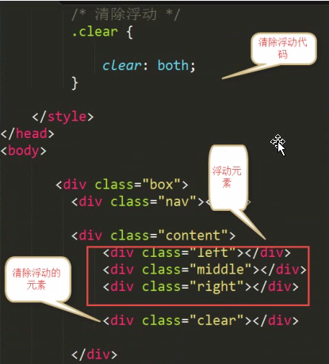

##### 4.7.3.2 hidden
父元素设置overflow：hidden；

```
overflow：hidden；还可以将超出父元素的部分进行隐藏
```

##### 4.7.3.3 伪元素
使用伪元素清除浮动（推荐）

```
单伪元素清除浮动 
  .clearfix:after {
            content:    " ";
      height:      0;
      line-height:  0;
      display:  block;
      clear:     both;
      visibility:  hidden;
}
          .clearfix {
 /*兼容IE*/
 zomm:  1;
}
或者（双伪元素）清除浮动
.clearfix:before .clearfix:after {
            content:    " ";
      height:      0;
      line-height:  0;
      display:  block;
      clear:     both;
      visibility:  hidden;
}
          .clearfix {
 /*兼容IE*/
 zomm:  1;
}
```

!!! note "清除浮动的时机"
    ```python
    1.  父容器没有高度 
    2.  父容器中所有子元素都设置了浮动
    以上两个都满足了，才能考虑是否清除浮动
    ```

#### 4.7.4 初始化


#### 4.7.5 overflow介绍

```
overflow：visible;    默认值----- /*默认值*/
overflow:  hidden;    超出部分隐藏------/*将超出部分隐藏*/
overflow:  scroll;    设置滚动条----/*超不超出都会有滚动条。超出会能拖动滚动条，不超出的不能拖动滚动条*/
overflow:  auto;      自动-----/*超出部分自动出现滚动，不超出的情况不出现滚动条*/
```

#### 4.7.6 伪元素
##### 4.7.6.1 语法
```
选择器:伪元素{属性:值;}
```

##### 4.7.6.2 用法

```
1.  first-line 伪元素
"first-line" 伪元素用于向某个选择器中的文字的首行添加特殊样式：
p{
    font-size:   12pt;
}
p:first-line{
    color:   #0000FF;
    font-variant:  small-caps;
}
2.  :first-letter 伪元素
first-letter 伪元素用于向某个选择器中的文本的首字母添加特殊的样式：
p{
    font-size:  12pt;
}  
p:first-letter{
    font-size:  200%; 
    float:  left;
}

3.  :before 伪元素
    before 伪元素可用于在某个元素之前插入某些内容。
    下面的样式会在标题之前播放音频：
        h1:before{ 
        content:url(beep.wav);
    }

4.  :after 伪元素
after 伪类可用于在某个元素之后插入某些内容。
下面的样式会在标题之后播放音频：
h1:after{
   content:  url(beep.wav);
}

```
例子

```
<!DOCTYPE html>
<html lang="en">
<head>
    <meta charset="UTF-8">
    <title>Title</title>
    <style type="text/css">
        .box {
            width: 200px;
            height: 300px;
            border: 1px solid red;
        }
        div:before,div:after {     在div之前和之后有伪元素出现
            content: "这是一个span";
            background-color: pink;
            width: 120px; 
            height: 30px;
            display: block;
        }
        /*选择区域*/ 
        div::selection {
            background-color:  red; 当选择时候，文字显示红色，松开就显示原来，颜色字体
        }
    </style>
</head>
<body>

    <div class="box">
        这个是正文DIV <br>
        这个是正文DIV <br>
        这个是正文DIV <br>
    </div>
</body>
</html>
```
> 大部分伪元素本来是::也就是两个冒号的，但是很多浏览器不支持，所以使用了：也就是一个冒号，
但是有的伪元素必须使用：：，而伪类是使用：也就是一个冒号如div:hover{.....}


### 4.8 定位
#### 4.8.1 属性
&#160; &#160; &#160; &#160;通过定位可以移动元素位置，通过使用 position 属性，我们可以选择 4 种不同类型的定位，这会影响元素框生成的方式。

```
position 属性值的含义：
1.  static     静态定位
元素框正常生成。块级元素生成一个矩形框，作为文档流的一部分，行内元素则会创建一个或多个行框，置于其父元素中。
2.  relative   相对定位 
元素框偏移某个距离。元素仍保持其未定位前的形状，它原本所占的空间仍保留。
3.  absolute  绝对定位
元素框从文档流完全删除，并相对于其包含块定位。包含块可能是文档中的另一个元素或者是初始包含块。元素原先在正常文档流中所占的空间会关闭，就好像元素原来不存在一样。元素定位后生成一个块级框，而不论原来它在正常流中生成何种类型的框。
4.  fixed
元素框的表现类似于将 position 设置为 absolute，不过其包含块是视窗本身。
提示：相对定位实际上被看作普通流定位模型的一部分，因为元素的位置相对于它在普通流中的位置。

```

#### 4.8.2 使用场景和特点

当页面中出现盒子压盒子时候，推荐使用定位。
    
定位体现的是元素之间的层级关系。

#### 4.8.3 静态定位

- 语法

```
position: static;
left： 10px;
top:  50px;
bottom: 10px;
right:   10px;
```
- 特点

```
1.  静态定位不能移动元素位置。
2.  静态定位的元素就是标准流元素的显示方式。
```

#### 4.8.4 绝对定位

- 语法：

```
position:  absolute;
```

- 特点

```
1.  如果一个子元素设置了绝对定位，如果该子元素的父元素设置了静态定位或者没有定位，那么当前子元素是以body（浏览器）左上角作为参照进行移动。
2.  如果一个子元素设置了绝对定位，如果该子元素的父元素设置了除静态定位以外的其他定位，那么当前绝对定位的子元素会以父元素左上角为参照进行移动。
3.  脱离文档流。不占位置。
4.  设置为绝对定位的元素框从文档流完全删除，并相对于其包含块定位，包含块可能是文档中的另一个元素或者是初始包含块。元素原先在正常文档流中所占的空间会关闭，就好像该元素原来不存在一样。元素定位后生成一个块级框，而不论原来它在正常流中生成何种类型的框。
```

例子

```
#box_relative {
    position: absolute;
    left: 30px;
    top: 20px;
}
```
&#160; &#160; &#160; &#160;绝对定位的元素的位置相对于==最近的已定位祖先元素==，如果元素没有已定位的祖先元素，那么它的位置相对于最初的包含块。而相对定位是“相对于”元素在文档中的初始位置（==本身源位置==），而绝对定位是“相对于”==最近的已定位祖先元素==，如果不存在已定位的祖先元素，那么“相对于”==最初的包含==块。


#### 4.8.5 相对定位

- 语法

```
  position:  relative;
```

- 特点

```
1.   相对定位的元素占位置
2.   相对定位元素是以元素的原来的位置为参照设置定位。
3.   相对定位不能实现模式转换 
4.   设置为相对定位的元素框会偏移某个距离。元素仍然保持其未定位前的形状，它原本所占的空间仍保留
5.   一般情况下要设置  子绝（绝对定位）父相（相对定位）
```
例子

```
#box_relative {
  position: relative;

  left: 30px;

  top: 20px;
}
```


#### 4.8.6 固定定位

- 语法

```
position:  fixed;
```

- 特点

```
1.  固定定位的元素始终以body（浏览器）可视区域为参照设置定位
2.  固定定位的元素脱标不占位置
3.  固定定位的元素可以实现模式转换
```


#### 4.8.7 Z-index

- 定位元素的特点

```
1.  只有（除了静态定位）定位的元素有层级关系。像浮动元素什么的都没有层级关系
2.  通过 z-index改变层级关系
```

- 层级关系

```
1.  当给你一个元素设置了定位，该元素默认的层级z-index值是auto(0)
2.  当z-index值相同的情况下，那么最后定位的元素层级要高于前面定位元素（后来居上原则）
3.  当z-index值不相同的情况下，那么z-index值越高，层级关系就越高
4.  如果子元素的父元素设置了z-index值，那么父元素的z-index值的越大，该子元素的层级越高
```

#### 4.8.8 定位盒子居中

&#160; &#160; &#160; &#160;标准流的盒子居中显示：margin：0  auto;  只是让标准流盒子居中显示，绝对定位的盒子居中显示：

```
1.  left: 50%; 父元素宽度一半
2.  margin-left:  -元素自己宽度一半(其中符号-表示向左移动，代表方向)
 也就是先按照父元素的宽度向右移动到父元素中间，然后自身像左移动一半。
```

### 4.9 其他设置
#### 4.9.1 CSS 规范

- 行内元素尽量里面包含行内元素  不推荐a里面包含h标签
- 有些块级元素不能包含其他块级元素。标题标签，段落标签不能包含div，尤其是P标签不能包含div


#### 4.9.2 脱标流 
网页布局避免脱标流

```
1.  网页布局优先考虑标准流
2.  然后考虑使用浮动
3.  最后使用定位
4.  元素模式转换，必须使用display
```

#### 4.9.3 vertical-align属性介绍

```
1.  text-align      水平对齐
2.  vertical-align  垂直对齐
3.  默认行内块元素(img,input)，有默认的vertical-align属性值
    vertical-align:  
                  baseline  ;  默认值
                  top       ;  顶部对齐
                  middle   ;  中部对齐
                  bottom   ;  底部对齐

```


#### 4.9.4 隐藏方式

```
overflow：    hidden;     将溢出部分隐藏
display:      none;       元素隐藏，隐藏后元素不占位置
display:      block;      显示元素
visibility:   hidden      元素隐藏，隐藏后元素占位置
```

#### 4.9.5 log内容移除

```
1.  logo一般推荐给a标签设置背景图片
2.  logo中a标签最好设置文字
3.  text-indent:  -1000px;这个值是负数随便写（首行缩进）
```

#### 4.9.6 精灵图
&#160; &#160; &#160; &#160;定义: 是一种处理网页特殊背景图片

&#160; &#160; &#160; &#160;它将一个页面的涉及到的所有零星背景图像都集中到一张大图中，然后将大图应用于网页，这样当用户访问该网页的时候，只要向服务器发送一次请求，网页中的背景图像即可全部展示出来，通常情况下，这个由很多小的背景图像合成大图称为精灵图。

使用：

```
1.  给元素设置精灵图为背景图片
2.   通过backgroud-position移动背景图片
```


#### 4.9.7 滑动门
&#160; &#160; &#160; &#160;定义：根据文本自适应大小，根据背景的层叠性制作，并允许他们在彼此之上进行滑动，以创造出一些特殊的效果。

注意：

```
1.  制作网页导航。 
2.  滑动门导航使用背景图片制作。
3.  滑动门导航内容不能设置宽度。
4.  左边固定不动的部分，背景左对齐
5.  右边随着内容变宽的部分，背景右对齐
```
例子

```
div {
    float: left;
}
.left {
    width: 9px;
    height: 64px;
    background:  url("l.png") no-repeat;
}
.middle {
    height: 64px;
    line-height: 64px;
    background:  url("m.png"); 
}
.right {
    width: 9px;
    height: 64px;
    background: url("r.png") no-repeat;
}
<div class="left"></div>
<div class="middle">文字111111111111111</div> 这个文字越多中间的就被撑开越宽
<div class="right"></div>
```
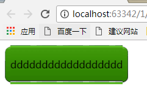


#### 4.9.8 图标字体

http://www.iconfont.cn/collections


```
<!DOCTYPE html>
<html lang="en">
<head>
    <meta charset="UTF-8">
    <title>Title</title>
    <link rel="stylesheet" href="iconfont.css">  链接引用
</head>
<body>


	<span class="iconfont">&#xe624;</span>
	<span class="iconfont">&#xe625;</span>
	<span class="iconfont">&#xe626;</span>
	<span class="iconfont">&#xe62c;</span>
	<span class="iconfont">&#xe62d;</span>
	<span class="iconfont">&#xe62e;</span>
	<span class="iconfont">&#xe62f;</span>
</body>
</html>
访问abc.html就显示右侧的图标，参考上图的那三个demohtml，里面有具体用法
```

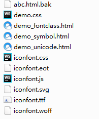
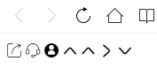
