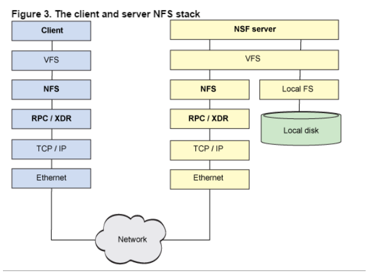

<h1>HDFS 基本知识</h1>

## 1. 介绍
&#160; &#160; &#160; &#160;在现代的企业环境中，单机容量往往无法存储大量数据，需要跨机器存储。统一管理分布在集群上的文件系统称为分布式文件系统。而一旦在系统中，引入网络，就不可避免地引入了所有网络编程的复杂性，例如挑战之一是如果保证在节点不可用的时候数据不丢失。

&#160; &#160; &#160; &#160;传统的网络文件系统（NFS）虽然也称为分布式文件系统，但是其存在一些限制。由于NFS中，文件是存储在单机上，因此无法提供可靠性保证，当很多客户端同时访问NFS Server时，很容易造成服务器压力，造成性能瓶颈。另外如果要对NFS中的文件进行操作，需要首先同步到本地，这些修改在同步到服务端之前，其他客户端是不可见的。某种程度上，NFS不是一种典型的分布式系统，虽然它的文件的确放在远端（单一）的服务器上面。

&#160; &#160; &#160; &#160;从NFS的协议栈可以看到，它事实上是一种VFS（操作系统对文件的一种抽象）实现。

&#160; &#160; &#160; &#160;HDFS，是Hadoop Distributed File System的简称，是Hadoop抽象文件系统的一种实现。Hadoop抽象文件系统可以与本地系统、Amazon S3等集成，甚至可以通过Web协议（webhsfs）来操作。HDFS的文件分布在集群机器上，同时提供副本进行容错及可靠性保证。例如客户端写入读取文件的直接操作都是分布在集群各个机器上的，没有单点性能压力。
## 2. HDFS
&#160; &#160; &#160; &#160;HDFS设计之初就非常明确其应用场景，适用与什么类型的应用，不适用什么应用，有一个相对明确的指导原则。

### 2.1 设计目标

### 2.1.1 存储非常大的文件
&#160; &#160; &#160; &#160;这里非常大指的是几百M、G、或者TB级别。实际应用中已有很多集群存储的数据达到PB级别。根据Hadoop官网，Yahoo！的Hadoop集群约有10万颗CPU，运行在4万个机器节点上。更多世界上的Hadoop集群使用情况，参考Hadoop官网.

### 2.1.2 采用流式的数据访问方式
&#160; &#160; &#160; &#160;HDFS基于这样的一个假设：最有效的数据处理模式是一次写入、多次读取数据集经常从数据源生成或者拷贝一次，然后在其上做很多分析工作，分析工作经常读取其中的大部分数据，即使不是全部。 因此读取整个数据集所需时间比读取第一条记录的延时更重要。

### 2.1.2运行于商业硬件上
&#160; &#160; &#160; &#160;Hadoop不需要特别贵的、reliable的（可靠的）机器，可运行于普通商用机器（可以从多家供应商采购） ，商用机器不代表低端机器。在集群中（尤其是大的集群），节点失败率是比较高的HDFS的目标是确保集群在节点失败的时候不会让用户感觉到明显的中断。
### 2.2 不适合应用
#### 2.2.1 低延时的数据访问 
&#160; &#160; &#160; &#160;对延时要求在毫秒级别的应用，不适合采用HDFS。HDFS是为高吞吐数据传输设计的,因此可能牺牲延时HBase更适合低延时的数据访问。

#### 2.2.2 大量小文件
&#160; &#160; &#160; &#160;文件的元数据（如目录结构，文件block的节点列表，block-node mapping）保存在NameNode的内存中， 整个文件系统的文件数量会受限于NameNode的内存大小。 
经验而言，一个文件/目录/文件块一般占有150字节的元数据内存空间。如果有100万个文件，每个文件占用1个文件块，则需要大约300M的内存。因此十亿级别的文件数量在现有商用机器上难以支持。

#### 2.2.3 多方读写，需要任意的文件修改 
&#160; &#160; &#160; &#160;HDFS采用追加（append-only）的方式写入数据。不支持文件任意offset的修改。不支持多个写入器（writer）。

## 3. HDFS核心概念
### 3.1 BLOCK
&#160; &#160; &#160; &#160;H物理磁盘中有块的概念，磁盘的物理Block是磁盘操作最小的单元，读写操作均以Block为最小单元，一般为512 Byte。文件系统在物理Block之上抽象了另一层概念，文件系统Block物理磁盘Block的整数倍。通常为几KB。Hadoop提供的df、fsck这类运维工具都是在文件系统的Block级别上进行操作。

&#160; &#160; &#160; &#160;HHDFS的Block块比一般单机文件系统大得多，默认为128M。HDFS的文件被拆分成block-sized的chunk，chunk作为独立单元存储。比Block小的文件不会占用整个Block，只会占据实际大小。例如， 如果一个文件大小为1M，则在HDFS中只会占用1M的空间，而不是128M。

HDFS的Block为什么这么大？ 
&#160; &#160; &#160; &#160;是为了最小化查找（seek）时间，控制定位文件与传输文件所用的时间比例。假设定位到Block所需的时间为10ms，磁盘传输速度为100M/s。如果要将定位到Block所用时间占传输时间的比例控制1%，则Block大小需要约100M。 
但是如果Block设置过大，在MapReduce任务中，Map或者Reduce任务的个数 如果小于集群机器数量，会使得作业运行效率很低。

Block抽象的好处 
&#160; &#160; &#160; &#160;block的拆分使得单个文件大小可以大于整个磁盘的容量，构成文件的Block可以分布在整个集群， 理论上，单个文件可以占据集群中所有机器的磁盘。 
Block的抽象也简化了存储系统，对于Block，无需关注其权限，所有者等内容（这些内容都在文件级别上进行控制）。 
Block作为容错和高可用机制中的副本单元，即以Block为单位进行复制。

### 3.2 namenode datanode
&#160; &#160; &#160; &#160;整个HDFS集群由Namenode和Datanode构成master-worker（主从）模式。Namenode负责构建命名空间，管理文件的元数据等，而Datanode负责实际存储数据，负责读写工作。
#### 3.2.1 namenode
&#160; &#160; &#160; &#160;Namenode存放文件系统树及所有文件、目录的元数据。元数据持久化为2种形式

- namespcae image
- edit log

&#160; &#160; &#160; &#160;但是持久化数据中不包括Block所在的节点列表，及文件的Block分布在集群中的哪些节点上，这些信息是在系统重启的时候重新构建（通过Datanode汇报的Block信息）。 
在HDFS中，Namenode可能成为集群的单点故障，Namenode不可用时，整个文件系统是不可用的。HDFS针对单点故障提供了2种解决机制： 

- 备份持久化元数据 

&#160; &#160; &#160; &#160;将文件系统的元数据同时写到多个文件系统， 例如同时将元数据写到本地文件系统及NFS。这些备份操作都是同步的、原子的。

- Secondary Namenode 

&#160; &#160; &#160; &#160;Secondary节点定期合并主Namenode的namespace image和edit log， 避免edit log过大，通过创建检查点checkpoint来合并。它会维护一个合并后的namespace image副本， 可用于在Namenode完全崩溃时恢复数据。

&#160; &#160; &#160; &#160;Secondary Namenode通常运行在另一台机器，因为合并操作需要耗费大量的CPU和内存。其数据落后于Namenode，因此当Namenode完全崩溃时，会出现数据丢失。 通常做法是拷贝NFS中的备份元数据到Second，将其作为新的主Namenode。 
在HA（High Availability高可用性）中可以运行一个Hot Standby，作为热备份，在Active Namenode故障之后，替代原有Namenode成为Active Namenode。

#### 3.2.2 dits和fsimage 
&#160; &#160; &#160; &#160;首先要提到两个文件edits和fsimage，下面来说说他们是做什么的。

- 集群中的名称节点（NameNode）会把文件系统的变化以追加保存到日志文件edits中。
- 当名称节点（NameNode）启动时，会从镜像文件 fsimage 中读取HDFS的状态，并且把edits文件中记录的操作应用到fsimage，也就是合并到fsimage中去。合并后更新fsimage的HDFS状态，创建一个新的edits文件来记录文件系统的变化

#### 3.2.3 datanode
&#160; &#160; &#160; &#160;数据节点负责存储和提取Block，读写请求可能来自namenode，也可能直接来自客户端。数据节点周期性向Namenode汇报自己节点上所存储的Block相关信息。

### 3.3 block  cache
&#160; &#160; &#160; &#160;DataNode通常直接从磁盘读取数据，但是频繁使用的Block可以在内存中缓存。默认情况下，一个Block只有一个数据节点会缓存。但是可以针对每个文件可以个性化配置。 
作业调度器可以利用缓存提升性能，例如MapReduce可以把任务运行在有Block缓存的节点上。 
用户或者应用可以向NameNode发送缓存指令（缓存哪个文件，缓存多久）， 缓存池的概念用于管理一组缓存的权限和资源。

### 3.4 HDFS Federation
&#160; &#160; &#160; &#160;我们知道NameNode的内存会制约文件数量，HDFS Federation提供了一种横向扩展NameNode的方式。在Federation模式中，每个NameNode管理命名空间的一部分，例如一个NameNode管理/user目录下的文件， 另一个NameNode管理/share目录下的文件。 
每个NameNode管理一个namespace volumn，所有volumn构成文件系统的元数据。每个NameNode同时维护一个Block Pool，保存Block的节点映射等信息。各NameNode之间是独立的，一个节点的失败不会导致其他节点管理的文件不可用。 
客户端使用mount table将文件路径映射到NameNode。mount table是在Namenode群组之上封装了一层，这一层也是一个Hadoop文件系统的实现，通过viewfs:协议访问。

### 3.5 HDFS HA
&#160; &#160; &#160; &#160;在HDFS集群中，NameNode依然是单点故障（SPOF: Single Point Of Failure）。元数据同时写到多个文件系统以及Second NameNode定期checkpoint有利于保护数据丢失，但是并不能提高可用性。 
这是因为NameNode是唯一一个对文件元数据和file-block映射负责的地方， 当它挂了之后，包括MapReduce在内的作业都无法进行读写。

&#160; &#160; &#160; &#160;当NameNode故障时，常规的做法是使用元数据备份重新启动一个NameNode。元数据备份可能来源于：

- 多文件系统写入中的备份
- Second NameNode的检查点文件

&#160; &#160; &#160; &#160;启动新的Namenode之后，需要重新配置客户端和DataNode的NameNode信息。另外重启耗时一般比较久，稍具规模的集群重启经常需要几十分钟甚至数小时，造成重启耗时的原因大致有： 

- 元数据镜像文件载入到内存耗时较长。 
- 需要重放edit log 
- 需要收到来自DataNode的状态报告并且满足条件后才能离开安全模式提供写服务。

## 4. hadoop ha
&#160; &#160; &#160; &#160;采用HA的HDFS集群配置两个NameNode，分别处于Active和Standby状态。当Active NameNode故障之后，Standby接过责任继续提供服务，用户没有明显的中断感觉。一般耗时在几十秒到数分钟。 
HA涉及到的主要实现逻辑有

### 4.1 存储
&#160; &#160; &#160; &#160;主备需共享edit log存储，主NameNode和待命的NameNode共享一份edit log，当主备切换时，Standby通过回放edit log同步数据。 
共享存储通常有2种选择

- NFS：传统的网络文件系统
- QJM：quorum journal manager

&#160; &#160; &#160; &#160;QJM是专门为HDFS的HA实现而设计的，用来提供高可用的edit log。QJM运行一组journal node，edit log必须写到大部分的journal nodes。通常使用3个节点，因此允许一个节点失败，类似ZooKeeper。注意QJM没有使用ZK，虽然HDFS HA的确使用了ZK来选举主Namenode。一般推荐使用QJM。

### 4.2 数据发送 
&#160; &#160; &#160; &#160;DataNode需要同时往主备发送Block Report ，因为Block映射数据存储在内存中（不是在磁盘上），为了在Active NameNode挂掉之后，新的NameNode能够快速启动，不需要等待来自Datanode的Block Report，DataNode需要同时向主备两个NameNode发送Block Report。

### 4.3 failover 
&#160; &#160; &#160; &#160;客户端需要配置failover模式（失效备援模式，对用户透明）,Namenode的切换对客户端来说是无感知的，通过客户端库来实现。客户端在配置文件中使用的HDFS URI是逻辑路径，映射到一对Namenode地址。客户端会不断尝试每一个Namenode地址直到成功。

### 4.4 接管 
&#160; &#160; &#160; &#160;Standby替代Secondary NameNode ，如果没有启用HA，HDFS独立运行一个守护进程作为Secondary Namenode。定期checkpoint，合并镜像文件和edit日志。

&#160; &#160; &#160; &#160;如果当主Namenode失败时，备份Namenode正在关机（停止 Standby），运维人员依然可以从头启动备份Namenode，这样比没有HA的时候更省事，算是一种改进，因为重启整个过程已经标准化到Hadoop内部，无需运维进行复杂的切换操作。

&#160; &#160; &#160; &#160;NameNode的切换通过代failover controller来实现。failover controller有多种实现，默认实现使用ZooKeeper来保证只有一个Namenode处于active状态。

&#160; &#160; &#160; &#160;每个Namenode运行一个轻量级的failover controller进程，该进程使用简单的心跳机制来监控Namenode的存活状态并在Namenode失败时触发failover。Failover可以由运维手动触发，例如在日常维护中需要切换主Namenode，这种情况graceful(优雅的) failover，非手动触发的failover称为ungraceful failover。

&#160; &#160; &#160; &#160;在ungraceful failover的情况下，没有办法确定失败（被判定为失败）的节点是否停止运行，也就是说触发failover后，之前的主Namenode可能还在运行。QJM一次只允许一个Namenode写edit log，但是之前的主Namenode仍然可以接受读请求。Hadoop使用fencing来杀掉之前的Namenode。Fencing通过收回之前Namenode对共享的edit log的访问权限、关闭其网络端口使得原有的Namenode不能再继续接受服务请求。使用STONITH技术也可以将之前的主Namenode关机。

最后，HA方案中Namenode的切换对客户端来说是不可见的，前面已经介绍过，主要通过客户端库来完成。

## 5. HDFS 如何存储数据

HDFS 采用Master/Slave的架构来存储数据，这种架构主要由四个部分组成，分别为HDFS Client、NameNode、DataNode和Secondary NameNode。下面我们分别介绍这四个组成部分   

### 5.1 Client
Client：就是客户端.

- 文件切分。文件上传 HDFS 的时候，Client 将文件切分成 一个一个的Block，然后进行存储。
- 与 NameNode 交互，获取文件的位置信息。
- 与 DataNode 交互，读取或者写入数据。
- Client 提供一些命令来管理 HDFS，比如启动或者关闭HDFS。
- Client 可以通过一些命令来访问 HDFS。

### 5.2 namenode
NameNode：就是 master，它是一个主管、管理者。

- 管理 HDFS 的名称空间
- 管理数据块（Block）映射信息
- 配置副本策略
- 处理客户端读写请求。

### 5.3 DataNode
就是Slave。NameNode 下达命令，DataNode 执行实际的操作。

- 存储实际的数据块。
- 执行数据块的读/写操作。

### 5.4 Secondary NameNode
并非 NameNode 的热备。当NameNode 挂掉的时候，它并不能马上替换 NameNode 并提供服务。

- 辅助 NameNode，分担其工作量。
- 定期合并 fsimage和fsedits，并推送给NameNode。
- 在紧急情况下，可辅助恢复 NameNode。

## 6. HDFS 如何读取文件

HDFS的文件读取原理，主要包括以下几个步骤：

- 首先调用FileSystem对象的open方法，其实获取的是一个DistributedFileSystem的实例。
- DistributedFileSystem通过RPC(远程过程调用)获得文件的第一批block的locations，同一block按照重复数会返回多个locations，这些locations按照hadoop拓扑结构排序，距离客户端近的排在前面。
- 前两步会返回一个FSDataInputStream对象，该对象会被封装成 DFSInputStream对象，DFSInputStream可以方便的管理datanode和namenode数据流。客户端调用read方法，DFSInputStream就会找出离客户端最近的datanode并连接datanode。
- 数据从datanode源源不断的流向客户端。
- 如果第一个block块的数据读完了，就会关闭指向第一个block块的datanode连接，接着读取下一个block块。这些操作对客户端来说是透明的，从客户端的角度来看只是读一个持续不断的流。
- 如果第一批block都读完了，DFSInputStream就会去namenode拿下一批blocks的location，然后继续读，如果所有的block块都读完，这时就会关闭掉所有的流。

## 7. HDFS 如何写入文件

HDFS的文件写入原理，主要包括以下几个步骤：

- 客户端通过调用 DistributedFileSystem 的create方法，创建一个新的文件。
- DistributedFileSystem 通过 RPC（远程过程调用）调用 NameNode，去创建一个没有blocks关联的新文件。创建前，NameNode 会做各种校验，比如文件是否存在，客户端有无权限去创建等。如果校验通过，NameNode 就会记录下新文件，否则就会抛出IO异常。
- 前两步结束后会返回 FSDataOutputStream 的对象，和读文件的时候相似，FSDataOutputStream 被封装成 DFSOutputStream，DFSOutputStream 可以协调 NameNode和 DataNode。客户端开始写数据到DFSOutputStream,DFSOutputStream会把数据切成一个个小packet，然后排成队列 data queue。
- DataStreamer 会去处理接受 data queue，它先问询 NameNode 这个新的 block 最适合存储的在哪几个DataNode里，比如重复数是3，那么就找到3个最适合的 DataNode，把它们排成一个 pipeline。DataStreamer 把 packet 按队列输出到管道的第一个 DataNode 中，第一个 DataNode又把 packet 输出到第二个 DataNode 中，以此类推。
- DFSOutputStream 还有一个队列叫 ack queue，也是由 packet 组成，等待DataNode的收到响应，当pipeline中的所有DataNode都表示已经收到的时候，这时akc queue才会把对应的packet包移除掉。
- 客户端完成写数据后，调用close方法关闭写入流。
- DataStreamer 把剩余的包都刷到 pipeline 里，然后等待 ack 信息，收到最后一个 ack 后，通知 DataNode 把文件标示为已完成。

## 8. HDFS 副本存放策略

&#160; &#160; &#160; &#160;namenode如何选择在哪个datanode 存储副本（replication）？这里需要对可靠性、写入带宽和读取带宽进行权衡。Hadoop对datanode存储副本有自己的副本策略，在其发展过程中一共有两个版本的副本策略，分别如下所示

## 9. hadoop2.x新特性

- 引入了NameNode Federation，解决了横向内存扩展
- 引入了Namenode HA，解决了namenode单点故障
- 引入了YARN，负责资源管理和调度
- 增加了ResourceManager HA解决了ResourceManager单点故障

### 9.1 NameNode Federation

- 存在多个NameNode，每个NameNode分管一部分目录
- NameNode共用DataNode

&#160; &#160; &#160; &#160;这样做的好处就是当NN内存受限时，能扩展内存，解决内存扩展问题，而且每个NN独立工作相互不受影响，比如其中一个NN挂掉啦，它不会影响其他NN提供服务，但我们需要注意的是，虽然有多个NN，分管不同的目录，但是对于特定的NN，依然存在单点故障，因为没有它没有热备，解决单点故障使用NameNode HA

### 9.2 NameNode HA

- 基于NFS共享存储解决方案
- 基于Qurom Journal Manager(QJM)解决方案

#### 9.2.1 基于NFS方案

&#160; &#160; &#160; &#160;Active NN与Standby NN通过NFS实现共享数据，但如果Active NN与NFS之间或Standby NN与NFS之间，其中一处有网络故障的话，那就会造成数据同步问题。

#### 9.2.2 基于QJM方案
&#160; &#160; &#160; &#160;Active NN、Standby NN有主备之分，NN Active是主的，NN Standby备用的

&#160; &#160; &#160; &#160;集群启动之后，一个namenode是active状态，来处理client与datanode之间的请求，并把相应的日志文件写到本地中或JN中；

&#160; &#160; &#160; &#160;Active NN与Standby NN之间是通过一组JN共享数据（JN一般为奇数个，ZK一般也为奇数个），Active NN会把日志文件、镜像文件写到JN中去，只要JN中有一半写成功，那就表明Active NN向JN中写成功啦，Standby NN就开始从JN中读取数据，来实现与Active NN数据同步，这种方式支持容错，因为Standby NN在启动的时候，会加载镜像文件（fsimage）并周期性的从JN中获取日志文件来保持与Active NN同步

&#160; &#160; &#160; &#160;为了实现Standby NN在Active NN挂掉之后，能迅速的再提供服务，需要DN不仅需要向Active NN汇报，同时还要向Standby NN汇报，这样就使得Standby NN能保存数据块在DN上的位置信息，因为在NameNode在启动过程中最费时工作，就是处理所有DN上的数据块的信息

&#160; &#160; &#160; &#160;为了实现Active NN高热备，增加了FailoverController和ZK，FailoverController通过Heartbeat的方式与ZK通信，通过ZK来选举，一旦Active NN挂掉，就选取另一个FailoverController作为active状态，然后FailoverController通过rpc，让standby NN转变为Active NN

&#160; &#160; &#160; &#160;FailoverController一方面监控NN的状态信息，一方面还向ZK定时发送心跳，使自己被选举。当自己被选为主（Active）的时候，就会通过rpc使相应NN转变Active状态

结合HDFS2的新特性，在实际生成环境中部署图

这里有12个DN,有4个NN，NN-1与NN-2是主备关系，它们管理/share目录；NN-3与NN-4是主备关系，它们管理/user目录
