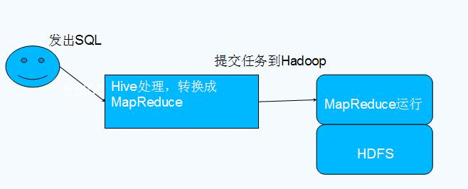
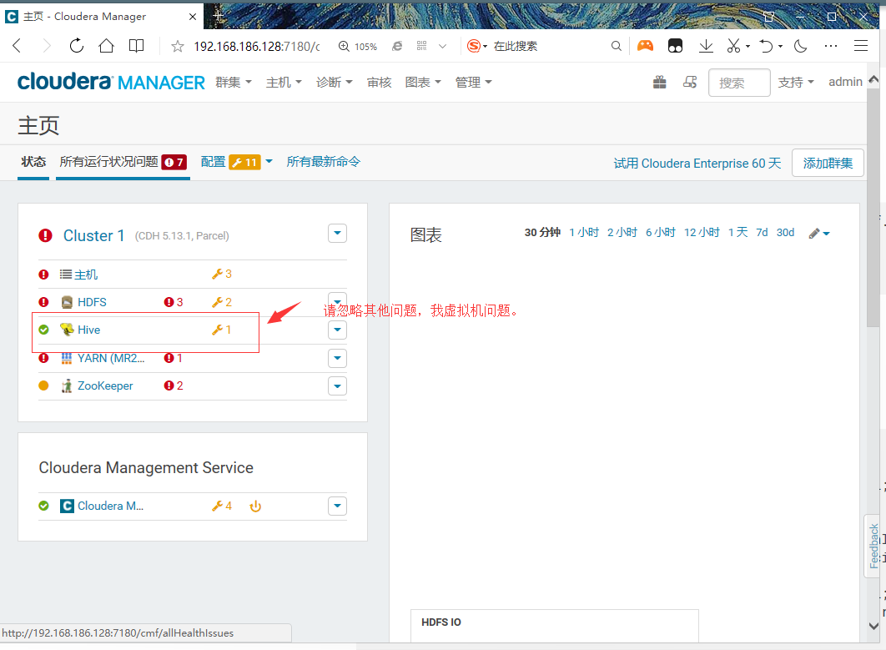

<center><h1>Hive</h1></center>

## 1. 介绍
&#160; &#160; &#160; &#160;什么是Hive

- Hive是基于Hadoop的一个数据仓库工具，可以将结构化的数据文件映射为一张数据库表，并提供类SQL查询功能。
- 本质是将SQL转换为MapReduce程序

### 1.2 特点

- 可扩展

&#160; &#160; &#160; &#160;Hive可以自由的扩展集群的规模，一般情况下不需要重启服务

- 延展性

&#160; &#160; &#160; &#160;Hive支持用户自定义函数，用户可以根据自己的需求来实现自己的函数

- 容错

&#160; &#160; &#160; &#160;良好的容错性，节点出现问题SQL仍可完成执行

### 1.3 Hive与Hadoop的关系



### 1.4 Hive与传统数据库对比

条件| Hive | RDBMS
---|---|---
查询语言|HQL|SQL
数据存储|HDFS|Raw Device or local FileSystem
执行|MapReduce|Excutor
执行延迟|高|低
处理数据规模|大|小
索引|0.8版本后加入位图索引|有复杂的索引


## 2. 安装
&#160; &#160; &#160; &#160;我通过cdh安装hive,以下记录cdh安装hive过程。


&#160; &#160; &#160; &#160;你的要根据你的情况来填写。我建议创建hive类似这样的库的时候，要单独创建一个用户给hive，然后授权hive，别直接使用root用户，我这里是测试，图方便了，线上按照我建议的去做。

例如以下。
```
create database hive DEFAULT CHARSET utf8 COLLATE utf8_general_ci;
grant all privileges on hive.* to 'hive'@'%' identified by 'hive' 
# 授权的ip地址也可以针对性的做调整
```

> mysql的用户链接hive这样类似hadoop其他组件的数据库一定要配置密码。否则会安装的过程会报错。jdbc去连接的时候会自动带密码。


到此hive安装结束，接下来我们，去页面查看hive的情况。




从cdh的管理后台的页面上来看。hive安装成功。

