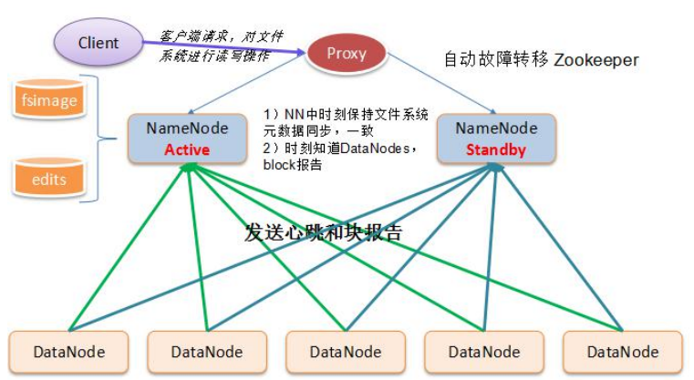
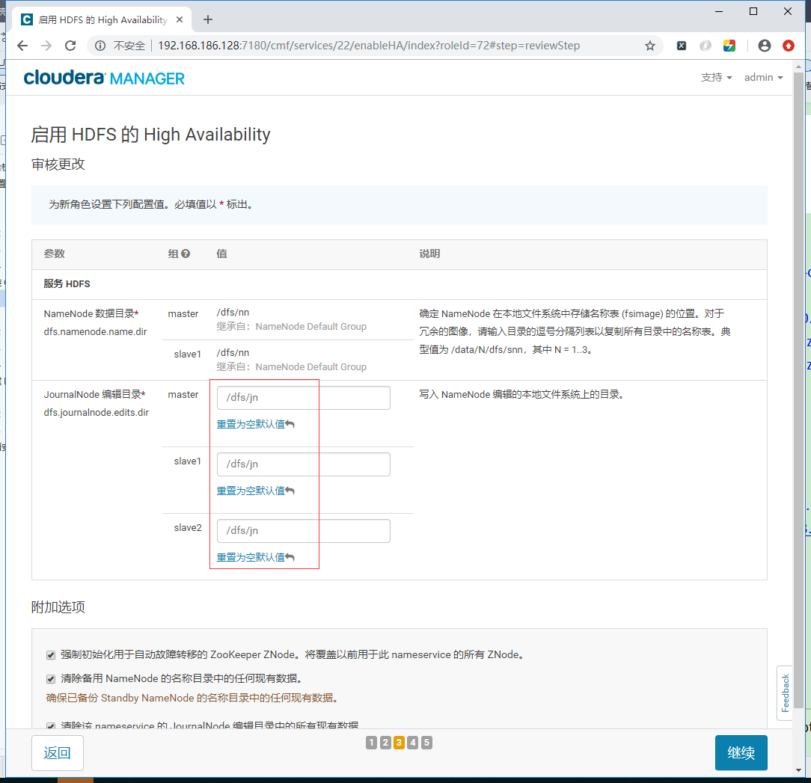
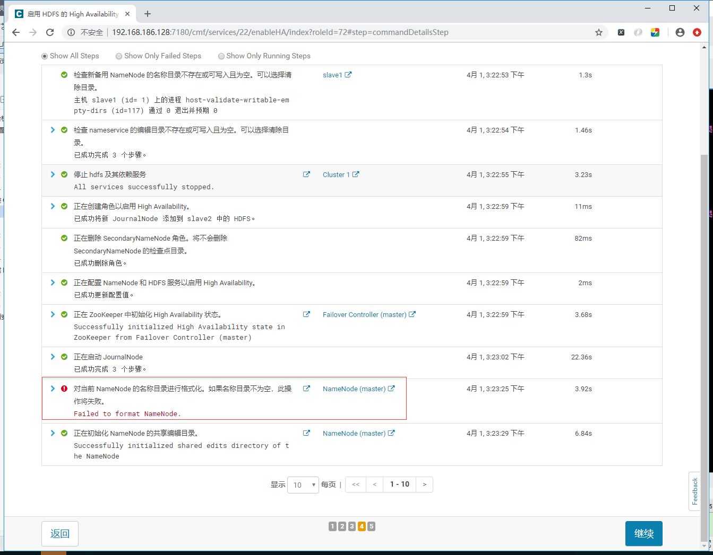
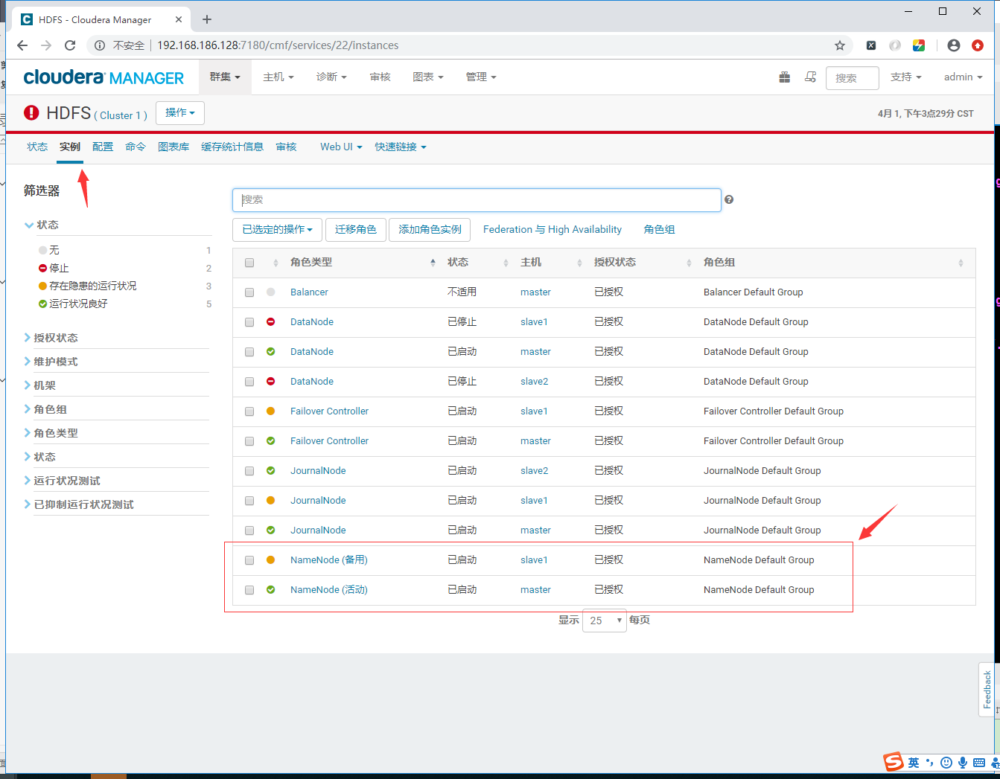
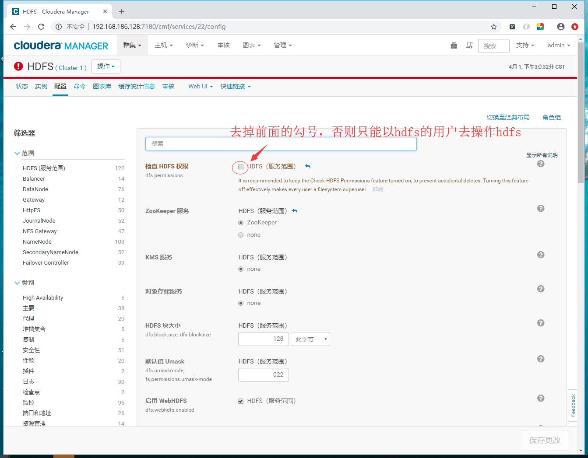
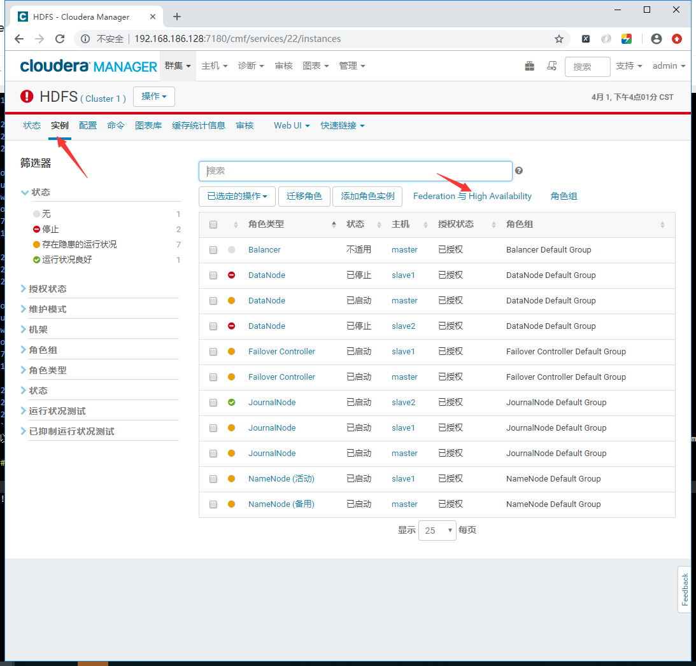
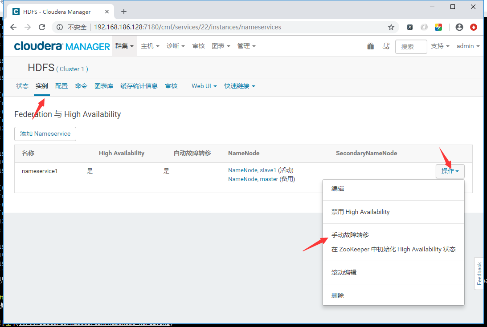
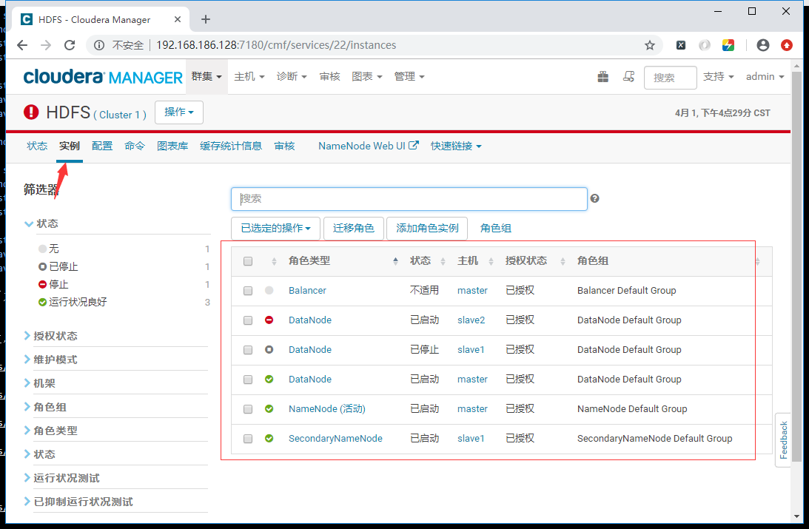

<center><h1>NameNode HA</h1></center>

## 1. 介绍
&#160; &#160; &#160; &#160; hdfs的namenode作为集群中最重要的数据中心'头脑' 高可用是必须的。所有机器操作hdfs的时候，都是通过hdfs的namenode。单节点的NameNode是非常可怕，一旦这个节点挂了以后，整个集群的hdfs都不可用，以下是记录cdh在配置namenode的HA，过程。



首先。新搭建的机器上没有数据。我整一些数据上去

```
[root@master ~]# su - hdfs
Last login: Mon Apr  1 11:14:33 CST 2019 on pts/0
[hdfs@master ~]$ hdfs dfs -mkdir /cmz
[hdfs@master ~]$ hdfs dfs -ls /
Found 3 items
drwxr-xr-x   - hdfs supergroup          0 2019-04-01 15:08 /cmz
drwxrwxrwt   - hdfs supergroup          0 2019-04-01 13:34 /tmp
drwxr-xr-x   - hdfs supergroup          0 2019-04-01 13:33 /user
[hdfs@master ~]$ hdfs dfs -put /etc/hosts /cmz/
[hdfs@master ~]$ hdfs dfs -ls /cmz/
Found 1 items
-rw-r--r--   3 hdfs supergroup        231 2019-04-01 15:09 /cmz/hosts
[hdfs@master ~]$ hdfs dfs -text /cmz/hosts
127.0.0.1   localhost localhost.localdomain localhost4 localhost4.localdomain4
::1         localhost localhost.localdomain localhost6 localhost6.localdomain6

192.168.186.128  master
192.168.186.129  slave1
192.168.186.137  slave2
```
hdfs上创建了一个cmz文件夹，里面上传了hosts文件。


## 2. 配置HA
### 2.1 配置步骤






以上出现namenode格式化失败，是因为之前有数据，不用管。继续。


到此为止，namenode ha配置成功。

> namenode ha，hdfs的数据还在。

###  2.2 查看ha


可以看出hdfs的namenode配置成功了。接下来我们测试namenode的ha。

### 2.3 测试
在测试之前。我们下修改hdfs的配置文件，保证在系统之内hdfs可以通过非hdfs用户去操作hdfs。



#### 2.3.1 自动切换
停止master。挂起master对应的虚拟机之前。

```
[hdfs@master ~]$ hdfs dfs -ls /cmz
Found 1 items
-rw-r--r--   3 hdfs supergroup        231 2019-04-01 15:09 /cmz/hosts

[root@slave1 lib]# hdfs dfs -ls /cmz
Found 1 items
-rw-r--r--   3 hdfs supergroup        231 2019-04-01 15:09 /cmz/hosts

[root@slave2 src]# hdfs dfs -ls /cmz
Found 1 items
-rw-r--r--   3 hdfs supergroup        231 2019-04-01 15:09 /cmz/hosts
```
停止master。挂起master对应的虚拟机之后。

```
[root@slave1 lib]# hdfs dfs -ls /cmz
Found 1 items
-rw-r--r--   3 hdfs supergroup        231 2019-04-01 15:09 /cmz/hosts

[root@slave2 src]#  hdfs dfs -ls /cmz
Found 1 items
-rw-r--r--   3 hdfs supergroup        231 2019-04-01 15:09 /cmz/hosts
cd
```

过一段时间后，备namenode发现主namenode挂了以后，接管了，其他的agent的管理。
在master有问题之后，备namenode接管主namenode之前，hdfs服务是不可用的。此时操作hdfs会报错。我虚拟机反应时间大概30不到。就切换过来了。

手动恢复主namenode机器。


再次测试hdfs

```
[root@master ~]# hdfs dfs -ls /cmz
Found 1 items
-rw-r--r--   3 hdfs supergroup        231 2019-04-01 15:09 /cmz/hosts
[root@master ~]# hdfs dfs -text /cmz/hosts
127.0.0.1   localhost localhost.localdomain localhost4 localhost4.localdomain4
::1         localhost localhost.localdomain localhost6 localhost6.localdomain6

192.168.186.128  master
192.168.186.129  slave1
192.168.186.137  slave2

[root@slave1 lib]# hdfs dfs -ls /cmz
Found 1 items
-rw-r--r--   3 hdfs supergroup        231 2019-04-01 15:09 /cmz/hosts
[root@slave1 lib]# hdfs dfs -text /cmz/hosts
127.0.0.1   localhost localhost.localdomain localhost4 localhost4.localdomain4
::1         localhost localhost.localdomain localhost6 localhost6.localdomain6

192.168.186.128  master
192.168.186.129  slave1
192.168.186.137  slave2

[root@slave2 src]# hdfs dfs -ls /cmz
Found 1 items
-rw-r--r--   3 hdfs supergroup        231 2019-04-01 15:09 /cmz/hosts
[root@slave2 src]# hdfs dfs -text /cmz/hosts
127.0.0.1   localhost localhost.localdomain localhost4 localhost4.localdomain4
::1         localhost localhost.localdomain localhost6 localhost6.localdomain6

192.168.186.128  master
192.168.186.129  slave1
192.168.186.137  slave2
```
从以上可以看出恢复了之前有问题的主namenode之后。cdh发现系统中已经有一个主的namenode[之前的备namenode]后，将原本主的namenode降低身份，化身为备namenode了。

#### 2.3.2 手动切换
模拟了namenode的ha之后，我们也可以手动切换namenode。






查看切换后的情况


可见手动切换OK。


## 3. 禁用HA
若是有个namenode实在有问题。我们也可以手动卸载namenode ha，以下是记录步骤



可以看出，namenode去除了ha了。测试如下

```
[root@master ~]# hdfs dfs -ls /cmz
Found 1 items
-rw-r--r--   3 hdfs supergroup        231 2019-04-01 15:09 /cmz/hosts

[root@slave1 lib]# hdfs dfs -ls /cmz
Found 1 items
-rw-r--r--   3 hdfs supergroup        231 2019-04-01 15:09 /cmz/hosts

[root@slave2 src]# hdfs dfs -ls /cmz

Found 1 items
-rw-r--r--   3 hdfs supergroup        231 2019-04-01 15:09 /cmz/hosts
```
截止到目前为止，NameNode的HA，启用和禁用，测试OK。


