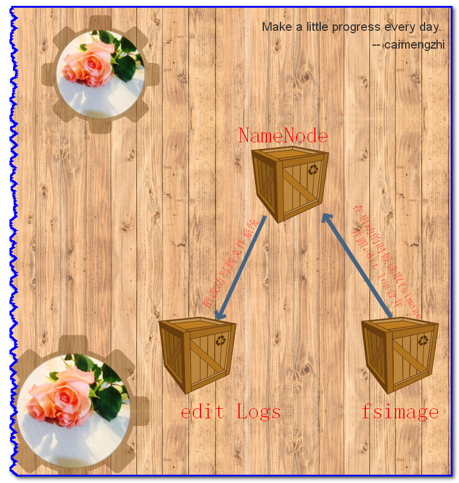

<h1>Secondary NameNode</h1>

## 1. 介绍
&#160; &#160; &#160; &#160;记得刚接触Hadoop那会, 一直没有弄明白NameNode和Secondary NameNode的区别和关系。很多人和我开始都认为，Secondary NameNode是NameNode的备份，是为了防止NameNode的单点失败的。后来深入了解工作原理后，才发现并不是这样。

## 2. 作用
&#160; &#160; &#160; &#160;在Hadoop中，有一些命名不好的模块，Secondary NameNode是其中之一。从它的名字上看，它给人的感觉就像是NameNode的备份。但它实际上却不是。很多Hadoop的初学者都很疑惑，Secondary NameNode究竟是做什么的，而且它为什么会出现在HDFS中。因此，在这篇文章中，我想要解释下Secondary NameNode在HDFS中所扮演的角色。

&#160; &#160; &#160; &#160;SecondaryNameNode有两个作用，一是镜像备份，二是日志与镜像的定期合并。两个过程同时进行，称为checkpoint. 镜像备份的作用:备份fsimage(fsimage是元数据发送检查点时写入文件);日志与镜像的定期合并的作用:将Namenode中edits日志和fsimage合并,防止(如果Namenode节点故障，namenode下次启动的时候，会把fsimage加载到内存中，应用edit log,edit log往往很大，导致操作往往很耗时。)

&#160; &#160; &#160; &#160;从它的名字来看，你可能认为它跟NameNode有点关系。没错，你猜对了。因此在我们深入了解Secondary NameNode之前，我们先来看看NameNode是做什么的。

## 3. NameNode
&#160; &#160; &#160; &#160;NameNode主要是用来保存HDFS的元数据信息，比如命名空间信息，块信息等。当它运行的时候，这些信息是存在内存中的。但是这些信息也可以持久化到磁盘上。

[最好的资料](http://hadoop.apache.org/docs/stable/hadoop-project-dist/hadoop-hdfs/HdfsUserGuide.html)

上面的这张图片展示了NameNode怎么把元数据保存到磁盘上的。这里有两个不同的文件：

- fsimage - 它是在NameNode启动时对整个文件系统的快照
- edit logs - 它是在NameNode启动后，对文件系统的改动序列

&#160; &#160; &#160; &#160;只有在NameNode重启时，edit logs才会合并到fsimage文件中，从而得到一个文件系统的最新快照。但是在产品集群中NameNode是很少重启的，这也意味着当NameNode运行了很长时间后，edit logs文件会变得很大。在这种情况下就会出现下面一些问题：

- edit logs文件会变的很大，怎么去管理这个文件是一个挑战。
- NameNode的重启会花费很长时间，因为有很多改动[在edit logs中]要合并到fsimage文件上。
- 如果NameNode挂掉了，那我们就丢失了很多改动因为此时的fsimage文件非常旧。[我认为在这个情况下丢失的改动不会很多, 因为丢失的改动应该是还在内存中但是没有写到edit logs的这部分。]

&#160; &#160; &#160; &#160;因此为了克服这个问题，我们需要一个易于管理的机制来帮助我们减小edit logs文件的大小和得到一个最新的fsimage文件，这样也会减小在NameNode上的压力。这跟Windows的恢复点是非常像的，Windows的恢复点机制允许我们对OS进行快照，这样当系统发生问题时，我们能够回滚到最新的一次恢复点上。

## 4. Secondary NameNode
&#160; &#160; &#160; &#160;因此为了克服这个问题SecondaryNameNode就是来帮助解决上述问题的，它的职责是合并NameNode的edit logs到fsimage文件中。

上面的图片展示了Secondary NameNode是怎么工作的。

1. 首先，它定时到NameNode去获取edit logs，并更新到fsimage上。[笔者注：Secondary NameNode自己的fsimage]
1. 一旦它有了新的fsimage文件，它将其拷贝回NameNode中。
1. NameNode在下次重启时会使用这个新的fsimage文件，从而减少重启的时间。

&#160; &#160; &#160; &#160;Secondary NameNode的整个目的是在HDFS中提供一个检查点。它只是NameNode的一个助手节点。这也是它在社区内被认为是检查点节点的原因。

&#160; &#160; &#160; &#160;是关于NameNode是什么时候将改动写到edit logs中的？这个操作实际上是由DataNode的写操作触发的，当我们往DataNode写文件时，DataNode会跟NameNode通信，告诉NameNode什么文件的第几个block放在它那里，NameNode这个时候会将这些元数据信息写到edit logs文件中。

## 4. Secondary NameNode工作原理
日志与镜像的定期合并总共分五步：

1. SecondaryNameNode通知NameNode准备提交edits文件，此时主节点产生edits.new
1. SecondaryNameNode通过http get方式获取NameNode的fsimage与edits文件（在SecondaryNameNode的current同级目录下可见到 temp.check-point或者previous-checkpoint目录，这些目录中存储着从namenode拷贝来的镜像文件）
1. SecondaryNameNode开始合并获取的上述两个文件，产生一个新的fsimage文件fsimage.ckpt
1. SecondaryNameNode用http post方式发送fsimage.ckpt至NameNode
1. NameNode将fsimage.ckpt与edits.new文件分别重命名为fsimage与edits，然后更新fstime，整个checkpoint过程到此结束。 在新版本的hadoop中（hadoop0.21.0）,SecondaryNameNode两个作用被两个节点替换， checkpoint node与backup node. 

SecondaryNameNode备份由三个参数控制fs.checkpoint.period控制周期，fs.checkpoint.size控制日志文件超过多少大小时合并， dfs.http.address表示http地址，这个参数在SecondaryNameNode为单独节点时需要设置。

