<center><h1>MFS分布式存储</h1></center>
> 作者: caimengzhi

> 本文基于 mfs 1.x版本[endlife Dec 31st, 2017]。现在已经3.x[TBA]了，但是原理类似。本文是我很早之前写的word版本，移动到本博客中。3.x部署方式更简单，直接在线安装即可. 

> MFS 3.x install https://moosefs.com/download/#current

## 1. 介绍

&emsp;在企业中，我们可以使用共享存储的方式为服务器提供存储空间，我们可以使用之前学习过的nfs，但是当服务器到达一定的数量的时候，在性能与容量上无法胜任更高的要求。MFS即moosefs（以下简称MFS），可以提供容量为PB级别的共享存储，我们不用考虑使用昂贵的专业级硬件服务器，自身冗余功能及动态扩容功能，保证数据的安全。

&emsp;公司之前的图片服务器采用的是NFS，随着业务量增加，多台服务器通过NFS方式共享一个服务器存储空间，使得NFS服务器不堪重用，经常出现超时问题，而且NFS服务器存在点单故障问题，尽管可以使用rsync进行同步数据，但对整个系统的性能得不到任何提升，所以公司决定，更换存储技术，搭建分布式文件系统，服务器之间的数据访问不再是一对一的关系了，而是多对多的关系，这样可以大幅度的提升性能。

&emsp;在当前多种常用的分布式文件系统中，我们采用了MFS（mooseFS）。MFS正式推出是在2008年5月，是一个具有容错功能的、高可用、可扩展的海量级分布式文件系统。MFS把数据分散在多台服务器上，但是用户只看到一个服务源。MFS也想类UNIX文件系统一样，包含了层级结构、文件属性、可以创建特殊的文件（块设备、字符设备、管道、套接字）、符号连接和硬链接。

&emsp;MFS是一种分布式文件存储系统。可支持文件自动备份的功能，提高可用性和高扩展性。MogileFS不支持对一个文件内部的随机或顺序读写，因此只适合做一部分应用，如图片服务，静态HTML服务、文件服务器等，这些应用在文件写入后基本上不需要对文件进行修改，但是可以生成一个新的文件覆盖原有文件。分布式文件系统（Distributed File System）是指文件系统管理的物理存储资源不一定直接连接在本地节点上，而是通过计算机网络与节点相连，分布式文件系统的实际基于客户机/服务器模式。目前常见的分布式文件系统有很多种，例如我之前一篇文章里面提到的Hadoop、FastDFS、Moosefs、PNFS(Parallel NFS）、Lustre、TFS、GFS、HDFS等等一系列。在众多的分布式文件系统解决方案中，MFS是搭建比较简单、使用起来也不需要过多的修改web程序，非常方便。那今天我们使用SHELL脚本来部署MFS。

### 1.1 分布式系统优势

&emsp;分布式文件系统（Distributed File System）是指将文件系统管理的物理存储资源不一定直接连接在本地节点上，而是通过计算机网络与节点互联，简单的来说就是把一些分散的（分布在局域网内各个计算机上）共享文件夹，集合到一个文件夹内（虚拟共享文件夹）。对于用户来说，只要打开这个共享文件夹，就可以看到里面的数据。用户是感觉不到这些共享文件是分散在各个计算机上的。分布式文件系统的好处是集中访问、简化操作、数据容灾、提高文件存取性能。

- 通用文件系统，不需要修改上层应用就可以使用。
- 可以在线扩容，体系架构可伸缩性极强(官方的case可以扩到70台了)。
- 部署简单。
- 体系架构高可用，单独一台机器出问题不会影响整体性能。
- 文件对象高可用，可设置任意的文件冗余程度(提供比raid1+0更高的冗余级别)而绝对不会影响读或者写的性能，只会加速。
- 提供Windows回收站的功能(不怕误操作了，提供类似oralce 的闪回等高级dbms的即时回滚特性，oralce这些特性可是收费的哦)
- 挂载时候可以通过密码认证。
- 提供基于Python的web gui监控。
- 提高随机读或写的效率。
- 提高海量小文件的读写效率。

### 1.2 分布式原理流程

&emsp;MFS是一个具有容错性的玩过分布式文件系统，他把数据分赛存放子在多个物理服务器上，而呈现给用户的则是一个统一的资源。

&emsp;MFS分布式文件系统的组成如下图所示

- 元数据服务器（Master）：在整个体系中负责管理文件系统，维护元数据
- 元数据日志服务器（MetaLogger）：备份Master服务器的变化日志文件
- 数据存储服务器（Chunk Server）：真正存储数据的服务器
- 客户端（Client）：可以像挂载NFS一样 挂载MFS文件系统

```  

             -----------\                    /--------------
                          \                 /
          mfs client * n   --- mfs master---     MFS chunk * n
                          /       |         \  
             -----------/         |          \--------------
                            ------|------
                            |            |
                            | mfs back *n| ex: mfs metalogger,sersync,crontab
```

&emsp; MFS读数据的处理过程

-  客户端向元数据服务器发出读请求

- 元数据服务器把所需数据存放的位置（Chunk Server的IP地址和Chunk编号）告知客户端
-  客户端向已知的Chunk Server请求发送数据
-  Chunk Server向客户端发送数据 


###  1.3 数据写入流程

<center>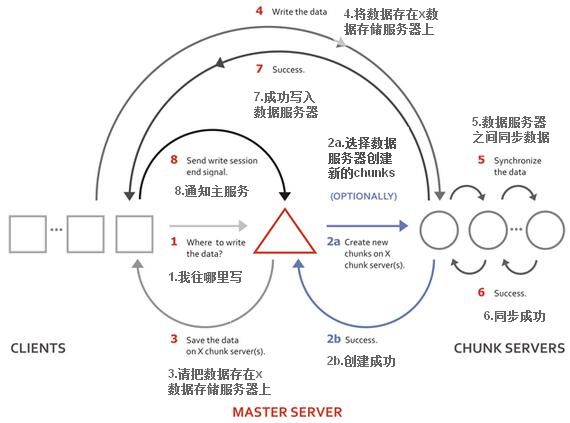</center>

1．客户端向元数据服务器发送写入请求

2．元数据服务器与Chunk Server进行交互，但元数据服务器只在某些服务器创建新的分块Chunks，创建成功后由Chunk Servers告知元数据服务器操作成功

3．元数据服务器告知客户端，可以在哪个Chunk Server的哪些Chunks写入数据

4．客户端向指定的Chunk Server写入数据

5．该Chunk Server与其他Chunk Server进行数据同步，同步成功后Chunk Server告知客户端数据写入成功

6．客户端告知元数据服务器本次写入完毕 

### 1.4 数据读出流程

<center>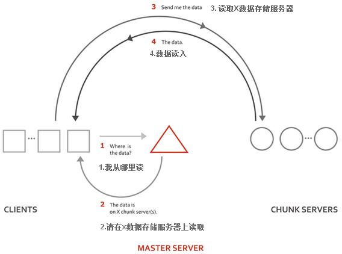</center>

1. 客户端向元数据服务器发送读取请求

2. 元数据服务器直接告诉客户端在哪个数据存储服务器的哪个chunks读取数据

3. 客户端发送读取数据到指定的chun kserver

4. Chunk server 发挥数据给客户端

### 1.5 平台要求

&emsp;部署安装MFS的的平台要求，每个安装MooseFS操作系统都需要支持内核fuse工作模式，且系统当前正在使用。

1. 支持Linux，FreeBSD,OpenSolaris,MacOS X，不支持Windows

2. 内核版本Linux (Linux 2.6.14 and up have FUSE support included in the official kernel)

3. Master mfs内存要大，大概比例300M内存可以支持1百万个文件（来自官网数据）。

### 1.6 环境

| 软件包 | 文件名              | 需要安装机器 | 备注               |
| ------ | ------------------- | ------------ | ------------------ |
| fuse   | fuse-2.9.7.tar.gz   | 客户端       | 已下载，见文件夹内 |
| mfs    | mfs-1.6.27-5.tar.gz | 所有服务器   | 已下载，见文件夹内 |

本案例使用六台虚拟机模拟搭建MFS文件系统，具体情况如所示。

<center>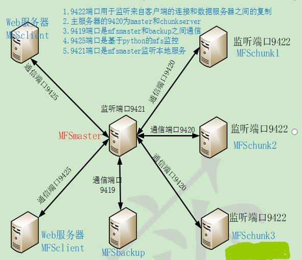</center>

## 2. 准备

### 2.1 资源规划

| 名称            | 接口 | IP              | Hostname  | 用途                         | 环境                     |
| --------------- | ---- | --------------- | --------- | ---------------------------- | ------------------------ |
| mfs master      | eth0 | 192.168.200.129 | mfsmaster | MFS主服务器                  | CentOS  6.8  x64  2.6.32 |
| mfs backup      | eth0 | 192.168.200.136 | mfsbackup | MFS主服务器的备份服务器      | CentOS  6.8  x64  2.6.32 |
| chunk  server01 | eth0 | 192.168.200.166 | mfsdata01 | MFS的数据存放服务器1         | CentOS  6.8  x64  2.6.32 |
| chunk  server02 | eth0 | 192.168.200.165 | mfsdata02 | MFS的数据存放服务器2         | CentOS  6.8  x64  2.6.32 |
| chunk  server03 | eth0 | 192.168.200.162 | mfsdata03 | MFS的数据存放服务器3         | CentOS  6.8  x64  2.6.32 |
| mfs client      | eth0 | 192.168.200.149 | mfsclient | 访问MFS的客户端服务器        | CentOS  6.8  x64  2.6.32 |
| mfs vip         | eth0 | 192.168.200.200 |           | VIP初始绑定在MFS的主服务器上 | CentOS  6.8  x64  2.6.32 |

### 2.2 角色

| 角色                                                   | 角色作用                                                     |
| ------------------------------------------------------ | ------------------------------------------------------------ |
| 管理服务器 managing server (master)                    | 负责各个数据存储服务器的管理,文件读写调度,文件空间回收以及恢复.多节点拷贝 |
| 元数据日志服务器 backupMetalogger server（Metalogger） | 负责备份master 服务器的变化日志文件，文件类型为changelog_ml.*.mfs ，以便于在master server 出问题的时候接替其进行工作 |
| 数据存储服务器data servers (chunkservers)              | 负责连接管理服务器,听从管理服务器调度,提供存储空间，并为客户提供数据传输. |
| 客户机挂载使用client computers                         | 通过fuse 内核接口挂接远程管理服务器上所管理的数据存储服务器,.看起来共享的文件系统和本地unix 文件系统使用一样的效果. |

### 2.3 准备

- 修改主机名

  &emsp;按照要求分别把对应的主机名修改为mfsmaster，mfsbackup，mfsdata01，mfsdata02，mfsdata03，mfsclient

- 修改hosts

&emsp;修改hosts的目的便于内网直接通过主机名或者别名访问。

```
cat>>/etc/hosts<<EOF
192.168.200.129	mfsmaster
192.168.200.136	mfsbackup
192.168.200.166	mfsdata01
192.168.200.165	mfsdata02
192.168.200.162	mfsdata03
192.168.200.149	mfsclient
192.168.200.200  master.caimz.org
EOF
```

每个服务器都要做，可以通过ansible，pupt，salstack这样的自动化工作，来同步。

-  master backup data安装过程完全一样。

```
# 关闭，selinux，防火墙。
sed -i 's#SELINUX=enforcing#SELINUX=disabled#g' /etc/selinux/config
# centos6
/etc/init.d/iptables stop
# centos7
systemctl firewalld stop
```

> 每个服务器都要做

- 绑定vip

```
在master mfs上手动配置vip，域名解析到该VIP上，通过域名访问，以后便于迁移。
[root@mfsmaster ~]# ifconfig eth0:0 192.168.200.200  
[root@mfsmaster ~]# ifconfig eth0:0
eth0:0    Link encap:Ethernet  HWaddr 00:0C:29:15:D2:B3  
          inet addr:192.168.200.200  Bcast:192.168.200.255  Mask:255.255.255.0
          UP BROADCAST RUNNING MULTICAST  MTU:1500  Metric:1
```

### 2.4 测试

```
[root@mfsmaster ~]# ping master.caimz.org
PING master.caimz.org (192.168.200.200) 56(84) bytes of data.
64 bytes from master.caimz.org (192.168.200.200): icmp_seq=1 ttl=64 time=0.164 ms
64 bytes from master.caimz.org (192.168.200.200): icmp_seq=2 ttl=64 time=0.144 ms

[root@mfsclient mfs]# /etc/init.d/iptables status
iptables: Firewall is not running. 


[root@mfsbackup ~]# ping -c2 master.caimz.org
PING master.caimz.org (192.168.200.200) 56(84) bytes of data.
64 bytes from master.caimz.org (192.168.200.200): icmp_seq=1 ttl=64 time=4.85 ms
64 bytes from master.caimz.org (192.168.200.200): icmp_seq=2 ttl=64 time=0.656 ms

[root@mfsbackup mfs]# /etc/init.d/iptables status
iptables: Firewall is not running. 

[root@mfsdata01 src]# ping -c2 master.caimz.org
PING master.caimz.org (192.168.200.200) 56(84) bytes of data.
64 bytes from master.caimz.org (192.168.200.200): icmp_seq=1 ttl=64 time=3.27 ms
64 bytes from master.caimz.org (192.168.200.200): icmp_seq=2 ttl=64 time=0.799 ms

[root@mfsdata01 mfs]# /etc/init.d/iptables status
iptables: Firewall is not running. 

[root@mfsdata02 src]# ping -c2 master.caimz.org
PING master.caimz.org (192.168.200.200) 56(84) bytes of data.
64 bytes from master.caimz.org (192.168.200.200): icmp_seq=1 ttl=64 time=5.39 ms
64 bytes from master.caimz.org (192.168.200.200): icmp_seq=2 ttl=64 time=0.768 ms

[root@mfsdata02 mfs]# /etc/init.d/iptables status
iptables: Firewall is not running. 

[root@mfsdata03 src]# ping -c2 master.caimz.org
PING master.caimz.org (192.168.200.200) 56(84) bytes of data.
64 bytes from master.caimz.org (192.168.200.200): icmp_seq=1 ttl=64 time=3.88 ms
64 bytes from master.caimz.org (192.168.200.200): icmp_seq=2 ttl=64 time=0.940 ms

[root@mfsdata03 mfs]# /etc/init.d/iptables status
iptables: Firewall is not running. 

[root@mfsclient ~]# ping -c2 master.caimz.org
PING master.caimz.org (192.168.200.200) 56(84) bytes of data.
64 bytes from master.caimz.org (192.168.200.200): icmp_seq=1 ttl=64 time=3.42 ms
64 bytes from master.caimz.org (192.168.200.200): icmp_seq=2 ttl=64 time=0.809 ms

[root@mfsclient mfs]# /etc/init.d/iptables status
iptables: Firewall is not running.
```

> 确保以上6台机器都能正常访问，目的是以后，不论是外网还是内网访问都是通过VIP来访问

## 3. 安装配置master

### 3.1 快速安装

```
groupadd mfs
useradd -g mfs mfs -s /sbin/nologin
cd /usr/local/src/
yum -y install fuse* zlib*
tar xf mfs-1.6.27-5.tar.gz
cd mfs-1.6.27
./configure \
--prefix=/application/mfs-1.6.27 \
--with-default-user=mfs \
--with-default-group=mfs 
make && make install
ln -sf /application/mfs-1.6.27 /application/mfs
cd /application/mfs/etc/mfs/
cp mfsmaster.cfg.dist mfsmaster.cfg      
cp mfsexports.cfg.dist mfsexports.cfg
cat >/application/mfs/etc/mfsmaster.cfg <<EOF
# Allow "meta"
*              .       rw
# Allow everything but "meta"
192.168.200.0/24 / rw,alldirs,mapall=mfs:mfs,password=111111
EOF
cp /application/mfs/var/mfs/metadata.mfs.empty /application/mfs/var/mfs/metadata.mfs
echo "export PATH=$PATH:/application/mfs/sbin:/application/mfs/bin" >>/etc/profile
source /etc/profile
/application/mfs/sbin/mfsmaster start
```

> 注意： 在安装yum install -y zlib* <- (enable-mfsmount ，MFS客户端)

### 3.2 安装具体步骤

安装步骤具体如下

```
[root@mfsmaster src]# cd /usr/local/src/
[root@mfsmaster src]# ls mfs-1.6.27-5.tar.gz 
mfs-1.6.27-5.tar.gz
[root@mfsmaster src]# tar xf mfs-1.6.27-5.tar.gz
[root@mfsmaster src]# cd mfs-1.6.27
[root@mfsmaster mfs-1.6.27]#./configure \
--prefix=/application/mfs-1.6.27 \
--with-default-user=mfs \
--with-default-group=mfs 
[root@mfsmaster mfs-1.6.27]# make && make install
[root@mfsmaster mfs-1.6.27]# ln -sf /application/mfs-1.6.27 /application/mfs
[root@mfsmaster mfs]# ll /application/mfs/
total 20
drwxr-xr-x 2 root root 4096 Dec  8 14:48 bin   
drwxr-xr-x 3 root root 4096 Dec  8 14:48 etc    #mfs配置文件所在地，里面有很多模板
drwxr-xr-x 2 root root 4096 Dec  8 14:48 sbin   #mfs命令路径
drwxr-xr-x 4 root root 4096 Dec  8 14:48 share  #mfs帮助文件
drwxr-xr-x 3 root root 4096 Dec  8 14:48 var    #mfs数据和日志目录
[root@mfsmaster mfs]# tree /application/mfs
/application/mfs
|-- bin
|   |-- mfsappendchunks -> mfstools
|   |-- mfscheckfile -> mfstools
|   |-- mfsdeleattr -> mfstools
|   |-- mfsdirinfo -> mfstools
|   |-- mfsfileinfo -> mfstools
|   |-- mfsfilerepair -> mfstools
|   |-- mfsgeteattr -> mfstools
|   |-- mfsgetgoal -> mfstools
|   |-- mfsgettrashtime -> mfstools
|   |-- mfsmakesnapshot -> mfstools
|   |-- mfsmount
|   |-- mfsrgetgoal -> mfstools
|   |-- mfsrgettrashtime -> mfstools
|   |-- mfsrsetgoal -> mfstools
|   |-- mfsrsettrashtime -> mfstools
|   |-- mfsseteattr -> mfstools
|   |-- mfssetgoal -> mfstools
|   |-- mfssettrashtime -> mfstools
|   |-- mfssnapshot
|   `-- mfstools
|-- etc
|   `-- mfs      #mfs配置文件样例文件是以.dist后缀命名。要用的时候就把.dist 后缀去掉即可
|       |-- mfschunkserver.cfg.dist
|       |-- mfsexports.cfg.dist
|       |-- mfshdd.cfg.dist
|       |-- mfsmaster.cfg.dist
|       |-- mfsmetalogger.cfg.dist
|       |-- mfsmount.cfg.dist
|       `-- mfstopology.cfg.dist
|-- sbin        #mfs启动命令和相关命令等
|   |-- mfscgiserv
|   |-- mfschunkserver
|   |-- mfsmaster
|   |-- mfsmetadump
|   |-- mfsmetalogger
|   `-- mfsmetarestore
|-- share      #帮助文件
|   |-- man
|   |   |-- man1
|   |   |   |-- mfsappendchunks.1
|   |   |   |-- mfscheckfile.1
|   |   |   |-- mfsdeleattr.1
|   |   |   |-- mfsdirinfo.1
|   |   |   |-- mfsfileinfo.1
|   |   |   |-- mfsfilerepair.1
|   |   |   |-- mfsgeteattr.1
|   |   |   |-- mfsgetgoal.1
|   |   |   |-- mfsgettrashtime.1
|   |   |   |-- mfsmakesnapshot.1
|   |   |   |-- mfsrgetgoal.1
|   |   |   |-- mfsrgettrashtime.1
|   |   |   |-- mfsrsetgoal.1
|   |   |   |-- mfsrsettrashtime.1
|   |   |   |-- mfsseteattr.1
|   |   |   |-- mfssetgoal.1
|   |   |   |-- mfssettrashtime.1
|   |   |   `-- mfstools.1
|   |   |-- man5
|   |   |   |-- mfschunkserver.cfg.5
|   |   |   |-- mfsexports.cfg.5
|   |   |   |-- mfshdd.cfg.5
|   |   |   |-- mfsmaster.cfg.5
|   |   |   |-- mfsmetalogger.cfg.5
|   |   |   `-- mfstopology.cfg.5
|   |   |-- man7
|   |   |   |-- mfs.7
|   |   |   `-- moosefs.7
|   |   `-- man8
|   |       |-- mfscgiserv.8
|   |       |-- mfschunkserver.8
|   |       |-- mfsmaster.8
|   |       |-- mfsmetalogger.8
|   |       |-- mfsmetarestore.8
|   |       `-- mfsmount.8
|   `-- mfscgi         #这个是master图形监控界面的程序
|       |-- chart.cgi
|       |-- err.gif
|       |-- favicon.ico
|       |-- index.html
|       |-- logomini.png
|       |-- mfs.cgi
|       `-- mfs.css
`-- var
    `-- mfs
        `-- metadata.mfs.empty

13 directories, 73 files
[root@mfsmaster mfs]# cd /application/mfs/etc/mfs/
[root@mfsmaster mfs]# ls
mfschunkserver.cfg.dist  mfshdd.cfg.dist     mfsmetalogger.cfg.dist  mfstopology.cfg.dist
mfsexports.cfg.dist      mfsmaster.cfg.dist  mfsmount.cfg.dist
[root@mfsmaster mfs]# ls -l
total 28
-rw-r--r-- 1 root root  572 Dec  8 14:48 mfschunkserver.cfg.dist
-rw-r--r-- 1 root root 4060 Dec  8 14:48 mfsexports.cfg.dist
-rw-r--r-- 1 root root   57 Dec  8 14:48 mfshdd.cfg.dist
-rw-r--r-- 1 root root 1047 Dec  8 14:48 mfsmaster.cfg.dist
-rw-r--r-- 1 root root  449 Dec  8 14:48 mfsmetalogger.cfg.dist
-rw-r--r-- 1 root root  404 Dec  8 14:48 mfsmount.cfg.dist
-rw-r--r-- 1 root root 1123 Dec  8 14:48 mfstopology.cfg.dis
复制模板
[root@mfsmaster mfs]# cp mfsmaster.cfg.dist mfsmaster.cfg     #主配置文件  
[root@mfsmaster mfs]# cp mfsexports.cfg.dist mfsexports.cfg    #提供挂载，授权共享目录文件
```

### 3.3 配置文件解释

```
[root@mfsmaster mfs]# egrep -v "#|^$" mfsexports.cfg
*			/	rw,alldirs,maproot=0
*			.	rw   #这个是用于允许挂载mata文件系统的，例如：恢复回收站数据需要
第一部分：mfs客户端的ip地址或者范围
地址可以指定几种形式
1)* 所有的ip地址
2)n.n.n.n/b 网络地址/位数掩码
3)n.n.n.n/m.m.m.m IP网络地址/位数掩码
4)F.f.f.f - t.t.t.t  IP段

第二部分：挂载点，被挂载的目录
目录部分需要注意两点
1)/ 标识MFS根。整个集权挂载点
2). 标示MFSMETA文件系统

第三部分： 设置MFS客户端可以访问的权限
权限部分：
1)ro 只读模式共享
2)rw读写方式共享
3)alldir 允许挂载任何指定子目录
4)maproot 映射为root，还是指定的用户。匿名用户
5)password 指定客户端密码
实际配置。对外提供授权挂载点
[root@mfsmaster ~]# cat >/application/mfs/etc/mfsmaster.cfg <<EOF
# Allow "meta"
*              .       rw
# Allow everything but "meta"
192.168.200.0/24 / rw,alldirs,mapall=mfs:mfs,password=111111
EOF
[root@mfsmaster ~]# cat /application/mfs/etc/mfsmaster.cfg
# Allow "meta"
*              .       rw
# Allow everything but "meta"
192.168.200.0/24 / rw,alldirs,mapall=mfs:mfs,password=111111

在master上配置vip。可以使用其他网卡（我这里是测试就暂时使用别名）
[root@mfsmaster ~]# ifconfig eth0:0 192.168.200.200
[root@mfsmaster ~]# ifconfig eth0:0
eth0:0    Link encap:Ethernet  HWaddr 00:0C:29:15:D2:B3  
          inet addr:192.168.200.200  Bcast:192.168.200.255  Mask:255.255.255.0
          UP BROADCAST RUNNING MULTICAST  MTU:1500  Metric:1
```

### 3.4 启动

```
[root@mfsmaster ~]# /application/mfs/sbin/mfsmaster start  #启动
working directory: /application/mfs-1.6.27/var/mfs
lockfile created and locked
initializing mfsmaster modules ...
loading sessions ... ok
sessions file has been loaded
exports file has been loaded
mfstopology configuration file (/application/mfs-1.6.27/etc/mfstopology.cfg) not found - using defaults
loading metadata ...
loading objects (files,directories,etc.) ... ok
loading names ... ok
loading deletion timestamps ... ok
loading chunks data ... ok
checking filesystem consistency ... ok
connecting files and chunks ... ok
all inodes: 1
directory inodes: 1
file inodes: 0
chunks: 0
metadata file has been loaded
stats file has been loaded
master <-> metaloggers module: listen on *:9419
master <-> chunkservers module: listen on *:9420
main master server module: listen on *:9421
mfsmaster daemon initialized properly

[root@mfsmaster ~]# /application/mfs/sbin/mfsmaster -s     #停止方式1
sending SIGTERM to lock owner (pid:11788) 
waiting for termination ... terminated
[root@mfsmaster ~]# /application/mfs/sbin/mfsmaster stop   #停止方式2
sending SIGTERM to lock owner (pid:12146)
waiting for termination ... Terminated
```


### 3.5 启动失败

```
问题1.修改原数据文件metadata.mfs.empty修改为metadata.mfs
working directory: /application/mfs-1.6.27/var/mfs
lockfile created and locked
initializing mfsmaster modules ...
loading sessions ... file not found
if it is not fresh installation then you have to restart all active mounts !!!
exports file has been loaded
mfstopology configuration file (/application/mfs-1.6.27/etc/mfstopology.cfg) not found - using defaults
loading metadata ...
can't open metadata file
if this is new instalation then rename /application/mfs-1.6.27/var/mfs/metadata.mfs.empty as /application/mfs-1.6.27/var/mfs/metadata.mfs
init: file system manager failed !!!
error occured during initialization - exiting
需要先配置文件	
[root@mfsmaster mfs]# pwd
/application/mfs/var/mfs
[root@mfsmaster mfs]# cp metadata.mfs.empty metadata.mfs      
[root@mfsmaster mfs]# /application/mfs/sbin/mfsmaster start
working directory: /application/mfs-1.6.27/var/mfs
lockfile created and locked
initializing mfsmaster modules ...
loading sessions ... ok
sessions file has been loaded
exports file has been loaded
mfstopology configuration file (/application/mfs-1.6.27/etc/mfstopology.cfg) not found - using defaults
loading metadata ...
create new empty filesystemmetadata file has been loaded
no charts data file - initializing empty charts
master <-> metaloggers module: listen on *:9419
master <-> chunkservers module: listen on *:9420
main master server module: listen on *:9421
mfsmaster daemon initialized properly
[root@mfsmaster mfs]# netstat -lnp|grep mfs
tcp        0      0 0.0.0.0:9419                0.0.0.0:*                   LISTEN      11788/mfsmaster     
tcp        0      0 0.0.0.0:9420                0.0.0.0:*                   LISTEN      11788/mfsmaster     
tcp        0      0 0.0.0.0:9421                0.0.0.0:*                   LISTEN      11788/mfsmaster     
[root@mfsmaster mfs]# netstat -lnp|grep 94 
tcp        0      0 0.0.0.0:9419                0.0.0.0:*                   LISTEN      11788/mfsmaster     
tcp        0      0 0.0.0.0:9420                0.0.0.0:*                   LISTEN      11788/mfsmaster     
tcp        0      0 0.0.0.0:9421                0.0.0.0:*                   LISTEN      11788/mfsmaster     
unix  2      [ ACC ]     STREAM     LISTENING     33064  9094/bonobo-activat /tmp/orbit-leco/linc-2386-0-372adc3c888d7
unix  2      [ ACC ]     STREAM     LISTENING     33867  9108/bluetooth-appl /tmp/orbit-leco/linc-2394-0-52f00e366e388
问题2.权限问题/application/mfs/var/mfs
chown -R  mfs.mfs  /application/mfs

查看系统日志：
[root@mfsmaster mfs]# ll /application/mfs/var/mfs
total 12
-rw-r----- 1 mfs  mfs  95 Dec  8 16:04 metadata.mfs.back
-rw-r--r-- 1 root root  8 Dec  8 14:48 metadata.mfs.empty
-rw-r----- 1 mfs  mfs  10 Dec  8 16:01 sessions.mfs
[root@mfsmaster mfs]# tail -f /var/log/messages
Dec  8 16:04:11 mfsmaster mfsmaster[11788]: set uid to 501
Dec  8 16:04:11 mfsmaster mfsmaster[11788]: sessions have been loaded
Dec  8 16:04:11 mfsmaster mfsmaster[11788]: exports file has been loaded
Dec  8 16:04:11 mfsmaster mfsmaster[11788]: mfstopology configuration file (/application/mfs-1.6.27/etc/mfstopology.cfg) not found - network topology not defined
Dec  8 16:04:11 mfsmaster mfsmaster[11788]: create new empty filesystem
Dec  8 16:04:11 mfsmaster mfsmaster[11788]: no charts data file - initializing empty charts
Dec  8 16:04:11 mfsmaster mfsmaster[11788]: master <-> metaloggers module: listen on *:9419
Dec  8 16:04:11 mfsmaster mfsmaster[11788]: master <-> chunkservers module: listen on *:9420
Dec  8 16:04:11 mfsmaster mfsmaster[11788]: main master server module: listen on *:9421
Dec  8 16:04:11 mfsmaster mfsmaster[11788]: open files limit: 5000
```

### 3.6 配置环境变量

```
[root@mfsmaster ~]# echo "export PATH=$PATH:/application/mfs/sbin:/application/mfs/bin" >>/etc/profile
[root@mfsmaster ~]# source /etc/profile
```

### 3.7 开机自启动

```
[root@mfsmaster ~]# echo "# startup master mfs by caimengzhi at 2016/12/08">>/etc/rc.local 
[root@mfsmaster ~]# echo "/application/mfs/sbin/mfsmaster start">>/etc/rc.local 
[root@mfsmaster ~]# tail -2 /etc/rc.local 
# startup master mfs by caimengzhi at 2016/12/08
/application/mfs/sbin/mfsmaster start
#在/etc/rc.local中使用全路径
```

### 3.8 启动mfscgi

&emsp;`MFS`内置的监控工具`mfscgiserv`。在master执行 `mfscgiserv start`就启动了，web输入` http://master-ip:9425 `#默认端口为9425

```
[root@mfsmaster ~]# which mfscgiserv 
/application/mfs/sbin/mfscgiserv
[root@mfsmaster ~]# mfscgiserv start  #启动
lockfile created and locked
starting simple cgi server (host: any , port: 9425 , rootpath: /application/mfs-1.6.27/share/mfscgi)
启动简单的cgi 服务（监控所有主机的9425端口）
[root@mfsmaster ~]# netstat -lnp|grep 9425
tcp        0      0 0.0.0.0:9425                0.0.0.0:*                   LISTEN      12330/python
```

<center>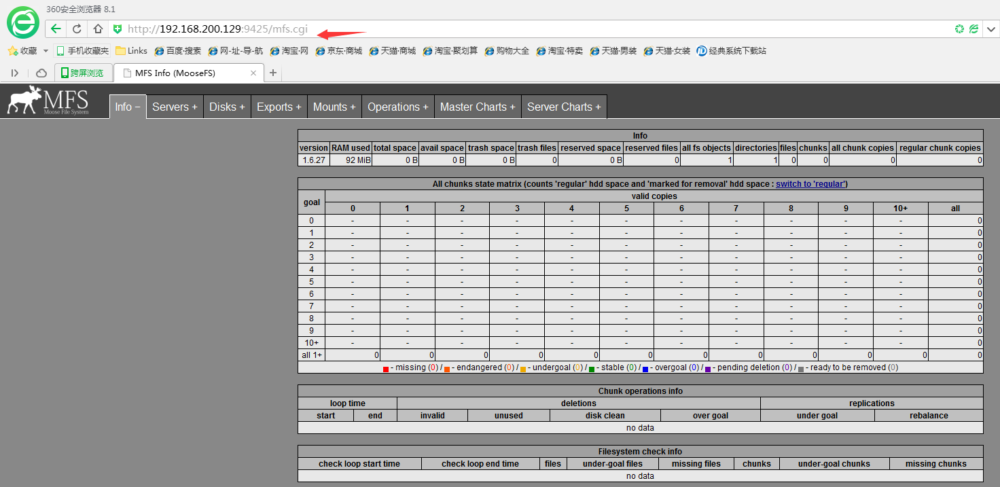</center>

## 4. 安装配置mfsmetalogger

### 4.1 快速安装

```
groupadd mfs
useradd -g mfs mfs -s /sbin/nologin
cd /usr/local/src/
yum -y install fuse* zlib*
tar xf mfs-1.6.27-5.tar.gz
cd mfs-1.6.27
./configure \
--prefix=/application/mfs-1.6.27 \
--with-default-user=mfs \
--with-default-group=mfs 
make && make install
ln -sf /application/mfs-1.6.27 /application/mfs
cd /application/mfs/etc/mfs/
cp mfsmetalogger.cfg.dist mfsmetalogger.cfg 
sed -i "s@# MASTER_HOST = mfsmaster@MASTER_HOST = master.caimz.org @g" mfsmetalogger.cfg
echo "export PATH=$PATH:/application/mfs/sbin:/application/mfs/bin" >>/etc/profile
source /etc/profile
```

### 4.2 具体安装步骤

```
[root@mfsbackup ~]# groupadd mfs
[root@mfsbackup ~]# useradd -g mfs mfs -s /sbin/nologin
[root@mfsbackup ~]# cd /usr/local/src/
[root@mfsbackup src]# yum -y install fuse* zlib*
[root@mfsbackup src]# tar xf mfs-1.6.27-5.tar.gz
[root@mfsbackup src]# cd mfs-1.6.27
[root@mfsbackup mfs-1.6.27]# ./configure \
> --prefix=/application/mfs-1.6.27 \
> --with-default-user=mfs \
> --with-default-group=mfs 
checking build system type... x86_64-unknown-linux-gnu
checking host system type... x86_64-unknown-linux-gnu
。。。。。省。。。。
[root@mfsbackup mfs-1.6.27]# make && make install
[root@mfsbackup mfs-1.6.27]# ln -sf /application/mfs-1.6.27 /application/mfs
[root@mfsbackup mfs-1.6.27]# cd /application/mfs/etc/mfs/
[root@mfsbackup mfs]# ls
mfschunkserver.cfg.dist  mfsexports.cfg.dist  mfshdd.cfg.dist  mfsmaster.cfg.dist  mfsmetalogger.cfg.dist  mfsmount.cfg.dist  mfstopology.cfg.dist
[root@mfsbackup mfs]# cp mfsmetalogger.cfg.dist mfsmetalogger.cfg  
[root@mfsbackup mfs]# 
sed -i "s@# MASTER_HOST = mfsmaster@MASTER_HOST = master.caimz.org @g" mfsmetalogger.cfg
[root@mfsbackup mfs]# cat mfsmetalogger.cfg |grep MASTER_HOST
MASTER_HOST = master.caimz.org  #设置成vip的域名
[root@mfsbackup mfs]# grep caimz /etc/hosts
192.168.200.200 master.caimz.org   #事先hosts文件中做好了解析
```

### 4.3 配置文件解释

```
[root@mfsbackup mfs]# cat mfsmetalogger.cfg
# WORKING_USER = mfs
# WORKING_GROUP = mfs
# SYSLOG_IDENT = mfsmetalogger
# LOCK_MEMORY = 0
# NICE_LEVEL = -19
# DATA_PATH = /application/mfs-1.6.27/var/mfs
# BACK_LOGS = 50
# BACK_META_KEEP_PREVIOUS = 3
# META_DOWNLOAD_FREQ = 24  #这个是可以设置小的，这样同步时间间隔就缩短
#原数据备份文件下载请求频率，默认是24小时，即每隔一天从原数据服务器（master）下载一个meta.mfs.back,文件。当原数据服务器关闭或者出现故障时，meta.mfs.back文件将消失，那么要恢复整个mfs，则需要从metalogger服务器取得该文件，请特别注意这个文件，它与日志文件在一起，才能恢复整个被破坏的分布式文件系统文件。
# MASTER_RECONNECTION_DELAY = 5
MASTER_HOST = master.caimz.org  #这是需要链接的mfs master的主机，可以是ip或者域名（利于迁移）
# MASTER_PORT = 9419          #这里是需要链接的mfs master的port
# MASTER_TIMEOUT = 60
# deprecated, to be removed in MooseFS 1.7
# LOCK_FILE = /application/mfs-1.6.27/var/run/mfs/mfsmetalogger.lock
```

检测主master和back是否相通.

```
[root@mfsbackup mfs]# telnet master.caimz.org 9419
Trying 192.168.200.200...
Connected to master.caimz.org.
Escape character is '^]'.
或者使用nmap
[root@mfsbackup mfs]# nmap master.caimz.org -p 9419

Starting Nmap 5.51 ( http://nmap.org ) at 2016-12-08 17:10 CST
Nmap scan report for master.caimz.org (192.168.200.200)
Host is up (0.00067s latency).
PORT     STATE SERVICE
9419/tcp open  unknown
MAC Address: 00:0C:29:15:D2:B3 (VMware)

Nmap done: 1 IP address (1 host up) scanned in 0.10 seconds
```

启动备份服务器metalogger

```
[root@mfsbackup mfs]# /application/mfs/sbin/mfsmetalogger start
working directory: /application/mfs-1.6.27/var/mfs
lockfile created and locked
initializing mfsmetalogger modules ...
mfsmetalogger daemon initialized properly
[root@mfsbackup mfs]# netstat -lntup|grep mfs  #没有启动端口，有进程
[root@mfsbackup mfs]# ps -ef | grep mfs
mfs       12644      1  0 17:15 ?        00:00:00 /application/mfs/sbin/mfsmetalogger start
root      12648   6128  0 17:15 pts/1    00:00:00 grep mfs
[root@mfsbackup mfs]# netstat -an | grep -i est
Active Internet connections (servers and established)
tcp        0     64 192.168.200.136:22          192.168.200.1:64595         ESTABLISHED 
tcp        0      0 192.168.200.136:22          192.168.200.1:62257         ESTABLISHED 
tcp        0      0 192.168.200.136:57836       192.168.200.200:9419        ESTABLISHED 
Active UNIX domain sockets (servers and established)
unix  2      [ ACC ]     STREAM     LISTENING     10713  /var/run/vmware/guestServicePipe
master和log一直有个长连接
此时在检测主上的情况
[root@mfsmaster ~]# netstat -an | grep -i est
Active Internet connections (servers and established)
tcp        0      0 192.168.200.129:22          192.168.200.1:64594         ESTABLISHED 
tcp        0      0 192.168.200.200:9419        192.168.200.136:57836       ESTABLISHED 
tcp        0     64 192.168.200.129:22          192.168.200.1:49355         ESTABLISHED 
tcp        0      0 192.168.200.129:22          192.168.200.1:64720         ESTABLISHED 
Active UNIX domain sockets (servers and established)
unix  2      [ ACC ]     STREAM     LISTENING     10711  /var/run/vmware/guestServicePipe
```

> mfs master 和log一直保持长链接，这样有数据才能实时通信。以后要是恢复的话，需要changelog metadata.路径所在。

备份服务器的日志路径：

```
[root@mfsbackup mfs]#  ll  /application/mfs/var/mfs/
total 12
-rw-r----- 1 mfs  mfs   0 Dec  8 17:15 changelog_ml_back.0.mfs
-rw-r----- 1 mfs  mfs   0 Dec  8 17:15 changelog_ml_back.1.mfs
-rw-r--r-- 1 root root  8 Dec  8 16:46 metadata.mfs.empty
-rw-r----- 1 mfs  mfs  95 Dec  8 17:15 metadata_ml.mfs.back
-rw-r----- 1 mfs  mfs  10 Dec  8 17:21 sessions_ml.mfs
```

主mfs服务器日志路径

```
[root@mfsmaster ~]# ll  /application/mfs/var/mfs/
total 764
-rw-r----- 1 mfs  mfs      95 Dec  8 17:00 metadata.mfs.back
-rw-r----- 1 mfs  mfs      95 Dec  8 16:13 metadata.mfs.back.1
-rw-r--r-- 1 root root      8 Dec  8 14:48 metadata.mfs.empty
-rw-r----- 1 mfs  mfs      10 Dec  8 17:00 sessions.mfs
-rw-r----- 1 mfs  mfs  762516 Dec  8 17:00 stats.mfs
```

### 4.4 开机自启动

```
[root@mfsbackup mfs]# echo "# startup back mfs by caimengzhi at 2016/12/08">>/etc/rc.local
[root@mfsbackup mfs]# echo "/application/mfs/sbin/mfsmetalogger start" >>/etc/rc.local
[root@mfsbackup mfs]# tail -2 /etc/rc.local 
# startup back mfs by caimengzhi at 2016/12/08
/application/mfs/sbin/mfsmetalogger start
```

### 4.5 配置环境变量

```
[root@mfsbackup mfs]# echo "export PATH=$PATH:/application/mfs/sbin:/application/mfs/bin" >>/etc/profile
[root@mfsbackup mfs]# tail -1 /etc/profile
export PATH=/usr/local/sbin:/usr/local/bin:/sbin:/bin:/usr/sbin:/usr/bin:/root/bin:/application/mfs/sbin:/application/mfs/bin
[root@mfsbackup mfs]# source /etc/profile
```

### 4.6 启停

```
[root@mfsbackup mfs]# mfsmetalogger -s          #停止
sending SIGTERM to lock owner (pid:12644)
waiting for termination ... terminated
[root@mfsbackup mfs]# mfsmetalogger start        #启动
working directory: /application/mfs-1.6.27/var/mfs
lockfile created and locked
initializing mfsmetalogger modules ...
mfsmetalogger daemon initialized properly
[root@mfsbackup mfs]# ps -ef | grep mfs
mfs       12823      1  0 17:29 ?        00:00:00 mfsmetalogger start
root      12840   6128  0 17:30 pts/1    00:00:00 grep mfs
```

查看日志

```
[root@mfsbackup mfs]# tail -f /var/log/messages
Dec  8 17:24:58 localhost dhclient[12552]: DHCPACK from 192.168.200.254 (xid=0x2d38688f)
Dec  8 17:24:58 localhost dhclient[12552]: bound to 192.168.200.136 -- renewal in 814 seconds.
Dec  8 17:24:58 localhost NetworkManager[2046]: <info> (eth0): DHCPv4 state changed reboot -> renew
Dec  8 17:24:58 localhost NetworkManager[2046]: <info>   address 192.168.200.136
Dec  8 17:24:58 localhost NetworkManager[2046]: <info>   prefix 24 (255.255.255.0)
Dec  8 17:24:58 localhost NetworkManager[2046]: <info>   gateway 192.168.200.2
Dec  8 17:24:58 localhost NetworkManager[2046]: <info>   nameserver '192.168.200.2'
Dec  8 17:24:58 localhost NetworkManager[2046]: <info>   domain name 'localdomain'
Dec  8 17:25:00 localhost mfsmetalogger[12644]: sessions downloaded 10B/0.001561s (0.006 MB/s)
Dec  8 17:26:00 localhost mfsmetalogger[12644]: sessions downloaded 10B/0.001153s (0.009 MB/s)
```

## 5. 安装配置数据server 

### 5.1 快速安装

```
groupadd mfs
useradd -g mfs mfs -s /sbin/nologin
cd /usr/local/src/
yum -y install fuse* zlib*
tar xf mfs-1.6.27-5.tar.gz
cd mfs-1.6.27
./configure \
--prefix=/application/mfs-1.6.27 \
--with-default-user=mfs \
--with-default-group=mfs 
make && make install
ln -sf /application/mfs-1.6.27 /application/mfs
cd /application/mfs/etc/mfs/
cp mfschunkserver.cfg.dist mfschunkserver.cfg  
cp mfshdd.cfg.dist mfshdd.cfg
sed -i "s@# MASTER_HOST = mfsmaster@MASTER_HOST = master.caimz.org @g"  mfschunkserver.cfg
mkdir /mfsdata
chown -R mfs.mfs /mfsdata
echo "/mfsdata" >>mfshdd.cfg
/application/mfs/sbin/mfschunkserver start
```

### 5.2 安装具体步骤

```
我只列出第一台记录，其他两台一样操作。
[root@mfsdata01 src]# groupadd mfs
[root@mfsdata01 src]# useradd -g mfs mfs -s /sbin/nologin
[root@mfsdata01 src]# cd /usr/local/src/
[root@mfsdata01 src]# yum -y install fuse* zlib*
[root@mfsdata01 src]# tar xf mfs-1.6.27-5.tar.gz
[root@mfsdata01 src]# cd mfs-1.6.27
[root@mfsdata01 mfs-1.6.27]# ./configure \
> --prefix=/application/mfs-1.6.27 \
> --with-default-user=mfs \
> --with-default-group=mfs
[root@mfsdata01 mfs-1.6.27]# make && make install
[root@mfsdata01 mfs-1.6.27]# ln -sf /application/mfs-1.6.27 /application/mfs
```

### 5.3 新增测试盘

&emsp;要用别的磁盘做文件存储。此时我使用虚拟机新添加一块磁盘。我只列举一个，其他两台服务区一样操作。

```
[root@mfsdata01 ~]# fdisk -l

Disk /dev/sdb: 536.9 GB, 536870912000 bytes
255 heads, 63 sectors/track, 65270 cylinders
Units = cylinders of 16065 * 512 = 8225280 bytes
Sector size (logical/physical): 512 bytes / 512 bytes
I/O size (minimum/optimal): 512 bytes / 512 bytes
Disk identifier: 0x00000000

Disk /dev/sda: 966.4 GB, 966367641600 bytes
255 heads, 63 sectors/track, 117487 cylinders
Units = cylinders of 16065 * 512 = 8225280 bytes
Sector size (logical/physical): 512 bytes / 512 bytes
I/O size (minimum/optimal): 512 bytes / 512 bytes
Disk identifier: 0x0005b2f2

   Device Boot      Start         End      Blocks   Id  System
/dev/sda1   *           1          39      307200   83  Linux
Partition 1 does not end on cylinder boundary.
/dev/sda2              39      117235   941378560   83  Linux
/dev/sda3          117235      117488     2031616   82  Linux swap / Solaris
以下是一个新增磁盘分区格式化
[root@mfsdata01 ~]# fdisk /dev/sdb
Device contains neither a valid DOS partition table, nor Sun, SGI or OSF disklabel
Building a new DOS disklabel with disk identifier 0x31a32dd8.
Changes will remain in memory only, until you decide to write them.
After that, of course, the previous content won't be recoverable.

Warning: invalid flag 0x0000 of partition table 4 will be corrected by w(rite)

WARNING: DOS-compatible mode is deprecated. It's strongly recommended to
         switch off the mode (command 'c') and change display units to
         sectors (command 'u').

Command (m for help): n
Command action
   e   extended
   p   primary partition (1-4)
p
Partition number (1-4): 1
First cylinder (1-65270, default 1): 
Using default value 1
Last cylinder, +cylinders or +size{K,M,G} (1-65270, default 65270): 
Using default value 65270

Command (m for help): w
The partition table has been altered!

Calling ioctl() to re-read partition table.
Syncing disks.
[root@mfsdata01 ~]# fdisk -l

Disk /dev/sdb: 536.9 GB, 536870912000 bytes
255 heads, 63 sectors/track, 65270 cylinders
Units = cylinders of 16065 * 512 = 8225280 bytes
Sector size (logical/physical): 512 bytes / 512 bytes
I/O size (minimum/optimal): 512 bytes / 512 bytes
Disk identifier: 0x31a32dd8

   Device Boot      Start         End      Blocks   Id  System
/dev/sdb1               1       65270   524281243+  83  Linux

Disk /dev/sda: 966.4 GB, 966367641600 bytes
255 heads, 63 sectors/track, 117487 cylinders
Units = cylinders of 16065 * 512 = 8225280 bytes
Sector size (logical/physical): 512 bytes / 512 bytes
I/O size (minimum/optimal): 512 bytes / 512 bytes
Disk identifier: 0x0005b2f2

   Device Boot      Start         End      Blocks   Id  System
/dev/sda1   *           1          39      307200   83  Linux
Partition 1 does not end on cylinder boundary.
/dev/sda2              39      117235   941378560   83  Linux
/dev/sda3          117235      117488     2031616   82  Linux swap / Solaris
[root@mfsdata01 ~]# mkfs
mkfs          mkfs.cramfs   mkfs.ext2     mkfs.ext3     mkfs.ext4     mkfs.ext4dev  mkfs.msdos    mkfs.vfat     
[root@mfsdata01 ~]# mkfs.ext
mkfs.ext2     mkfs.ext3     mkfs.ext4     mkfs.ext4dev  
[root@mfsdata01 ~]# mkfs.ext4 /dev/sdb1
mke2fs 1.41.12 (17-May-2010)
Filesystem label=
OS type: Linux
Block size=4096 (log=2)
Fragment size=4096 (log=2)
Stride=0 blocks, Stripe width=0 blocks
32768000 inodes, 131070310 blocks
6553515 blocks (5.00%) reserved for the super user
First data block=0
Maximum filesystem blocks=4294967296
4000 block groups
32768 blocks per group, 32768 fragments per group
8192 inodes per group
Superblock backups stored on blocks: 
	32768, 98304, 163840, 229376, 294912, 819200, 884736, 1605632, 2654208, 
	4096000, 7962624, 11239424, 20480000, 23887872, 71663616, 78675968, 
	102400000

Writing inode tables: done                            
Creating journal (32768 blocks): done
Writing superblocks and filesystem accounting information: done

This filesystem will be automatically checked every 24 mounts or
180 days, whichever comes first.  Use tune2fs -c or -i to override.
[root@mfsdata01 ~]# fdisk -l

Disk /dev/sdb: 536.9 GB, 536870912000 bytes
255 heads, 63 sectors/track, 65270 cylinders
Units = cylinders of 16065 * 512 = 8225280 bytes
Sector size (logical/physical): 512 bytes / 512 bytes
I/O size (minimum/optimal): 512 bytes / 512 bytes
Disk identifier: 0x31a32dd8

   Device Boot      Start         End      Blocks   Id  System
/dev/sdb1               1       65270   524281243+  83  Linux

Disk /dev/sda: 966.4 GB, 966367641600 bytes
255 heads, 63 sectors/track, 117487 cylinders
Units = cylinders of 16065 * 512 = 8225280 bytes
Sector size (logical/physical): 512 bytes / 512 bytes
I/O size (minimum/optimal): 512 bytes / 512 bytes
Disk identifier: 0x0005b2f2

   Device Boot      Start         End      Blocks   Id  System
/dev/sda1   *           1          39      307200   83  Linux
Partition 1 does not end on cylinder boundary.
/dev/sda2              39      117235   941378560   83  Linux
/dev/sda3          117235      117488     2031616   82  Linux swap / Solaris
添加到fstab里中，配置如下
[root@mfsdata01 mfs-1.6.27]# mkdir /mfsdata  #创建要被新分区挂载的目录
[root@mfsdata01 ~]#
echo “/dev/sdb1               /mfsdata                ext4    defaults        0 0”>> /etc/fstab 
[root@mfsdata01 ~]# tail -1 /etc/fstab 
/dev/sdb1               /mfsdata                ext4    defaults        0 0
[root@mfsdata01 ~]# mount  #检查语法有什么错误
/dev/sda2 on / type ext4 (rw)
proc on /proc type proc (rw)
sysfs on /sys type sysfs (rw)
devpts on /dev/pts type devpts (rw,gid=5,mode=620)
tmpfs on /dev/shm type tmpfs (rw)
/dev/sda1 on /boot type ext4 (rw)
none on /proc/sys/fs/binfmt_misc type binfmt_misc (rw)
vmware-vmblock on /var/run/vmblock-fuse type fuse.vmware-vmblock (rw,nosuid,nodev,default_permissions,allow_other)
[root@mfsdata01 ~]# mount -a  #自动挂载
[root@mfsdata01 ~]# df -h
Filesystem      Size  Used Avail Use% Mounted on
/dev/sda2       884G  6.4G  833G   1% /
tmpfs           491M   72K  491M   1% /dev/shm
/dev/sda1       283M   97M  172M  37% /boot
/dev/sdb1       493G   70M  467G   1% /mfsdata  #已经挂载上去了
```

接着开始配置chunk server

```
[root@mfsdata01 ~]# cd /application/mfs/etc/mfs/
[root@mfsdata01 mfs]# ll
total 28
-rw-r--r-- 1 root root  572 Dec  8 01:40 mfschunkserver.cfg.dist
-rw-r--r-- 1 root root 4060 Dec  8 01:40 mfsexports.cfg.dist
-rw-r--r-- 1 root root   57 Dec  8 01:40 mfshdd.cfg.dist
-rw-r--r-- 1 root root 1047 Dec  8 01:40 mfsmaster.cfg.dist
-rw-r--r-- 1 root root  449 Dec  8 01:40 mfsmetalogger.cfg.dist
-rw-r--r-- 1 root root  404 Dec  8 01:40 mfsmount.cfg.dist
-rw-r--r-- 1 root root 1123 Dec  8 01:40 mfstopology.cfg.dist
[root@mfsdata01 mfs]# cp mfschunkserver.cfg.dist mfschunkserver.cfg
[root@mfsdata01 mfs]# cp mfshdd.cfg.dist mfshdd.cfg
[root@mfsdata01 mfs]# ll -lrt
total 36
-rw-r--r-- 1 root root  572 Dec  8 01:40 mfschunkserver.cfg.dist
-rw-r--r-- 1 root root   57 Dec  8 01:40 mfshdd.cfg.dist
-rw-r--r-- 1 root root  449 Dec  8 01:40 mfsmetalogger.cfg.dist
-rw-r--r-- 1 root root 1047 Dec  8 01:40 mfsmaster.cfg.dist
-rw-r--r-- 1 root root 4060 Dec  8 01:40 mfsexports.cfg.dist
-rw-r--r-- 1 root root 1123 Dec  8 01:40 mfstopology.cfg.dist
-rw-r--r-- 1 root root  404 Dec  8 01:40 mfsmount.cfg.dist
-rw-r--r-- 1 root root  572 Dec  8 02:12 mfschunkserver.cfg
-rw-r--r-- 1 root root   57 Dec  8 02:13 mfshdd.cfg
```

### 5.4 配置文件解释

```
[root@mfsdata01 mfs]# cat mfschunkserver.cfg|grep -v "^$"
# WORKING_USER = mfs
# WORKING_GROUP = mfs
# SYSLOG_IDENT = mfschunkserver
# LOCK_MEMORY = 0
# NICE_LEVEL = -19
# DATA_PATH = /application/mfs-1.6.27/var/mfs
# MASTER_RECONNECTION_DELAY = 5
# BIND_HOST = *
# MASTER_HOST = mfsmaster
# MASTER_PORT = 9420
# MASTER_TIMEOUT = 60
# CSSERV_LISTEN_HOST = *
# CSSERV_LISTEN_PORT = 9422  #这个监听端口用于其他数据存储服务器之间连接，通常是数据复制。
# HDD_CONF_FILENAME = /application/mfs-1.6.27/etc/mfs/mfshdd.cfg
# HDD_TEST_FREQ = 10
# deprecated, to be removed in MooseFS 1.7
# LOCK_FILE = /application/mfs-1.6.27/var/run/mfs/mfschunkserver.lock
# BACK_LOGS = 50
# CSSERV_TIMEOUT = 5
```

只修改主master的地方

```
[root@mfsdata01 mfs]# 
sed -i "s@# MASTER_HOST = mfsmaster@MASTER_HOST = master.caimz.org @g"  mfschunkserver.cfg
[root@mfsdata01 mfs]# cat mfschunkserver.cfg|grep MASTER_HOST
MASTER_HOST = master.caimz.org
```

新添加共享存储的配置

```
[root@mfsdata01 mfs]# cat mfshdd.cfg
# mount points of HDD drives
#
#/mnt/hd1
#/mnt/hd2
#etc.
/mfsdata    #可以挂在多个挂载点。
[root@mfsdata01 mfs]# chown -R mfs.mfs /mfsdata
```

> 另外两台操作一样

启动chunkserver

```
[root@mfsdata01 mfs]# /application/mfs/sbin/mfschunkserver start
working directory: /application/mfs-1.6.27/var/mfs
lockfile created and locked
initializing mfschunkserver modules ...
hdd space manager: path to scan: /mfsdata/
hdd space manager: start background hdd scanning (searching for available chunks)
main server module: listen on *:9422
no charts data file - initializing empty charts
mfschunkserver daemon initialized properly
[root@mfsdata01 mfs]# netstat -lnp|grep 9422
tcp        0      0 0.0.0.0:9422                0.0.0.0:*                   LISTEN      2902/mfschunkserver 
```

查看共享存储生成文件，都是以某个算法生产的二进制文件

```
[root@mfsdata01 mfs]# ls /mfsdata/
00  06  0C  12  18  1E  24  2A  30  36  3C  42  48  4E  54  5A  60  66  6C  72  78  7E  84  8A  90  96  9C  A2  A8  AE  B4  BA  C0  C6  CC  D2  D8  DE  E4  EA  F0  F6  FC
01  07  0D  13  19  1F  25  2B  31  37  3D  43  49  4F  55  5B  61  67  6D  73  79  7F  85  8B  91  97  9D  A3  A9  AF  B5  BB  C1  C7  CD  D3  D9  DF  E5  EB  F1  F7  FD
02  08  0E  14  1A  20  26  2C  32  38  3E  44  4A  50  56  5C  62  68  6E  74  7A  80  86  8C  92  98  9E  A4  AA  B0  B6  BC  C2  C8  CE  D4  DA  E0  E6  EC  F2  F8  FE
03  09  0F  15  1B  21  27  2D  33  39  3F  45  4B  51  57  5D  63  69  6F  75  7B  81  87  8D  93  99  9F  A5  AB  B1  B7  BD  C3  C9  CF  D5  DB  E1  E7  ED  F3  F9  FF
04  0A  10  16  1C  22  28  2E  34  3A  40  46  4C  52  58  5E  64  6A  70  76  7C  82  88  8E  94  9A  A0  A6  AC  B2  B8  BE  C4  CA  D0  D6  DC  E2  E8  EE  F4  FA  lost+found
05  0B  11  17  1D  23  29  2F  35  3B  41  47  4D  53  59  5F  65  6B  71  77  7D  83  89  8F  95  9B  A1  A7  AD  B3  B9  BF  C5  CB  D1  D7  DD  E3  E9  EF  F5  FB
```

### 5.5 启停 chunkserver

```
[root@mfsdata01 mfs]# /application/mfs/sbin/mfschunkserver start  #启动
[root@mfsdata01 mfs]# /application/mfs/sbin/mfschunkserver -s     #停止
```

查看和master通信，9420端口

```
[root@mfsdata01 mfs]# netstat -an|grep 94
tcp        0      0 0.0.0.0:9422                0.0.0.0:*                   LISTEN      
tcp        0      0 192.168.200.166:54738       192.168.200.200:9420        ESTABLISHED 
tcp        0      0 192.168.200.166:54736       192.168.200.200:9420        TIME_WAIT   
tcp        0     64 192.168.200.166:22          192.168.200.1:49467         ESTABLISHED 
unix  3      [ ]         STREAM     CONNECTED     14194  /tmp/orbit-gdm/linc-a4b-0-23192e49bfbe2
unix  3      [ ]         STREAM     CONNECTED     13894  
unix  3      [ ]         STREAM     CONNECTED     12694  
```

> 说明：9422 端口用于监听来自客户端的连接和数据服务器之间的复制，主服务器的9420为master和chunkserver modules：listen *:9420

查看日志

```
[root@mfsdata01 mfs]# tail /var/log/messages
Dec  8 02:29:11 mfsdata01 mfschunkserver[2902]: closing *:9422
Dec  8 02:29:16 mfsdata01 mfschunkserver[2954]: set gid to 502
Dec  8 02:29:16 mfsdata01 mfschunkserver[2954]: set uid to 502
Dec  8 02:29:16 mfsdata01 mfschunkserver[2954]: hdd space manager: folder /mfsdata/ will be scanned
Dec  8 02:29:16 mfsdata01 mfschunkserver[2954]: main server module: listen on *:9422
Dec  8 02:29:16 mfsdata01 mfschunkserver[2954]: connecting ...
Dec  8 02:29:16 mfsdata01 mfschunkserver[2954]: stats file has been loaded
Dec  8 02:29:16 mfsdata01 mfschunkserver[2954]: open files limit: 10000
Dec  8 02:29:16 mfsdata01 mfschunkserver[2954]: connected to Master
Dec  8 02:29:16 mfsdata01 mfschunkserver[2954]: scanning folder /mfsdata/: complete (0s
```

此时先检查四个启动状态

```
Data01
[root@mfsdata01 mfs]# netstat -an|grep 94
tcp        0      0 0.0.0.0:9422                0.0.0.0:*                   LISTEN      
tcp        0     64 192.168.200.166:22          192.168.200.1:49467         ESTABLISHED 
tcp        0      0 192.168.200.166:54742       192.168.200.200:9420        ESTABLISHED 
unix  3      [ ]         STREAM     CONNECTED     14194  /tmp/orbit-gdm/linc-a4b-0-23192e49bfbe2
unix  3      [ ]         STREAM     CONNECTED     13894  
unix  3      [ ]         STREAM     CONNECTED     12694  

Data02
[root@mfsdata02 mfs]# netstat -an|grep 94
tcp        0      0 0.0.0.0:9422                0.0.0.0:*                   LISTEN      
tcp        0      0 192.168.200.165:47722       192.168.200.200:9420        ESTABLISHED 
tcp        0     64 192.168.200.165:22          192.168.200.1:49494         ESTABLISHED 
unix  2      [ ACC ]     STREAM     LISTENING     14006  /tmp/orbit-gdm/linc-a81-0-736fea94f3c4
unix  2      [ ACC ]     STREAM     LISTENING     14373  /tmp/orbit-gdm/linc-a94-0-71d248bb7ab8e
unix  2      [ ACC ]     STREAM     LISTENING     11894  @/var/run/hald/dbus-JqgnwVw0xA

Data03
[root@mfsdata03 ~]# netstat -an|grep 94
tcp        0      0 0.0.0.0:9422                0.0.0.0:*                   LISTEN      
tcp        0      0 192.168.200.162:46478       192.168.200.200:9420        ESTABLISHED 
unix  2      [ ACC ]     STREAM     LISTENING     16617  /tmp/orbit-gdm/linc-a88-0-1d5cb023d94d
unix  2      [ ACC ]     STREAM     LISTENING     16794  /tmp/orbit-gdm/linc-a9f-0-60d5980d8747
```

> 检查三个data数据服务器已经启动监听以后，在主web上刷新，查看数据共享存储的大小。见下图。因为我每个chunkserver分别挂载了三个硬盘，且每个硬盘的大小是500GB，所有三个加起来一共1.5TB，

<center>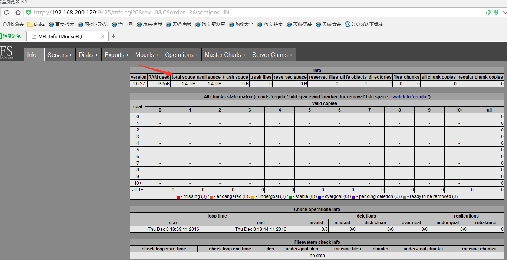</center>

<center>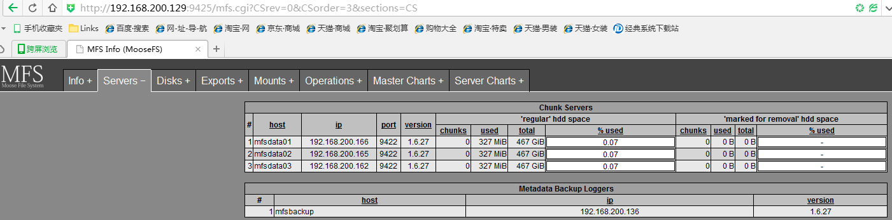</center>

Data的共享存储使用了71M见下。，但是页面显示327M。

```
[root@mfsdata01 mfsdata]# df -h
Filesystem      Size  Used Avail Use% Mounted on
/dev/sda2       884G  6.4G  833G   1% /
tmpfs           491M   72K  491M   1% /dev/shm
/dev/sda1       283M   97M  172M  37% /boot
/dev/sdb1       493G   71M  467G   1% /mfsdata
```

<center>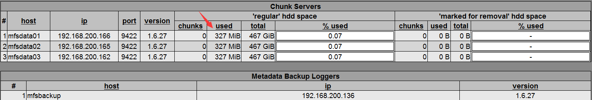</center>

> 为啥df -h 和master管理界面显示的大小有区别？327M - 71M=256M。差别了256M。
>
> 解释，当磁盘使用低于256M的时候，不在申请空间，所以存放内容小雨256M的时候，web管理界面会显示256M。Master想data服务器申请空间是按照最小256M申请的，低于256M就不在申请空间了。

### 5.6 开机自启动

```
[root@mfsdata01 mfsdata]# echo "# start chunkserver by caimengzhi at 2016/12/08">>/etc/rc.local
[root@mfsdata01 mfsdata]# echo "/application/mfs/sbin/mfschunkserver start">>/etc/rc.local
```

### 5.7 添加环境变量

```
[root@mfsdata01 mfsdata]# echo "export PATH=$PATH:/application/mfs/sbin:/application/mfs/bin" >>/etc/profile
[root@mfsdata01 mfsdata]# source /etc/profile
```

## 6. 安装配置客户端

### 6.1 快速安装

```
groupadd mfs
useradd -g mfs mfs -s /sbin/nologin
cd /usr/local/src/
yum -y install fuse* zlib*
tar xf mfs-1.6.27-5.tar.gz
cd mfs-1.6.27
./configure \
--prefix=/application/mfs-1.6.27 \
--with-default-user=mfs \
--with-default-group=mfs \
--enable-mfsmount
make && make install
ln -sf /application/mfs-1.6.27 /application/mfs
modprobe fuse
echo "export PATH=$PATH:/application/mfs/sbin/:/application/mfs/bin/" >>/etc/profile
source  /etc/profile
```

### 6.2 具体安装步骤

```
[root@mfsclient ~]# cat /etc/hosts
127.0.0.1   localhost localhost.localdomain localhost4 localhost4.localdomain4
::1         localhost localhost.localdomain localhost6 localhost6.localdomain6
192.168.200.129mfsmaster
192.168.200.136mfsbackup
192.168.200.166mfsdata01
192.168.200.165mfsdata02
192.168.200.162mfsdata03
192.168.200.149mfsclient
192.168.200.200 master.caimz.org
[root@mfsclient ~]# rpm -qa fuse
fuse-2.8.3-5.el6.x86_64
[root@mfsclient src]# groupadd mfs
[root@mfsclient src]# useradd -g mfs mfs -s /sbin/nologin
[root@mfsclient src]# cd /usr/local/src/
[root@mfsclient src]# yum -y install fuse* zlib*
[root@mfsclient src]# tar xf mfs-1.6.27-5.tar.gz
[root@mfsclient src]# cd mfs-1.6.27
[root@mfsclient mfs-1.6.27]# ./configure \
> --prefix=/application/mfs-1.6.27 \
> --with-default-user=mfs \
> --with-default-group=mfs \
> --enable-mfsmount
[root@mfsclient mfs-1.6.27]# make && make install
[root@mfsclient mfs-1.6.27]# ln -sf /application/mfs-1.6.27 /application/mfs
[root@mfsclient mfs-1.6.27]# cd /application/mfs
[root@mfsclient mfs]# ls
bin  etc  sbin  share  var
[root@mfsclient mfs]# cd bin/
[root@mfsclient bin]# ll
total 700
lrwxrwxrwx. 1 root root      8 Dec  8 03:14 mfsappendchunks -> mfstools
lrwxrwxrwx. 1 root root      8 Dec  8 03:14 mfscheckfile -> mfstools
lrwxrwxrwx. 1 root root      8 Dec  8 03:14 mfsdeleattr -> mfstools
lrwxrwxrwx. 1 root root      8 Dec  8 03:14 mfsdirinfo -> mfstools
lrwxrwxrwx. 1 root root      8 Dec  8 03:14 mfsfileinfo -> mfstools
lrwxrwxrwx. 1 root root      8 Dec  8 03:14 mfsfilerepair -> mfstools
lrwxrwxrwx. 1 root root      8 Dec  8 03:14 mfsgeteattr -> mfstools
lrwxrwxrwx. 1 root root      8 Dec  8 03:14 mfsgetgoal -> mfstools
lrwxrwxrwx. 1 root root      8 Dec  8 03:14 mfsgettrashtime -> mfstools
lrwxrwxrwx. 1 root root      8 Dec  8 03:14 mfsmakesnapshot -> mfstools
-rwxr-xr-x. 1 root root 507890 Dec  8 03:14 mfsmount
lrwxrwxrwx. 1 root root      8 Dec  8 03:14 mfsrgetgoal -> mfstools
lrwxrwxrwx. 1 root root      8 Dec  8 03:14 mfsrgettrashtime -> mfstools
lrwxrwxrwx. 1 root root      8 Dec  8 03:14 mfsrsetgoal -> mfstools
lrwxrwxrwx. 1 root root      8 Dec  8 03:14 mfsrsettrashtime -> mfstools
lrwxrwxrwx. 1 root root      8 Dec  8 03:14 mfsseteattr -> mfstools
lrwxrwxrwx. 1 root root      8 Dec  8 03:14 mfssetgoal -> mfstools
lrwxrwxrwx. 1 root root      8 Dec  8 03:14 mfssettrashtime -> mfstools
-rwxr-xr-x. 1 root root    137 Dec  8 03:14 mfssnapshot
-rwxr-xr-x. 1 root root 204038 Dec  8 03:14 mfstools
```

### 6.3 配置环境变量

```
[root@mfsclient bin]# echo "export PATH=$PATH:/application/mfs/sbin/:/application/mfs/bin/" >>/etc/profile
[root@mfsclient bin]# source  /etc/profile
```

### 6.4 挂载测试

```
root@mfsclient bin]# mkdir /mnt/mfs
[root@mfsclient bin]# ls /mnt/mfs
[root@mfsclient bin]# chown -R mfs.mfs /mnt/mfs
[root@mfsclient bin]# lsmod | grep fuse  #确保内核中有该模块
fuse                   79892  2 
要是没有就加载到内核，命令如下：
[root@mfsclient bin]# modprobe fuse
[root@mfsclient bin]# cat /etc/hosts
127.0.0.1   localhost localhost.localdomain localhost4 localhost4.localdomain4
::1         localhost localhost.localdomain localhost6 localhost6.localdomain6
192.168.200.129mfsmaster
192.168.200.136mfsbackup
192.168.200.166mfsdata01
192.168.200.165mfsdata02
192.168.200.162mfsdata03
192.168.200.149mfsclient
192.168.200.200 master.caimz.org
[root@mfsclient bin]# ping master.caimz.org
PING master.caimz.org (192.168.200.200) 56(84) bytes of data.
64 bytes from master.caimz.org (192.168.200.200): icmp_seq=1 ttl=64 time=4.86 ms
```

```
挂载命令
1. 非交互式挂载
[root@mfsclient bin]# /application/mfs/bin/mfsmount /mnt/mfs -H master.caimz.org -o mfspassword=111111
mfsmaster accepted connection with parameters: read-write,restricted_ip ; root mapped to root:root

2. 交互式挂载
[root@mfsclient bin]# /application/mfs/bin/mfsmount /mnt/mfs -H master.caimz.org -p
MFS Password:  #此时等待你输入密码
查看挂载后的情况
[root@mfsclient bin]# df -hP
Filesystem             Size  Used Avail Use% Mounted on
/dev/sda2              884G  7.3G  832G   1% /
tmpfs                  491M     0  491M   0% /dev/shm
/dev/sda1              283M   66M  203M  25% /boot
master.caimz.org:9421  1.4T     0  1.4T   0% /mnt/mfs

测试
[root@mfsclient bin]# cd /mnt/mfs/
[root@mfsclient mfs]# echo "123456" >caimz.txt
[root@mfsclient mfs]# for n in `seq 9`;do cp /bin/cat $n;done
[root@mfsclient mfs]# ls
1  2  3  4  5  6  7  8  9  caimz.txt

查看变化
Master 
[root@mfsmaster ~]# ls -l /application/mfs/var/mfs/        #客户端挂载上共享存储，没有写入数据
total 768
-rw-r----- 1 mfs  mfs      52 Dec  8 19:26 changelog.0.mfs
-rw-r----- 1 mfs  mfs      95 Dec  8 19:00 metadata.mfs.back
-rw-r----- 1 mfs  mfs      95 Dec  8 18:00 metadata.mfs.back.1
-rw-r--r-- 1 root root      8 Dec  8 14:48 metadata.mfs.empty
-rw-r----- 1 mfs  mfs     368 Dec  8 19:26 sessions.mfs
-rw-r----- 1 mfs  mfs  762516 Dec  8 19:00 stats.mfs
[root@mfsmaster ~]# ls -l /application/mfs/var/mfs/         #客户端挂载上共享存储，写入数据后
total 768
-rw-r----- 1 mfs  mfs    1661 Dec  8 19:29 changelog.0.mfs       #增加了
-rw-r----- 1 mfs  mfs      95 Dec  8 19:00 metadata.mfs.back
-rw-r----- 1 mfs  mfs      95 Dec  8 18:00 metadata.mfs.back.1
-rw-r--r-- 1 root root      8 Dec  8 14:48 metadata.mfs.empty
-rw-r----- 1 mfs  mfs     368 Dec  8 19:26 sessions.mfs
-rw-r----- 1 mfs  mfs  762516 Dec  8 19:00 stats.mfs

Backup
[root@mfsbackup ~]# ls -l /application/mfs/var/mfs/       #客户端挂载上共享存储，没有写入数据
total 28
-rw-r----- 1 mfs  mfs   52 Dec  8 19:26 changelog_ml.0.mfs
-rw-r----- 1 mfs  mfs    0 Dec  8 19:19 changelog_ml_back.0.mfs
-rw-r----- 1 mfs  mfs    0 Dec  8 19:19 changelog_ml_back.1.mfs
-rw-r--r-- 1 root root   8 Dec  8 16:46 metadata.mfs.empty
-rw-r----- 1 mfs  mfs   95 Dec  8 19:19 metadata_ml.mfs.back
-rw-r----- 1 mfs  mfs   95 Dec  8 18:45 metadata_ml.mfs.back.1
-rw-r----- 1 mfs  mfs   95 Dec  8 18:43 metadata_ml.mfs.back.2
-rw-r----- 1 mfs  mfs   95 Dec  8 18:29 metadata_ml.mfs.back.3
-rw-r----- 1 mfs  mfs  368 Dec  8 19:27 sessions_ml.mfs
[root@mfsbackup ~]# ls -l /application/mfs/var/mfs/        #客户端挂载上共享存储，写入数据后
total 28
-rw-r----- 1 mfs  mfs  1915 Dec  8 19:30 changelog_ml.0.mfs
-rw-r----- 1 mfs  mfs     0 Dec  8 19:19 changelog_ml_back.0.mfs
-rw-r----- 1 mfs  mfs     0 Dec  8 19:19 changelog_ml_back.1.mfs
-rw-r--r-- 1 root root    8 Dec  8 16:46 metadata.mfs.empty
-rw-r----- 1 mfs  mfs    95 Dec  8 19:19 metadata_ml.mfs.back
-rw-r----- 1 mfs  mfs    95 Dec  8 18:45 metadata_ml.mfs.back.1
-rw-r----- 1 mfs  mfs    95 Dec  8 18:43 metadata_ml.mfs.back.2
-rw-r----- 1 mfs  mfs    95 Dec  8 18:29 metadata_ml.mfs.back.3
-rw-r----- 1 mfs  mfs   368 Dec  8 19:31 sessions_ml.mfs

Data01
[root@mfsdata01 ~]# find /mfsdata/ -type f               #客户端挂载上共享存储，没有写入数据
/mfsdata/.lock
/mfsdata/mfshdd.cfg
[root@mfsdata01 mfsdata]# find /mfsdata/ -type f          #客户端挂载上共享存储，写入数据后
/mfsdata/07/chunk_0000000000000007_00000001.mfs
/mfsdata/01/chunk_0000000000000001_00000001.mfs
/mfsdata/04/chunk_0000000000000004_00000001.mfs
/mfsdata/.lock
/mfsdata/0A/chunk_000000000000000A_00000001.mfs
/mfsdata/mfshdd.cfg

DATA02
[root@mfsdata02 mfs]# find /mfsdata/ -type f
/mfsdata/.lock
[root@mfsdata02 mfs]# find /mfsdata/ -type f
/mfsdata/08/chunk_0000000000000008_00000001.mfs
/mfsdata/.lock
/mfsdata/02/chunk_0000000000000002_00000001.mfs
/mfsdata/05/chunk_0000000000000005_00000001.mfs

DATA03
[root@mfsdata03 ~]# find /mfsdata/ -type f
/mfsdata/.lock
[root@mfsdata03 ~]# find /mfsdata/ -type f
/mfsdata/06/chunk_0000000000000006_00000001.mfs
/mfsdata/09/chunk_0000000000000009_00000001.mfs
/mfsdata/.lock
/mfsdata/03/chunk_0000000000000003_00000001.mfs

传输了几个文件
[root@mfsclient mfs]# mv jdk-8u40-linux-x64.gz  1.gz
[root@mfsclient mfs]# cp 1.gz 2.gz
[root@mfsclient mfs]# cp 1.gz 3.gz
[root@mfsclient mfs]# cp 1.gz 4.gz
[root@mfsclient mfs]# du -sh .
662M	.
[root@mfsclient mfs]# ll
total 677062
-rwxr-xr-x. 1 root root     48568 Dec  8 03:29 1
-rw-r--r--. 1 root root 173218127 Nov 11 00:10 1.gz
-rwxr-xr-x. 1 root root     48568 Dec  8 03:29 2
-rw-r--r--. 1 root root 173218127 Dec  8 03:45 2.gz
-rwxr-xr-x. 1 root root     48568 Dec  8 03:29 3
-rw-r--r--. 1 root root 173218127 Dec  8 03:46 3.gz
-rwxr-xr-x. 1 root root     48568 Dec  8 03:29 4
-rw-r--r--. 1 root root 173218127 Dec  8 03:46 4.gz
-rwxr-xr-x. 1 root root     48568 Dec  8 03:29 5
-rwxr-xr-x. 1 root root     48568 Dec  8 03:29 6
-rwxr-xr-x. 1 root root     48568 Dec  8 03:29 7
-rwxr-xr-x. 1 root root     48568 Dec  8 03:29 8
-rwxr-xr-x. 1 root root     48568 Dec  8 03:29 9
-rw-r--r--. 1 root root         7 Dec  8 03:29 caimz.txt
```

<center>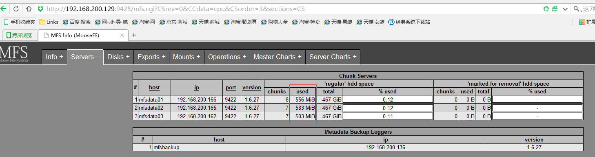</center>

## 7. 集群维护

### 7.1 安全启动MFS集群

 最安全的启动MooseFS 集群（避免任何读或写的错误数据或类似的问题）的方式是按照以下命令步骤：

- 启动mfsmaster 进程
- 启动所有的mfschunkserver 进程
- 启动mfsmetalogger 进程（如果配置了mfsmetalogger）
- 当所有的chunkservers 连接到MooseFS master 后，任何数目的客户端可以利用mfsmount 去挂接被export 的文件系统。（可以通过检查master 的日志或是CGI 监视器来查看是否所有的chunkserver被连接）。

```
 正常启动顺序：matser ---> chunker ---> metalogger ---> client
```

### 7.2 **安全停止MFS集群**

安全的停止MooseFS 集群：

- 在所有的客户端卸载MooseFS 文件系统（用umount 命令或者是其它等效的命令）
- 用mfschunkserver stop 命令停止chunkserver 进程

- 用mfsmetalogger stop 命令停止metalogger 进程

- 用mfsmaster stop 命令停止master 进程

```
正常关闭顺序：client ---> chunker ---> metalogger ---> master
```

## **8.** 基本参数设置

### 8.1 命令集合

```
mfssetgoal -r 3 /mnt/mfs   设置副本 的份数，推荐3份
mfsgetgoal  /mnt/mfs      查看某文件
mfsdirinfo -H /mnt/mfs     查看目录信息

[root@mfsclient mfs]# ll
total 1325431
-rwxr-xr-x. 1 root root     48568 Dec  8 19:29 1
-rw-r--r--. 1 root root 139640832 Dec  9 11:07 111.tar.gz
[root@mfsclient mfs]# mfsfileinfo  1 
1:
	chunk 0: 0000000000000002_00000001 / (id:2 ver:1)
		copy 1: 192.168.200.165:9422
查看到文件所在位置和副本，在chunk0上，有一份副本

[root@mfsclient mfs]# mfsgetgoal 1.gz
1.gz: 1
默认情况下写数据是一份。

    创建多级目录，不要把所有文件都放在一个目录下，根据业务等性质安排，假如当其中一个文件目录过大的时候，还可以根据目录迁移，此时可以再将该目录再做一次mfs共享存储。
[root@mfsclient mfs]# ll
total 428
-rwxr-xr-x. 1 root root 48568 Dec  8 19:29 1
-rwxr-xr-x. 1 root root 48568 Dec  8 19:29 2
-rwxr-xr-x. 1 root root 48568 Dec  8 19:29 3
-rwxr-xr-x. 1 root root 48568 Dec  8 19:29 4
-rwxr-xr-x. 1 root root 48568 Dec  8 19:29 5
-rwxr-xr-x. 1 root root 48568 Dec  8 19:29 6
-rwxr-xr-x. 1 root root 48568 Dec  8 19:29 7
-rwxr-xr-x. 1 root root 48568 Dec  8 19:29 8
-rwxr-xr-x. 1 root root 48568 Dec  8 19:29 9
drwxr-xr-x. 3 root root     7 Dec  9 15:19 write
[root@mfsclient mfs]# mkdir a1
[root@mfsclient mfs]# mkdir a2
[root@mfsclient mfs]# mkdir a3
[root@mfsclient mfs]# mv [1-9] a1/
[root@mfsclient mfs]# ls a1
1  2  3  4  5  6  7  8  9
[root@mfsclient mfs]# echo "1heloxc">>caimz.txt
[root@mfsclient mfs]# mv caimz.txt a2
[root@mfsclient mfs]# ll
total 1
drwxr-xr-x. 2 root root 0 Dec  9 15:20 a1
drwxr-xr-x. 2 root root 0 Dec  9 15:20 a2
drwxr-xr-x. 2 root root 0 Dec  9 15:19 a3
drwxr-xr-x. 3 root root 7 Dec  9 15:19 write
```

### 8.2 设置副本数量与测试

```
1)设置副本数量
[root@mfsclient mfs]# mfssetgoal -r 3 a1   #设置a1的副本数量是3份
a1:
 inodes with goal changed:              10
 inodes with goal not changed:           0
 inodes with permission denied:          0

2)查看副本数量
[root@mfsclient mfs]# mfsgetgoal -r  a1/1
a1/1:
 files with goal        3 :          1
1.设置副本时候尽量在安装完毕后就要设置。然后在导入数据，默认副本是1.
2.设置副本是基于目录，可以一个目录副本设置为3，另一个目录设置为5，根据数据重要程度设置等等

3)  新增文件测试查看副本
[root@mfsclient mfs]# cp /bin/cat  a1/10
[root@mfsclient mfs]# mfsfileinfo  a1/10
a1/10:
	chunk 0: 0000000000000682_00000001 / (id:1666 ver:1)
		copy 1: 192.168.200.162:9422
		copy 2: 192.168.200.165:9422
		copy 3: 192.168.200.166:9422
[root@mfsclient mfs]# mfsgetgoal -r  a1/10
a1/10:
 files with goal        3 :          1
[root@mfsclient mfs]# mfscheckfile /mnt/mfs/a1/1
/mnt/mfs/a1/1:
 chunks with 3 copies:
可以看出之前设置的副本是3，新建立的副本都是3份。查看到副本所在机器位置和端口。
```

总结

```
小结
1. 设置文件备份副本数目
mfssetgoal  -r  3  /mnt/mfs/a1 设置副本数量 -r递归
mfssetgoal  -r  3  /mnt/mfs/a1 查看副本数量 -r 递归
mfsrsetgoal 设置副本的命令已经由 mfssetgoal -r 取代

2.查看文件备份数量
mfssetgoal  -r  3  /mnt/mfs/a1 设置副本数量 -r递归
mfsfileinfo  -r  3  /mnt/mfs/a1 设置副本数量 -r递归
mfscheckfile       /mnt/mfs/a1/1
```

```
4)  创建大点文件看效果
[root@mfsclient mfs]# cd a2
[root@mfsclient a2]# ls
caimz.txt
[root@mfsclient a2]# dd if=/dev/zero of=/mnt/mfs/a2/10M bs=1M count=10
10+0 records in
10+0 records out
10485760 bytes (10 MB) copied, 2.06528 s, 5.1 MB/s
[root@mfsclient a2]# du -sh *
10M	10M
512	caimz.txt
[root@mfsclient a2]# mfsfileinfo 10M 
10M:
	chunk 0: 0000000000000683_00000001 / (id:1667 ver:1)
		copy 1: 192.168.200.165:9422
副本只有1个因为 上面a1设置了副本数为3，所有设置a2副本数目为3，步骤如下：
[root@mfsclient a2]# mfssetgoal -r 3 /mnt/mfs/a2
/mnt/mfs/a2:
 inodes with goal changed:               3
 inodes with goal not changed:           0
 inodes with permission denied:          0
[root@mfsclient a2]# mfsfileinfo 10M 
10M:
	chunk 0: 0000000000000683_00000001 / (id:1667 ver:1)
		copy 1: 192.168.200.165:9422
重新建立一个63m的文件
[root@mfsclient a2]# dd if=/dev/zero of=/mnt/mfs/a2/63m.img bs=1M count=63
63+0 records in
63+0 records out
66060288 bytes (66 MB) copied, 7.95249 s, 8.3 MB/s
[root@mfsclient a2]# mfsfileinfo 63m.img 
63m.img:
	chunk 0: 0000000000000684_00000001 / (id:1668 ver:1)
		copy 1: 192.168.200.162:9422
		copy 2: 192.168.200.165:9422
		copy 3: 192.168.200.166:9422
虽然是有三个副本，但是还是一个chunk
继续创建一个65m文件
[root@mfsclient a2]# dd if=/dev/zero of=/mnt/mfs/a2/65m.img bs=1M count=65
65+0 records in
65+0 records out
68157440 bytes (68 MB) copied, 10.5965 s, 6.4 MB/s
[root@mfsclient a2]# mfsfileinfo 65m.img 
65m.img:
	chunk 0: 0000000000000685_00000001 / (id:1669 ver:1)
		copy 1: 192.168.200.162:9422
		copy 2: 192.168.200.165:9422
		copy 3: 192.168.200.166:9422
	chunk 1: 0000000000000686_00000001 / (id:1670 ver:1)
		copy 1: 192.168.200.162:9422
		copy 2: 192.168.200.165:9422
		copy 3: 192.168.200.166:9422
此时有两个chunk，三份副本。
```

总结

```
小结：
1.MFS数据存放是多个chunk
2.每个chunk的大小是64m，一个文件超过了64m就会占用两个chunk。（这个就是上面原因）
3.相当于block概念
4.生产环境的data服务器应该是3台以上，设置副本的数量应该至少3份。

名词解释
1.chunk 是chunk server 的数据单位
2.chunk server 就是data server也就是存放数据的服务器
```

### 8.3 垃圾箱

```
1)  查看默认删除后的回收时间
[root@mfsclient a2]# mfsgettrashtime 10M 
10M: 86400
默认是1天

2)  设置文件删除后回收时间
[root@mfsclient a2]# mfssettrashtime -r 1200 /mnt/mfs/a2  #-r 递归
/mnt/mfs/a2:
 inodes with trashtime changed:              5
 inodes with trashtime not changed:          0
 inodes with permission denied:              0
   也就是说在删除后的1200秒（20分钟）没有回收的话，文件会被删除掉。也就是在回收站中能呆多久。此时也可以针对文件设置回收时间。以上是针对目录设置的。
[root@mfsclient a2]# mfsgettrashtime 10M 
10M: 1200
```

总结

```
小结：
1.mfsgettrashtime 和 mfssettrashtime 是查看和设置文件删除后回收时间
2.-r为递归，对于目录递归，后写入的文件也生效
```

### 8.4 配置垃圾箱

&emsp;配置垃圾回收站，设置文件或目录的删除时间。一个删除的文件能够存放在“ 垃圾箱”中的时间称为隔离时间， 这个时间可以用mfsgettrashtime 命令来查看，用mfssettrashtime 命令来设置。单位为秒。单独安装或挂载MFSMETA 文件系统（mfsmount -m mountpoint），它包含目录/ trash (包含仍然可以被还原的删除文件的信息)和/ trash/undel (用于获取文件)。把删除的文件，移到/ trash/undel下，就可以恢复此文件。在MFSMETA 的目录里，除了trash 和trash/undel 两个目录，还有第三个目录reserved，该目录内有已经删除的文件，但却被其他用户一直打开着。在用户关闭了这些被打开的文件后，reserved 目录中的文件将被删除，文件的数据也将被立即删除。此目录不能进行操作。
&emsp;以后要在该下查看或者恢复文件，在查看回收站删除的数据前提是配置挂载点的权限：如下

```
[root@mfsmaster mfs]# cat /application/mfs/etc/mfsmaster.cfg  
# Allow "meta"
*              .       rw
# Allow everything but "meta"
192.168.200.0/24 / rw,alldirs,mapall=mfs:mfs,password=111111
否则挂载的时候被拒绝。
[root@mfsclient a2]# mkdir /mnt/mfs-trash/
[root@mfsclient a2]# mfsmount -Hmaster.caimz.org -m /mnt/mfs-trash/
mfsmaster accepted connection with parameters: read-write,restricted_ip
[root@mfsclient a2]# ls /mnt/mfs-trash/
reserved  trash
#trash 以后删除的文件就在这个里面
如下：
[root@mfsclient a2]# ls /mnt/mfs-trash/trash/ -lrt |grep caimz
-rw-r--r--. 1 root root          8 Dec  9 15:20 0000058C|a2|caimz.txt  
可以看出，哪个目录下的文件被删除掉了
还原操作
[root@mfsclient trash]# ls /mnt/mfs/a2
10M  63m.img  65m.img  caimz.txt
[root@mfsclient trash]# rm -rf /mnt/mfs/a2/caimz.txt 
10M  63m.img  65m.img  caimz.txt
[root@mfsclient a2]# ls /mnt/mfs/a2
10M  63m.img  65m.img
开始还原，进入到垃圾箱找到之前删除的文件
[root@mfsclient a2]# cd /mnt/mfs-trash/trash/
[root@mfsclient trash]# ls /mnt/mfs-trash/trash/ -lrt |grep caimz
-rw-r--r--. 1 root root          8 Dec  9 15:20 0000058C|a2|caimz.txt
[root@mfsclient trash]# mv 0000058C\|a2\|caimz.txt undel/   #需要转意
[root@mfsclient trash]# ls /mnt/mfs/a2
10M  63m.img  65m.img  caimz.txt
[root@mfsclient trash]# cat /mnt/mfs/a2/caimz.txt 
1heloxc
```

```
小结：
1. 此时已经还原OK，一定要在文件的回收之前还原，否则就会被删除掉。
2. 还原的前提就是你删除的文件在/mnt/mfs-trash/trash/ 有，然后直接mv到/mnt/mfs-trash/trash/undel目录下即可
3. 还原的后的文件，会出现在删除之前所在的路径下。
```

## 9. 故障模拟

### 9.1 故障恢复原理

&emsp; 一旦`mfsmaster`崩溃（例如因为主机或电源失败），需要最后一个元数据日志`changelog` 并入主要的`metadata`中。这个操作时通过`mfsmetarestore` 工具做的，最简单的方法是：`mfsmetarestore  -a`，如果master数据被存储在`MooseFS`编译指定地点外的路径，则要利用-d 参数指定使用，如：`mfsmetarestore -a -d /storage/mfsmaster`

为了从备份中恢复一个master，需要做：

```
1、安装一个mfsmaster
2、利用同样的配置来配置这台mfsmaster（利用备份来找回mfsmaster.cfg），可见配置文件也是需要备份的。
3、找回metadata.mfs.back文件，可以从备份中找，也可以中metalogger 主机中找（如果启动了metalogger 服务），然后把metadata.mfs.back 放入data 目录，一般为${prefix}/var/mfs。
4、从在master宕掉之前的任何运行metalogger 服务的服务器上拷贝最后metadata 文件，然后放入mfsmaster 的数据目录。
5、利用mfsmetarestore命令合并元数据changelogs，可以用自动恢复模式mfsmetarestore –a，也可以利用非自动化恢复模式，语法如下：
mfsmetarestore -m metadata.mfs.back -o metadata.mfschangelog_ml.*.mfs
```

### 9.2 多种方式宕机

#### 9.2.1 一台chunkserver宕机

​    一台数据存储服务器宕机

1．mfschunk 1直接挂起，也就是保持当前状态。

&emsp;此时data01已经相当于宕机了。此时在查看文件。

<center></center>

监控

<center>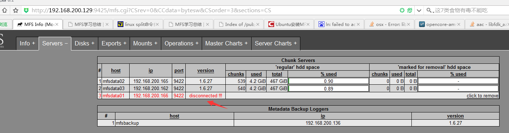</center>

已经显示失去联系了。

2. 客户端查看文件

```
[root@mfsclient a2]# mfsfileinfo caimz.txt 
caimz.txt:
	chunk 0: 0000000000000681_00000001 / (id:1665 ver:1)
		copy 1: 192.168.200.162:9422
		copy 2: 192.168.200.165:9422
此时只显示了两份副本了。
[root@mfsclient a2]# cat caimz.txt 
1heloxc
[root@mfsclient a2]# df -PH
Filesystem             Size  Used Avail Use% Mounted on
/dev/sda2              949G  7.9G  893G   1% /
tmpfs                  515M     0  515M   0% /dev/shm
/dev/sda1              297M   69M  213M  25% /boot
master.caimz.org:9421  1.1T  8.6G  994G   1% /mnt/mfs
文件没丢。挂载还是持续。
```

#### 9.2.2 两台chunkserver宕机

1. 此时在继续宕机data02

<center>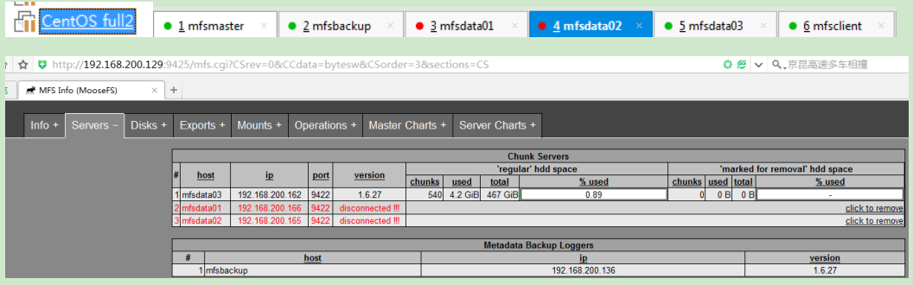</center>

此时页面也显示失去了两个数据存。

2. 测试客户端再次查看

```
[root@mfsclient a2]# mfsfileinfo caimz.txt 
caimz.txt:
	chunk 0: 0000000000000681_00000001 / (id:1665 ver:1)
		copy 1: 192.168.200.162:9422
```

> 此时就一个副本存在了。

```
[root@mfsclient a2]# df -PH
Filesystem             Size  Used Avail Use% Mounted on
/dev/sda2              949G  7.9G  893G   1% /
tmpfs                  515M     0  515M   0% /dev/shm
/dev/sda1              297M   69M  213M  25% /boot
master.caimz.org:9421  502G  4.5G  497G   1% /mnt/mfs
[root@mfsclient a2]# cat caimz.txt 
```

> `1heloxc`、数据没有丢失，且挂载也存在。

#### 9.2.3 三台chunkserver宕机

继续宕机最后一台存储,此时页面也显示失去了三台数据存服务器链接。

<center>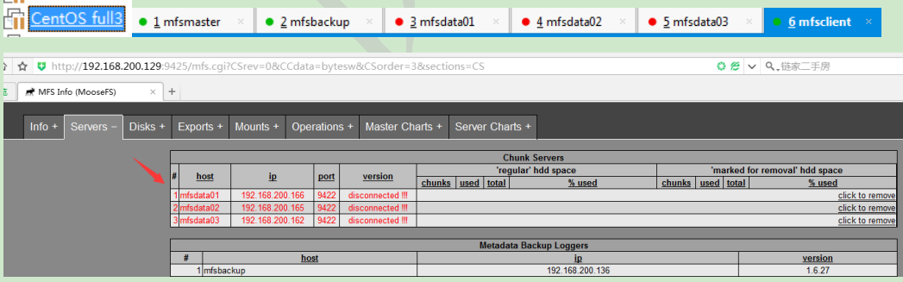</center>

查看客户端

```
[root@mfsclient a2]# ls
10M  63m.img  65m.img  caimz.txt
[root@mfsclient a2]# cat caimz.txt 
1heloxc
[root@mfsclient a2]# df -PH
Filesystem      Size  Used Avail Use% Mounted on
/dev/sda2       949G  7.9G  893G   1% /
tmpfs           515M     0  515M   0% /dev/shm
/dev/sda1       297M   69M  213M  25% /boot
[root@mfsclient a2]# mfsfileinfo caimz.txt 
caimz.txt:
	chunk 0: 0000000000000681_00000001 / (id:1665 ver:1)
		no valid copies !!!
[root@mfsclient a2]# ls /mnt/mfs/a2
10M  63m.img  65m.img  caimz.txt
```

> 此时挂载已经去掉了，文件副本已经么有了。且会在客户端保持一份数据，能查看到。

### 9.3 恢复机器

恢复data数据服务器

#### 9.3.1 1. 恢复data01

查看进程

<center>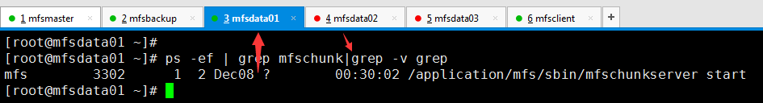</center>

客户端查看

```
[root@mfsclient a2]# mfsfileinfo caimz.txt 
caimz.txt:
	chunk 0: 0000000000000681_00000001 / (id:1665 ver:1)
		copy 1: 192.168.200.166:9422
[root@mfsclient a2]# df -PH
Filesystem             Size  Used Avail Use% Mounted on
/dev/sda2              949G  7.9G  893G   1% /
tmpfs                  515M     0  515M   0% /dev/shm
/dev/sda1              297M   69M  213M  25% /boot
master.caimz.org:9421  502G  4.7G  497G   1% /mnt/mfs
```

> 此时已经看到已经自动挂载好了，且查看文件的时候已经有了一份副本。

```
[root@mfsclient a2]# ls /mnt/mfs/a2
10M  63m.img  65m.img  caimz.txt
[root@mfsclient a2]# echo "dddddddd">d.log
[root@mfsclient a2]# ls
10M  63m.img  65m.img  caimz.txt  d.log
[root@mfsclient a2]# cat caimz.txt 
1heloxc
[root@mfsclient a2]# cat d.log 
dddddddd
[root@mfsclient a2]# echo "add new oneline">>caimz.txt 
```

> 此时也可以正常操作了。

<center>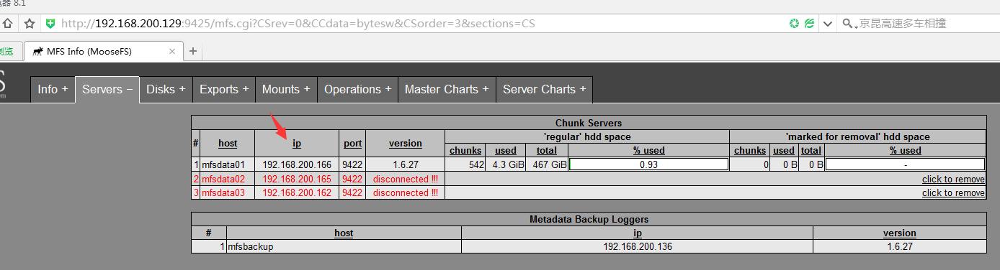</center>

Web监控到有data存储服务器起来了。当data数据服务器启动起来后，会自动加入。

### 9.4 分布式MFS数据备份原理

&emsp; MFS元数据备份，元数据一般有两个部分：

- 主要的元数据的文件(metadata.mfs 当mfsmaster允许时候，metadata.mfs被命名为metadata.mfs.back，每小时进行同步。
-  元数据变更记录文件(changelog.*.mfs)里面存储的是最后N个小时的数据变化，由BACL_LOGS参数控制。
- 主要的元数据文件，metadata.mfs需要定期备份的频率取决于有多少每小时更新日志存储changelogs，元数据的变更记应该实时自动复制，自从MFS1.6.5这两项任务都是由mfsmetalogger守护进程来完成的。

`http://www.moosefs.org/reference-guide.html`

```
root@mfsmaster mfs]# ll
total 11924
-rw-r----- 1 mfs  mfs     1737 Dec  9 16:55 changelog.1.mfs
-rw-r----- 1 mfs  mfs     6825 Dec  9 15:58 changelog.2.mfs
-rw-r----- 1 mfs  mfs   491913 Dec  8 19:47 changelog.22.mfs
-rw-r----- 1 mfs  mfs   138711 Dec  9 12:23 changelog.5.mfs
-rw-r----- 1 mfs  mfs  9027022 Dec  9 11:49 changelog.6.mfs
-rw-r----- 1 mfs  mfs  1478256 Dec  9 10:59 changelog.7.mfs
-rw-r----- 1 mfs  mfs       56 Dec  9 09:57 changelog.8.mfs
-rw-r----- 1 mfs  mfs   132008 Dec  9 17:00 metadata.mfs.back
-rw-r----- 1 mfs  mfs   131923 Dec  9 16:00 metadata.mfs.back.1
-rw-r--r-- 1 root root       8 Dec  8 14:48 metadata.mfs.empty
-rw-r----- 1 mfs  mfs      553 Dec  9 17:00 sessions.mfs
-rw-r----- 1 mfs  mfs   762516 Dec  9 17:00 stats.mfs
[root@mfsbackup mfs]# ll
total 10448
-rw-r----- 1 mfs  mfs     1737 Dec  9 16:55 changelog_ml.1.mfs
-rw-r----- 1 mfs  mfs     6825 Dec  9 15:58 changelog_ml.2.mfs
-rw-r----- 1 mfs  mfs   138711 Dec  9 12:24 changelog_ml.5.mfs
-rw-r----- 1 mfs  mfs  9027022 Dec  9 11:49 changelog_ml.6.mfs
-rw-r----- 1 mfs  mfs       58 Dec  9 10:59 changelog_ml.7.mfs
-rw-r----- 1 mfs  mfs  1478198 Dec  9 10:59 changelog_ml_back.0.mfs
-rw-r----- 1 mfs  mfs       56 Dec  9 10:59 changelog_ml_back.1.mfs
-rw-r--r-- 1 root root       8 Dec  8 16:46 metadata.mfs.empty
-rw-r----- 1 mfs  mfs     1441 Dec  9 10:59 metadata_ml.mfs.back
-rw-r----- 1 mfs  mfs     1441 Dec  9 09:39 metadata_ml.mfs.back.1
-rw-r----- 1 mfs  mfs       95 Dec  8 19:45 metadata_ml.mfs.back.2
-rw-r----- 1 mfs  mfs       95 Dec  8 19:19 metadata_ml.mfs.back.3
-rw-r----- 1 mfs  mfs      553 Dec  9 17:07 sessions_ml.mfs
```

### 9.5 master数据恢复数据

&emsp;通过MFS master日志恢复数据

#### 9.5.1 备份

手工模拟。先备份。

```
[root@mfsmaster ~]# cd /application/mfs
[root@mfsmaster mfs]# tar zcvf /opt/varMedata.tar.gz ./var  #备份数据文件
./var/
./var/mfs/
./var/mfs/changelog.5.mfs
./var/mfs/metadata.mfs.back
./var/mfs/stats.mfs
./var/mfs/changelog.1.mfs
./var/mfs/.mfscgiserv.lock
./var/mfs/sessions.mfs
./var/mfs/changelog.2.mfs
./var/mfs/metadata.mfs.empty
./var/mfs/changelog.6.mfs
./var/mfs/metadata.mfs.back.1
./var/mfs/changelog.22.mfs
./var/mfs/changelog.7.mfs
./var/mfs/.mfsmaster.lock
./var/mfs/changelog.8.mfs
[root@mfsmaster mfs]# tar zcvf /opt/etcConf.tar.gz ./etc   #备份配置文件
./etc/
./etc/mfsmaster.cfg
./etc/mfs/
./etc/mfs/mfshdd.cfg.dist
./etc/mfs/mfsexports.cfg.dist
./etc/mfs/mfsmetalogger.cfg.dist
./etc/mfs/mfsmount.cfg.dist
./etc/mfs/mfsexports.cfg
./etc/mfs/mfschunkserver.cfg.dist
./etc/mfs/mfsmaster.cfg
./etc/mfs/mfstopology.cfg.dist
./etc/mfs/mfsmaster.cfg.dist
[root@mfsmaster mfs]# ls /opt/     #此时实时的把该数据推送到其他服务器上。
etcConf.tar.gz  rh  varMedata.tar.gz
```

#### 9.5.2 恢复

此时开始模拟master mfs 宕机，出问题后重新恢复。

```
1.Mfsmaster重新安装
[root@mfsmaster ~]# cd /application/mfs
[root@mfsmaster mfs]# ls
bin  etc  sbin  share  var
[root@mfsmaster mfs]# rm -rf var 
[root@mfsmaster mfs]# mfsmaster -s
can't set working directory to /application/mfs-1.6.27/var/mfs
[root@mfsmaster mfs]# ps -ef | grep mfs
mfs       12166      1  1 Dec08 ?        00:20:57 /application/mfs/sbin/mfsmaster start
root      12330      1  0 Dec08 ?        00:00:15 python /application/mfs/sbin/mfscgiserv start
root      31368  27258  0 17:25 pts/0    00:00:00 grep mfs
[root@mfsmaster mfs]# kill -9 12330
[root@mfsmaster mfs]# ps -ef | grep mfs
mfs       12166      1  1 Dec08 ?        00:20:57 /application/mfs/sbin/mfsmaster start
root      31370  27258  0 17:25 pts/0    00:00:00 grep mfs
[root@mfsmaster mfs]# ps -ef | grep mfs
mfs       12166      1  1 Dec08 ?        00:20:57 /application/mfs/sbin/mfsmaster start
root      31380  27258  0 17:26 pts/0    00:00:00 grep mfs
[root@mfsmaster mfs]# kill -9 12166
[root@mfsmaster mfs]# ps -ef | grep mfs
root      31390  27258  0 17:26 pts/0    00:00:00 grep mfs

3) 然后机器新安装（假设机器新安装后）     
[root@mfsmaster /]# cd /application/mfs
[root@mfsmaster mfs]# mkdir -p var/mfs 
[root@mfsmaster mfs]# mfsmaster start
working directory: /application/mfs-1.6.27/var/mfs
can't create lockfile in working directory: EACCES (Permission denied)
[root@mfsmaster mfs]# chown -R mfs /application/mfs/var/
[root@mfsmaster mfs]# mfsmaster start
working directory: /application/mfs-1.6.27/var/mfs
lockfile created and locked
initializing mfsmaster modules ...
loading sessions ... file not found
if it is not fresh installation then you have to restart all active mounts !!!
exports file has been loaded
mfstopology configuration file (/application/mfs-1.6.27/etc/mfstopology.cfg) not found - using defaults
loading metadata ...
can't open metadata file
if this is new instalation then rename /application/mfs-1.6.27/var/mfs/metadata.mfs.empty as /application/mfs-1.6.27/var/mfs/metadata.mfs
init: file system manager failed !!!
error occured during initialization - exiting  
#说明环境还不是新安装的。从其他机器导入 metadata.mfs.empty改为 metadata.mfs放在/application/mfs/var/mfs下
[root@mfsmaster mfs]# rz      #上传    metadata.mfs.empty文件                                          
[root@mfsmaster mfs]# ls
bin  etc  metadata.mfs.empty  sbin  share  var
[root@mfsmaster mfs]# mv metadata.mfs.empty metadata.mfs       
[root@mfsmaster mfs]# pwd
/application/mfs
[root@mfsmaster mfs]# mv metadata.mfs var/mfs
[root@mfsmaster mfs]# mfsmaster start
working directory: /application/mfs-1.6.27/var/mfs
lockfile created and locked
initializing mfsmaster modules ...
loading sessions ... ok
sessions file has been loaded
exports file has been loaded
mfstopology configuration file (/application/mfs-1.6.27/etc/mfstopology.cfg) not found - using defaults
loading metadata ...
create new empty filesystemmetadata file has been loaded
no charts data file - initializing empty charts
master <-> metaloggers module: listen on *:9419
master <-> chunkservers module: listen on *:9420
main master server module: listen on *:9421
mfsmaster daemon initialized properly

4) 查看启动后情况，master和客户端链接情况
[root@mfsmaster mfs]# netstat -lnp|grep 94
tcp        0      0 0.0.0.0:9419                0.0.0.0:*                   LISTEN      31478/mfsmaster     
tcp        0      0 0.0.0.0:9420                0.0.0.0:*                   LISTEN      31478/mfsmaster     
tcp        0      0 0.0.0.0:9421                0.0.0.0:*                   LISTEN      31478/mfsmaster     
unix  2      [ ACC ]     STREAM     LISTENING     33064  9094/bonobo-activat /tmp/orbit-leco/linc-2386-0-372adc3c888d7
unix  2      [ ACC ]     STREAM     LISTENING     33867  9108/bluetooth-appl /tmp/orbit-leco/linc-2394-0-52f00e366e388
[root@mfsmaster mfs]# netstat -an|grep 94
tcp        0      0 0.0.0.0:9419                0.0.0.0:*                   LISTEN      
tcp        0      0 0.0.0.0:9420                0.0.0.0:*                   LISTEN      
tcp        0      0 0.0.0.0:9421                0.0.0.0:*                   LISTEN      
tcp        0      0 192.168.200.200:9419        192.168.200.136:49510       ESTABLISHED 
tcp        0      0 192.168.200.200:9421        192.168.200.149:57812       ESTABLISHED 
tcp        0      0 192.168.200.200:9420        192.168.200.162:37608       ESTABLISHED 
tcp        0      0 192.168.200.200:9420        192.168.200.166:45948       ESTABLISHED 
tcp        0      0 192.168.200.200:9421        192.168.200.149:57814       ESTABLISHED 
tcp        0      0 192.168.200.200:9420        192.168.200.165:38910       ESTABLISHED 

5) 启动mfsmaster web监控
[root@mfsmaster mfs]# /application/mfs/sbin/mfscgiserv start
lockfile created and locked
starting simple cgi server (host: any , port: 9425 , rootpath: /application/mfs-1.6.27/share/mfscgi)

6) 此时在查看客户端
[root@mfsclient a2]# ls
ls: cannot open directory .: No such file or directory
[root@mfsclient a2]# cdf -HP
-bash: cdf: command not found
[root@mfsclient a2]# df -Ph
Filesystem             Size  Used Avail Use% Mounted on
/dev/sda2              884G  7.3G  832G   1% /
tmpfs                  491M     0  491M   0% /dev/shm
/dev/sda1              283M   66M  203M  25% /boot
master.caimz.org:9421  1.4T     0  1.4T   0% /mnt/mfs
[root@mfsclient a2]# ls /mnt/mfs
[root@mfsclient a2]# 
此时看到客户端上没有数据了，太可怕了。

7) 开始数据恢复 
但是监控显示数据存储服务器上数据还是有的，接下来开始恢复，
```

<center>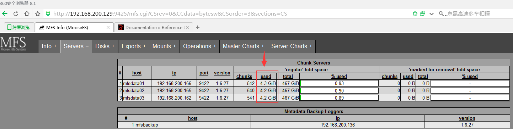</center>

```
[root@mfsmaster mfs]# ll
total 20
drwxr-xr-x 2 root root 4096 Dec  8 14:48 bin
drwxr-xr-x 3 root root 4096 Dec  8 15:39 etc
drwxr-xr-x 2 root root 4096 Dec  8 14:48 sbin
drwxr-xr-x 4 root root 4096 Dec  8 14:48 share
drwxr-xr-x 3 mfs  root 4096 Dec  9 17:28 var
[root@mfsmaster mfs]# pwd
/application/mfs
[root@mfsmaster mfs]# rm -rf var 
[root@mfsmaster mfs]# tar -zxvf /opt/varMedata.tar.gz -C .
./var/
./var/mfs/
./var/mfs/changelog.5.mfs
./var/mfs/metadata.mfs.back
./var/mfs/stats.mfs
./var/mfs/changelog.1.mfs
./var/mfs/.mfscgiserv.lock
./var/mfs/sessions.mfs
./var/mfs/changelog.2.mfs
./var/mfs/metadata.mfs.empty
./var/mfs/changelog.6.mfs
./var/mfs/metadata.mfs.back.1
./var/mfs/changelog.22.mfs
./var/mfs/changelog.7.mfs
./var/mfs/.mfsmaster.lock
./var/mfs/changelog.8.mfs
[root@mfsmaster mfs]# ls
bin  etc  sbin  share  var
[root@mfsmaster mfs]# ls var/mfs/
changelog.1.mfs  changelog.22.mfs  changelog.6.mfs  changelog.8.mfs    metadata.mfs.back.1  sessions.mfs
changelog.2.mfs  changelog.5.mfs   changelog.7.mfs  metadata.mfs.back  metadata.mfs.empty   stats.mfs
[root@mfsmaster mfs]# mfsmaster start
working directory: /application/mfs-1.6.27/var/mfs
lockfile created and locked
initializing mfsmaster modules ...
loading sessions ... ok
sessions file has been loaded
exports file has been loaded
mfstopology configuration file (/application/mfs-1.6.27/etc/mfstopology.cfg) not found - using defaults
loading metadata ...
can't open metadata file
if this is new instalation then rename /application/mfs-1.6.27/var/mfs/metadata.mfs.empty as /application/mfs-1.6.27/var/mfs/metadata.mfs
init: file system manager failed !!!
error occured during initialization - exiting

8) 自动恢复日志 
[root@mfsmaster mfs]# mfsmetarestore -a  # 自动恢复master日志
loading objects (files,directories,etc.) ... ok
loading names ... ok
loading deletion timestamps ... ok
loading chunks data ... ok
checking filesystem consistency ... ok
connecting files and chunks ... ok
progress: current change: 0 (first:296374 - last:0 - 100% - ETA:finished)
store metadata into file: /application/mfs-1.6.27/var/mfs/metadata.mfs
[root@mfsmaster mfs]# ll var/mfs
total 12048
-rw-r----- 1 mfs  mfs     1737 Dec  9 16:55 changelog.1.mfs
-rw-r----- 1 mfs  mfs     6825 Dec  9 15:58 changelog.2.mfs
-rw-r----- 1 mfs  mfs   491913 Dec  8 19:47 changelog.22.mfs
-rw-r----- 1 mfs  mfs   138711 Dec  9 12:23 changelog.5.mfs
-rw-r----- 1 mfs  mfs  9027022 Dec  9 11:49 changelog.6.mfs
-rw-r----- 1 mfs  mfs  1478256 Dec  9 10:59 changelog.7.mfs
-rw-r----- 1 mfs  mfs       56 Dec  9 09:57 changelog.8.mfs
-rw-r--r-- 1 root root  132008 Dec  9 17:49 metadata.mfs
-rw-r----- 1 mfs  mfs   132008 Dec  9 17:00 metadata.mfs.back
-rw-r----- 1 mfs  mfs   131923 Dec  9 16:00 metadata.mfs.back.1
-rw-r--r-- 1 root root       8 Dec  8 14:48 metadata.mfs.empty
-rw-r----- 1 mfs  mfs      553 Dec  9 17:00 sessions.mfs
-rw-r----- 1 mfs  mfs   762516 Dec  9 17:00 stats.mfs

9) 启动mfs master
[root@mfsmaster mfs]# mfsmaster start
working directory: /application/mfs-1.6.27/var/mfs
lockfile created and locked
initializing mfsmaster modules ...
loading sessions ... ok
sessions file has been loaded
exports file has been loaded
mfstopology configuration file (/application/mfs-1.6.27/etc/mfstopology.cfg) not found - using defaults
loading metadata ...
loading objects (files,directories,etc.) ... ok
loading names ... ok
loading deletion timestamps ... ok
loading chunks data ... ok
checking filesystem consistency ... ok
connecting files and chunks ... ok
all inodes: 1425
directory inodes: 6
file inodes: 1419
chunks: 1591
metadata file has been loaded
stats file has been loaded
master <-> metaloggers module: listen on *:9419
master <-> chunkservers module: listen on *:9420
main master server module: listen on *:9421
mfsmaster daemon initialized properly

10) 查看客户端情况
此时在查看客户端的挂载情况：
[root@mfsclient a2]# df -hP
Filesystem             Size  Used Avail Use% Mounted on
/dev/sda2              884G  7.3G  832G   1% /
tmpfs                  491M     0  491M   0% /dev/shm
/dev/sda1              283M   66M  203M  25% /boot
master.caimz.org:9421  1.4T  8.0G  1.4T   1% /mnt/mfs
master.caimz.org:9421  3.8G  3.8G     0 100% /mnt/mfs-trash
[root@mfsclient a2]# cd /mnt/mfs
[root@mfsclient mfs]# ls
a1  a2  a3  write
[root@mfsclient mfs]# cd a1
[root@mfsclient a1]# ls
1  10  2  3  4  5  6  7  8  9
[root@mfsclient a1]# cd ../a2
[root@mfsclient a2]# ls
10M  63m.img  65m.img  caimz.txt  d.log
[root@mfsclient a2]# cat d.log 
Dddddddd
```

&emsp;说明已经挂载好了，数据已经恢复了。主库宕机后，恢复后有的挂载没了，需要重新挂载。我这次做的实验没有出现这个情况。

> Master宕机后，若是使用其他新的机器作为新的master一定要注意之前老的mfsmaster vip给局域网产生的arp缓存问题。解决该问题就是要么清除arp缓存，要么换新的vip。

### 9.6 metalogger数据

通过MFS backup日志恢复数据。

```
1) 查看备份日志
[root@mfsmaster mfs]# ls
changelog.1.mfs  changelog.23.mfs  changelog.6.mfs  changelog.8.mfs  metadata.mfs.back    metadata.mfs.empty  stats.mfs
changelog.2.mfs  changelog.3.mfs   changelog.7.mfs  changelog.9.mfs  metadata.mfs.back.1  sessions.mfs
[root@mfsmaster mfs]# pwd
/application/mfs/var/mfs
[root@mfsmaster mfs]# rm -rf *
[root@mfsmaster mfs]# mfsmaster -s
sending SIGTERM to lock owner (pid:31734)
waiting for termination ... Terminated

2) 拷贝备份日志到mfs master上
将Backup 收集日志导入到master上
[root@mfsbackup mfs]# ls
changelog_ml.1.mfs       changelog_ml_back.1.mfs  metadata_ml.mfs.back    metadata_ml.mfs.back.2  sessions_ml.mfs
changelog_ml_back.0.mfs  metadata.mfs.empty       metadata_ml.mfs.back.1  metadata_ml.mfs.back.3
[root@mfsbackup mfs]# pwd
/application/mfs/var/mfs
[root@mfsbackup mfs]# cd ../../
[root@mfsbackup mfs]# pwd
/application/mfs
[root@mfsbackup mfs]# ls  
bin  etc  sbin  share  var
[root@mfsbackup mfs]# tar zcvf var-mfs-s.tar.gz ./var/
./var/
./var/mfs/
./var/mfs/metadata_ml.mfs.back.1
./var/mfs/changelog_ml.1.mfs
./var/mfs/metadata.mfs.empty
./var/mfs/changelog_ml_back.1.mfs
./var/mfs/.mfsmetalogger.lock
./var/mfs/metadata_ml.mfs.back
./var/mfs/metadata_ml.mfs.back.2
./var/mfs/sessions_ml.mfs
./var/mfs/changelog_ml_back.0.mfs
./var/mfs/metadata_ml.mfs.back.3
[root@mfsbackup mfs]# sz -y var-mfs-s.tar.gz

3) 导入备份日志到mfs master上
现在将backup的日志导入到master上。
[root@mfsmaster mfs]# rz
[root@mfsmaster mfs]# ls var-mfs-s.tar.gz 
var-mfs-s.tar.gz
[root@mfsmaster mfs]# ls
metadata.mfs  stats.mfs  var-mfs-s.tar.gz
[root@mfsmaster mfs]# pwd
/application/mfs/var/mfs
[root@mfsmaster mfs]# mv var-mfs-s.tar.gz ../../
[root@mfsmaster mfs]# ls
metadata.mfs  stats.mfs
[root@mfsmaster mfs]# rm -rf *
[root@mfsmaster mfs]# pwd
/application/mfs/var/mfs
[root@mfsmaster mfs]# cd ../../
[root@mfsmaster mfs]# ls
bin  etc  sbin  share  var  var-mfs-s.tar.gz
[root@mfsmaster mfs]# tar xf var-mfs-s.tar.gz -C .
[root@mfsmaster mfs]# cd var/mfs/
[root@mfsmaster mfs]# cd var/mfs/
[root@mfsmaster mfs]# ll
total 164
-rw-r----- 1 mfs  mfs     198 Dec  9 17:52 changelog_ml.1.mfs
-rw-r----- 1 mfs  mfs      29 Dec  9 17:51 changelog_ml_back.0.mfs
-rw-r----- 1 mfs  mfs    1737 Dec  9 17:51 changelog_ml_back.1.mfs
-rw-r--r-- 1 root root      8 Dec  8 16:46 metadata.mfs.empty
-rw-r----- 1 mfs  mfs  132008 Dec  9 17:51 metadata_ml.mfs.back   #元数据文件
-rw-r----- 1 mfs  mfs      95 Dec  9 17:32 metadata_ml.mfs.back.1  #备份的复制变换文件
-rw-r----- 1 mfs  mfs    1441 Dec  9 10:59 metadata_ml.mfs.back.2
-rw-r----- 1 mfs  mfs    1441 Dec  9 09:39 metadata_ml.mfs.back.3
-rw-r----- 1 mfs  mfs     553 Dec  9 18:03 sessions_ml.mfs

4)通过备份日志开始恢复
此时将备份日志数据导入到新的mfs master上开始恢复
[root@mfsmaster mfs]# mfsmetarestore -m metadata_ml.mfs.back* -o metadata.mfs changelog_ml_back.*.mfs
#也就是通过backup上的日志文件和数据文件生成一个新的metadata.mfs。这样才能正常启动master
loading objects (files,directories,etc.) ... ok
loading names ... ok
loading deletion timestamps ... ok
loading chunks data ... ok
checking filesystem consistency ... ok
connecting files and chunks ... ok
progress: current change: 0 (first:296374 - last:0 - 100% - ETA:finished)
store metadata into file: metadata.mfs

5) 恢复完毕后开启启动mfs master
启动mfsmaster
[root@mfsmaster mfs]# mfsmaster start
working directory: /application/mfs-1.6.27/var/mfs
lockfile created and locked
initializing mfsmaster modules ...
loading sessions ... file not found
if it is not fresh installation then you have to restart all active mounts !!!
exports file has been loaded
mfstopology configuration file (/application/mfs-1.6.27/etc/mfstopology.cfg) not found - using defaults
loading metadata ...
loading objects (files,directories,etc.) ... ok
loading names ... ok
loading deletion timestamps ... ok
loading chunks data ... ok
checking filesystem consistency ... ok
connecting files and chunks ... ok
all inodes: 1425
directory inodes: 6
file inodes: 1419
chunks: 1591
metadata file has been loaded
no charts data file - initializing empty charts
master <-> metaloggers module: listen on *:9419
master <-> chunkservers module: listen on *:9420
main master server module: listen on *:9421
mfsmaster daemon initialized properly

6) 查看客户端
此时mfs master启动成功后开始检查客户端的情况
[root@mfsclient a2]# df -hP
Filesystem             Size  Used Avail Use% Mounted on
/dev/sda2              884G  7.3G  832G   1% /
tmpfs                  491M     0  491M   0% /dev/shm
/dev/sda1              283M   66M  203M  25% /boot
master.caimz.org:9421  1.4T  8.0G  1.4T   1% /mnt/mfs
[root@mfsclient a2]# ls /mnt/mfs
a1  a2  a3  write
[root@mfsclient a2]# ls /mnt/mfs/a2
10M  63m.img  65m.img  caimz.txt  d.log
```

数据又回来了。

### 9.7 监控

1) mfs master 

   通过rsync + inotify 或者 sersync + rsync实时同步。 /application/mfs/var和 /application/mfs/etc两个文件夹，分别是数据，日志文件和配置文件。以后通过该两个备份恢复数据。

2) mfs backup

   监控backup日志服务器同步，这里有个问题，我需要有手段确保backup日志服务器可以实时的从master的备份数据，例如：通过定时任务及nagios等进行监控

   例如：在master上每分钟定时执行 echo 1>>/mnt/mfs/check.log，然后通过nagios监控从backup日志服务器上最新日志记录的变化。

3) mfs chunk

   监控数据存储服务器是否宕机，及时上报。

### 9.8 数据恢复

&emsp;数据恢复总结，对于数据恢复，我个人倾向于通过备份master的日志，来恢复数据，对于backup服务器，可以不使用，通过serync +inotify 来实时备份mfs master 日志数据文件和配置文件恢复。

## 10. 分布式存储MFS常见问题

```
1)Master性能瓶颈
   master本身的性能瓶颈。
2) 体系架构存储文件总数的瓶颈
   mfs把文件系统的结构缓存到master的内存中，个人认为文件越多，master的内存消耗越大，8g对应2500kw的文件数，2亿文件就得64GB内存。
3) 单点故障解决方案的健壮性
  Hearbeat + drbd 实现高可用
```

