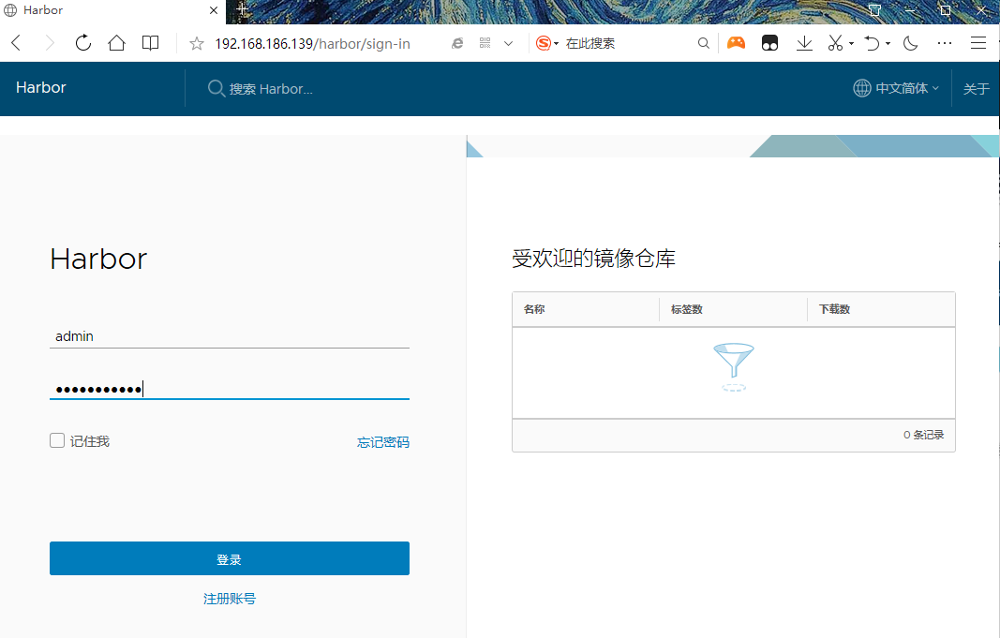
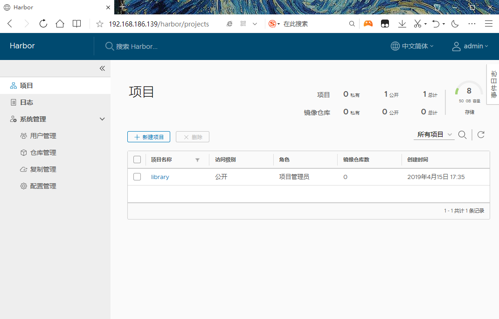
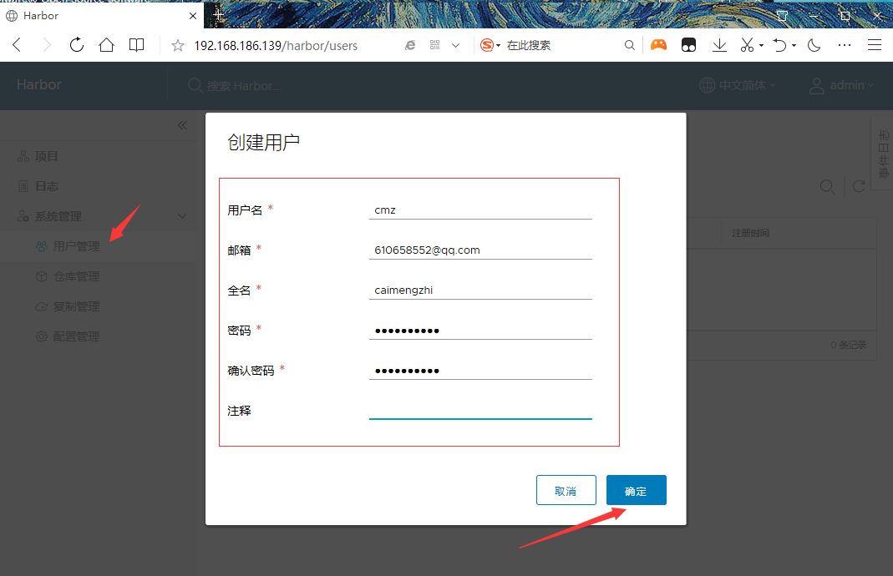
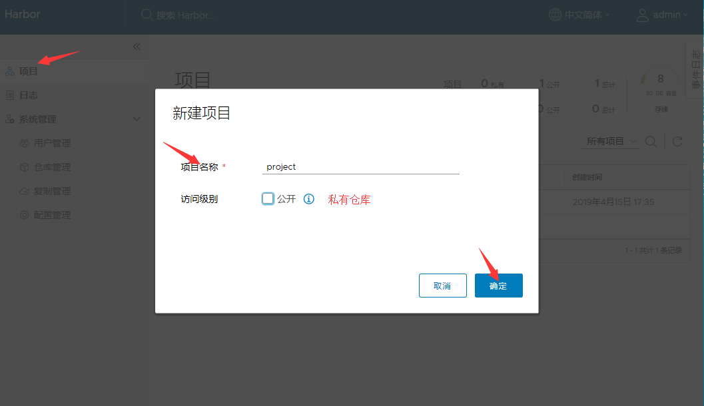
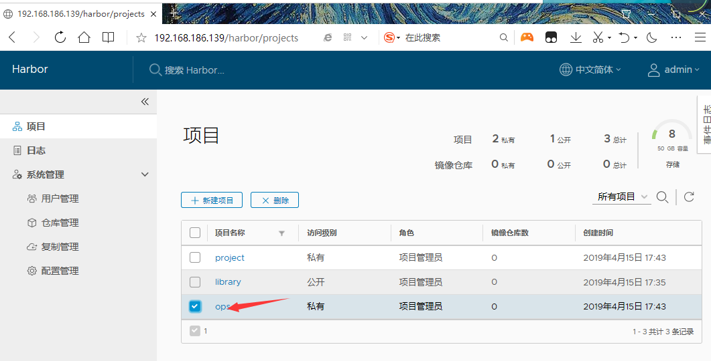
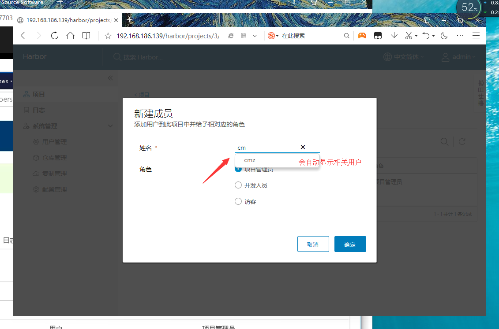
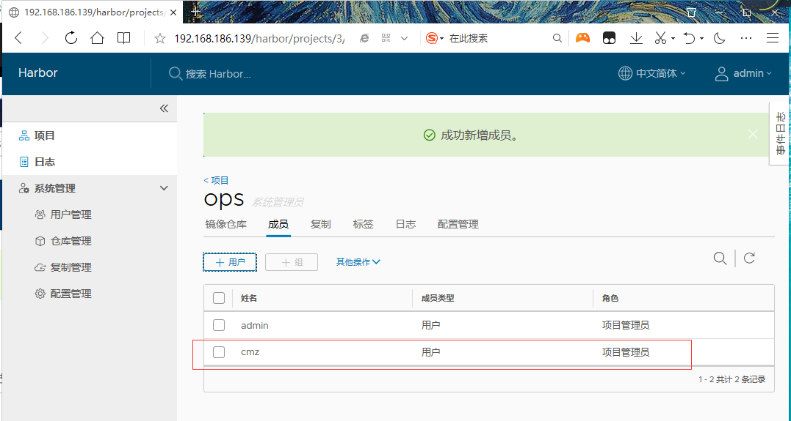

<center><h1>Harbor</h1></center>


## 1. 介绍
&#160; &#160; &#160; &#160;Habor是由VMWare公司开源的容器镜像仓库。事实上，Habor是在Docker Registry上进行了相应的企业级扩展，从而获得了更加广泛的应用，这些新的企业级特性包括：管理用户界面，基于角色的访问控制 ，AD/LDAP集成以及审计日志等，足以满足基本企业需求。

> 官方地址：https://vmware.github.io/harbor/cn/


组件 | 功能
---|---
harbor-adminserver\ 配置管理中心
harbor-db |Mysql数据库
harbor-jobservice| 负责镜像复制
harbor-log |记录操作日志
harbor-ui| Web管理页面和API
nginx |前端代理，负责前端页面和镜像上传/下载转发
redis |会话
registry|镜像存储

## 2. 安装
### 2.1 安装方式

- 在线安装：从Docker Hub下载Harbor相关镜像，因此安装软件包非常小
- 离线安装：安装包包含部署的相关镜像，因此安装包比较大
- OVA安装程序：当用户具有vCenter环境时，使用此安装程序，在部署OVA后启动Harbor

[离线下载地址](https://github.com/goharbor/harbor)


```
https://storage.googleapis.com/harbor-releases/release-1.7.0/harbor-offline-installer-v1.7.5.tgz
```

### 2.2 离线安装
安装docker [compose](https://docs.docker.com/compose/install/)
```
sudo curl -L "https://github.com/docker/compose/releases/download/1.24.0/docker-compose-$(uname -s)-$(uname -m)" -o /usr/local/bin/docker-compose
```
或者离线

```
[root@localhost harbor]# mv docker-compose-Linux-x86_64  /usr/bin/docker-compose
[root@localhost harbor]# chmod +x /usr/bin/docker-compose
```


```
[root@localhost ~]# ls
anaconda-ks.cfg  df  file  harbor-offline-installer-v1.6.1.tgz  www_root
[root@localhost ~]# ls harbor-offline-installer-v1.6.1.tgz 
harbor-offline-installer-v1.6.1.tgz
[root@localhost ~]# pwd
/root
[root@localhost ~]# tar xf harbor-offline-installer-v1.6.1.tgz 
```
修改hostname

```
[root@localhost harbor]# grep -i hostname harbor.cfg 
#The IP address or hostname to access admin UI and registry service.
hostname = 192.168.186.139
```
> harbor的默认账号是admin，默认密码是Harbor12345(harbor.cfg中配置)


```
[root@localhost harbor]# ls
common                          docker-compose.notary.yml  harbor.cfg            LICENSE              prepare
docker-compose.chartmuseum.yml  docker-compose.yml         harbor.v1.6.1.tar.gz  NOTICE
docker-compose.clair.yml        ha                         install.sh            open_source_license

[root@localhost harbor]# ./prepare

[root@localhost harbor]# ./install.sh
省略
Creating network "harbor_harbor" with the default driver
Creating harbor-log ... done
Creating harbor-db          ... done
Creating registry           ... done
Creating harbor-adminserver ... done
Creating redis              ... done
Creating harbor-ui          ... done
Creating harbor-jobservice  ... done
Creating nginx              ... done

✔ ----Harbor has been installed and started successfully.----

Now you should be able to visit the admin portal at http://192.168.186.139. 
For more details, please visit https://github.com/goharbor/harbor .

[root@localhost harbor]# docker-compose ps
       Name                     Command                       State                                  Ports                        
----------------------------------------------------------------------------------------------------------------------------------
harbor-adminserver   /harbor/start.sh                 Up (health: starting)                                                       
harbor-db            /entrypoint.sh postgres          Up (health: starting)   5432/tcp                                            
harbor-jobservice    /harbor/start.sh                 Up                                                                          
harbor-log           /bin/sh -c /usr/local/bin/ ...   Up (health: starting)   127.0.0.1:1514->10514/tcp                           
harbor-ui            /harbor/start.sh                 Up (health: starting)                                                       
nginx                nginx -g daemon off;             Up (health: starting)   0.0.0.0:443->443/tcp, 0.0.0.0:4443->4443/tcp,       
                                                                              0.0.0.0:80->80/tcp                                  
redis                docker-entrypoint.sh redis ...   Up                      6379/tcp                                            
registry             /entrypoint.sh /etc/regist ...   Up (health: starting)   5000/tcp  
```


<center></center>
<center></center>

## 3. 配置
### 3.1 创建用户

<center></center>

### 3.2 创建项目

<center></center>

> 私有项目只能登录后才能下载

### 3.3 项目授权用户

<center></center>
<center></center>
<center></center>
<center></center>

### 3.配置 https
在 /etc/docker/daemon.json 新添加

```
"insecure-registries":["192.168.186.139"]
```
> 本机的harbor的访问IP地址或者域名

然后重启doker，如下:
```
[root@localhost harbor]# cat /etc/docker/daemon.json 
{
"registry-mirrors": ["http://f1361db2.m.daocloud.io"],
"insecure-registries":["192.168.186.139"]
}
[root@localhost harbor]# systemctl restart docker

确保harbor启动了
[root@localhost harbor]# docker-compose up -d
harbor-log is up-to-date
Starting registry ... 
Starting registry  ... done
Starting harbor-db ... done
Starting redis     ... done
Starting harbor-ui ... done
Starting nginx     ... 
Starting nginx     ... done
```

## 4. 镜像操作

```
打标签
docker tag nginx:v1 192.168.186.139/library/nginx:v1

上传
docker push 192.168.186.139/library/nginx:v1

下载
docker pull 192.168.186.139/library/nginx:v1
```

### 4.1 打tag

```
[root@localhost harbor]# docker tag php:v1 192.168.186.139/library/php:v1
[root@localhost harbor]# docker images|grep 192.168.186.139
192.168.186.139/library/php     v1                  4e102a80b17b        2 hours ago         540MB
```

### 4.2 push

```
[root@localhost harbor]# docker login 192.168.186.139
Username: cmz
Password: 
WARNING! Your password will be stored unencrypted in /root/.docker/config.json.
Configure a credential helper to remove this warning. See
https://docs.docker.com/engine/reference/commandline/login/#credentials-store

Login Succeeded
[root@localhost harbor]# docker push 192.168.186.139/library/php:v1
The push refers to repository [192.168.186.139/library/php]
6c55c6012da8: Pushed 
bc4dd018b65a: Pushed 
d594d3471db4: Pushed 
6937ea9eb098: Pushed 
2ddc31ac7171: Pushed 
d69483a6face: Pushed 
v1: digest: sha256:2c1fd04ef71ccb17aca096c66c8b5a4e3bcdba4753fd5c927fee5b0e1b51781d size: 1582
```
> 先要登录，在push。

<center></center>
