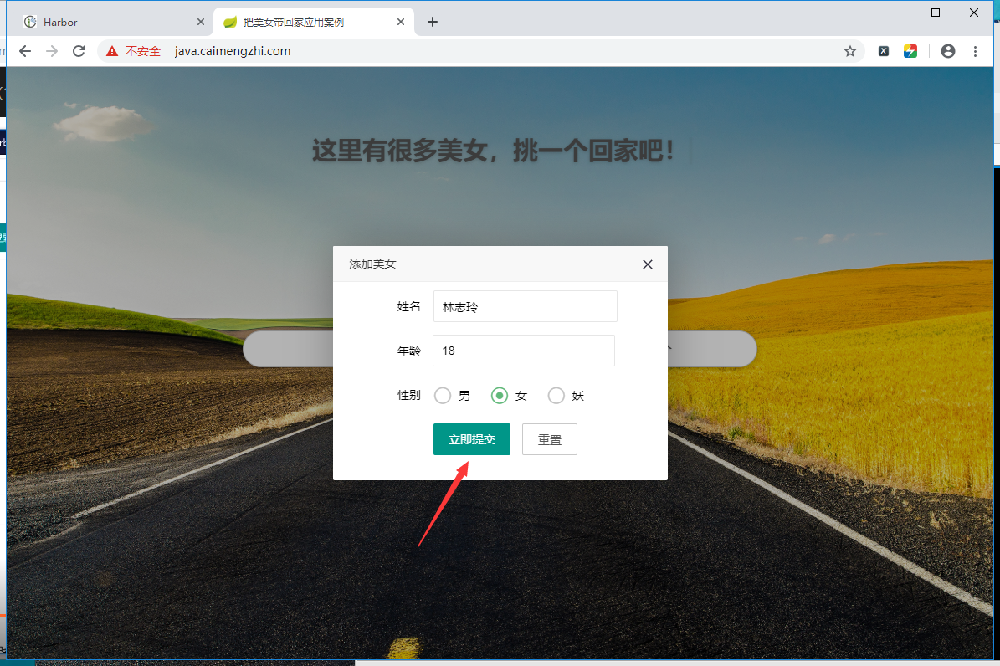
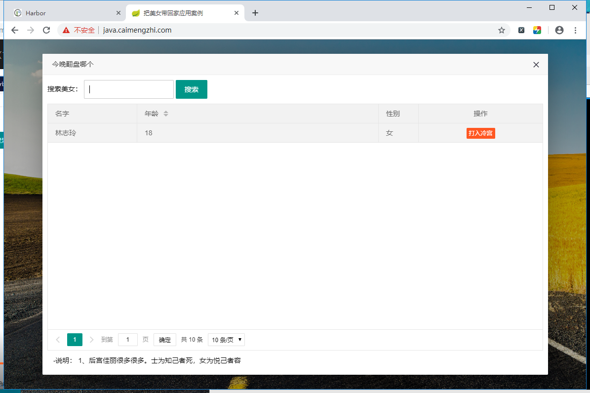
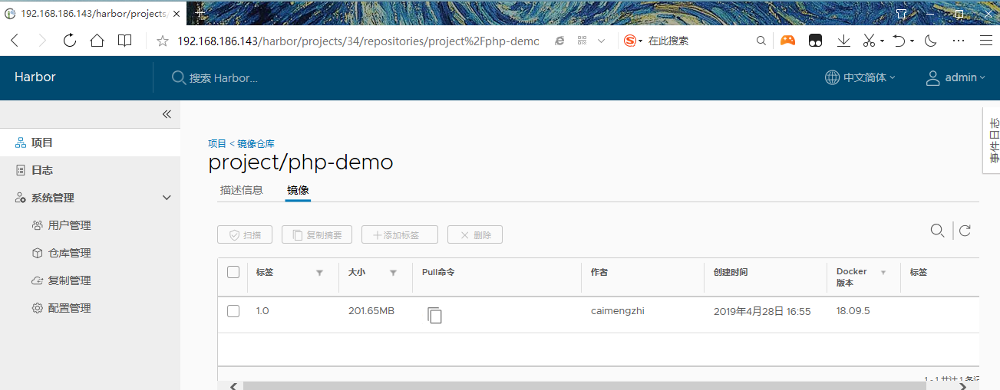
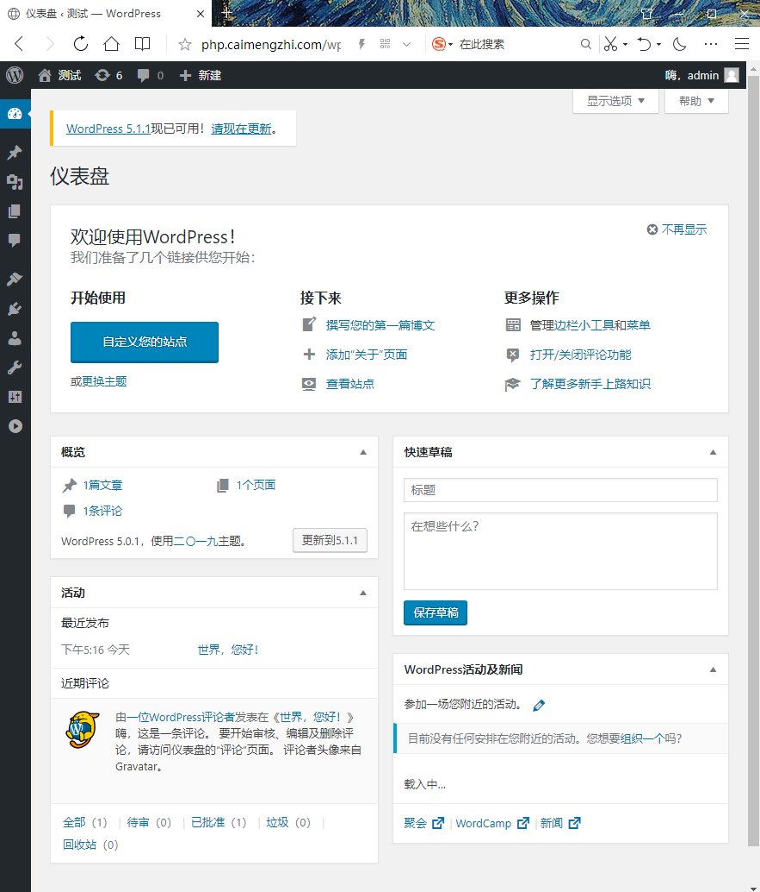
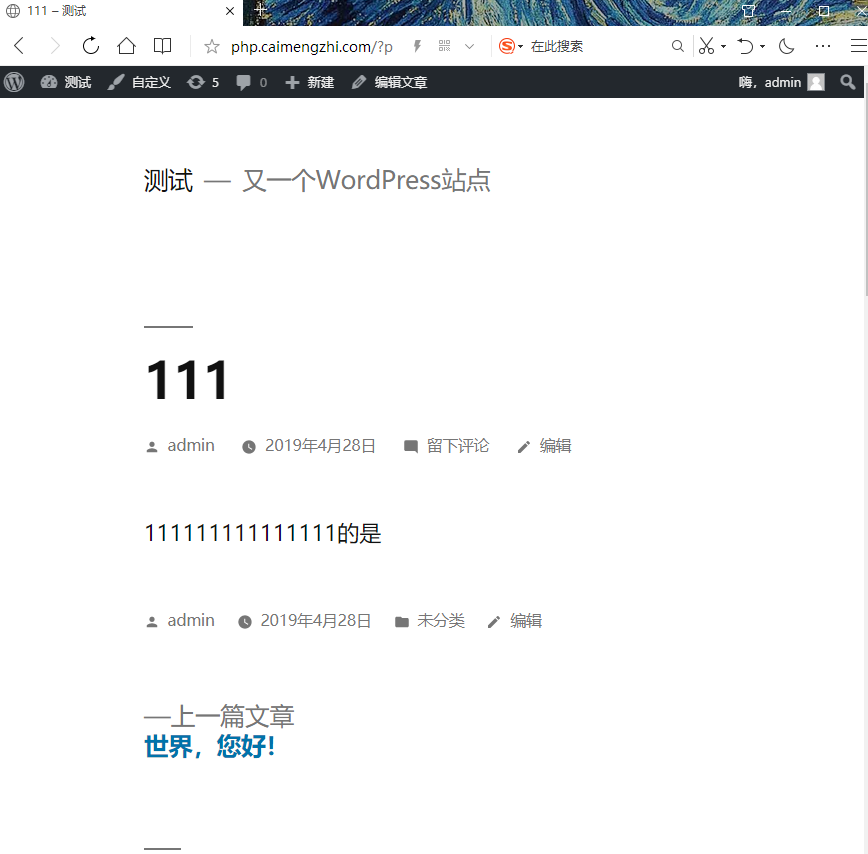

<center><h1>Kubernets 案例</h1></center>


## 1. 部署java项目
&#160; &#160; &#160; &#160;将公司的java项目部署到K8S中，


```
tomcat 三个实例
mysql 单实例

deployment/service/ingress

---
statefulset
headless-service
pv,pvc(storageclass PV自动供给)
```
详细操作过程
```
[root@k8s-lb01 opt]# ls
docker-compose-Linux-x86_64  harbor-offline-installer-v1.6.1.tgz
[root@k8s-lb01 opt]# chmod +x docker-compose-Linux-x86_64 
[root@k8s-lb01 opt]# ls
docker-compose-Linux-x86_64  harbor-offline-installer-v1.6.1.tgz
[root@k8s-lb01 opt]# tar xf harbor-offline-installer-v1.6.1.tgz 
[root@k8s-lb01 opt]# mv docker-compose-Linux-x86_64 /bin/docker-compose
[root@k8s-lb01 opt]# chmod +x /bin/docker-compose 
[root@k8s-lb01 opt]# cd harbor/

修改访问地址，也就是harbor仓库地址
[root@k8s-lb01 harbor]# sed -i 's/hostname = reg.mydomain.com/hostname = 192.168.186.143/g'  harbor.cfg 
[root@k8s-lb01 harbor]# grep 192.168.186.143 harbor.cfg
hostname = 192.168.186.143

生成环境文件
[root@k8s-lb01 harbor]# ./prepare 
Generated and saved secret to file: /data/secretkey
Generated configuration file: ./common/config/nginx/nginx.conf
Generated configuration file: ./common/config/adminserver/env
Generated configuration file: ./common/config/ui/env
Generated configuration file: ./common/config/registry/config.yml
Generated configuration file: ./common/config/db/env
Generated configuration file: ./common/config/jobservice/env
Generated configuration file: ./common/config/jobservice/config.yml
Generated configuration file: ./common/config/log/logrotate.conf
Generated configuration file: ./common/config/registryctl/env
Generated configuration file: ./common/config/ui/app.conf
Generated certificate, key file: ./common/config/ui/private_key.pem, cert file: ./common/config/registry/
root.crtThe configuration files are ready, please use docker-compose to start the service.

确保harbor机器上的docker启动。
[root@k8s-lb01 harbor]# systemctl start docker
[root@k8s-lb01 harbor]# systemctl status docker
● docker.service - Docker Application Container Engine
   Loaded: loaded (/usr/lib/systemd/system/docker.service; disabled; vendor preset: disabled)
   Active: active (running) since Sun 2019-04-28 13:47:25 CST; 4s ago
     Docs: https://docs.docker.com
 Main PID: 120472 (dockerd)
    Tasks: 11
   Memory: 115.2M
   CGroup: /system.slice/docker.service
           └─120472 /usr/bin/dockerd -H fd:// --containerd=/run/containerd/containerd.sock

Apr 28 13:47:24 k8s-lb01 dockerd[120472]: time="2019-04-28T13:47:24.777678214+08:00" level=info ms...grpc
Apr 28 13:47:24 k8s-lb01 dockerd[120472]: time="2019-04-28T13:47:24.777906986+08:00" level=info ms...grpc
Apr 28 13:47:24 k8s-lb01 dockerd[120472]: time="2019-04-28T13:47:24.811816578+08:00" level=info ms...nds"
Apr 28 13:47:24 k8s-lb01 dockerd[120472]: time="2019-04-28T13:47:24.813312962+08:00" level=info ms...rt."
Apr 28 13:47:25 k8s-lb01 dockerd[120472]: time="2019-04-28T13:47:25.156849516+08:00" level=info ms...ess"
Apr 28 13:47:25 k8s-lb01 dockerd[120472]: time="2019-04-28T13:47:25.349981896+08:00" level=info ms...ne."
Apr 28 13:47:25 k8s-lb01 dockerd[120472]: time="2019-04-28T13:47:25.478879284+08:00" level=info ms...09.5
Apr 28 13:47:25 k8s-lb01 dockerd[120472]: time="2019-04-28T13:47:25.479271714+08:00" level=info ms...ion"
Apr 28 13:47:25 k8s-lb01 systemd[1]: Started Docker Application Container Engine.
Apr 28 13:47:25 k8s-lb01 dockerd[120472]: time="2019-04-28T13:47:25.530053164+08:00" level=info ms...ock"
Hint: Some lines were ellipsized, use -l to show in full.


安装，等待完毕
[root@k8s-lb01 harbor]# ./install.sh 

启动harbor
[root@k8s-lb01 harbor]# docker-compose up -d
harbor-log is up-to-date
harbor-adminserver is up-to-date
registry is up-to-date
redis is up-to-date
harbor-db is up-to-date
harbor-ui is up-to-date
harbor-jobservice is up-to-date
nginx is up-to-date

查看harbor状态
[root@k8s-lb01 harbor]# docker-compose ps
       Name                     Command                  State                                    Ports                              
-------------------------------------------------------------------------------------------------------------------------------------
harbor-adminserver   /harbor/start.sh                 Up (healthy)                                                                   
harbor-db            /entrypoint.sh postgres          Up (healthy)   5432/tcp                                                        
harbor-jobservice    /harbor/start.sh                 Up                                                                             
harbor-log           /bin/sh -c /usr/local/bin/ ...   Up (healthy)   127.0.0.1:1514->10514/tcp                                       
harbor-ui            /harbor/start.sh                 Up (healthy)                                                                   
nginx                nginx -g daemon off;             Up (healthy)   0.0.0.0:443->443/tcp, 0.0.0.0:4443->4443/tcp, 0.0.0.0:80->80/tcp
redis                docker-entrypoint.sh redis ...   Up             6379/tcp                                                        
registry             /entrypoint.sh /etc/regist ...   Up (healthy)   5000/tcp   
都是UP。就表示启动OK。
```

创建基础镜像仓库。

<center></center>
<center></center>
<center></center>

??? note "修改node节点的指定harbor仓库地址"
    ```
    [root@k8s-node01 ~]# cat /etc/docker/daemon.json 
    {"registry-mirrors": ["http://f1361db2.m.daocloud.io"],
    "insecure-registries":["192.168.186.143"]
    }
    [root@k8s-node01 ~]# systemctl restart docker
    [root@k8s-node01 ~]# systemctl status docker
    ● docker.service - Docker Application Container Engine
       Loaded: loaded (/usr/lib/systemd/system/docker.service; disabled; vendor preset: disabled)
       Active: active (running) since Sun 2019-04-28 14:33:02 CST; 6s ago
         Docs: https://docs.docker.com
     Main PID: 74451 (dockerd)
        Tasks: 124
       Memory: 89.7M
       CGroup: /system.slice/docker.service
               ├─74451 /usr/bin/dockerd --bip=172.17.73.1/24 --ip-masq=false --mtu=1450
               ├─74459 containerd --config /var/run/docker/containerd/containerd.toml --log-level info
               ├─74706 containerd-shim -namespace moby -workdir /var/lib/docker/containerd/daemon/io.conta...
               ├─74873 containerd-shim -namespace moby -workdir /var/lib/docker/containerd/daemon/io.conta...
               ├─74986 containerd-shim -namespace moby -workdir /var/lib/docker/containerd/daemon/io.conta...
               ├─75147 containerd-shim -namespace moby -workdir /var/lib/docker/containerd/daemon/io.conta...
               ├─75157 containerd-shim -namespace moby -workdir /var/lib/docker/containerd/daemon/io.conta...
               ├─75327 containerd-shim -namespace moby -workdir /var/lib/docker/containerd/daemon/io.conta...
               ├─75599 containerd-shim -namespace moby -workdir /var/lib/docker/containerd/daemon/io.conta...
               ├─75627 containerd-shim -namespace moby -workdir /var/lib/docker/containerd/daemon/io.conta...
               └─75762 containerd-shim -namespace moby -workdir /var/lib/docker/containerd/daemon/io.conta...
    
    Apr 28 14:33:02 k8s-node01 systemd[1]: Started Docker Application Container Engine.
    Apr 28 14:33:03 k8s-node01 dockerd[74451]: time="2019-04-28T14:33:03.082316037+08:00" level=info m...4706
    Apr 28 14:33:03 k8s-node01 dockerd[74451]: time="2019-04-28T14:33:03.601109635+08:00" level=info m...4873
    Apr 28 14:33:03 k8s-node01 dockerd[74451]: time="2019-04-28T14:33:03.848889848+08:00" level=info m...4986
    Apr 28 14:33:04 k8s-node01 dockerd[74451]: time="2019-04-28T14:33:04.322740990+08:00" level=info m...5147
    Apr 28 14:33:04 k8s-node01 dockerd[74451]: time="2019-04-28T14:33:04.330730660+08:00" level=info m...5157
    Apr 28 14:33:04 k8s-node01 dockerd[74451]: time="2019-04-28T14:33:04.595311994+08:00" level=info m...5327
    Apr 28 14:33:05 k8s-node01 dockerd[74451]: time="2019-04-28T14:33:05.614295926+08:00" level=info m...5599
    Apr 28 14:33:05 k8s-node01 dockerd[74451]: time="2019-04-28T14:33:05.717944119+08:00" level=info m...5627
    Apr 28 14:33:06 k8s-node01 dockerd[74451]: time="2019-04-28T14:33:06.110381631+08:00" level=info m...5762
    Hint: Some lines were ellipsized, use -l to show in full.
    
    同样其他node上也相同操作
    [root@k8s-node02 ~]# cat /etc/docker/daemon.json 
    {"registry-mirrors": ["http://f1361db2.m.daocloud.io"],
    "insecure-registries":["192.168.186.143"]
    }
    [root@k8s-node02 ~]# systemctl restart docker
    [root@k8s-node02 ~]# systemctl status docker
    ● docker.service - Docker Application Container Engine
       Loaded: loaded (/usr/lib/systemd/system/docker.service; enabled; vendor preset: disabled)
       Active: active (running) since Sun 2019-04-28 14:34:58 CST; 26s ago
         Docs: https://docs.docker.com
     Main PID: 75503 (dockerd)
        Tasks: 154
       Memory: 88.7M
       CGroup: /system.slice/docker.service
               ├─75503 /usr/bin/dockerd --bip=172.17.26.1/24 --ip-masq=false --mtu=1450
               ├─75510 containerd --config /var/run/docker/containerd/containerd.toml --log-level info
               ├─75771 containerd-shim -namespace moby -workdir /var/lib/docker/containerd/daemon/io.containerd.runtime.v1.linux/moby/9d78c2e983500e20bd976b09543db3b4c459d7870da722af900fc863...
               ├─75862 containerd-shim -namespace moby -workdir /var/lib/docker/containerd/daemon/io.containerd.runtime.v1.linux/moby/0dc2b2c79b61b5528e00e920e2dac22b2e311ede6da9cd9bb8e5c7fe...
               ├─75885 containerd-shim -namespace moby -workdir /var/lib/docker/containerd/daemon/io.containerd.runtime.v1.linux/moby/ea53e245eacbb9e44d940d3d45f1a0519789405a79d469617a8f520e...
               ├─75943 containerd-shim -namespace moby -workdir /var/lib/docker/containerd/daemon/io.containerd.runtime.v1.linux/moby/9a4e763666c758f2baf9aac7fd66feabac481994844ae90f707ed0f1...
               ├─76216 containerd-shim -namespace moby -workdir /var/lib/docker/containerd/daemon/io.containerd.runtime.v1.linux/moby/02d7ddee415e16af6f3016a6750429b9bb24c43d7039967b9e9fd6c5...
               ├─76472 containerd-shim -namespace moby -workdir /var/lib/docker/containerd/daemon/io.containerd.runtime.v1.linux/moby/49c4d69b1acd2b56de5878e91e825ac7c904a124aa2a0ce7ba9c563a...
               ├─76625 containerd-shim -namespace moby -workdir /var/lib/docker/containerd/daemon/io.containerd.runtime.v1.linux/moby/4a3547cb56de8d45fa95f862f65031327f8ceefc8e8b26a358432bb5...
               ├─76643 containerd-shim -namespace moby -workdir /var/lib/docker/containerd/daemon/io.containerd.runtime.v1.linux/moby/4b527a258c5c0393aa6a81a2991dc378b2ead099de91a5662c3abf31...
               ├─76760 containerd-shim -namespace moby -workdir /var/lib/docker/containerd/daemon/io.containerd.runtime.v1.linux/moby/39bcf89f58fdeb4c239045dad4f418fd74638e574d4bd5bf4ed9253e...
               ├─77131 containerd-shim -namespace moby -workdir /var/lib/docker/containerd/daemon/io.containerd.runtime.v1.linux/moby/08d26453c1568bde55a22ba64462d5bd1cfdd595ba23ad1b3cd70d33...
               ├─77342 containerd-shim -namespace moby -workdir /var/lib/docker/containerd/daemon/io.containerd.runtime.v1.linux/moby/08931842f7a5e84a1c65ec5698b8566a9f4deb7fbe1f1407d98f984c...
               └─77476 containerd-shim -namespace moby -workdir /var/lib/docker/containerd/daemon/io.containerd.runtime.v1.linux/moby/9db7a42e54aae37a9fd2527ddc26fcb4e6a42eab6f18ff5a520df4ce...
    
    Apr 28 14:34:59 k8s-node02 dockerd[75503]: time="2019-04-28T14:34:59.778147009+08:00" level=info msg="shim containerd-shim started" address="/containerd-shim/moby/ea53e245eac...se pid=75885
    Apr 28 14:34:59 k8s-node02 dockerd[75503]: time="2019-04-28T14:34:59.932749097+08:00" level=info msg="shim containerd-shim started" address="/containerd-shim/moby/9a4e763666c...se pid=75943
    Apr 28 14:35:00 k8s-node02 dockerd[75503]: time="2019-04-28T14:35:00.561857906+08:00" level=info msg="shim containerd-shim started" address="/containerd-shim/moby/02d7ddee415...se pid=76216
    Apr 28 14:35:01 k8s-node02 dockerd[75503]: time="2019-04-28T14:35:01.230215643+08:00" level=info msg="shim containerd-shim started" address="/containerd-shim/moby/49c4d69b1ac...se pid=76472
    Apr 28 14:35:01 k8s-node02 dockerd[75503]: time="2019-04-28T14:35:01.522859524+08:00" level=info msg="shim containerd-shim started" address="/containerd-shim/moby/4a3547cb56d...se pid=76625
    Apr 28 14:35:01 k8s-node02 dockerd[75503]: time="2019-04-28T14:35:01.569893339+08:00" level=info msg="shim containerd-shim started" address="/containerd-shim/moby/4b527a258c5...se pid=76643
    Apr 28 14:35:01 k8s-node02 dockerd[75503]: time="2019-04-28T14:35:01.803637142+08:00" level=info msg="shim containerd-shim started" address="/containerd-shim/moby/39bcf89f58f...se pid=76760
    Apr 28 14:35:02 k8s-node02 dockerd[75503]: time="2019-04-28T14:35:02.855091441+08:00" level=info msg="shim containerd-shim started" address="/containerd-shim/moby/08d26453c15...se pid=77131
    Apr 28 14:35:03 k8s-node02 dockerd[75503]: time="2019-04-28T14:35:03.530510575+08:00" level=info msg="shim containerd-shim started" address="/containerd-shim/moby/08931842f7a...se pid=77342
    Apr 28 14:35:03 k8s-node02 dockerd[75503]: time="2019-04-28T14:35:03.908797660+08:00" level=info msg="shim containerd-shim started" address="/containerd-shim/moby/9db7a42e54a...se pid=77476
    Hint: Some lines were ellipsized, use -l to show in full.
    
    检查所有节点上的node docker均要正常启动。
    ```

```
[root@k8s-node01 ~]# git clone https://github.com/caimengzhi/tomcat-java-demo
Cloning into 'tomcat-java-demo'...
remote: Enumerating objects: 180, done.
remote: Counting objects: 100% (180/180), done.
remote: Compressing objects: 100% (162/162), done.
remote: Total 180 (delta 4), reused 180 (delta 4), pack-reused 0
Receiving objects: 100% (180/180), 4.50 MiB | 149.00 KiB/s, done.
Resolving deltas: 100% (4/4), done.

[root@k8s-node01 ~]# tar xf apache-maven-3.5.0-bin.tar.gz
[root@k8s-node01 ~]# tar xf jdk-8u45-linux-x64.tar.gz 
[root@k8s-node01 ~]# mv apache-maven-3.5.0 /usr/local/maven
[root@k8s-node01 ~]# mv jdk1.8.0_45/ /usr/local/jdk

配置环境变量
[root@k8s-node01 ~]# tail -3 /etc/profile
JAVA_HOME=/usr/local/jdk
PATH=$PATH:$JAVA_HOME/bin
export JAVA_HOME PATH

[root@k8s-node01 ~]# source /etc/profile
[root@k8s-node01 ~]# java -version
java version "1.8.0_45"
Java(TM) SE Runtime Environment (build 1.8.0_45-b14)
Java HotSpot(TM) 64-Bit Server VM (build 25.45-b02, mixed mode)

编辑java项目
[root@k8s-node01 ~]# cd tomcat-java-demo/
[root@k8s-node01 tomcat-java-demo]# ls
doc  Dockerfile  LICENSE  pom.xml  README.md  src
[root@k8s-node01 tomcat-java-demo]# /usr/local/maven/bin/mvn clean package
省略。。。
[INFO] Packaging webapp
[INFO] Assembling webapp [ly-simple-tomcat] in [/root/tomcat-java-demo/target/ly-simple-tomcat-0.0.1-SNAPSHOT]
[INFO] Processing war project
[INFO] Webapp assembled in [178 msecs]
[INFO] Building war: /root/tomcat-java-demo/target/ly-simple-tomcat-0.0.1-SNAPSHOT.war
[INFO] ------------------------------------------------------------------------
[INFO] BUILD SUCCESS
[INFO] ------------------------------------------------------------------------
[INFO] Total time: 05:30 min
[INFO] Finished at: 2019-04-28T02:54:07-04:00
[INFO] Final Memory: 32M/175M
[INFO] ------------------------------------------------------------------------
到此编译通过。
[root@k8s-node01 tomcat-java-demo]# ll target/
total 21304
drwxr-xr-x 5 root root       95 Apr 28 14:53 classes
drwxr-xr-x 3 root root       25 Apr 28 14:53 generated-sources
drwxr-xr-x 4 root root       37 Apr 28 14:54 ly-simple-tomcat-0.0.1-SNAPSHOT
-rw-r--r-- 1 root root 21813531 Apr 28 14:54 ly-simple-tomcat-0.0.1-SNAPSHOT.war
drwxr-xr-x 2 root root       28 Apr 28 14:54 maven-archiver
drwxr-xr-x 3 root root       35 Apr 28 14:53 maven-status

[root@k8s-node01 tomcat-java-demo]# cat Dockerfile 
FROM lizhenliang/tomcat 
MAINTAINER caimengzhi
RUN rm -rf /usr/local/tomcat/webapps/*
ADD target/*.war /usr/local/tomcat/webapps/ROOT.war 

构建基础镜像
[root@k8s-node01 tomcat-java-demo]# docker build -t 192.168.186.143/project/java-demo:latest .
Sending build context to Docker daemon   63.1MB
Step 1/4 : FROM lizhenliang/tomcat
 ---> 143035d83fdc
Step 2/4 : MAINTAINER caimengzhi
 ---> Running in bc9e233d0456
Removing intermediate container bc9e233d0456
 ---> 7b03e5bab490
Step 3/4 : RUN rm -rf /usr/local/tomcat/webapps/*
 ---> Running in 71e67f23e1c9
Removing intermediate container 71e67f23e1c9
 ---> 19ceb3e4d1df
Step 4/4 : ADD target/*.war /usr/local/tomcat/webapps/ROOT.war
 ---> 5cd2914873fb
Successfully built 5cd2914873fb
Successfully tagged 192.168.186.143/project/java-demo:latest
[root@k8s-node01 tomcat-java-demo]# docker images
REPOSITORY                                                        TAG                 IMAGE ID            CREATED             SIZE
192.168.186.143/project/java-demo                                 latest              5cd2914873fb        8 seconds ago       410MB

先登录到harbor，然后再推送,期中账号和密码就是登录harbor的web端的账号和密码<admin:Harbor12345>
[root@k8s-node01 tomcat-java-demo]# docker login 192.168.186.143
Username: admin  
Password: 
WARNING! Your password will be stored unencrypted in /root/.docker/config.json.
Configure a credential helper to remove this warning. See
https://docs.docker.com/engine/reference/commandline/login/#credentials-store

Login Succeeded
[root@k8s-node01 tomcat-java-demo]# docker push 192.168.186.143/project/java-demo:latest
The push refers to repository [192.168.186.143/project/java-demo]
e0e47f5a4eca: Pushed 
9992f38a0262: Pushed 
ceead5ca823f: Pushed 
2353c173a26a: Pushed 
071d8bd76517: Pushed 
latest: digest: sha256:4223a8dbe254dcf66f35d2e0ab906458fe9f973cf62c2f590f5ad96c878866f6 size: 1371
```
查看harbor，可以看到已经推送上来了。如下:

<center></center>

```
[root@k8s-master01 ~]# mkdir project
[root@k8s-master01 ~]# cd project/
[root@k8s-master01 project]# ls
[root@k8s-master01 project]# rz -E
rz waiting to receive.
[root@k8s-master01 project]# ls
java-demo_.zip  php-demo_.zip
[root@k8s-master01 project]# unzip java-demo_.zip 
Archive:  java-demo_.zip
   creating: java-demo/
  inflating: java-demo/mysql.yaml    
 extracting: java-demo/namespace.yaml  
  inflating: java-demo/registry-pull-secret.yaml  
  inflating: java-demo/deployment.yaml  
  inflating: java-demo/service.yaml  
  inflating: java-demo/ingress.yaml  
[root@k8s-master01 project]# cd java-demo/
[root@k8s-master01 java-demo]# ll
total 24
-rw-r--r-- 1 root root 1000 Dec 15 22:31 deployment.yaml
-rw-r--r-- 1 root root  277 Dec 15 23:38 ingress.yaml
-rw-r--r-- 1 root root  869 Dec 15 23:50 mysql.yaml
-rw-r--r-- 1 root root   54 Dec 15 21:03 namespace.yaml
-rw-r--r-- 1 root root  359 Dec 15 21:25 registry-pull-secret.yaml
-rw-r--r-- 1 root root  210 Dec 15 23:07 service.yaml
[root@k8s-master01 java-demo]# cat namespace.yaml 
apiVersion: v1
kind: Namespace
metadata:
  name: test
[root@k8s-master01 java-demo]# kubectl create -f namespace.yaml 
namespace/test created
[root@k8s-master01 java-demo]# kubectl get ns
NAME            STATUS   AGE
default         Active   9d
ingress-nginx   Active   3d23h
kube-public     Active   9d
kube-system     Active   9d
test            Active   5s
```

??? note "namespace.yaml"
    ```
    apiVersion: v1
    kind: Namespace
    metadata:
      name: test
    ```

??? note "deployment.yaml"
    ```
    apiVersion: apps/v1beta1
    kind: Deployment
    metadata:
      name: tomcat-java-demo
      namespace: test
    spec:
      replicas: 3
      selector:
        matchLabels:
          project: www
          app: java-demo
      template:
        metadata:
          labels:
            project: www
            app: java-demo
        spec:
          imagePullSecrets:
          - name: registry-pull-secret
          containers:
          - name: tomcat
            image: 192.168.186.143/project/java-demo:latest
            imagePullPolicy: Always
            ports:
            - containerPort: 8080
              name: web
              protocol: TCP
            resources:
              requests:
                cpu: 0.5
                memory: 1Gi
              limits:
                cpu: 1
                memory: 2Gi
            livenessProbe:
              httpGet:
                path: /
                port: 8080
              initialDelaySeconds: 60
              timeoutSeconds: 20
            readinessProbe:
              httpGet:
                path: /
                port: 8080
              initialDelaySeconds: 60
              timeoutSeconds: 20
    ```
> deployment.yaml 中的image是要设置为harbor对应的仓库地址。修改成你的地址。imagePullSecrets。


```
通过命令可以查看怎么使用
[root@k8s-master01 java-demo]# kubectl create secret --help
Create a secret using specified subcommand.

Available Commands:
  docker-registry Create a secret for use with a Docker registry
  generic         Create a secret from a local file, directory or literal value
  tls             Create a TLS secret

Usage:
  kubectl create secret [flags] [options]

Use "kubectl <command> --help" for more information about a given command.
Use "kubectl options" for a list of global command-line options (applies to all commands).
[root@k8s-master01 java-demo]# kubectl create secret docker-registry
Error: required flag(s) "docker-password", "docker-username" not set


Examples:
  # If you don't already have a .dockercfg file, you can create a dockercfg secret directly by using:
  kubectl create secret docker-registry my-secret --docker-server=DOCKER_REGISTRY_SERVER --docker-username=DOCKER_USER --docker-password=DOCKER_PASSWORD --docker-email=DOC
KER_EMAIL
Options:
      --allow-missing-template-keys=true: If true, ignore any errors in templates when a field or map key is missing in the template. Only applies to golang and jsonpath o
utput formats.      --append-hash=false: Append a hash of the secret to its name.
      --docker-email='': Email for Docker registry
      --docker-password='': Password for Docker registry authentication
      --docker-server='https://index.docker.io/v1/': Server location for Docker registry
      --docker-username='': Username for Docker registry authentication
      --dry-run=false: If true, only print the object that would be sent, without sending it.
      --from-file=[]: Key files can be specified using their file path, in which case a default name will be given to them, or optionally with a name and file path, in whi
ch case the given name will be used.  Specifying a directory will iterate each named file in the directory that is a valid secret key.      --generator='secret-for-docker-registry/v1': The name of the API generator to use.
  -o, --output='': Output format. One of: json|yaml|name|go-template|go-template-file|template|templatefile|jsonpath|jsonpath-file.
      --save-config=false: If true, the configuration of current object will be saved in its annotation. Otherwise, the annotation will be unchanged. This flag is useful w
hen you want to perform kubectl apply on this object in the future.      --template='': Template string or path to template file to use when -o=go-template, -o=go-template-file. The template format is golang templates [http://golang.org/p
kg/text/template/#pkg-overview].      --validate=true: If true, use a schema to validate the input before sending it

Usage:
  kubectl create secret docker-registry NAME --docker-username=user --docker-password=password --docker-email=email [--docker-server=string] [--from-literal=key1=value1] [
--dry-run] [options]
Use "kubectl options" for a list of global command-line options (applies to all commands).

required flag(s) "docker-password", "docker-username" not set

创建secret。
[root@k8s-master01 java-demo]# kubectl create secret docker-registry registry-pull-secret --docker-username=admin --docker-password=Harbor12345 --docker-email=610658552@qq.com --docker-server=192.168.186.143 -n test secret/registry-pull-secret created
# -n test表示创建在名称空间为test里面，registry-pull-secret 里上面yaml文件中指定的secret字段。其他是harbor相关信息

[root@k8s-master01 java-demo]# kubectl get secret -n test
NAME                   TYPE                                  DATA   AGE
default-token-266b7    kubernetes.io/service-account-token   3      9m6s
registry-pull-secret   kubernetes.io/dockerconfigjson        1      2m55s
上面deployment模式pod就引用了这个secret[registry-pull-secret]

创建deployment
[root@k8s-master01 java-demo]# kubectl create -f deployment.yaml 
deployment.apps/tomcat-java-demo created
查看创建pod
[root@k8s-master01 java-demo]# kubectl get pods -n test
NAME                                READY   STATUS    RESTARTS   AGE
tomcat-java-demo-56696dc668-9kn2j   0/1     Pending   0          38s
tomcat-java-demo-56696dc668-fch4j   0/1     Running   0          39s
tomcat-java-demo-56696dc668-s9cqk   0/1     Running   0          38s
后来查看pennding那机器详细信息发现是我的机器的内存不足了，哈哈。我修改配置文件降低内存。就重新安装
```
> 若不是running的话，同kube describe tomcat-java-demo-56696dc668-s9cqk -n test 去查看详细信息，以下是排除详细过程。

??? note "上述问题解决排查思路"
    ```
    [root@k8s-master01 java-demo]# kubectl get pod -n test
    NAME                                READY   STATUS    RESTARTS   AGE
    tomcat-java-demo-5c77966c99-5ngm9   0/1     Running   0          10s
    tomcat-java-demo-5c77966c99-7zhr2   0/1     Pending   0          10s
    tomcat-java-demo-5c77966c99-fhsrm   0/1     Running   0          10s
    
    [root@k8s-master01 java-demo]# kubectl describe pod tomcat-java-demo-5c77966c99-7zhr2 -n test
    Name:               tomcat-java-demo-5c77966c99-7zhr2
    Namespace:          test
    Priority:           0
    PriorityClassName:  <none>
    Node:               <none>
    Labels:             app=java-demo
                        pod-template-hash=5c77966c99
                        project=www
    Annotations:        <none>
    Status:             Pending
    IP:                 
    Controlled By:      ReplicaSet/tomcat-java-demo-5c77966c99
    Containers:
      tomcat:
        Image:      192.168.186.143/project/java-demo:latest
        Port:       8080/TCP
        Host Port:  0/TCP
        Limits:
          cpu:     1
          memory:  1Gi
        Requests:
    ▽     cpu:        500m
          memory:     1Gi
        Liveness:     http-get http://:8080/ delay=60s timeout=20s period=10s #success=1 #failure=3
        Readiness:    http-get http://:8080/ delay=60s timeout=20s period=10s #success=1 #failure=3
        Environment:  <none>
        Mounts:
          /var/run/secrets/kubernetes.io/serviceaccount from default-token-266b7 (ro)
    Conditions:
      Type           Status
      PodScheduled   False 
    Volumes:
      default-token-266b7:
        Type:        Secret (a volume populated by a Secret)
        SecretName:  default-token-266b7
        Optional:    false
    QoS Class:       Burstable
    Node-Selectors:  <none>
    Tolerations:     node.kubernetes.io/not-ready:NoExecute for 300s
                     node.kubernetes.io/unreachable:NoExecute for 300s
    Events:
      Type     Reason            Age                From               Message
      ----     ------            ----               ----               -------
      Warning  FailedScheduling  31s (x3 over 31s)  default-scheduler  0/2 nodes are available: 2 Insufficient memory.
    
    修改降低内存。我测试机内存太小。
    [root@k8s-master01 java-demo]# cat deployment.yaml
    apiVersion: apps/v1beta1
    kind: Deployment
    metadata:
      name: tomcat-java-demo
      namespace: test
    spec:
      replicas: 3
      selector:
        matchLabels:
          project: www
          app: java-demo
      template:
        metadata:
          labels:
            project: www
            app: java-demo
        spec:
          imagePullSecrets:
          - name: registry-pull-secret
          containers:
          - name: tomcat
            image: 192.168.186.143/project/java-demo:latest
            imagePullPolicy: Always
            ports:
            - containerPort: 8080
              name: web
              protocol: TCP
            resources:
              requests:
                cpu: 0.5
                memory: 0.5Gi
              limits:
                cpu: 1
                memory: 0.5Gi
            livenessProbe:
              httpGet:
                path: /
                port: 8080
              initialDelaySeconds: 60
              timeoutSeconds: 20
            readinessProbe:
              httpGet:
                path: /
                port: 8080
              initialDelaySeconds: 60
              timeoutSeconds: 20
    [root@k8s-master01 java-demo]# kubectl delete -f deployment.yaml -n test
    deployment.apps "tomcat-java-demo" deleted
    [root@k8s-master01 java-demo]# kubectl create -f deployment.yaml -n test
    deployment.apps/tomcat-java-demo created
    [root@k8s-master01 java-demo]# kubectl get pod -n test
    NAME                                READY   STATUS        RESTARTS   AGE
    tomcat-java-demo-5c77966c99-5ngm9   0/1     Terminating   0          99s
    tomcat-java-demo-6b87495c99-fr8vq   0/1     Running       0          4s
    tomcat-java-demo-6b87495c99-m9jlp   0/1     Running       0          4s
    tomcat-java-demo-6b87495c99-s2cdm   0/1     Running       0          4s
    ```

??? note "service.yaml"
    ```
    apiVersion: v1
    kind: Service
    metadata:
      name: tomcat-java-demo
      namespace: test
    spec:
      selector:
        project: www
        app: java-demo
      ports:
      - name: web
        port: 80
        targetPort: 8080
    ```

```
[root@k8s-master01 java-demo]# kubectl apply -f service.yaml 
service/tomcat-java-demo created
```
??? note "ingress.yaml"
    ```
    apiVersion: extensions/v1beta1
    kind: Ingress
    metadata:
      name: tomcat-java-demo 
      namespace: test
    spec:
      rules:
        - host: java.caimengzhi.com
          http:
            paths:
            - path: /
              backend:
                serviceName: tomcat-java-demo 
                servicePort: 80
    ```

```
[root@k8s-master01 java-demo]# kubectl apply -f ingress.yaml 
ingress.extensions/tomcat-java-demo created
[root@k8s-master01 java-demo]# kubectl get pod,svc,ingress -n test
NAME                                    READY   STATUS    RESTARTS   AGE
pod/tomcat-java-demo-6b87495c99-fr8vq   1/1     Running   0          7m48s
pod/tomcat-java-demo-6b87495c99-m9jlp   1/1     Running   0          7m48s
pod/tomcat-java-demo-6b87495c99-s2cdm   1/1     Running   0          7m48s

NAME                       TYPE        CLUSTER-IP   EXTERNAL-IP   PORT(S)   AGE
service/tomcat-java-demo   ClusterIP   10.0.0.27    <none>        80/TCP    2m20s

NAME                                  HOSTS                 ADDRESS   PORTS   AGE
ingress.extensions/tomcat-java-demo   java.caimengzhi.com             80      45s

[root@k8s-master01 java-demo]# kubectl get pods -n ingress-nginx
NAME                                        READY   STATUS    RESTARTS   AGE
nginx-ingress-controller-678df7d6c7-hrj9v   1/1     Running   4          3d23h
nginx-ingress-controller-n8jqs              1/1     Running   4          3d22h
nginx-ingress-controller-xgwnw              0/1     Pending   0          3d22h
```
修改hosts，访问测试

<center></center>

??? note "mysql.yaml"
    ```
    apiVersion: v1
    kind: Service
    metadata:
      name: mysql
    spec:
      ports:
      - port: 3306 
        name: mysql 
      clusterIP: None
      selector:
        app: mysql-public
    
    ---
    
    apiVersion: apps/v1beta1
    kind: StatefulSet
    metadata:
      name: db
    spec:
      serviceName: "mysql"
      template:
        metadata:
          labels:
            app: mysql-public 
        spec:
          containers:
          - name: mysql
            image: mysql:5.7 
            env: 
            - name: MYSQL_ROOT_PASSWORD
              value: "123456"
            - name: MYSQL_DATABASE
              value: test
            ports: 
            - containerPort: 3306
            volumeMounts:
            - mountPath: "/var/lib/mysql"
              name: mysql-data
      volumeClaimTemplates:
      - metadata:
          name: mysql-data 
        spec:
          accessModes: ["ReadWriteMany"]
          storageClassName: "managed-nfs-storage"
          resources:
            requests:
              storage: 2Gi
    ```

```
[root@k8s-master01 java-demo]# kubectl apply -f mysql.yaml 
service/mysql created
statefulset.apps/db created
等一会，等到db创建。
[root@k8s-master01 java-demo]# kubectl get pods,svc
NAME                                         READY   STATUS    RESTARTS   AGE
pod/agent-85j4c                              1/1     Running   3          46h
pod/agent-kp5fp                              1/1     Running   2          46h
pod/busybox                                  1/1     Running   5          5h17m
pod/db-0                                     1/1     Running   0          46s
pod/nfs-client-provisioner-d947789f7-rchmw   1/1     Running   2          46h
pod/web-0                                    1/1     Running   1          5h20m
pod/web-1                                    1/1     Running   1          5h20m
pod/web-2                                    1/1     Running   1          5h20m

NAME                 TYPE        CLUSTER-IP   EXTERNAL-IP   PORT(S)    AGE
service/kubernetes   ClusterIP   10.0.0.1     <none>        443/TCP    9d
service/mysql        ClusterIP   None         <none>        3306/TCP   46s
service/nginx        ClusterIP   None         <none>        80/TCP     5h20m

[root@k8s-master01 java-demo]# kubectl get pv,pvc
NAME                                                        CAPACITY   ACCESS MODES   RECLAIM POLICY   STATUS   CLAIM                     STORAGECLASS          REASON   AGE
persistentvolume/pvc-1e188d5b-698a-11e9-8c4f-000c2994bdca   2Gi        RWX            Delete           Bound    default/mysql-data-db-0   managed-nfs-storage            103s
persistentvolume/pvc-7383e81d-695d-11e9-8c4f-000c2994bdca   1Gi        RWO            Delete           Bound    default/www-web-0         managed-nfs-storage            5h21m
persistentvolume/pvc-7d6cbcac-695d-11e9-8c4f-000c2994bdca   1Gi        RWO            Delete           Bound    default/www-web-1         managed-nfs-storage            5h21m
persistentvolume/pvc-7f234bb6-695d-11e9-8c4f-000c2994bdca   1Gi        RWO            Delete           Bound    default/www-web-2         managed-nfs-storage            5h21m

NAME                                    STATUS   VOLUME                                     CAPACITY   ACCESS MODES   STORAGECLASS          AGE
persistentvolumeclaim/mysql-data-db-0   Bound    pvc-1e188d5b-698a-11e9-8c4f-000c2994bdca   2Gi        RWX            managed-nfs-storage   108s
persistentvolumeclaim/www-web-0         Bound    pvc-7383e81d-695d-11e9-8c4f-000c2994bdca   1Gi        RWO            managed-nfs-storage   5h21m
persistentvolumeclaim/www-web-1         Bound    pvc-7d6cbcac-695d-11e9-8c4f-000c2994bdca   1Gi        RWO            managed-nfs-storage   5h21m
persistentvolumeclaim/www-web-2         Bound    pvc-7f234bb6-695d-11e9-8c4f-000c2994bdca   1Gi        RWO            managed-nfs-storage   5h21m

[root@k8s-master01 java-demo]# kubectl get pv,pvc | grep db
persistentvolume/pvc-1e188d5b-698a-11e9-8c4f-000c2994bdca   2Gi        RWX            Delete           Bound    default/mysql-data-db-0   managed-nfs-storage            2m25s

persistentvolumeclaim/mysql-data-db-0   Bound    pvc-1e188d5b-698a-11e9-8c4f-000c2994bdca   2Gi        RWX            managed-nfs-storage   2m30s
```
进入mysql查看是否正常

```
[root@k8s-master01 java-demo]# kubectl get pod
NAME                                     READY   STATUS    RESTARTS   AGE
agent-85j4c                              1/1     Running   3          46h
agent-kp5fp                              1/1     Running   2          46h
busybox                                  1/1     Running   5          5h19m
db-0                                     1/1     Running   0          3m30s
nfs-client-provisioner-d947789f7-rchmw   1/1     Running   2          46h
web-0                                    1/1     Running   1          5h23m
web-1                                    1/1     Running   1          5h22m
web-2                                    1/1     Running   1          5h22m
[root@k8s-master01 java-demo]# kubectl exec -it db-0 bash
root@db-0:/# mysql -uroot -p123456
mysql: [Warning] Using a password on the command line interface can be insecure.
Welcome to the MySQL monitor.  Commands end with ; or \g.
Your MySQL connection id is 2
Server version: 5.7.26 MySQL Community Server (GPL)

Copyright (c) 2000, 2019, Oracle and/or its affiliates. All rights reserved.

Oracle is a registered trademark of Oracle Corporation and/or its
affiliates. Other names may be trademarks of their respective
owners.

Type 'help;' or '\h' for help. Type '\c' to clear the current input statement.

mysql> ^DBye
```

??? note "tables_ly_tomcat.sql"
    ```
    [root@k8s-node01 tomcat-java-demo]# cat doc/db/tables_ly_tomcat.sql 
    /*
    MySQL - 5.6.30-log : Database - test
    */
    CREATE DATABASE IF NOT EXISTS `test`  DEFAULT CHARACTER SET utf8 ;
    USE `test`;
    
    CREATE TABLE `user` (
      `id` INT(11) NOT NULL AUTO_INCREMENT,
      `name` VARCHAR(100) NOT NULL COMMENT '名字',
      `age` INT(3) NOT NULL COMMENT '年龄',
      `sex` CHAR(1) DEFAULT NULL COMMENT '性别',
      PRIMARY KEY (`id`)
    ) ENGINE=INNODB DEFAULT CHARSET=utf8;
    ```

接下来开始初始化数据库，先将node1上的sql拷贝到master上，然后再在master上将sql拷贝带pod为db-0里面
```
[root@k8s-node01 tomcat-java-demo]# scp doc/db/tables_ly_tomcat.sql root@192.168.186.139:~
root@192.168.186.139's password: 
tables_ly_tomcat.sql                        100%  390   233.0KB/s   00:00  

然后转战到master上数据导入到db-0的mysql中
[root@k8s-master01 ~]# kubectl cp /root/tables_ly_tomcat.sql db-0:/
[root@k8s-master01 ~]# kubectl exec -it db-0 bashr
root@db-0:/# ls tables_ly_tomcat.sql 
tables_ly_tomcat.sql
root@db-0:/# mysql -uroot -p123456
mysql: [Warning] Using a password on the command line interface can be insecure.
Welcome to the MySQL monitor.  Commands end with ; or \g.
Your MySQL connection id is 3
Server version: 5.7.26 MySQL Community Server (GPL)

Copyright (c) 2000, 2019, Oracle and/or its affiliates. All rights reserved.

Oracle is a registered trademark of Oracle Corporation and/or its
affiliates. Other names may be trademarks of their respective
owners.

Type 'help;' or '\h' for help. Type '\c' to clear the current input statement.

mysql> source tables_ly_tomcat.sql
Query OK, 1 row affected, 1 warning (0.00 sec)

Database changed
Query OK, 0 rows affected (0.05 sec)

Query OK, 0 rows affected (0.00 sec)

mysql> use test;
Database changed
mysql> show tables;
+----------------+
| Tables_in_test |
+----------------+
| user           |
+----------------+
1 row in set (0.00 sec)

mysql> select * from user;
Empty set (0.01 sec)

mysql> desc user;
+-------+--------------+------+-----+---------+----------------+
| Field | Type         | Null | Key | Default | Extra          |
+-------+--------------+------+-----+---------+----------------+
| id    | int(11)      | NO   | PRI | NULL    | auto_increment |
| name  | varchar(100) | NO   |     | NULL    |                |
| age   | int(3)       | NO   |     | NULL    |                |
| sex   | char(1)      | YES  |     | NULL    |                |
+-------+--------------+------+-----+---------+----------------+
4 rows in set (0.00 sec)
```

修改mysql指定到pod中的mysql
```
[root@k8s-node01 tomcat-java-demo]# cat src/main/resources/application.yml 
server:
  port: 8080
spring:
  datasource:
    url: jdbc:mysql://db-0.mysql.default:3306/test?characterEncoding=utf-8
    username: root
    password: 123456
    driver-class-name: com.mysql.jdbc.Driver
  freemarker:
    allow-request-override: false
    cache: true
    check-template-location: true
    charset: UTF-8
    content-type: text/html; charset=utf-8
    expose-request-attributes: false
    expose-session-attributes: false
    expose-spring-macro-helpers: false
    suffix: .ftl
    template-loader-path:
      - classpath:/templates/
```
> db-0.mysql.default 是db-0为pod名字。mysql是容器名。default是名称空间名字

```
修改源码后重新打包。
[root@k8s-node01 tomcat-java-demo]# /usr/local/maven/bin/mvn clean package
[INFO] Scanning for projects...
。。。。省略
[INFO] ------------------------------------------------------------------------
[INFO] BUILD SUCCESS
[INFO] ------------------------------------------------------------------------
[INFO] Total time: 11.969 s
[INFO] Finished at: 2019-04-28T04:07:37-04:00
[INFO] Final Memory: 29M/189M
[INFO] ------------------------------------------------------------------------
这次打包很快，因为第一次打包的时候，本地没有maven仓库，需要去联网下载。

生成基础镜像[有修改，我暂时称为它版本为1.0]
[root@k8s-node01 tomcat-java-demo]# docker build -t 192.168.186.143/project/java-demo:1.0 .
Sending build context to Docker daemon   63.1MB
Step 1/4 : FROM lizhenliang/tomcat
 ---> 143035d83fdc
Step 2/4 : MAINTAINER caimengzhi
 ---> Using cache
 ---> 7b03e5bab490
Step 3/4 : RUN rm -rf /usr/local/tomcat/webapps/*
 ---> Using cache
 ---> 19ceb3e4d1df
Step 4/4 : ADD target/*.war /usr/local/tomcat/webapps/ROOT.war
 ---> Using cache
 ---> 19e86064a443
Successfully built 19e86064a443
Successfully tagged 192.168.186.143/project/java-demo:1.0


推送到harbor
[root@k8s-node01 tomcat-java-demo]# docker push 192.168.186.143/project/java-demo:1.0
The push refers to repository [192.168.186.143/project/java-demo]
214419143e9b: Layer already exists 
9992f38a0262: Layer already exists 
ceead5ca823f: Layer already exists 
2353c173a26a: Layer already exists 
071d8bd76517: Layer already exists 
1.0: digest: sha256:18e1ae984d700d9585a59241b6206f9681921c8d04e86c299f9ebfb7e9ce694a size: 1371
```
查看harbor

<center></center>


```
[root@k8s-master01 java-demo]# sed -i 's@image: 192.168.186.143/project/java-demo:latest@image: 192.168.186.143/project/java-demo:1.0@g' deployment.yaml

更新
[root@k8s-master01 java-demo]# kubectl apply -f deployment.yaml 
Warning: kubectl apply should be used on resource created by either kubectl create --save-config or kubectl apply
deployment.apps/tomcat-java-demo configured

查看
[root@k8s-master01 java-demo]# kubectl get pods -n test 
NAME                                READY   STATUS    RESTARTS   AGE
tomcat-java-demo-6b87495c99-fr8vq   1/1     Running   0          43m
tomcat-java-demo-6b87495c99-m9jlp   1/1     Running   0          43m
tomcat-java-demo-6b87495c99-s2cdm   1/1     Running   0          43m
tomcat-java-demo-6d584d6fcc-hs9z2   0/1     Running   0          47s
此时在滚动更新。等待好几分钟[根据你的yaml中的deployment的监控检查，大致判断出需要多少时间，差不多80秒左右一个pod，等待即可，反正最后就三个tomcat]。
我等待了两三分钟后再次查看。
[root@k8s-master01 java-demo]# kubectl get pods -n test  
NAME                                READY   STATUS    RESTARTS   AGE
tomcat-java-demo-6d584d6fcc-6gt4x   1/1     Running   0          76s
tomcat-java-demo-6d584d6fcc-9t7hn   1/1     Running   0          2m20s
tomcat-java-demo-6d584d6fcc-hs9z2   1/1     Running   0          3m31s
```
页面测试

<center></center>
<center></center>
<center></center>
<center></center>

## 2. 部署php
和部署java的差不多。我以开源的wordpress为例。

```
[root@k8s-node01 ~]# git clone  https://github.com/caimengzhi/php-demo.git
Cloning into 'php-demo'...
remote: Enumerating objects: 1894, done.
remote: Counting objects: 100% (1894/1894), done.
remote: Compressing objects: 100% (1690/1690), done.
remote: Total 1894 (delta 171), reused 1894 (delta 171), pack-reused 0
Receiving objects: 100% (1894/1894), 10.84 MiB | 646.00 KiB/s, done.
Resolving deltas: 100% (171/171), done.
```
开始制作基础镜像，推到下harbor

```
[root@k8s-node01 ~]# cd php-demo/
修改wordpress的数据。就是上面弄好的db-0那个mysql。
[root@k8s-node01 php-demo]# cat wp-config.php |grep db
define('DB_HOST', 'db-0.mysql.default');

推送镜像
[root@k8s-node01 php-demo]# docker build -t 192.168.186.143/project/php-demo:1.0 .
Sending build context to Docker daemon  57.08MB
Step 1/3 : FROM lizhenliang/nginx-php:latest
latest: Pulling from lizhenliang/nginx-php
a02a4930cb5d: Already exists 
fa86e91a9cea: Pull complete 
a2ee3cdd92de: Pull complete 
6eafef900f83: Pull complete 
7c524fc4fb55: Pull complete 
10b63beb6450: Pull complete 
1b83328bbf44: Pull complete 
Digest: sha256:6e5f35d9eddcd3e5db05668110a0b01e094ccf99f5d00811153a091fbba0402f
Status: Downloaded newer image for lizhenliang/nginx-php:latest
 ---> 2dfb7012dd85
Step 2/3 : MAINTAINER caimengzhi
 ---> Running in d9e4849bfb49
Removing intermediate container d9e4849bfb49
 ---> 23b73d2b2ddf
Step 3/3 : ADD . /usr/local/nginx/html
 ---> ce5aae4a5826
Successfully built ce5aae4a5826
Successfully tagged 192.168.186.143/project/php-demo:1.0
[root@k8s-node01 php-demo]# docker push 192.168.186.143/project/php-demo:1.0
The push refers to repository [192.168.186.143/project/php-demo]
c7769154a34c: Pushed 
7081ec6f65bb: Pushed 
04cd82449427: Pushed 
2fd331e80a89: Pushed 
924522699749: Pushed 
a80e6454a6fe: Pushed 
a71af749bf3b: Pushed 
071d8bd76517: Mounted from project/java-demo 
1.0: digest: sha256:e4e5926d0d84d338cfb406a76d22c69e8966ab17c10f77fbf103392d704702dd size: 1999
```

<center></center>

??? note "deployment.yaml"
    ```python
    apiVersion: apps/v1beta1
    kind: Deployment
    metadata:
      name: php-demo
      namespace: test
    spec:
      replicas: 3
      selector:
        matchLabels:
          project: www
          app: php-demo
      template:
        metadata:
          labels:
            project: www
            app: php-demo
        spec:
          imagePullSecrets:
          - name: registry-pull-secret
          containers:
          - name: nginx 
            image: 192.168.186.143/project/php-demo:1.0
            imagePullPolicy: Always
            ports:
            - containerPort: 80
              name: web
              protocol: TCP
            resources:
              requests:
                cpu: 0.5
                memory: 256Mi
              limits:
                cpu: 1
                memory: 1Gi
            resources:
              requests:
                cpu: 0.5
                memory: 256Mi
              limits:
                cpu: 1
                memory: 1Gi
            livenessProbe:
              httpGet:
                path: /index.html
                port: 80
              initialDelaySeconds: 6
              timeoutSeconds: 20
    ```


```
[root@k8s-master01 php-demo]# kubectl apply -f deployment.yaml 
deployment.apps/php-demo created

[root@k8s-master01 php-demo]# kubectl get pod -n test
NAME                                READY   STATUS    RESTARTS   AGE
php-demo-6d447c876b-csm6p           1/1     Running   0          26s
php-demo-6d447c876b-knjwg           1/1     Running   0          26s
php-demo-6d447c876b-pjdwd           1/1     Running   0          26s
tomcat-java-demo-6d584d6fcc-6gt4x   1/1     Running   0          42m
tomcat-java-demo-6d584d6fcc-9t7hn   1/1     Running   0          43m
tomcat-java-demo-6d584d6fcc-hs9z2   1/1     Running   0          44m
```

??? note "service.yaml"
    ```
    # [root@k8s-master01 php-demo]# vim service.yaml 
    apiVersion: v1
    kind: Service
    metadata:
      name: php-demo
      namespace: test
    spec:
      selector:
        project: www
        app: php-demo
      ports:
      - name: web
        port: 80
        targetPort: 80
    ```
??? note "ingress.yaml"
    ```
    apiVersion: extensions/v1beta1
    kind: Ingress
    metadata:
      name: php-demo 
      namespace: test
    spec:
      rules:
        - host: php.caimengzhi.com
          http:
            paths:
            - path: /
              backend:
                serviceName: php-demo 
                servicePort: 80
    ```

```
[root@k8s-master01 php-demo]# kubectl apply -f service.yaml 
service/php-demo created
[root@k8s-master01 php-demo]# kubectl get svc -n test
NAME               TYPE        CLUSTER-IP   EXTERNAL-IP   PORT(S)   AGE
php-demo           ClusterIP   10.0.0.240   <none>        80/TCP    13s
tomcat-java-demo   ClusterIP   10.0.0.27    <none>        80/TCP    83m

[root@k8s-master01 php-demo]# kubectl apply -f ingress.yaml 
ingress.extensions/php-demo created

[root@k8s-node01 php-demo]# cat wp-config.php |grep -C2 DB_NAME
// ** MySQL 设置 - 具体信息来自您正在使用的主机 ** //
/** WordPress数据库的名称 */
define('DB_NAME', 'test');

/** MySQL数据库用户名 */
wordpress 使用的默认test库，之前部署java项目的时候，使用了test库，为了wordpress初始化的时候怕出啥问题，我将之前的test库中表删掉

[root@k8s-master01 php-demo]# kubectl exec -it db-0 bash
root@db-0:/# mysql -uroot -p123456
mysql: [Warning] Using a password on the command line interface can be insecure.
Welcome to the MySQL monitor.  Commands end with ; or \g.
Your MySQL connection id is 64
Server version: 5.7.26 MySQL Community Server (GPL)

Copyright (c) 2000, 2019, Oracle and/or its affiliates. All rights reserved.

Oracle is a registered trademark of Oracle Corporation and/or its
affiliates. Other names may be trademarks of their respective
owners.

Type 'help;' or '\h' for help. Type '\c' to clear the current input statement.

mysql> use test;
Reading table information for completion of table and column names
You can turn off this feature to get a quicker startup with -A

Database changed
mysql> show tables;
+----------------+
| Tables_in_test |
+----------------+
| user           |
+----------------+
1 row in set (0.01 sec)

mysql> drop table user;
Query OK, 0 rows affected (0.04 sec)
```

然后找到本的hosts，添加hosts解析。我的是windows系统`C:\Windows\System32\drivers\etc\hosts` ，若是linux的话`/etc/hosts`
```
192.168.186.141 php.caimengzhi.com
```
然后再本地打开浏览器输入`php.caimengzhi.com`安装。

<center></center>
<center></center>
<center></center>
<center></center>
<center></center>
