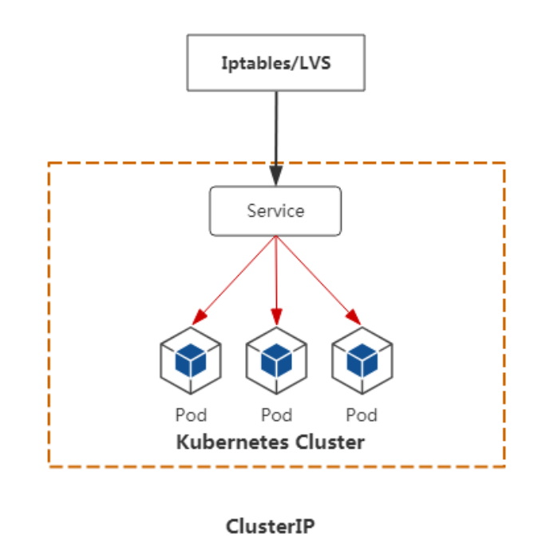
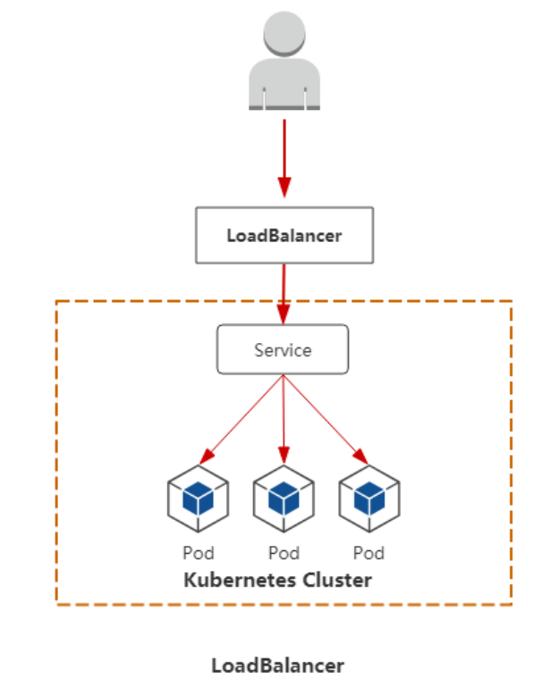

<center><h1>Kubernets service与外界通讯</h1></center>

## 1. service
&#160; &#160; &#160; &#160;service的存在就是为了与外界连通。

- 防止Pod失联（服务发现）
- 定义一组Pod的访问策略（负载均衡[基于iptables，ipvs]）
- 支持ClusterIP，NodePort以及LoadBalancer三种类型
- Service的底层实现主要有iptables和ipvs二种网络模式

!!! note "关系"
    ```python
    • 通过label-selector相关联
    • 通过Service实现Pod的负载均衡（ TCP/UDP 4层）

    Pod   Pod  Pod
      \    |    /    lales:
       \   |   /       app: nginx
        \  |  /      
         \ | /       selector:
          \|/          app:nginx
        Service
        
    是通过label标签去选择pod
    ```

## 2. service 类型
service一共有三种模型

<center></center>

<center></center>

<center></center>


## 3. service 代理模式

<center></center>

默认是iptables。也可以指定。

```
[root@k8s-node01 cfg]# cat kube-proxy

KUBE_PROXY_OPTS="--logtostderr=true \
--v=4 \
--hostname-override=192.168.186.141 \
--cluster-cidr=10.0.0.0/24 \
--proxy-mode=ipvs \
--masquerade-all=true \
--kubeconfig=/opt/kubernetes/cfg/kube-proxy.kubeconfig"

指定了是ipvs。

[root@k8s-node02 cfg]# cat kube-proxy

KUBE_PROXY_OPTS="--logtostderr=true \
--v=4 \
--hostname-override=192.168.186.142 \
--cluster-cidr=10.0.0.0/24 \
--proxy-mode=ipvs \
--masquerade-all=true \
--kubeconfig=/opt/kubernetes/cfg/kube-proxy.kubeconfig"
重启两机器上的kube-proxy
[root@k8s-node02 cfg]# systemctl restart kube-proxy
[root@k8s-node01 cfg]# ps axf|grep proxy
```

```
[root@k8s-node01 ~]# yum install ipvsadm
[root@k8s-node01 ~]# ipvsadm -L -n
IP Virtual Server version 1.2.1 (size=4096)
Prot LocalAddress:Port Scheduler Flags
  -> RemoteAddress:Port           Forward Weight ActiveConn InActConn
TCP  127.0.0.1:41583 rr
  -> 172.17.66.2:80               Masq    1      0          0         
  -> 172.17.66.4:80               Masq    1      0          0         
  -> 172.17.66.5:80               Masq    1      0          0         
TCP  172.17.66.1:30001 rr
  -> 172.17.8.5:8443              Masq    1      0          0         
TCP  172.17.66.1:41583 rr
  -> 172.17.66.2:80               Masq    1      0          0         
  -> 172.17.66.4:80               Masq    1      0          0         
  -> 172.17.66.5:80               Masq    1      0          0         
TCP  172.17.67.0:30001 rr
  -> 172.17.8.5:8443              Masq    1      0          0         
TCP  172.17.67.0:41583 rr
  -> 172.17.66.2:80               Masq    1      0          0         
  -> 172.17.66.4:80               Masq    1      0          0         
  -> 172.17.66.5:80               Masq    1      0          0         
TCP  192.168.186.141:30001 rr
  -> 172.17.8.5:8443              Masq    1      0          0         
TCP  192.168.186.141:41583 rr
  -> 172.17.66.2:80               Masq    1      0          0         
  -> 172.17.66.4:80               Masq    1      0          0         
  -> 172.17.66.5:80               Masq    1      0          0         
TCP  10.0.0.1:443 rr
  -> 192.168.186.139:6443         Masq    1      0          0         
  -> 192.168.186.140:6443         Masq    1      0          0         
TCP  10.0.0.17:443 rr
  -> 172.17.8.5:8443              Masq    1      0          0         
TCP  10.0.0.228:80 rr
  -> 172.17.66.2:80               Masq    1      0          0         
  -> 172.17.66.4:80               Masq    1      0          0         
  -> 172.17.66.5:80               Masq    1      0          0         
TCP  127.0.0.1:30001 rr
  -> 172.17.8.5:8443              Masq    1      0          0  
  
[root@k8s-master01 yml]# kubectl get svc
NAME            TYPE        CLUSTER-IP   EXTERNAL-IP   PORT(S)        AGE
kubernetes      ClusterIP   10.0.0.1     <none>        443/TCP        5d1h
nginx-service   NodePort    10.0.0.228   <none>        80:41583/TCP   24h
[root@k8s-node01 ~]# ip a|grep 228
    inet 10.0.0.228/32 brd 10.0.0.228 scope global kube-ipvs0
```

## 4. ipvs iptables对比
Iptables: 

- 灵活，功能强大
- 规则遍历匹配和更新，呈线性时延
- 可扩展性

IPVS：

- 工作在内核态，有更好的性能
- 调度算法丰富：rr，wrr，lc，wlc，ip hash...

> 推荐ipvs

## 5. DNS

DNS服务监视Kubernetes API，为每一个Service创建DNS记录用于域名解析。
```
https://github.com/kubernetes/kubernetes/tree/master/cluster/addons/dns/coredns
```


ClusterIP A记录格式：`<service-name>.<namespace-name>.svc.cluster.local`

```
示例：my-svc.my-namespace.svc.cluster.local
```


??? note "coredns.yaml"
    ```
    apiVersion: v1
    kind: ServiceAccount
    metadata:
      name: coredns
      namespace: kube-system
      labels:
          kubernetes.io/cluster-service: "true"
          addonmanager.kubernetes.io/mode: Reconcile
    ---
    apiVersion: rbac.authorization.k8s.io/v1
    kind: ClusterRole
    metadata:
      labels:
        kubernetes.io/bootstrapping: rbac-defaults
        addonmanager.kubernetes.io/mode: Reconcile
      name: system:coredns
    rules:
    - apiGroups:
      - ""
      resources:
      - endpoints
      - services
      - pods
      - namespaces
      verbs:
      - list
      - watch
    - apiGroups:
      - ""
      resources:
      - nodes
      verbs:
      - get
    ---
    apiVersion: rbac.authorization.k8s.io/v1
    kind: ClusterRoleBinding
    metadata:
      annotations:
        rbac.authorization.kubernetes.io/autoupdate: "true"
      labels:
        kubernetes.io/bootstrapping: rbac-defaults
        addonmanager.kubernetes.io/mode: EnsureExists
      name: system:coredns
    roleRef:
      apiGroup: rbac.authorization.k8s.io
      kind: ClusterRole
      name: system:coredns
    subjects:
    - kind: ServiceAccount
      name: coredns
      namespace: kube-system
    ---
    apiVersion: v1
    kind: ConfigMap
    metadata:
      name: coredns
      namespace: kube-system
      labels:
          addonmanager.kubernetes.io/mode: EnsureExists
    data:
      Corefile: |
        .:53 {
            errors
            health
            kubernetes cluster.local in-addr.arpa ip6.arpa {
                pods insecure
                upstream
                fallthrough in-addr.arpa ip6.arpa
            }
            prometheus :9153
            forward . /etc/resolv.conf
            cache 30
            loop
            reload
            loadbalance
        }
    ---
    apiVersion: apps/v1
    kind: Deployment
    metadata:
      name: coredns
      namespace: kube-system
      labels:
        k8s-app: kube-dns
        kubernetes.io/cluster-service: "true"
        addonmanager.kubernetes.io/mode: Reconcile
        kubernetes.io/name: "CoreDNS"
    spec:
      # replicas: not specified here:
      # 1. In order to make Addon Manager do not reconcile this replicas parameter.
      # 2. Default is 1.
      # 3. Will be tuned in real time if DNS horizontal auto-scaling is turned on.
      strategy:
        type: RollingUpdate
        rollingUpdate:
          maxUnavailable: 1
      selector:
        matchLabels:
          k8s-app: kube-dns
      template:
        metadata:
          labels:
            k8s-app: kube-dns
          annotations:
            seccomp.security.alpha.kubernetes.io/pod: 'docker/default'
        spec:
          priorityClassName: system-cluster-critical
          serviceAccountName: coredns
          tolerations:
            - key: "CriticalAddonsOnly"
              operator: "Exists"
          nodeSelector:
            beta.kubernetes.io/os: linux
          containers:
          - name: coredns
            image: coredns/coredns:1.3.1
            imagePullPolicy: IfNotPresent
            resources:
              limits:
                memory: 170Mi
              requests:
                cpu: 100m
                memory: 70Mi
            args: [ "-conf", "/etc/coredns/Corefile" ]
            volumeMounts:
            - name: config-volume
              mountPath: /etc/coredns
              readOnly: true
            ports:
            - containerPort: 53
              name: dns
              protocol: UDP
            - containerPort: 53
              name: dns-tcp
              protocol: TCP
            - containerPort: 9153
              name: metrics
              protocol: TCP
            livenessProbe:
              httpGet:
                path: /health
                port: 8080
                scheme: HTTP
              initialDelaySeconds: 60
              timeoutSeconds: 5
              successThreshold: 1
              failureThreshold: 5
            readinessProbe:
              httpGet:
                path: /health
                port: 8080
                scheme: HTTP
            securityContext:
              allowPrivilegeEscalation: false
              capabilities:
                add:
                - NET_BIND_SERVICE
                drop:
                - all
              readOnlyRootFilesystem: true
          dnsPolicy: Default
          volumes:
            - name: config-volume
              configMap:
                name: coredns
                items:
                - key: Corefile
                  path: Corefile
    ---
    apiVersion: v1
    kind: Service
    metadata:
      name: kube-dns
      namespace: kube-system
      annotations:
        prometheus.io/port: "9153"
        prometheus.io/scrape: "true"
      labels:
        k8s-app: kube-dns
        kubernetes.io/cluster-service: "true"
        addonmanager.kubernetes.io/mode: Reconcile
        kubernetes.io/name: "CoreDNS"
    spec:
      selector:
        k8s-app: kube-dns
      clusterIP: 10.0.0.2 
      ports:
      - name: dns
        port: 53
        protocol: UDP
      - name: dns-tcp
        port: 53
        protocol: TCP
      - name: metrics
        port: 9153
        protocol: TCP
    ```

!!! note "coredns.yaml修改注意"
    ```
    1. coredns.yaml是github官网下载地址 https://github.com/kubernetes/kubernetes/blob/master/cluster/addons/dns/coredns/coredns.yaml.base
    
    2. dns 地址
        [root@k8s-node01 cfg]# cat /opt/kubernetes/cfg/kubelet.config 
        
        kind: KubeletConfiguration
        apiVersion: kubelet.config.k8s.io/v1beta1
        address: 192.168.186.141
        port: 10250
        readOnlyPort: 10255
        cgroupDriver: cgroupfs
        clusterDNS:
        - 10.0.0.2     # < - pod中会优先使用这个cluster ip地址解析访问的域名，后面会有例子
        clusterDomain: cluster.local.
        failSwapOn: false
        authentication:
          anonymous:
            enabled: true
    
    3. 需要修改三个地址:
        1.  67行，kubernetes __PILLAR__DNS__DOMAIN__ in-addr.arpa ip6.arpa 改为 kubernetes cluster.local in-addr.arpa ip6.arpa   
            cluster.local 是cat /opt/kubernetes/cfg/kubelet.config 中的clusterDomain去掉后面最后一个点
        2. 118行，image: k8s.gcr.io/coredns:1.3.1 改为image: coredns/coredns:1.3.1，因为那地址我们访问不了
        3. 188行， clusterIP: __PILLAR__DNS__SERVER__ 改为clusterIP: 10.0.0.2   # <--- 之前配置好的
            [root@k8s-node01 cfg]# cat /opt/kubernetes/cfg/kubelet.config |grep -A1 clusterDNS
            clusterDNS:
            - 10.0.0.2 
    ```

```
[root@k8s-master01 demo]# kubectl apply -f coredns.yaml 
serviceaccount/coredns created
clusterrole.rbac.authorization.k8s.io/system:coredns created
clusterrolebinding.rbac.authorization.k8s.io/system:coredns created
configmap/coredns created
deployment.apps/coredns created
service/kube-dns created

[root@k8s-master01 demo]# kubectl get ns
NAME          STATUS   AGE
default       Active   5d1h
kube-public   Active   5d1h
kube-system   Active   5d1h

[root@k8s-master01 demo]# kubectl get pods -n kube-system 
NAME                                   READY   STATUS    RESTARTS   AGE
coredns-69b995478c-9j5cs               1/1     Running   0          2m37s
kubernetes-dashboard-bd68f6c55-znhwx   1/1     Running   0          26h
```

```
[root@k8s-master01 demo]# kubectl get pods
NAME                                READY   STATUS             RESTARTS   AGE
agent-rxgp9                         1/1     Running            0          6h
agent-twh7c                         1/1     Running            0          6h
frontend                            1/2     CrashLoopBackOff   128        22h
hello-1556011920-sfr28              0/1     Completed          0          3m10s
hello-1556011980-bbsv5              0/1     Completed          0          2m10s
hello-1556012040-r2k5v              0/1     Completed          0          69s
hello-1556012100-nrmlf              0/1     Completed          0          9s
liveness-exec                       0/1     CrashLoopBackOff   162        21h
mypod                               1/1     Running            0          127m
mypod2                              1/1     Running            0          119m
mypod3                              0/1     Completed          0          99m
mypod4                              0/1     Completed          0          99m
nginx-deployment-5997b94b5c-79rrk   1/1     Running            0          21h
nginx-deployment-5997b94b5c-cs28z   1/1     Running            0          21h
nginx-deployment-5997b94b5c-zc7pp   1/1     Running            0          21h
pi-4bz86                            0/1     Completed          0          172m
[root@k8s-master01 demo]# kubectl exec -it nginx-deployment-5997b94b5c-79rrk  bash
root@nginx-deployment-5997b94b5c-79rrk:/# apt-get update -y 
root@nginx-deployment-5997b94b5c-79rrk:/# apt-get install iputils-ping

[root@k8s-master01 ~]# kubectl get svc
NAME            TYPE        CLUSTER-IP   EXTERNAL-IP   PORT(S)        AGE
kubernetes      ClusterIP   10.0.0.1     <none>        443/TCP        5d1h
nginx-service   NodePort    10.0.0.228   <none>        80:41583/TCP   24h

root@nginx-deployment-5997b94b5c-79rrk:/# ping nginx-service
PING nginx-service.default.svc.cluster.local (10.0.0.228) 56(84) bytes of data.
64 bytes from nginx-service.default.svc.cluster.local (10.0.0.228): icmp_seq=1 ttl=64 time=0.265 ms
64 bytes from nginx-service.default.svc.cluster.local (10.0.0.228): icmp_seq=2 ttl=64 time=0.098 ms
^C
--- nginx-service.default.svc.cluster.local ping statistics ---
2 packets transmitted, 2 received, 0% packet loss, time 1001ms
rtt min/avg/max/mdev = 0.098/0.181/0.265/0.084 ms

可见DNS是解析的。
```

