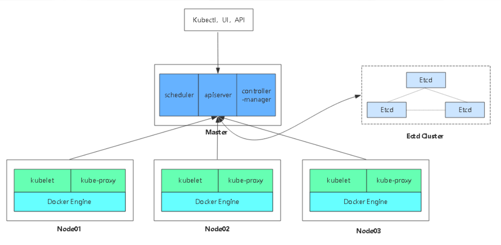

<center><h1>Kubernetes之etcd部署</h1></center>


## 1. 准备环境


ip | 操作系统|角色|安装软件|主机名
---|---|---|---|---
192.168.186.139|centos7.6_x64|master1|docker，etcd|k8s-master01
192.168.186.141|centos7.6_x64|node1|docker,etcd|k8s-node01
192.168.186.142|centos7.6_x64|node2|docker,etcd|k8s-node02

> 本教程以安装Centos7 mini版本为系统镜像安装


## 2. 部署方式
### 2.1 minikube
&#160; &#160; &#160; &#160;Minikube是一个工具，可以在本地快速运行一个单点的Kubernetes，仅用于尝试Kubernetes或日常开发的用户使用。[部署地址](https://kubernetes.io/docs/setup/minikube/)

```
https://kubernetes.io/docs/setup/minikube/
```


### 2.2 kubeadm
&#160; &#160; &#160; &#160;Kubeadm也是一个工具，提供kubeadm init和kubeadm join，用于快速部署Kubernetes集群。[部署地址]https://kubernetes.io/docs/reference/setup-tools/kubeadm/kubeadm/)

```
https://kubernetes.io/docs/reference/setup-tools/kubeadm/kubeadm/
```


### 2.3 binary
&#160; &#160; &#160; &#160; ==推荐==，从官方下载发行版的二进制包，手动部署每个组件，组成Kubernetes集群。[下载地址](https://github.com/kubernetes/kubernetes/releases)

```
https://github.com/kubernetes/kubernetes/releases
```

## 3. 集群规划




## 4. 自签ssl证书

组件| 使用证书
---|---
etcd |ca.pem，server.pem，server-key.pem
flannel| ca.pem，server.pem，server-key.pem
kube-apiserver| ca.pem，server.pem，server-key.pem
kubelet |ca.pem，ca-key.pem
kube-proxy| ca.pem，kube-proxy.pem，kube-proxy-key.pem
kubectl |ca.pem，admin.pem，admin-key.pem

### 4.1 安装cfssl

```
curl -L https://pkg.cfssl.org/R1.2/cfssl_linux-amd64 -o /usr/local/bin/cfssl
curl -L https://pkg.cfssl.org/R1.2/cfssljson_linux-amd64 -o /usr/local/bin/cfssljson
curl -L https://pkg.cfssl.org/R1.2/cfssl-certinfo_linux-amd64 -o /usr/local/bin/cfssl-certinfo
chmod +x /usr/local/bin/cfssl /usr/local/bin/cfssljson /usr/local/bin/cfssl-certinfo
```

### 4.2 etcd证书

```
cat > ca-config.json <<EOF
{
  "signing": {
    "default": {
      "expiry": "87600h"
    },
    "profiles": {
      "www": {
         "expiry": "87600h",
         "usages": [
            "signing",
            "key encipherment",
            "server auth",
            "client auth"
        ]
      }
    }
  }
}
EOF

cat > ca-csr.json <<EOF
{
    "CN": "etcd CA",
    "key": {
        "algo": "rsa",
        "size": 2048
    },
    "names": [
        {
            "C": "CN",
            "L": "Beijing",
            "ST": "Beijing"
        }
    ]
}
EOF
cfssl gencert -initca ca-csr.json | cfssljson -bare ca -

cat > server-csr.json <<EOF
{
    "CN": "etcd",
    "hosts": [
    "192.168.186.139",
    "192.168.186.140",
    "192.168.186.141"
    ],
    "key": {
        "algo": "rsa",
        "size": 2048
    },
    "names": [
        {
            "C": "CN",
            "L": "BeiJing",
            "ST": "BeiJing"
        }
    ]
}
EOF
cfssl gencert -ca=ca.pem -ca-key=ca-key.pem -config=ca-config.json -profile=www server-csr.json | cfssljson -bare server
```

>其中192.168.186.139，192.168.186.140，192.168.186.141是etcd三台机器

??? note "ETCD CA证书"
    ```
    [root@k8s-master01 k8s-cert]# cat > ca-config.json <<EOF
    > {
    >   "signing": {
    >     "default": {
    >       "expiry": "87600h"
    >     },
    >     "profiles": {
    >       "www": {
    >          "expiry": "87600h",
    >          "usages": [
    >             "signing",
    >             "key encipherment",
    >             "server auth",
    >             "client auth"
    >         ]
    >       }
    >     }
    >   }
    > }
    > EOF
          "ST": "Beijing"
            }
        ]
    }
    EOF
    [root@k8s-master01 k8s-cert]# 
    [root@k8s-master01 k8s-cert]# cat > ca-csr.json <<EOF
    > {
    >     "CN": "etcd CA",
    >     "key": {
    >         "algo": "rsa",
    >         "size": 2048
    >     },
    >     "names": [
    >         {
    >             "C": "CN",
    >             "L": "Beijing",
    >             "ST": "Beijing"
    >         }
    >     ]
    > }
    > EOF
    [root@k8s-master01 k8s-cert]# ls
    ca-config.json  ca-csr.json  cfssl.sh  etcd-cert.sh
    
    [root@k8s-master01 k8s-cert]# cfssl gencert -initca ca-csr.json | cfssljson -bare ca -
    2019/04/17 17:35:51 [INFO] generating a new CA key and certificate from CSR
    2019/04/17 17:35:51 [INFO] generate received request
    2019/04/17 17:35:51 [INFO] received CSR
    2019/04/17 17:35:51 [INFO] generating key: rsa-2048
    2019/04/17 17:35:51 [INFO] encoded CSR
    2019/04/17 17:35:51 [INFO] signed certificate with serial number 19362195409262761163364083373669733716717649253
    
    [root@k8s-master01 k8s-cert]# ls
    ca-config.json  ca.csr  ca-csr.json  ca-key.pem  ca.pem  cfssl.sh  etcd-cert.sh

    [root@k8s-master01 k8s-cert]# cat > server-csr.json <<EOF
    > {
    >     "CN": "etcd",
    >     "hosts": [
    >     "192.168.186.139",
    >     "192.168.186.140",
    >     "192.168.186.141"
    >     ],
    >     "key": {
    >         "algo": "rsa",
    >         "size": 2048
    >     },
    >     "names": [
    >         {
    >             "C": "CN",
    >             "L": "BeiJing",
    >             "ST": "BeiJing"
    >         }
    >     ]
    > }
    > EOF
    [root@k8s-master01 k8s-cert]# ll
    total 32
    -rw-r--r-- 1 root root  287 Apr 17 17:34 ca-config.json
    -rw-r--r-- 1 root root  956 Apr 17 17:35 ca.csr
    -rw-r--r-- 1 root root  209 Apr 17 17:34 ca-csr.json
    -rw------- 1 root root 1679 Apr 17 17:35 ca-key.pem
    -rw-r--r-- 1 root root 1265 Apr 17 17:35 ca.pem
    -rw-r--r-- 1 root root  342 Oct 20 23:08 cfssl.sh
    -rw-r--r-- 1 root root 1088 Aug 27  2018 etcd-cert.sh
    -rw-r--r-- 1 root root  296 Apr 17 17:44 server-csr.json

    [root@k8s-master01 k8s-cert]# cfssl gencert -ca=ca.pem -ca-key=ca-key.pem -config=ca-config.json -profile=www server-csr.json | cf
    ssljson -bare server2019/04/17 17:45:55 [INFO] generate received request
    2019/04/17 17:45:55 [INFO] received CSR
    2019/04/17 17:45:55 [INFO] generating key: rsa-2048
    2019/04/17 17:45:55 [INFO] encoded CSR
    2019/04/17 17:45:55 [INFO] signed certificate with serial number 701496650760603801976943167457047477178197782049
    2019/04/17 17:45:55 [WARNING] This certificate lacks a "hosts" field. This makes it unsuitable for
    websites. For more information see the Baseline Requirements for the Issuance and Management
    of Publicly-Trusted Certificates, v.1.1.6, from the CA/Browser Forum (https://cabforum.org);
    specifically, section 10.2.3 ("Information Requirements").
    
    [root@k8s-master01 k8s-cert]# ll
    total 44
    -rw-r--r-- 1 root root  287 Apr 17 17:34 ca-config.json
    -rw-r--r-- 1 root root  956 Apr 17 17:35 ca.csr
    -rw-r--r-- 1 root root  209 Apr 17 17:34 ca-csr.json
    -rw------- 1 root root 1679 Apr 17 17:35 ca-key.pem
    -rw-r--r-- 1 root root 1265 Apr 17 17:35 ca.pem
    -rw-r--r-- 1 root root  342 Oct 20 23:08 cfssl.sh
    -rw-r--r-- 1 root root 1088 Aug 27  2018 etcd-cert.sh
    -rw-r--r-- 1 root root 1013 Apr 17 17:45 server.csr
    -rw-r--r-- 1 root root  296 Apr 17 17:44 server-csr.json
    -rw------- 1 root root 1675 Apr 17 17:45 server-key.pem
    -rw-r--r-- 1 root root 1338 Apr 17 17:45 server.pem
    ```

## 5. 单master部署
### 5.1 基础准备

```
1. 关闭selinux
2. 关闭防火墙
3. 修改主机名
```

??? note "master机器上etcd配置文件和启动文件"
    ```
    [root@k8s-master01 cfg]# pwd
    /opt/etcd/cfg
    [root@k8s-master01 cfg]# cat etcd 
    #[Member]
    ETCD_NAME="etcd01"
    ETCD_DATA_DIR="/var/lib/etcd/default.etcd"
    ETCD_LISTEN_PEER_URLS="https://192.168.186.139:2380"
    ETCD_LISTEN_CLIENT_URLS="https://192.168.186.139:2379"
    
    #[Clustering]
    ETCD_INITIAL_ADVERTISE_PEER_URLS="https://192.168.186.139:2380"
    ETCD_ADVERTISE_CLIENT_URLS="https://192.168.186.139:2379"
    ETCD_INITIAL_CLUSTER="etcd01=https://192.168.186.139:2380,etcd02=https://192.168.186.141:2380,etcd03=https://192.168.186.142:2380"
    ETCD_INITIAL_CLUSTER_TOKEN="etcd-cluster"
    ETCD_INITIAL_CLUSTER_STATE="new"
    
    [root@k8s-master01 cfg]# cat /usr/lib/systemd/system/etcd.service
    [Unit]
    Description=Etcd Server
    After=network.target
    After=network-online.target
    Wants=network-online.target
    
    [Service]
    Type=notify
    EnvironmentFile=/opt/etcd/cfg/etcd
    ExecStart=/opt/etcd/bin/etcd --name=${ETCD_NAME} --data-dir=${ETCD_DATA_DIR} --listen-peer-urls=${ETCD_LISTEN_PEER_URLS} --listen-
    client-urls=${ETCD_LISTEN_CLIENT_URLS},http://127.0.0.1:2379 --advertise-client-urls=${ETCD_ADVERTISE_CLIENT_URLS} --initial-advertise-peer-urls=${ETCD_INITIAL_ADVERTISE_PEER_URLS} --initial-cluster=${ETCD_INITIAL_CLUSTER} --initial-cluster-token=${ETCD_INITIAL_CLUSTER_TOKEN} --initial-cluster-state=new --cert-file=/opt/etcd/ssl/server.pem --key-file=/opt/etcd/ssl/server-key.pem --peer-cert-file=/opt/etcd/ssl/server.pem --peer-key-file=/opt/etcd/ssl/server-key.pem --trusted-ca-file=/opt/etcd/ssl/ca.pem --peer-trusted-ca-file=/opt/etcd/ssl/ca.pemRestart=on-failure
    LimitNOFILE=65536
    
    [Install]
    WantedBy=multi-user.target
    ```

??? note "node01机器上etcd配置文件和启动文件"
    ```
    [root@k8s-node01 cfg]# cat /opt/etcd/cfg/etcd 
    #[Member]
    ETCD_NAME="etcd02"
    ETCD_DATA_DIR="/var/lib/etcd/default.etcd"
    ETCD_LISTEN_PEER_URLS="https://192.168.186.141:2380"
    ETCD_LISTEN_CLIENT_URLS="https://192.168.186.141:2379"
    
    #[Clustering]
    ETCD_INITIAL_ADVERTISE_PEER_URLS="https://192.168.186.141:2380"
    ETCD_ADVERTISE_CLIENT_URLS="https://192.168.186.141:2379"
    ETCD_INITIAL_CLUSTER="etcd01=https://192.168.186.139:2380,etcd02=https://192.168.186.141:2380,etcd03=https://192.168.186.142:2380"
    ETCD_INITIAL_CLUSTER_TOKEN="etcd-cluster"
    ETCD_INITIAL_CLUSTER_STATE="new"
    
    [root@k8s-node01 cfg]# cat /usr/lib/systemd/system/etcd.service
    [Unit]
    Description=Etcd Server
    After=network.target
    After=network-online.target
    Wants=network-online.target
    
    [Service]
    Type=notify
    EnvironmentFile=/opt/etcd/cfg/etcd
    ExecStart=/opt/etcd/bin/etcd --name=${ETCD_NAME} --data-dir=${ETCD_DATA_DIR} --listen-peer-urls=${ETCD_LISTEN_PEER_URLS} --listen-
    client-urls=${ETCD_LISTEN_CLIENT_URLS},http://127.0.0.1:2379 --advertise-client-urls=${ETCD_ADVERTISE_CLIENT_URLS} --initial-advertise-peer-urls=${ETCD_INITIAL_ADVERTISE_PEER_URLS} --initial-cluster=${ETCD_INITIAL_CLUSTER} --initial-cluster-token=${ETCD_INITIAL_CLUSTER_TOKEN} --initial-cluster-state=new --cert-file=/opt/etcd/ssl/server.pem --key-file=/opt/etcd/ssl/server-key.pem --peer-cert-file=/opt/etcd/ssl/server.pem --peer-key-file=/opt/etcd/ssl/server-key.pem --trusted-ca-file=/opt/etcd/ssl/ca.pem --peer-trusted-ca-file=/opt/etcd/ssl/ca.pemRestart=on-failure
    LimitNOFILE=65536
    
    [Install]
    WantedBy=multi-user.target
    ```

??? note "node02机器上etcd配置文件和启动文件"
    ```
    [root@k8s-node02 cfg]# cat /opt/etcd/cfg/etcd 
    #[Member]
    ETCD_NAME="etcd03"
    ETCD_DATA_DIR="/var/lib/etcd/default.etcd"
    ETCD_LISTEN_PEER_URLS="https://192.168.186.142:2380"
    ETCD_LISTEN_CLIENT_URLS="https://192.168.186.142:2379"
    
    #[Clustering]
    ETCD_INITIAL_ADVERTISE_PEER_URLS="https://192.168.186.142:2380"
    ETCD_ADVERTISE_CLIENT_URLS="https://192.168.186.142:2379"
    ETCD_INITIAL_CLUSTER="etcd01=https://192.168.186.139:2380,etcd02=https://192.168.186.141:2380,etcd03=https://192.168.186.142:2380"
    ETCD_INITIAL_CLUSTER_TOKEN="etcd-cluster"
    ETCD_INITIAL_CLUSTER_STATE="new"
    
    [root@k8s-node02 cfg]# cat /usr/lib/systemd/system/etcd.service
    [Unit]
    Description=Etcd Server
    After=network.target
    After=network-online.target
    Wants=network-online.target
    
    [Service]
    Type=notify
    EnvironmentFile=/opt/etcd/cfg/etcd
    ExecStart=/opt/etcd/bin/etcd --name=${ETCD_NAME} --data-dir=${ETCD_DATA_DIR} --listen-peer-urls=${ETCD_LISTEN_PEER_URLS} --listen-
    client-urls=${ETCD_LISTEN_CLIENT_URLS},http://127.0.0.1:2379 --advertise-client-urls=${ETCD_ADVERTISE_CLIENT_URLS} --initial-advertise-peer-urls=${ETCD_INITIAL_ADVERTISE_PEER_URLS} --initial-cluster=${ETCD_INITIAL_CLUSTER} --initial-cluster-token=${ETCD_INITIAL_CLUSTER_TOKEN} --initial-cluster-state=new --cert-file=/opt/etcd/ssl/server.pem --key-file=/opt/etcd/ssl/server-key.pem --peer-cert-file=/opt/etcd/ssl/server.pem --peer-key-file=/opt/etcd/ssl/server-key.pem --trusted-ca-file=/opt/etcd/ssl/ca.pem --peer-trusted-ca-file=/opt/etcd/ssl/ca.pemRestart=on-failure
    LimitNOFILE=65536
    
    [Install]
    WantedBy=multi-user.target
    ```


### 5.2 etcd部署
#### 5.2.1 下载地址
二进制包下载 [地址](https://github.com/etcd-io/etcd/releases)
```
https://github.com/etcd-io/etcd/releases
```

#### 5.2.2 详细部署
```
[root@k8s-master01 ~]# mkdir soft
[root@k8s-master01 ~]# cd soft/
[root@k8s-master01 soft]# rz -E
rz waiting to receive.
[root@k8s-master01 soft]# ls
etcd-v3.3.10-linux-amd64.tar.gz
[root@k8s-master01 soft]# tar xf etcd-v3.3.10-linux-amd64.tar.gz 
[root@k8s-master01 soft]# cd etcd-v3.3.10-linux-amd64/
[root@k8s-master01 etcd-v3.3.10-linux-amd64]# mkdir -p /opt/etcd/{ssl,cfg,bin} -p 
[root@k8s-master01 etcd-v3.3.10-linux-amd64]# mv etcd etcdctl /opt/etcd/bin/
[root@k8s-master01 etcd-v3.3.10-linux-amd64]# ls /opt/etcd/bin/
etcd  etcdctl  <---- etcd 启动etcd服务的，etcdctl管理etcd的客户端
[root@k8s-master01 k8s]# ls
etcd-cert  etcd.sh  k8s-cert
[root@k8s-master01 k8s]# chmod +x etcd.sh 
[root@k8s-master01 k8s-cert]# ls
ca-config.json  ca-csr.json  ca.pem    etcd-cert.sh  server-csr.json  server.pem
ca.csr          ca-key.pem   cfssl.sh  server.csr    server-key.pem
[root@k8s-master01 k8s-cert]# pwd
/root/k8s/k8s-cert
[root@k8s-master01 k8s-cert]# cp {ca,server-key,server}.pem /opt/etcd/ssl/
[root@k8s-master01 k8s-cert]# ls /opt/etcd/ssl/
ca.pem  server-key.pem  server.pem

[root@k8s-master01 k8s]# ./etcd.sh etcd01 192.168.186.139 etcd02=https://192.168.186.140:2380,etcd03=https://192.168.186.141:2380
Created symlink from /etc/systemd/system/multi-user.target.wants/etcd.service to /usr/lib/systemd/system/etcd.service.
此时会卡着，因为等待其他成员
 
拷贝到其他机器
[root@k8s-master01 ~]# scp -r /opt/etcd/ root@192.168.186.141:/opt/
The authenticity of host '192.168.186.141 (192.168.186.141)' can't be established.
ECDSA key fingerprint is SHA256:liHoRWT1+1BGJquXvy2VzVd7bU1+Si/RNb7vIyFWpd8.
ECDSA key fingerprint is MD5:5a:81:8f:74:20:b6:89:e6:a9:14:9f:58:60:e9:7d:53.
Are you sure you want to continue connecting (yes/no)? yes
Warning: Permanently added '192.168.186.141' (ECDSA) to the list of known hosts.
root@192.168.186.141's password: 
ca.pem                                                                                          100% 1265     1.4MB/s   00:00    
server-key.pem                                                                                  100% 1675     1.2MB/s   00:00    
server.pem                                                                                      100% 1338     1.9MB/s   00:00    
etcd                                                                                            100%  523   256.9KB/s   00:00    
etcd                                                                                            100%   18MB  80.3MB/s   00:00    
etcdctl                                                                                         100%   15MB  77.4MB/s   00:00    
[root@k8s-master01 ~]# scp -r /opt/etcd/ root@192.168.186.142:/opt/
The authenticity of host '192.168.186.142 (192.168.186.142)' can't be established.
ECDSA key fingerprint is SHA256:smdGSwwemIA+SHBzs0Lrnjg8ugPzneHChLWhl0y0m38.
ECDSA key fingerprint is MD5:f0:66:dc:78:d3:98:77:97:2c:be:69:58:22:73:a6:cc.
Are you sure you want to continue connecting (yes/no)? yes
Warning: Permanently added '192.168.186.142' (ECDSA) to the list of known hosts.
root@192.168.186.142's password: 
ca.pem                                                                                          100% 1265     1.2MB/s   00:00    
server-key.pem                                                                                  100% 1675     1.1MB/s   00:00    
server.pem                                                                                      100% 1338   770.6KB/s   00:00    
etcd                                                                                            100%  523   278.0KB/s   00:00    
etcd                                                                                            100%   18MB  71.6MB/s   00:00    
etcdctl   

[root@k8s-master01 ~]# scp /usr/lib/systemd/system/etcd.service root@192.168.186.141:/usr/lib/systemd/system/
root@192.168.186.141's password: 
etcd.service                                                                                    100%  923     1.3MB/s   00:00    
[root@k8s-master01 ~]# scp /usr/lib/systemd/system/etcd.service root@192.168.186.142:/usr/lib/systemd/system/
root@192.168.186.142's password: 
etcd.service                                                                                    100%  923   818.2KB/s   00:00  
```
> 拷贝配置文件和启动文件到其他机器，同时在其他机器上修改配置，具体配置完的配置文件详见5.1准备章节的那三个配置文件

#### 5.2.3 启动所有机器etcd

```
[root@k8s-master01 ssl]# systemctl start etcd
[root@k8s-node01 ssl]# systemctl start etcd
[root@k8s-node02 cfg]# systemctl start etcd
```


#### 5.2.4 查看集群状态

```
/opt/etcd/bin/etcdctl \
--ca-file=/opt/etcd/ssl/ca.pem \
--cert-file=/opt/etcd/ssl/server.pem \
--key-file=/opt/etcd/ssl/server-key.pem \
--endpoints="https://192.168.186.139:2379,https://192.168.186.141:2379,https://192.168.186.142:2379" \
cluster-health
```

??? note "操作"
    ```
    [root@k8s-master01 ssl]# /opt/etcd/bin/etcdctl \
    > --ca-file=/opt/etcd/ssl/ca.pem \
    > --cert-file=/opt/etcd/ssl/server.pem \
    > --key-file=/opt/etcd/ssl/server-key.pem \
    > --endpoints="https://192.168.186.139:2379,https://192.168.186.141:2379,https://192.168.186.142:2379" \
    > cluster-health
    member b4802607144fc88c is healthy: got healthy result from https://192.168.186.139:2379
    member d6d33d0b4d38dddf is healthy: got healthy result from https://192.168.186.142:2379
    member ecb4d60ee7b08012 is healthy: got healthy result from https://192.168.186.141:2379
    cluster is healthy
    
    [root@k8s-node01 cfg]# /opt/etcd/bin/etcdctl \
    > --ca-file=/opt/etcd/ssl/ca.pem \
    > --cert-file=/opt/etcd/ssl/server.pem \
    > --key-file=/opt/etcd/ssl/server-key.pem \
    > --endpoints="https://192.168.186.139:2379,https://192.168.186.141:2379,https://192.168.186.142:2379" \
    > cluster-health
    member b4802607144fc88c is healthy: got healthy result from https://192.168.186.139:2379
    member d6d33d0b4d38dddf is healthy: got healthy result from https://192.168.186.142:2379
    member ecb4d60ee7b08012 is healthy: got healthy result from https://192.168.186.141:2379
    cluster is healthy
    
    [root@k8s-node02 cfg]# /opt/etcd/bin/etcdctl \
    > --ca-file=/opt/etcd/ssl/ca.pem \
    > --cert-file=/opt/etcd/ssl/server.pem \
    > --key-file=/opt/etcd/ssl/server-key.pem \
    > --endpoints="https://192.168.186.139:2379,https://192.168.186.141:2379,https://192.168.186.142:2379" \
    > cluster-health
    member b4802607144fc88c is healthy: got healthy result from https://192.168.186.139:2379
    member d6d33d0b4d38dddf is healthy: got healthy result from https://192.168.186.142:2379
    member ecb4d60ee7b08012 is healthy: got healthy result from https://192.168.186.141:2379
    cluster is healthy
    
    以上说明etcd机器OK
    ```


### 5.3 常见问题

- etcd启动不起来

??? note "错误1"
    ```
    因为etcd之间https通讯是基于证书的。我证书中的IP地址有错误。
    ```

- etcd启动后不加入集群

??? note "错误2"
    ```
    现象: 
    Apr 18 10:34:45 k8s-master01 etcd: request cluster ID mismatch (got cf138cda9790f1d0 want 8732ef518b18f052)
    
    解决方法：
    此时etcd节点都已经启动，但是无法连接，发现有request cluster ID mismatch报错。找到etcd数据存储目录
    
    [root@k8s-master01 ssl]# grep -i ETCD_DATA_DIR /opt/etcd/cfg/etcd 
    ETCD_DATA_DIR="/var/lib/etcd/default.etcd"
    
    删除各节点/var/lib/etcd/default.etcd，重启etcd即可解决。
    由于删除的是数据存储目录，不是新建etcd集群，或者有重要数据的不可直接删除。
    ```

> 可以通过 journalctl -xefu etcd来详细排查问题


??? note "排查思路"
    ```python
    部署常见问题，排除思路
    查看日志报错信息方法，如下：
    systemctl status kubelet
    systemctl restart kubelet && journalctl -xefu kubelet
    systemctl restart kube-apiserver.service && journalctl -xefu kube-apiserver
    journalctl -u kubelet
    tail –f /var/log/message
    或直接将应用的日志输出出来。
    
    排查思路，如下：
    1. iptables防火墙、Selinux问题。
    2. 时间是否同步。
    3. 二进制文件是否存在
    4. 配置文件没修改完或者多个空格？
    5. 目录是否存在
    6. 证书是否存在,且是否正确[初始化的时候需要指定三台etcd机器，我就搞错了，第一次错误，证书问题搞了好久]
    ```
    
- 新机器加入etc集群

```
https://github.com/k8sp/sextant/issues/333
```

