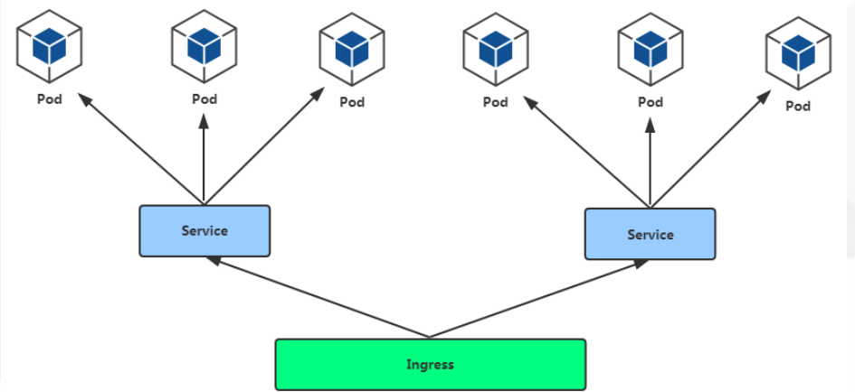
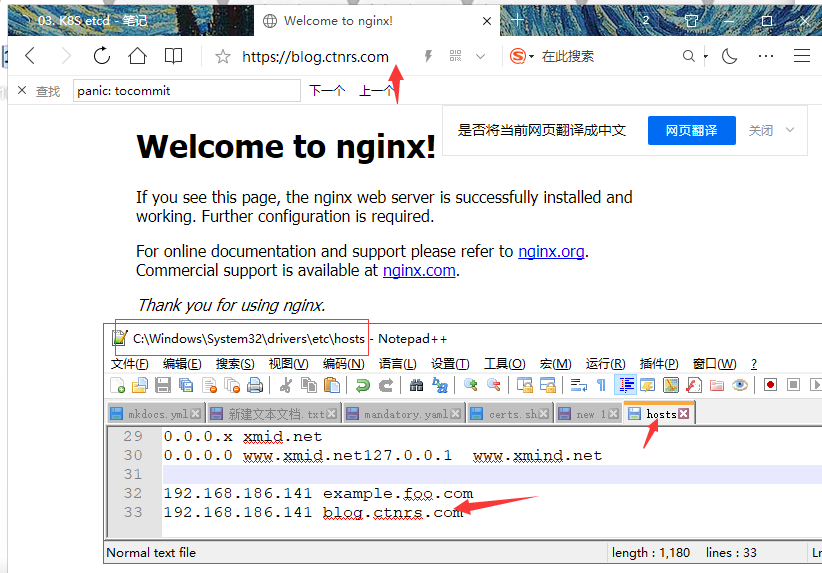
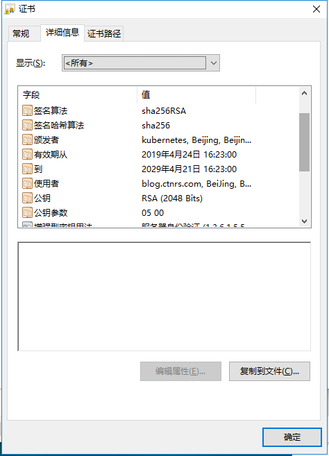

<center><h1>Kubernets Ingress</h1></center>


## 1. 介绍
&#160; &#160; &#160; &#160;Ingress是个什么鬼，网上资料很多（推荐官方。简单来讲，就是一个负载均衡的玩意，其主要用来解决使用NodePort暴露Service的端口时Node IP会漂移的问题。同时，若大量使用NodePort暴露主机端口，管理会非常混乱。

## 2. Pod与Ingress的关系

- 通过label-selector相关联
- 通过Ingress Controller实现Pod的负载均衡
    - 支持TCP/UDP 4层和HTTP 7层

```
https://kubernetes.io/docs/concepts/services-networking/ingress/
```

<center></center>

<center></center>

[部署文档](https://github.com/kubernetes/ingress-nginx/blob/master/docs/deploy/index.md)

```
https://github.com/kubernetes/ingress-nginx/blob/master/docs/deploy/index.md
```

??? note "注意事项"
    ```python
    • 镜像地址修改成国内的：lizhenliang/nginx-ingress-controller:0.20.0 
    • 使用宿主机网络：hostNetwork: true
    ```


```
[root@k8s-master01 demo]# cd /root/k8s/demo
[root@k8s-master01 demo]# wget https://raw.githubusercontent.com/kubernetes/ingress-nginx/master/deploy/mandatory.yaml
--2019-04-24 15:39:25--  https://raw.githubusercontent.com/kubernetes/ingress-nginx/master/deploy/mandatory.yaml
Resolving raw.githubusercontent.com (raw.githubusercontent.com)... 151.101.228.133
Connecting to raw.githubusercontent.com (raw.githubusercontent.com)|151.101.228.133|:443... connected.
HTTP request sent, awaiting response... 200 OK
Length: 5976 (5.8K) [text/plain]
Saving to: ‘mandatory.yaml’

100%[======================================================================================================================================>] 5,976       --.-K/s   in 0s      

2019-04-24 15:39:30 (84.4 MB/s) - ‘mandatory.yaml’ saved [5976/5976]

```

??? note "mandatory.yaml"
    ```
    apiVersion: v1
    kind: Namespace
    metadata:
      name: ingress-nginx
      labels:
        app.kubernetes.io/name: ingress-nginx
        app.kubernetes.io/part-of: ingress-nginx
    
    ---
    
    kind: ConfigMap
    apiVersion: v1
    metadata:
      name: nginx-configuration
      namespace: ingress-nginx
      labels:
        app.kubernetes.io/name: ingress-nginx
        app.kubernetes.io/part-of: ingress-nginx
    
    ---
    kind: ConfigMap
    apiVersion: v1
    metadata:
      name: tcp-services
      namespace: ingress-nginx
      labels:
        app.kubernetes.io/name: ingress-nginx
        app.kubernetes.io/part-of: ingress-nginx
    
    ---
    kind: ConfigMap
    apiVersion: v1
    metadata:
      name: udp-services
      namespace: ingress-nginx
      labels:
        app.kubernetes.io/name: ingress-nginx
        app.kubernetes.io/part-of: ingress-nginx
    
    ---
    apiVersion: v1
    kind: ServiceAccount
    metadata:
      name: nginx-ingress-serviceaccount
      namespace: ingress-nginx
      labels:
        app.kubernetes.io/name: ingress-nginx
        app.kubernetes.io/part-of: ingress-nginx
    
    ---
    apiVersion: rbac.authorization.k8s.io/v1beta1
    kind: ClusterRole
    metadata:
      name: nginx-ingress-clusterrole
      labels:
        app.kubernetes.io/name: ingress-nginx
        app.kubernetes.io/part-of: ingress-nginx
    rules:
      - apiGroups:
          - ""
        resources:
          - configmaps
          - endpoints
          - nodes
          - pods
          - secrets
        verbs:
          - list
          - watch
      - apiGroups:
          - ""
        resources:
          - nodes
        verbs:
          - get
      - apiGroups:
          - ""
        resources:
          - services
        verbs:
          - get
          - list
          - watch
      - apiGroups:
          - "extensions"
        resources:
          - ingresses
        verbs:
          - get
          - list
          - watch
      - apiGroups:
          - ""
        resources:
          - events
        verbs:
          - create
          - patch
      - apiGroups:
          - "extensions"
        resources:
          - ingresses/status
        verbs:
          - update
    
    ---
    apiVersion: rbac.authorization.k8s.io/v1beta1
    kind: Role
    metadata:
      name: nginx-ingress-role
      namespace: ingress-nginx
      labels:
        app.kubernetes.io/name: ingress-nginx
        app.kubernetes.io/part-of: ingress-nginx
    rules:
      - apiGroups:
          - ""
        resources:
          - configmaps
          - pods
          - secrets
          - namespaces
        verbs:
          - get
      - apiGroups:
          - ""
        resources:
          - configmaps
        resourceNames:
          # Defaults to "<election-id>-<ingress-class>"
          # Here: "<ingress-controller-leader>-<nginx>"
          # This has to be adapted if you change either parameter
          # when launching the nginx-ingress-controller.
          - "ingress-controller-leader-nginx"
        verbs:
          - get
          - update
      - apiGroups:
          - ""
        resources:
          - configmaps
        verbs:
          - create
      - apiGroups:
          - ""
        resources:
          - endpoints
        verbs:
          - get
    
    ---
    apiVersion: rbac.authorization.k8s.io/v1beta1
    kind: RoleBinding
    metadata:
      name: nginx-ingress-role-nisa-binding
      namespace: ingress-nginx
      labels:
        app.kubernetes.io/name: ingress-nginx
        app.kubernetes.io/part-of: ingress-nginx
    roleRef:
      apiGroup: rbac.authorization.k8s.io
      kind: Role
      name: nginx-ingress-role
    subjects:
      - kind: ServiceAccount
        name: nginx-ingress-serviceaccount
        namespace: ingress-nginx
    
    ---
    apiVersion: rbac.authorization.k8s.io/v1beta1
    kind: ClusterRoleBinding
    metadata:
      name: nginx-ingress-clusterrole-nisa-binding
      labels:
        app.kubernetes.io/name: ingress-nginx
        app.kubernetes.io/part-of: ingress-nginx
    roleRef:
      apiGroup: rbac.authorization.k8s.io
      kind: ClusterRole
      name: nginx-ingress-clusterrole
    subjects:
      - kind: ServiceAccount
        name: nginx-ingress-serviceaccount
        namespace: ingress-nginx
    
    ---
    
    apiVersion: apps/v1
    kind: Deployment
    metadata:
      name: nginx-ingress-controller
      namespace: ingress-nginx
      labels:
        app.kubernetes.io/name: ingress-nginx
        app.kubernetes.io/part-of: ingress-nginx
    spec:
      replicas: 1
      selector:
        matchLabels:
          app.kubernetes.io/name: ingress-nginx
          app.kubernetes.io/part-of: ingress-nginx
      template:
        metadata:
          labels:
            app.kubernetes.io/name: ingress-nginx
            app.kubernetes.io/part-of: ingress-nginx
          annotations:
            prometheus.io/port: "10254"
            prometheus.io/scrape: "true"
        spec:
          hostNetwork: true
          serviceAccountName: nginx-ingress-serviceaccount
          containers:
            - name: nginx-ingress-controller
              image: lizhenliang/nginx-ingress-controller:0.20.0
              args:
                - /nginx-ingress-controller
                - --configmap=$(POD_NAMESPACE)/nginx-configuration
                - --tcp-services-configmap=$(POD_NAMESPACE)/tcp-services
                - --udp-services-configmap=$(POD_NAMESPACE)/udp-services
                - --publish-service=$(POD_NAMESPACE)/ingress-nginx
                - --annotations-prefix=nginx.ingress.kubernetes.io
              securityContext:
                allowPrivilegeEscalation: true
                capabilities:
                  drop:
                    - ALL
                  add:
                    - NET_BIND_SERVICE
                # www-data -> 33
                runAsUser: 33
              env:
                - name: POD_NAME
                  valueFrom:
                    fieldRef:
                      fieldPath: metadata.name
                - name: POD_NAMESPACE
                  valueFrom:
                    fieldRef:
                      fieldPath: metadata.namespace
              ports:
                - name: http
                  containerPort: 80
                - name: https
                  containerPort: 443
              livenessProbe:
                failureThreshold: 3
                httpGet:
                  path: /healthz
                  port: 10254
                  scheme: HTTP
                initialDelaySeconds: 10
                periodSeconds: 10
                successThreshold: 1
                timeoutSeconds: 10
              readinessProbe:
                failureThreshold: 3
                httpGet:
                  path: /healthz
                  port: 10254
                  scheme: HTTP
                periodSeconds: 10
                successThreshold: 1
                timeoutSeconds: 10
    
    ---
    ```

!!! note "修改部分"
    ```
    1. line 214：quay.io/kubernetes-ingress-controller/nginx-ingress-controller:0.24.1 改为 lizhenliang/nginx-ingress-controller:0.20.0
    2. 211 行上面添加 hostNetwork: true，表示使用宿主机网络
    ```
>  绑定在哪个机器上就只能在哪个机器上访问，我们也可以部署成DaemonSet模式，也就是守护进程模式，这样每台机器上都有，前面在做一个负载均衡即可。

??? note "DaemonSet 模式的 mandatory.yml"
    ```
    [root@k8s-master01 demo]# cat mandatory.yaml 
    apiVersion: v1
    kind: Namespace
    metadata:
      name: ingress-nginx
      labels:
        app.kubernetes.io/name: ingress-nginx
        app.kubernetes.io/part-of: ingress-nginx
    
    ---
    
    kind: ConfigMap
    apiVersion: v1
    metadata:
      name: nginx-configuration
      namespace: ingress-nginx
      labels:
        app.kubernetes.io/name: ingress-nginx
        app.kubernetes.io/part-of: ingress-nginx
    
    ---
    kind: ConfigMap
    apiVersion: v1
    metadata:
      name: tcp-services
      namespace: ingress-nginx
      labels:
        app.kubernetes.io/name: ingress-nginx
        app.kubernetes.io/part-of: ingress-nginx
    
    ---
    kind: ConfigMap
    apiVersion: v1
    metadata:
      name: udp-services
      namespace: ingress-nginx
      labels:
        app.kubernetes.io/name: ingress-nginx
        app.kubernetes.io/part-of: ingress-nginx
    
    ---
    apiVersion: v1
    kind: ServiceAccount
    metadata:
      name: nginx-ingress-serviceaccount
      namespace: ingress-nginx
      labels:
        app.kubernetes.io/name: ingress-nginx
        app.kubernetes.io/part-of: ingress-nginx
    
    ---
    apiVersion: rbac.authorization.k8s.io/v1beta1
    kind: ClusterRole
    metadata:
      name: nginx-ingress-clusterrole
      labels:
        app.kubernetes.io/name: ingress-nginx
        app.kubernetes.io/part-of: ingress-nginx
    rules:
      - apiGroups:
          - ""
        resources:
          - configmaps
          - endpoints
          - nodes
          - pods
          - secrets
        verbs:
          - list
          - watch
      - apiGroups:
          - ""
        resources:
          - nodes
        verbs:
          - get
      - apiGroups:
          - ""
        resources:
          - services
        verbs:
          - get
          - list
          - watch
      - apiGroups:
          - "extensions"
        resources:
          - ingresses
        verbs:
          - get
          - list
          - watch
      - apiGroups:
          - ""
        resources:
          - events
        verbs:
          - create
          - patch
      - apiGroups:
          - "extensions"
        resources:
          - ingresses/status
        verbs:
          - update
    
    ---
    apiVersion: rbac.authorization.k8s.io/v1beta1
    kind: Role
    metadata:
      name: nginx-ingress-role
      namespace: ingress-nginx
      labels:
        app.kubernetes.io/name: ingress-nginx
        app.kubernetes.io/part-of: ingress-nginx
    rules:
      - apiGroups:
          - ""
        resources:
          - configmaps
          - pods
          - secrets
          - namespaces
        verbs:
          - get
      - apiGroups:
          - ""
        resources:
          - configmaps
        resourceNames:
          # Defaults to "<election-id>-<ingress-class>"
          # Here: "<ingress-controller-leader>-<nginx>"
          # This has to be adapted if you change either parameter
          # when launching the nginx-ingress-controller.
          - "ingress-controller-leader-nginx"
        verbs:
          - get
          - update
      - apiGroups:
          - ""
        resources:
          - configmaps
        verbs:
          - create
      - apiGroups:
          - ""
        resources:
          - endpoints
        verbs:
          - get
    
    ---
    apiVersion: rbac.authorization.k8s.io/v1beta1
    kind: RoleBinding
    metadata:
      name: nginx-ingress-role-nisa-binding
      namespace: ingress-nginx
      labels:
        app.kubernetes.io/name: ingress-nginx
        app.kubernetes.io/part-of: ingress-nginx
    roleRef:
      apiGroup: rbac.authorization.k8s.io
      kind: Role
      name: nginx-ingress-role
    subjects:
      - kind: ServiceAccount
        name: nginx-ingress-serviceaccount
        namespace: ingress-nginx
    
    ---
    apiVersion: rbac.authorization.k8s.io/v1beta1
    kind: ClusterRoleBinding
    metadata:
      name: nginx-ingress-clusterrole-nisa-binding
      labels:
        app.kubernetes.io/name: ingress-nginx
        app.kubernetes.io/part-of: ingress-nginx
    roleRef:
      apiGroup: rbac.authorization.k8s.io
      kind: ClusterRole
      name: nginx-ingress-clusterrole
    subjects:
      - kind: ServiceAccount
        name: nginx-ingress-serviceaccount
        namespace: ingress-nginx
    
    ---
    
    apiVersion: apps/v1
    #kind: Deployment
    kind: DaemonSet
    metadata:
      name: nginx-ingress-controller
      namespace: ingress-nginx
      labels:
        app.kubernetes.io/name: ingress-nginx
        app.kubernetes.io/part-of: ingress-nginx
    spec:
      #replicas: 1
      selector:
        matchLabels:
          app.kubernetes.io/name: ingress-nginx
          app.kubernetes.io/part-of: ingress-nginx
      template:
        metadata:
          labels:
            app.kubernetes.io/name: ingress-nginx
            app.kubernetes.io/part-of: ingress-nginx
          annotations:
            prometheus.io/port: "10254"
            prometheus.io/scrape: "true"
        spec:
          hostNetwork: true
          serviceAccountName: nginx-ingress-serviceaccount
          containers:
            - name: nginx-ingress-controller
              image: lizhenliang/nginx-ingress-controller:0.20.0
              args:
                - /nginx-ingress-controller
                - --configmap=$(POD_NAMESPACE)/nginx-configuration
                - --tcp-services-configmap=$(POD_NAMESPACE)/tcp-services
                - --udp-services-configmap=$(POD_NAMESPACE)/udp-services
                - --publish-service=$(POD_NAMESPACE)/ingress-nginx
                - --annotations-prefix=nginx.ingress.kubernetes.io
              securityContext:
                allowPrivilegeEscalation: true
                capabilities:
                  drop:
                    - ALL
                  add:
                    - NET_BIND_SERVICE
                # www-data -> 33
                runAsUser: 33
              env:
                - name: POD_NAME
                  valueFrom:
                    fieldRef:
                      fieldPath: metadata.name
                - name: POD_NAMESPACE
                  valueFrom:
                    fieldRef:
                      fieldPath: metadata.namespace
              ports:
                - name: http
                  containerPort: 80
                - name: https
                  containerPort: 443
              livenessProbe:
                failureThreshold: 3
                httpGet:
                  path: /healthz
                  port: 10254
                  scheme: HTTP
                initialDelaySeconds: 10
                periodSeconds: 10
                successThreshold: 1
                timeoutSeconds: 10
              readinessProbe:
                failureThreshold: 3
                httpGet:
                  path: /healthz
                  port: 10254
                  scheme: HTTP
                periodSeconds: 10
                successThreshold: 1
                timeoutSeconds: 10
    
    ---
    
    ```

```
修改成DaemonSet模式
[root@k8s-master01 demo]# kubectl apply -f mandatory.yaml 
namespace/ingress-nginx unchanged
configmap/nginx-configuration unchanged
configmap/tcp-services unchanged
configmap/udp-services unchanged
serviceaccount/nginx-ingress-serviceaccount unchanged
clusterrole.rbac.authorization.k8s.io/nginx-ingress-clusterrole unchanged
role.rbac.authorization.k8s.io/nginx-ingress-role unchanged
rolebinding.rbac.authorization.k8s.io/nginx-ingress-role-nisa-binding unchanged
clusterrolebinding.rbac.authorization.k8s.io/nginx-ingress-clusterrole-nisa-binding unchanged
daemonset.apps/nginx-ingress-controller created
[root@k8s-master01 demo]# kubectl get pods -n ingress-nginx -o wide
NAME                                        READY   STATUS    RESTARTS   AGE   IP                NODE              NOMINATED NODE   READINESS GATES
nginx-ingress-controller-678df7d6c7-hrj9v   1/1     Running   0          92m   192.168.186.141   192.168.186.141   <none>           <none>
nginx-ingress-controller-n8jqs              1/1     Running   0          86s   192.168.186.142   192.168.186.142   <none>           <none>
nginx-ingress-controller-xgwnw              0/1     Pending   0          86s   <none>            <none>            <none>           <none>
```


```
[root@k8s-master01 demo]# ls mandatory.yaml 
mandatory.yaml
[root@k8s-master01 demo]# kubectl apply -f mandatory.yaml 
namespace/ingress-nginx created
configmap/nginx-configuration created
configmap/tcp-services created
configmap/udp-services created
serviceaccount/nginx-ingress-serviceaccount created
clusterrole.rbac.authorization.k8s.io/nginx-ingress-clusterrole created
role.rbac.authorization.k8s.io/nginx-ingress-role created
rolebinding.rbac.authorization.k8s.io/nginx-ingress-role-nisa-binding created
clusterrolebinding.rbac.authorization.k8s.io/nginx-ingress-clusterrole-nisa-binding created
deployment.apps/nginx-ingress-controller created
[root@k8s-master01 demo]# kubectl get pods -n ingress-nginx
NAME                                        READY   STATUS    RESTARTS   AGE
nginx-ingress-controller-678df7d6c7-hrj9v   1/1     Running   0          14s

绑定在哪个机器上，就只能在哪个机器上访问
[root@k8s-master01 demo]# kubectl get pods -n ingress-nginx -o wide
NAME                                        READY   STATUS    RESTARTS   AGE   IP                NODE              NOMINATED NODE   READINESS GATES
nginx-ingress-controller-678df7d6c7-hrj9v   1/1     Running   0          50s   192.168.186.141   192.168.186.141   <none>         
```

- 模拟http

!!! note "ingress.yaml"
    ```
    #[root@k8s-master01 demo]# cat ingress.yaml 
    apiVersion: extensions/v1beta1
    kind: Ingress
    metadata:
      name: example-ingress
    spec:
      rules: 
      - host: example.foo.com
        http:
          paths: 
          - backend:
              serviceName: nginx-service
              servicePort: 80
    ```
!!! note "ingress.yaml 注意事项"
    ```
    1. host: example.foo.com，是需要访问的域名
    2. paths： 默认是/。要是paths：/abc，也就是访问example.foo.com/abc
    3. serviceName: nginx-service 是关联的servername
        [root@k8s-master01 demo]# kubectl get svc
        NAME            TYPE        CLUSTER-IP   EXTERNAL-IP   PORT(S)        AGE
        kubernetes      ClusterIP   10.0.0.1     <none>        443/TCP        6d
        nginx-service   NodePort    10.0.0.228   <none>        80:41583/TCP   46h
    4. servicePort: 80， 暴露的端口
    ```


```
[root@k8s-master01 demo]# kubectl apply -f ingress.yaml 
ingress.extensions/example-ingress created

[root@k8s-master01 demo]# kubectl get ingress
NAME              HOSTS             ADDRESS   PORTS   AGE
example-ingress   example.foo.com             80      25s
```
然后再本地绑定ip和域名。我宿主机windows。我找到hosts[ `C:\Windows\System32\drivers\etc\hosts` ]文件绑定如下:

```
192.168.186.141 example.foo.com 
```
打开浏览器测试如下：

<center></center>

- 模拟https

??? note "certs.sh"
    ```
    cat > ca-config.json <<EOF
    {
      "signing": {
        "default": {
          "expiry": "87600h"
        },
        "profiles": {
          "kubernetes": {
             "expiry": "87600h",
             "usages": [
                "signing",
                "key encipherment",
                "server auth",
                "client auth"
            ]
          }
        }
      }
    }
    EOF
    
    cat > ca-csr.json <<EOF
    {
        "CN": "kubernetes",
        "key": {
            "algo": "rsa",
            "size": 2048
        },
        "names": [
            {
                "C": "CN",
                "L": "Beijing",
                "ST": "Beijing"
            }
        ]
    }
    EOF
    
    cfssl gencert -initca ca-csr.json | cfssljson -bare ca -
    
    cat > blog.ctnrs.com-csr.json <<EOF
    {
      "CN": "blog.ctnrs.com",
      "hosts": [],
      "key": {
        "algo": "rsa",
        "size": 2048
      },
      "names": [
        {
          "C": "CN",
          "L": "BeiJing",
          "ST": "BeiJing"
        }
      ]
    }
    EOF
    
    cfssl gencert -ca=ca.pem -ca-key=ca-key.pem -config=ca-config.json -profile=kubernetes blog.ctnrs.com-csr.json | cfssljson -bare blog.ctnrs.com 
    
    kubectl create secret tls blog-ctnrs-com --cert=blog.ctnrs.com.pem --key=blog.ctnrs.com-key.pem
    ```

我们自签证书.
```
[root@k8s-master01 demo]# mkdir ssl
[root@k8s-master01 demo]# cd ssl/
[root@k8s-master01 ssl]# ls certs.sh 
certs.sh
[root@k8s-master01 ssl]# bash certs.sh 
2019/04/24 16:28:00 [INFO] generating a new CA key and certificate from CSR
2019/04/24 16:28:00 [INFO] generate received request
2019/04/24 16:28:00 [INFO] received CSR
2019/04/24 16:28:00 [INFO] generating key: rsa-2048
2019/04/24 16:28:00 [INFO] encoded CSR
2019/04/24 16:28:00 [INFO] signed certificate with serial number 56830600773821901097976292474137834286351616735
2019/04/24 16:28:00 [INFO] generate received request
2019/04/24 16:28:00 [INFO] received CSR
2019/04/24 16:28:00 [INFO] generating key: rsa-2048
2019/04/24 16:28:01 [INFO] encoded CSR
2019/04/24 16:28:01 [INFO] signed certificate with serial number 490260863612084267774077949236718419965374248985
2019/04/24 16:28:01 [WARNING] This certificate lacks a "hosts" field. This makes it unsuitable for
websites. For more information see the Baseline Requirements for the Issuance and Management
of Publicly-Trusted Certificates, v.1.1.6, from the CA/Browser Forum (https://cabforum.org);
specifically, section 10.2.3 ("Information Requirements").
secret/blog-ctnrs-com created

[root@k8s-master01 ssl]# ls certs.sh 
certs.sh
[root@k8s-master01 ssl]# kubectl get secret
NAME                  TYPE                                  DATA   AGE
blog-ctnrs-com        kubernetes.io/tls                     2      54s
db-user-pass          Opaque                                2      25h
default-token-r5m2l   kubernetes.io/service-account-token   3      6d
myregistrykey         kubernetes.io/dockerconfigjson        1      45h
mysecret              Opaque                                2      25h
[root@k8s-master01 ssl]# kubectl get secret|grep blog-ctnrs-com
blog-ctnrs-com        kubernetes.io/tls                     2      70s
[root@k8s-master01 ssl]# vim ingress.yml
[root@k8s-master01 ssl]# ls ingress.yml 
ingress.yml

[root@k8s-master01 ssl]# cat ingress.yml 
apiVersion: extensions/v1beta1
kind: Ingress
metadata:
  name: tls-example-ingress
spec:
  tls: 
  - hosts: 
    - blog.ctnrs.com
    secretName: blog-ctnrs-com 
  rules: 
  - host: blog.ctnrs.com
    http:
      paths: 
      - path: /
        backend:
          serviceName: nginx-service
          servicePort: 80

[root@k8s-master01 ssl]# kubectl apply -f ingress.yml 
ingress.extensions/tls-example-ingress created
```

<center></center>

<center></center>

https测试OK

## 3. 总结

NodePort访问流程

```
client -> lb -> nodeport/service -> iptables/ipvs -> pod -> container
```


Ingress访问流程:

```
client -> lb -> ingress controller(nginx)/service -> pod -> container
```

