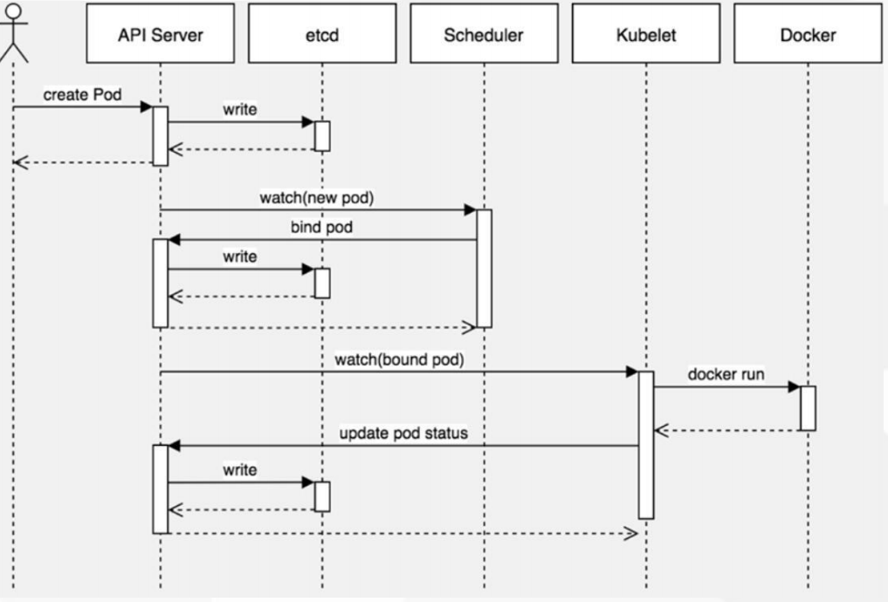

<center><h1>Kubernets Pod</h1></center>

## 1. 管理命令概要

类型| 命令|描述
---|---|---
基础命令|create |通过文件名或标准输入创建资源
.|expose |将一个资源公开为一个新的Service
.|run |在集群中运行一个特定的镜像
.|set |在对象上设置特定的功能
.|get |显示一个或多个资源
.|explain| 文档参考资料
.|edit |使用默认的编辑器编辑一个资源。
.|delete |通过文件名、标准输入、资源名称或标签选择器来删除资源。
部署命令|rollout| 管理资源的发布
.|rolling-update| 对给定的复制控制器滚动更新
.|scale| 扩容或缩容Pod数量，Deployment、ReplicaSet、RC或Job
.|autoscale| 创建一个自动选择扩容或缩容并设置Pod数量
集群管理命令|certificate| 修改证书资源
.|cluster-info| 显示集群信息
.|top| 显示资源（CPU/Memory/Storage）使用。需要Heapster运行
.|cordon| 标记节点不可调度
.|uncordon| 标记节点可调度
.|drain| 驱逐节点上的应用，准备下线维护
.|taint| 修改节点taint标记
故障诊断和调试命令|describe |显示特定资源或资源组的详细信息
.|logs|在一个Pod中打印一个容器日志。如果Pod只有一个容器，容器名称是可选的
.|attach| 附加到一个运行的容器
.|exec| 执行命令到容器
.|port-forward| 转发一个或多个本地端口到一个pod
.|proxy| 运行一个proxy到Kubernetes API server
.|cp |拷贝文件或目录到容器中
.|auth| 检查授权
高级命令|apply| 通过文件名或标准输入对资源应用配置
.|patch| 使用补丁修改、更新资源的字段
.|replace| 通过文件名或标准输入替换一个资源
.|convert| 不同的API版本之间转换配置文件
设置命令|label| 更新资源上的标签
.|annotate| 更新资源上的注释
.|completion| 用于实现kubectl工具自动补全其他命令
.|api-versions| 打印受支持的API版本
.|config| 修改kubeconfig文件（用于访问API，比如配置认证信息）
.|help| 所有命令帮助
.|plugin| 运行一个命令行插件
.|version| 打印客户端和服务版本信息

### 1.1 创建
先删除之前的pod，为创建干净环境[生产慎用]
```
[root@k8s-master01 ui]# kubectl get pod
NAME                   READY   STATUS    RESTARTS   AGE
nginx-5c7588df-c58ql   1/1     Running   0          3d21h
nginx-5c7588df-gh6l9   1/1     Running   0          3d21h
nginx-5c7588df-nlj5l   1/1     Running   0          3d22h
nginx-5c7588df-p8ls9   1/1     Running   0          3d
nginx-5c7588df-sv64n   1/1     Running   0          3d
[root@k8s-master01 ui]# kubectl get deploy
NAME    READY   UP-TO-DATE   AVAILABLE   AGE
nginx   5/5     5            5           3d22h

[root@k8s-master01 ui]# kubectl delete deploy nginx
deployment.extensions "nginx" deleted
[root@k8s-master01 ui]# kubectl get deploy
No resources found.
[root@k8s-master01 ui]# kubectl get pod
No resources found.
```

```
[root@k8s-master01 ui]# kubectl create deployment web --image=nginx 
deployment.apps/web created
[root@k8s-master01 ui]# kubectl get pods -o wide
NAME                  READY   STATUS    RESTARTS   AGE   IP            NODE              NOMINATED NODE   READINESS GATES
web-bbb9f66c9-gt486   1/1     Running   0          17s   172.17.66.2   192.168.186.141   <none>           <none>
```
> 创建deployment名字为web 使用的镜像是nginx[默认会去dockerhub下载最新的，要是私有仓库需要指定仓库名称]


### 1.2 发布

```
[root@k8s-master01 ui]# kubectl expose deployment web --port=80 --target-port=80 --name=nginx-service --type=NodePort 
service/nginx-service exposed

[root@k8s-master01 ui]# kubectl get pod,svc
NAME                      READY   STATUS    RESTARTS   AGE
pod/web-bbb9f66c9-gt486   1/1     Running   0          6m46s

NAME                    TYPE        CLUSTER-IP   EXTERNAL-IP   PORT(S)        AGE
service/kubernetes      ClusterIP   10.0.0.1     <none>        443/TCP        4d
service/nginx           NodePort    10.0.0.88    <none>        88:30232/TCP   3d22h
service/nginx-service   NodePort    10.0.0.152   <none>        80:34641/TCP   3m31s
                                                               |   |___________> 宿主机ip，随机端口
                                                               |_______________> 容器内ip

[root@k8s-master01 ui]# kubectl get pod -o wide
NAME                  READY   STATUS    RESTARTS   AGE    IP            NODE              NOMINATED NODE   READINESS GATES
web-bbb9f66c9-gt486   1/1     Running   0          8m5s   172.17.66.2   192.168.186.141   <none>           <none>
[root@k8s-master01 ui]# curl 192.168.186.141:34641
<!DOCTYPE html>
<html>
<head>
<title>Welcome to nginx!</title>
<style>
    body {
        width: 35em;
        margin: 0 auto;
        font-family: Tahoma, Verdana, Arial, sans-serif;
    }
</style>
</head>
<body>
<h1>Welcome to nginx!</h1>
<p>If you see this page, the nginx web server is successfully installed and
working. Further configuration is required.</p>

<p>For online documentation and support please refer to
<a href="http://nginx.org/">nginx.org</a>.<br/>
Commercial support is available at
<a href="http://nginx.com/">nginx.com</a>.</p>

<p><em>Thank you for using nginx.</em></p>
</body>
</html>

在node上测试
[root@k8s-master01 ui]# curl 192.168.186.141:34641
<!DOCTYPE html>
<html>
<head>
<title>Welcome to nginx!</title>
<style>
    body {
        width: 35em;
        margin: 0 auto;
        font-family: Tahoma, Verdana, Arial, sans-serif;
    }
</style>
</head>
<body>
<h1>Welcome to nginx!</h1>
<p>If you see this page, the nginx web server is successfully installed and
working. Further configuration is required.</p>

<p>For online documentation and support please refer to
<a href="http://nginx.org/">nginx.org</a>.<br/>
Commercial support is available at
<a href="http://nginx.com/">nginx.com</a>.</p>

<p><em>Thank you for using nginx.</em></p>
</body>
</html>
[root@k8s-master01 ui]# ping 10.0.0.152
PING 10.0.0.152 (10.0.0.152) 56(84) bytes of data.
^C
--- 10.0.0.152 ping statistics ---
1 packets transmitted, 0 received, 100% packet loss, time 0ms
```
> 指定deployment的名字为web[上面创建的]，外部访问端口[port]是80，内部端口[target-port]是80, 名字是nginx-service，类型是NodePort 。

??? note "查看pod信息"
    ```
    [root@k8s-master01 ui]# kubectl get pods,svc
    NAME                      READY   STATUS    RESTARTS   AGE
    pod/web-bbb9f66c9-gt486   1/1     Running   0          14m
    
    NAME                    TYPE        CLUSTER-IP   EXTERNAL-IP   PORT(S)        AGE
    service/kubernetes      ClusterIP   10.0.0.1     <none>        443/TCP        4d
    service/nginx           NodePort    10.0.0.88    <none>        88:30232/TCP   3d22h
    service/nginx-service   NodePort    10.0.0.152   <none>        80:34641/TCP   11m
    [root@k8s-master01 ui]# kubectl describe pod web-bbb9f66c9-gt486
    \Name:               web-bbb9f66c9-gt486
    Namespace:          default
    Priority:           0
    PriorityClassName:  <none>
    Node:               192.168.186.141/192.168.186.141
    Start Time:         Mon, 22 Apr 2019 16:15:14 +0800
    Labels:             app=web
                        pod-template-hash=bbb9f66c9
    Annotations:        <none>
    Status:             Running
    IP:                 172.17.66.2
    Controlled By:      ReplicaSet/web-bbb9f66c9
    Containers:
      nginx:
        Container ID:   docker://2d660194edef9b58f539edccb29a95e8b5d1593422cb93044491c9cac238bf29
        Image:          nginx
        Image ID:       docker-pullable://nginx@sha256:edeeacc4b2605cfbdc5b9e4dc502e3269c8346aa4d257d2fab74dccfc0f7b972
        Port:           <none>
        Host Port:      <none>
        State:          Running
          Started:      Mon, 22 Apr 2019 16:15:16 +0800
        Ready:          True
        Restart Count:  0
        Environment:    <none>
        Mounts:
          /var/run/secrets/kubernetes.io/serviceaccount from default-token-r5m2l (ro)
    Conditions:
      Type              Status
      Initialized       True 
      Ready             True 
      ContainersReady   True 
      PodScheduled      True 
    Volumes:
      default-token-r5m2l:
        Type:        Secret (a volume populated by a Secret)
        SecretName:  default-token-r5m2l
        Optional:    false
    QoS Class:       BestEffort
    Node-Selectors:  <none>
    Tolerations:     node.kubernetes.io/not-ready:NoExecute for 300s
                     node.kubernetes.io/unreachable:NoExecute for 300s
    Events:
      Type    Reason     Age   From                      Message
      ----    ------     ----  ----                      -------
      Normal  Scheduled  15m   default-scheduler         Successfully assigned default/web-bbb9f66c9-gt486 to 192.168.186.141
      Normal  Pulling    15m   kubelet, 192.168.186.141  pulling image "nginx"
      Normal  Pulled     15m   kubelet, 192.168.186.141  Successfully pulled image "nginx"
      Normal  Created    15m   kubelet, 192.168.186.141  Created container
      Normal  Started    15m   kubelet, 192.168.186.141  Started container
    ```

### 1.3 更新
查看历史发布版本
```
[root@k8s-master01 ui]# kubectl rollout history deployment/web
deployment.extensions/web 
REVISION  CHANGE-CAUSE
1         <none>
```
编辑，类似vim修改

```
[root@k8s-master01 ui]# kubectl edit deployment/web
```
或者set修改

```
[root@k8s-master01 ui]# kubectl set image deployment web nginx=nginx:1.12
deployment.extensions/web image updated
```
 我们通过web界面查看
 
```
[root@k8s-master01 ui]# kubectl get pods,svc -o wide
NAME                       READY   STATUS    RESTARTS   AGE   IP           NODE              NOMINATED NODE   READINESS GATES
pod/web-78b9948b79-wsmzc   1/1     Running   0          57s   172.17.8.2   192.168.186.142   <none>           <none>

NAME                    TYPE        CLUSTER-IP   EXTERNAL-IP   PORT(S)        AGE     SELECTOR
service/kubernetes      ClusterIP   10.0.0.1     <none>        443/TCP        4d      <none>
service/nginx           NodePort    10.0.0.88    <none>        88:30232/TCP   3d22h   app=nginx
service/nginx-service   NodePort    10.0.0.152   <none>        80:34641/TCP   17m     app=web
```
可以看出nginx启动在192.168.186.142的34641端口

```
[root@k8s-master01 ui]# curl 192.168.186.142:34641 -I
HTTP/1.1 200 OK
Server: nginx/1.12.2
Date: Mon, 22 Apr 2019 08:36:40 GMT
Content-Type: text/html
Content-Length: 612
Last-Modified: Tue, 11 Jul 2017 13:29:18 GMT
Connection: keep-alive
ETag: "5964d2ae-264"
Accept-Ranges: bytes
```
已经更新过来了。之前是最新的，现在改为1.2。

查看发布版本记录

```
[root@k8s-master01 ui]# kubectl rollout history deployment web
deployment.extensions/web 
REVISION  CHANGE-CAUSE
1         <none>
2         <none>
```

### 1.4 回滚

```
[root@k8s-master01 ui]# kubectl rollout undo deployment web
deployment.extensions/web rolled back
[root@k8s-master01 ui]# curl 192.168.186.142:34641 -I
^C
[root@k8s-master01 ui]# kubectl get pods,svc -o wide
NAME                      READY   STATUS    RESTARTS   AGE   IP            NODE              NOMINATED NODE   READINESS GATES
pod/web-bbb9f66c9-vcp9p   1/1     Running   0          29s   172.17.66.2   192.168.186.141   <none>           <none>

NAME                    TYPE        CLUSTER-IP   EXTERNAL-IP   PORT(S)        AGE     SELECTOR
service/kubernetes      ClusterIP   10.0.0.1     <none>        443/TCP        4d      <none>
service/nginx           NodePort    10.0.0.88    <none>        88:30232/TCP   3d22h   app=nginx
service/nginx-service   NodePort    10.0.0.152   <none>        80:34641/TCP   20m     app=web

[root@k8s-master01 ui]# curl 192.168.186.141:34641 -I
HTTP/1.1 200 OK
Server: nginx/1.15.12
Date: Mon, 22 Apr 2019 08:38:20 GMT
Content-Type: text/html
Content-Length: 612
Last-Modified: Tue, 16 Apr 2019 13:08:19 GMT
Connection: keep-alive
ETag: "5cb5d3c3-264"
Accept-Ranges: bytes
```
> undo只是回滚到上一个版本，和部署的流程类似。

回滚到指定版本

??? note "命令help"
    ```
    [root@k8s-master01 ui]# kubectl rollout history --h
    Error: unknown flag: --h
    
    
    Examples:
      # View the rollout history of a deployment
      kubectl rollout history deployment/abc
      
      # View the details of daemonset revision 3
      kubectl rollout history daemonset/abc --revision=3
    
    Options:
          --allow-missing-template-keys=true: If true, ignore any errors in templates when a field or map key is missing in the template. Only applies to golang and jsonpath output
     formats.  -f, --filename=[]: Filename, directory, or URL to files identifying the resource to get from a server.
      -o, --output='': Output format. One of: json|yaml|name|go-template|go-template-file|template|templatefile|jsonpath|jsonpath-file.
      -R, --recursive=false: Process the directory used in -f, --filename recursively. Useful when you want to manage related manifests organized within the same directory.
          --revision=0: See the details, including podTemplate of the revision specified
          --template='': Template string or path to template file to use when -o=go-template, -o=go-template-file. The template format is golang templates [http://golang.org/pkg/te
    xt/template/#pkg-overview].
    Usage:
      kubectl rollout history (TYPE NAME | TYPE/NAME) [flags] [options]
    
    Use "kubectl options" for a list of global command-line options (applies to all commands).
    
    unknown flag: --h
    ```

```
kubectl rollout history deployemnt --revision=0
就是之前的REVISION号。
[root@k8s-master01 ui]# kubectl rollout history deployment web
deployment.extensions/web 
REVISION  CHANGE-CAUSE
1         <none>
2         <none>

```

### 1.5 删除

```
[root@k8s-master01 ui]# kubectl delete deployment web
deployment.extensions "web" deleted

[root@k8s-master01 ui]# kubectl get pods,svc -o wide
NAME                    TYPE        CLUSTER-IP   EXTERNAL-IP   PORT(S)        AGE     SELECTOR
service/kubernetes      ClusterIP   10.0.0.1     <none>        443/TCP        4d      <none>
service/nginx           NodePort    10.0.0.88    <none>        88:30232/TCP   3d22h   app=nginx
service/nginx-service   NodePort    10.0.0.152   <none>        80:34641/TCP   21m     app=web
[root@k8s-master01 ui]# kubectl get svc -o wide
NAME            TYPE        CLUSTER-IP   EXTERNAL-IP   PORT(S)        AGE     SELECTOR
kubernetes      ClusterIP   10.0.0.1     <none>        443/TCP        4d      <none>
nginx           NodePort    10.0.0.88    <none>        88:30232/TCP   3d22h   app=nginx
nginx-service   NodePort    10.0.0.152   <none>        80:34641/TCP   21m     app=web
[root@k8s-master01 ui]# kubectl delete svc/nginx
service "nginx" deleted
[root@k8s-master01 ui]# kubectl get svc -o wide
NAME            TYPE        CLUSTER-IP   EXTERNAL-IP   PORT(S)        AGE   SELECTOR
kubernetes      ClusterIP   10.0.0.1     <none>        443/TCP        4d    <none>
nginx-service   NodePort    10.0.0.152   <none>        80:34641/TCP   22m   app=web
[root@k8s-master01 ui]# kubectl delete svc/nginx-service
service "nginx-service" deleted
[root@k8s-master01 ui]# kubectl get svc -o wide
NAME         TYPE        CLUSTER-IP   EXTERNAL-IP   PORT(S)   AGE   SELECTOR
kubernetes   ClusterIP   10.0.0.1     <none>        443/TCP   4d    <none>
```

## 2. yaml文件

```
[root@k8s-master01 ui]# kubectl get svc kubernetes -o yaml
apiVersion: v1
kind: Service
metadata:
  creationTimestamp: "2019-04-18T07:52:29Z"
  labels:
    component: apiserver
    provider: kubernetes
  name: kubernetes
  namespace: default
  resourceVersion: "27"
  selfLink: /api/v1/namespaces/default/services/kubernetes
  uid: ea082ff9-61ae-11e9-9365-000c2994bdca
spec:
  clusterIP: 10.0.0.1
  ports:
  - name: https
    port: 443
    protocol: TCP
    targetPort: 6443
  sessionAffinity: None
  type: ClusterIP
status:
  loadBalancer: {}
```

### 2.1 语法格式

- 缩进表示层级关系
- 不支持制表符“tab”缩进，使用空格缩进
- 通常开头缩进 2 个空格
- 字符后缩进 1 个空格，如冒号、逗号等
- “---” 表示YAML格式，一个文件的开始
- “#”注释
- 使用“-”（横线） + 单个空格表示单个列表项

```
[root@k8s-master01 demo]# cat nginx.yaml 
apiVersion: apps/v1beta2
kind: Deployment
metadata:
  name: nginx-deployment
  namespace: default
spec:
  replicas: 3
  selector:
    matchLabels:
      app: nginx
  template:
    metadata:
      labels:
        app: nginx
    spec:
      containers:
      - name: nginx
        image: nginx:1.15
        ports:
        - containerPort: 8
```
通过yaml文件生成nginx

```
[root@k8s-master01 demo]# kubectl apply -f nginx.yaml 
deployment.apps/nginx-deployment created
[root@k8s-master01 demo]# kubectl get pods -o wide
NAME                               READY   STATUS    RESTARTS   AGE   IP            NODE              NOMINATED NODE   READINESS GATES
nginx-deployment-78f97dff9-dc89x   1/1     Running   0          49s   172.17.66.3   192.168.186.141   <none>           <none>
nginx-deployment-78f97dff9-knvk9   1/1     Running   0          49s   172.17.8.2    192.168.186.142   <none>           <none>
nginx-deployment-78f97dff9-w8j4j   1/1     Running   0          49s   172.17.66.2   192.168.186.141   <none>           <none>
```


```
[root@k8s-master01 demo]# cat service.yaml 
apiVersion: v1
kind: Service
metadata:
  name: nginx-service 
  labels:
    app: nginx
spec:
  type: NodePort
  ports:
  - port: 80
    targetPort: 80
  selector:
    app: nginx
    
[root@k8s-master01 demo]# kubectl apply -f service.yaml 
[root@k8s-master01 demo]# kubectl get svc
NAME            TYPE        CLUSTER-IP   EXTERNAL-IP   PORT(S)        AGE
kubernetes      ClusterIP   10.0.0.1     <none>        443/TCP        4d1h
nginx-service   NodePort    10.0.0.228   <none>        80:41583/TCP   43s
```


## 3. 生命周期

```
• 用run命令生成kubectl run --image=nginx my-deploy -o yaml --dry-run > my-deploy.yaml 
• 用get命令导出kubectl get my-deploy/nginx -o=yaml --export > my-deploy.yaml
• Pod容器的字段拼写忘记了kubectl explain pods.spec.containers
```


```
[root@k8s-master01 demo]# kubectl run --image=nginx my-deploy -o yaml --dry-run >dry_run.yaml
kubectl run --generator=deployment/apps.v1 is DEPRECATED and will be removed in a future version. Use kubectl run --generator=run-pod/v1 or kubectl create instead.
[root@k8s-master01 demo]# cat dry_run.yaml 
apiVersion: apps/v1
kind: Deployment
metadata:
  creationTimestamp: null
  labels:
    run: my-deploy
  name: my-deploy
spec:
  replicas: 1
  selector:
    matchLabels:
      run: my-deploy
  strategy: {}
  template:
    metadata:
      creationTimestamp: null
      labels:
        run: my-deploy
    spec:
      containers:
      - image: nginx
        name: my-deploy
        resources: {}
status: {}
```
get方式

```
[root@k8s-master01 demo]# kubectl get deployment
NAME               READY   UP-TO-DATE   AVAILABLE   AGE
nginx-deployment   3/3     3            3           34m

[root@k8s-master01 demo]# kubectl get deployment nginx-deployment -o yaml
apiVersion: extensions/v1beta1
kind: Deployment
metadata:
  annotations:
    deployment.kubernetes.io/revision: "1"
    kubectl.kubernetes.io/last-applied-configuration: |
      {"apiVersion":"apps/v1beta2","kind":"Deployment","metadata":{"annotations":{},"name":"nginx-deployment","namespace":"default"},"spec":{"replicas":3,"selector":{"matchLabe
ls":{"app":"nginx"}},"template":{"metadata":{"labels":{"app":"nginx"}},"spec":{"containers":[{"image":"nginx:1.15","name":"nginx","ports":[{"containerPort":8}]}]}}}}  creationTimestamp: "2019-04-22T08:52:57Z"
  generation: 1
  name: nginx-deployment
  namespace: default
  resourceVersion: "71672"
  selfLink: /apis/extensions/v1beta1/namespaces/default/deployments/nginx-deployment
  uid: 0634c08c-64dc-11e9-9365-000c2994bdca
spec:
  progressDeadlineSeconds: 600
  replicas: 3
  revisionHistoryLimit: 10
  selector:
    matchLabels:
      app: nginx
  strategy:
    rollingUpdate:
      maxSurge: 25%
      maxUnavailable: 25%
    type: RollingUpdate
  template:
    metadata:
      creationTimestamp: null
      labels:
        app: nginx
    spec:
      containers:
      - image: nginx:1.15
        imagePullPolicy: IfNotPresent
        name: nginx
        ports:
        - containerPort: 8
          protocol: TCP
        resources: {}
        terminationMessagePath: /dev/termination-log
        terminationMessagePolicy: File
      dnsPolicy: ClusterFirst
      restartPolicy: Always
      schedulerName: default-scheduler
      securityContext: {}
      terminationGracePeriodSeconds: 30
status:
  availableReplicas: 3
  conditions:
  - lastTransitionTime: "2019-04-22T08:53:02Z"
    lastUpdateTime: "2019-04-22T08:53:02Z"
    message: Deployment has minimum availability.
    reason: MinimumReplicasAvailable
    status: "True"
    type: Available
  - lastTransitionTime: "2019-04-22T08:52:57Z"
    lastUpdateTime: "2019-04-22T08:53:02Z"
    message: ReplicaSet "nginx-deployment-78f97dff9" has successfully progressed.
    reason: NewReplicaSetAvailable
    status: "True"
    type: Progressing
  observedGeneration: 1
  readyReplicas: 3
  replicas: 3
  updatedReplicas: 3

导出
[root@k8s-master01 demo]# kubectl get deployment nginx-deployment -o yaml --export

json格式
[root@k8s-master01 demo]# kubectl get deployment nginx-deployment -o json
```


## 4.深入理解pod对象

- 最小部署单元
- 一组容器的集合
- 一个Pod中的容器共享网络命名空间
- Pod是短暂的

### 4.1 pod容器分类

- Infrastructure Container：基础容器
    - 维护整个Pod网络空间
- InitContainers：初始化容器
    - 先于业务容器开始执行
- Containers：业务容器
    - 并行启动

## 5.镜像拉取策略

- IfNotPresent：默认值，镜像在宿主机上不存在时才拉取
- Always：每次创建 Pod 都会重新拉取一次镜像
- Never： Pod 永远不会主动拉取这个镜像


```
[root@k8s-master01 demo]# kubectl get deployment/nginx-deployment -o yaml|grep imagePullPolicy
        imagePullPolicy: IfNotPresent
```

需要认证才能拉取的

```
apiVersion: v1
kind: Pod
metadata:
  name: foo
  namespace: awesomeapps
spec:
  containers:
    - name: foo
      image: janedoe/awesomeapp:v1
  imagePullSecrets:
    - name: myregistrykey
```

```
[root@k8s-master01 demo]# kubectl create secret --help
Create a secret using specified subcommand.

Available Commands:
  docker-registry Create a secret for use with a Docker registry
  generic         Create a secret from a local file, directory or literal value
  tls             Create a TLS secret

Usage:
  kubectl create secret [flags] [options]

Use "kubectl <command> --help" for more information about a given command.
Use "kubectl options" for a list of global command-line options (applies to all commands).


[root@k8s-master01 demo]# kubectl create secret docker-registry --help
。。。。。

Usage:
  kubectl create secret docker-registry NAME --docker-username=user --docker-password=password --docker-email=email
[--docker-server=string] [--from-literal=key1=value1] [--dry-run] [options]


[root@k8s-master01 demo]# kubectl create secret docker-registry myregistrykey --docker-username=admin --docker-password=Harbor12345 --docker-email=610658552@qq.com --docker-ser
ver="192.168.186.139" secret/myregistrykey created
[root@k8s-master01 demo]# kubectl get secret
NAME                  TYPE                                  DATA   AGE
default-token-r5m2l   kubernetes.io/service-account-token   3      4d2h
myregistrykey         kubernetes.io/dockerconfigjson        1      10s
默认创建在defualt名称空间

[root@k8s-master01 demo]# cat nginx.yaml 
apiVersion: apps/v1beta2
kind: Deployment
metadata:
  name: nginx-deployment
  namespace: default
spec:
  replicas: 3
  selector:
    matchLabels:
      app: nginx
  template:
    metadata:
      labels:
        app: nginx
    spec:
      imagePullSecrets:
        - name: myregistrykey
      containers:
      - name: nginx
        imagePullPolicy: IfNotPresent
        image: nginx:1.15
        ports:
        - containerPort: 8

此时在去拉取nginx镜像[存放在harbor仓库中]的时候，会带myregistrykey这个认证信息
```


## 6.资源镜像限制

```
https://kubernetes.io/docs/concepts/configuration/manage-compute-resources-container/
```

Pod和Container的资源请求和限制

- spec.containers[].resources.limits.cpu
- spec.containers[].resources.limits.memory
- spec.containers[].resources.requests.cpu
- spec.containers[].resources.requests.memory

??? note "官网demo limit-pod.yml"
    ```
    [root@k8s-master01 demo]# vim limit-pod.yml 
    apiVersion: v1
    kind: Pod
    metadata:
      name: frontend
    spec:
      containers:
      - name: db
        image: mysql
        resources:
          requests:
            memory: "64Mi"
            cpu: "250m"
          limits:
            memory: "128Mi"
            cpu: "500m"
      - name: wp
        image: wordpress
        resources:
          requests:
            memory: "64Mi"
            cpu: "250m"
          limits:
            memory: "128Mi"
            cpu: "500m"
    ```
```
[root@k8s-master01 demo]# kubectl apply -f limit-pod.yml 
pod/frontend created

```

## 7.重启策略

- Always：当容器终止退出后，总是重启容器，默认策略。
- OnFailure：当容器异常退出（退出状态码非0）时，才重启容器。
- Never：当容器终止退出，从不重启容器。

```
[root@k8s-master01 demo]# cat nginx.yaml 
apiVersion: apps/v1beta2
kind: Deployment
metadata:
  name: nginx-deployment
  namespace: default
spec:
  replicas: 3
  selector:
    matchLabels:
      app: nginx
  template:
    metadata:
      labels:
        app: nginx
    spec:
      imagePullSecrets:
        - name: myregistrykey
      restartPolicy: Always
      containers:
      - name: nginx
        imagePullPolicy: IfNotPresent
        image: nginx:1.15
        ports:
        - containerPort: 8
```

## 8.健康检查

```
https://kubernetes.io/docs/tasks/configure-pod-container/configure-liveness-readiness-probes/
```
> 检测你pod中应用

Probe有以下两种类型：

- ivenessProbe
如果检查失败，将杀死容器，根据Pod的restartPolicy来操作。

- readinessProbe
如果检查失败，Kubernetes会把Pod从service endpoints中剔除。

Probe支持以下三种检查方法：

- httpGet
发送HTTP请求，返回200-400范围状态码为成功。

- exec
执行Shell命令返回状态码是0为成功。

- tcpSocket
发起TCP Socket建立成功。

??? note "官网demo probe-pod.yaml"
    ```
    [root@k8s-master01 demo]# cat probe-pod.yaml
    apiVersion: v1
    kind: Pod
    metadata:
      labels:
        test: liveness
      name: liveness-exec
    spec:
      containers:
      - name: liveness
        image: busybox
        args:
        - /bin/sh
        - -c
        - touch /tmp/healthy; sleep 30; rm -rf /tmp/healthy; sleep 60
        livenessProbe:
          exec:
            command:
            - cat
            - /tmp/healthy
          initialDelaySeconds: 5
          periodSeconds: 5
    ```
> 修改了image[官网k8s.gcr.io/busybox]来源为busybox，和sleep为60[官网600]


```
[root@k8s-master01 demo]# kubectl apply -f probe-pod.yaml 
pod/liveness-exec created
[root@k8s-master01 demo]# kubectl get pods
NAME                               READY   STATUS             RESTARTS   AGE
frontend                           1/2     CrashLoopBackOff   11         35m
liveness-exec                      1/1     Running            0          6s
nginx-deployment-78f97dff9-dc89x   1/1     Running            0          176m
nginx-deployment-78f97dff9-knvk9   1/1     Running            0          176m
nginx-deployment-78f97dff9-w8j4j   1/1     Running            0          176m
已经启动了。等待30，删除那文件。等一会在查看

[root@k8s-master01 demo]# kubectl get pods
NAME                               READY   STATUS             RESTARTS   AGE
frontend                           1/2     CrashLoopBackOff   12         36m
liveness-exec                      1/1     Running            1          80s
nginx-deployment-78f97dff9-dc89x   1/1     Running            0          177m
nginx-deployment-78f97dff9-knvk9   1/1     Running            0          177m
nginx-deployment-78f97dff9-w8j4j   1/1     Running            0          177m
此时liveness-exec 重启了一次。
```
??? note "查看资源信息"
    ```
    [root@k8s-master01 demo]# kubectl describe pod liveness-exec
    Name:               liveness-exec
    Namespace:          default
    Priority:           0
    PriorityClassName:  <none>
    Node:               192.168.186.142/192.168.186.142
    Start Time:         Mon, 22 Apr 2019 19:49:03 +0800
    Labels:             test=liveness
    Annotations:        kubectl.kubernetes.io/last-applied-configuration:
                          {"apiVersion":"v1","kind":"Pod","metadata":{"annotations":{},"labels":{"test":"liveness"},"name":"liveness-exec","namespace":"default"},"s...
    Status:             Running
    IP:                 172.17.8.4
    Containers:
      liveness:
        Container ID:  docker://24678d5a30003ecae6ac664ff8f65545987e5e712e3cd6a7164f8a2ab519244a
        Image:         busybox
        Image ID:      docker-pullable://busybox@sha256:577311505bc76f39349a2d389d32c7967ca478de918104126c10aa0eb7f101fd
        Port:          <none>
        Host Port:     <none>
        Args:
          /bin/sh
          -c
          touch /tmp/healthy; sleep 30; rm -rf /tmp/healthy; sleep 60
        State:          Running
          Started:      Mon, 22 Apr 2019 19:50:19 +0800
        Last State:     Terminated
          Reason:       Error
          Exit Code:    137
          Started:      Mon, 22 Apr 2019 19:49:05 +0800
          Finished:     Mon, 22 Apr 2019 19:50:18 +0800
        Ready:          True
        Restart Count:  1
        Liveness:       exec [cat /tmp/healthy] delay=5s timeout=1s period=5s #success=1 #failure=3
        Environment:    <none>
        Mounts:
          /var/run/secrets/kubernetes.io/serviceaccount from default-token-r5m2l (ro)
    Conditions:
      Type              Status
      Initialized       True 
      Ready             True 
      ContainersReady   True 
      PodScheduled      True 
    Volumes:
      default-token-r5m2l:
        Type:        Secret (a volume populated by a Secret)
        SecretName:  default-token-r5m2l
        Optional:    false
    QoS Class:       BestEffort
    Node-Selectors:  <none>
    Tolerations:     node.kubernetes.io/not-ready:NoExecute for 300s
                     node.kubernetes.io/unreachable:NoExecute for 300s
    Events:
      Type     Reason     Age                 From                      Message
      ----     ------     ----                ----                      -------
      Normal   Scheduled  2m4s                default-scheduler         Successfully assigned default/liveness-exec to 192.168.186.142
      Normal   Pulling    49s (x2 over 2m3s)  kubelet, 192.168.186.142  pulling image "busybox"
      Normal   Pulled     49s (x2 over 2m3s)  kubelet, 192.168.186.142  Successfully pulled image "busybox"
      Normal   Created    49s (x2 over 2m3s)  kubelet, 192.168.186.142  Created container
      Normal   Killing    49s                 kubelet, 192.168.186.142  Killing container with id docker://liveness:Container failed liveness probe.. Container will be killed and r
    ecreated.  Normal   Started    48s (x2 over 2m2s)  kubelet, 192.168.186.142  Started container
      Warning  Unhealthy  4s (x6 over 89s)    kubelet, 192.168.186.142  Liveness probe failed: cat: can't open '/tmp/healthy': No such file or directory
    ```

## 9.调度约束

<center></center>

- nodeName用于将Pod调度到指定的Node名称上

```
[root@k8s-master01 demo]# kubectl get node
NAME              STATUS   ROLES    AGE    VERSION
192.168.186.141   Ready    <none>   4d2h   v1.13.4
192.168.186.142   Ready    <none>   4d2h   v1.13.4 
```

- nodeSelector用于将Pod调度到匹配Label的Node上

```
[root@k8s-master01 demo]# kubectl get node
NAME              STATUS   ROLES    AGE    VERSION
192.168.186.141   Ready    <none>   4d2h   v1.13.4
192.168.186.142   Ready    <none>   4d2h   v1.13.4

打标签
[root@k8s-master01 demo]# kubectl label nodes 192.168.186.141 env_role=dev
node/192.168.186.141 labeled
[root@k8s-master01 demo]# kubectl label nodes 192.168.186.142 env_role=prod
node/192.168.186.142 labeled

产看
root@k8s-master01 demo]# kubectl get nodes --show-labels
NAME              STATUS   ROLES    AGE    VERSION   LABELS
192.168.186.141   Ready    <none>   4d2h   v1.13.4   beta.kubernetes.io/arch=amd64,beta.kubernetes.io/os=linux,env=dev,env_role=dev,kubernetes.io/hostname=192.168.186.141
192.168.186.142   Ready    <none>   4d2h   v1.13.4   beta.kubernetes.io/arch=amd64,beta.kubernetes.io/os=linux,env_role=prod,kubernetes.io/hostname=192.168.186.142

[root@k8s-master01 demo]# cat nginx.yaml 
apiVersion: apps/v1beta2
kind: Deployment
metadata:
  name: nginx-deployment
  namespace: default
spec:
  replicas: 3
  selector:
    matchLabels:
      app: nginx
  template:
    metadata:
      labels:
        app: nginx
    spec:
#      imagePullSecrets:
#        - name: myregistrykey
      restartPolicy: Always
      nodeSelector:
        env_role: dev
      containers:
      - name: nginx
        imagePullPolicy: IfNotPresent
        image: nginx:1.15
        ports:
        - containerPort: 8
[root@k8s-master01 demo]# kubectl apply -f nginx.yaml 
deployment.apps/nginx-deployment configured
[root@k8s-master01 demo]# kubectl get pods
NAME                                READY   STATUS             RESTARTS   AGE
frontend                            1/2     CrashLoopBackOff   19         75m
liveness-exec                       0/1     CrashLoopBackOff   13         40m
nginx-deployment-5997b94b5c-79rrk   1/1     Running            0          5s
nginx-deployment-5997b94b5c-cs28z   1/1     Running            0          3s
nginx-deployment-5997b94b5c-zc7pp   1/1     Running            0          8s
nginx-deployment-78f97dff9-dc89x    0/1     Terminating        0          3h36m
nginx-deployment-78f97dff9-knvk9    0/1     Terminating        0          3h36m
nginx-deployment-78f97dff9-w8j4j    0/1     Terminating        0          3h36m
[root@k8s-master01 demo]# kubectl get pods
NAME                                READY   STATUS             RESTARTS   AGE
frontend                            1/2     CrashLoopBackOff   19         75m
liveness-exec                       0/1     CrashLoopBackOff   13         40m
nginx-deployment-5997b94b5c-79rrk   1/1     Running            0          16s
nginx-deployment-5997b94b5c-cs28z   1/1     Running            0          14s
nginx-deployment-5997b94b5c-zc7pp   1/1     Running            0          19s

我们查看一下容器的情况
[root@k8s-master01 demo]# kubectl get pods,svc
NAME                                    READY   STATUS             RESTARTS   AGE
pod/frontend                            1/2     CrashLoopBackOff   19         76m
pod/liveness-exec                       0/1     CrashLoopBackOff   13         41m
pod/nginx-deployment-5997b94b5c-79rrk   1/1     Running            0          77s
pod/nginx-deployment-5997b94b5c-cs28z   1/1     Running            0          75s
pod/nginx-deployment-5997b94b5c-zc7pp   1/1     Running            0          80s

NAME                    TYPE        CLUSTER-IP   EXTERNAL-IP   PORT(S)        AGE
service/kubernetes      ClusterIP   10.0.0.1     <none>        443/TCP        4d4h
service/nginx-service   NodePort    10.0.0.228   <none>        80:41583/TCP   3h30m
[root@k8s-master01 demo]# kubectl describe nginx-deployment-5997b94b5c-79rrk
error: the server doesn't have a resource type "nginx-deployment-5997b94b5c-79rrk"
[root@k8s-master01 demo]# kubectl describe pod  nginx-deployment-5997b94b5c-79rrk
Name:               nginx-deployment-5997b94b5c-79rrk
Namespace:          default
Priority:           0
PriorityClassName:  <none>
Node:               192.168.186.141/192.168.186.141
Start Time:         Mon, 22 Apr 2019 20:29:26 +0800
Labels:             app=nginx
                    pod-template-hash=5997b94b5c
Annotations:        <none>
Status:             Running
IP:                 172.17.66.5
Controlled By:      ReplicaSet/nginx-deployment-5997b94b5c
Containers:
  nginx:
    Container ID:   docker://aa15ccbc6a00282afd9b9b804f88b0aa1c12b96ad6396761f093a90f490d8714
    Image:          nginx:1.15
    Image ID:       docker-pullable://nginx@sha256:225df4aa2740c1a867fb5b080cfa8bba8ba644e2ea5cca779c3d3e606072d56e
    Port:           8/TCP
    Host Port:      0/TCP
    State:          Running
      Started:      Mon, 22 Apr 2019 20:29:27 +0800
    Ready:          True
    Restart Count:  0
    Environment:    <none>
    Mounts:
      /var/run/secrets/kubernetes.io/serviceaccount from default-token-r5m2l (ro)
Conditions:
  Type              Status
  Initialized       True 
  Ready             True 
  ContainersReady   True 
  PodScheduled      True 
Volumes:
  default-token-r5m2l:
    Type:        Secret (a volume populated by a Secret)
    SecretName:  default-token-r5m2l
    Optional:    false
QoS Class:       BestEffort
Node-Selectors:  env_role=dev
Tolerations:     node.kubernetes.io/not-ready:NoExecute for 300s
                 node.kubernetes.io/unreachable:NoExecute for 300s
Events:
  Type    Reason     Age   From                      Message
  ----    ------     ----  ----                      -------
  Normal  Scheduled  98s   default-scheduler         Successfully assigned default/nginx-deployment-5997b94b5c-79rrk to 192.168.186.141
  Normal  Pulled     97s   kubelet, 192.168.186.141  Container image "nginx:1.15" already present on machine
  Normal  Created    97s   kubelet, 192.168.186.141  Created container
  Normal  Started    97s   kubelet, 192.168.186.141  Started container
运行在了dev也就是192.168.186.141机器上了。再次检查另外两个容器
[root@k8s-master01 demo]# kubectl describe pod  nginx-deployment-5997b94b5c-cs28z | grep 141
Node:               192.168.186.141/192.168.186.141
  Normal  Scheduled  2m49s  default-scheduler         Successfully assigned default/nginx-deployment-5997b94b5c-cs28z to 192.168.186.141
  Normal  Pulled     2m48s  kubelet, 192.168.186.141  Container image "nginx:1.15" already present on machine
  Normal  Created    2m48s  kubelet, 192.168.186.141  Created container
  Normal  Started    2m48s  kubelet, 192.168.186.141  Started container
[root@k8s-master01 demo]# kubectl describe pod  nginx-deployment-5997b94b5c-zc7pp |grep 141
Node:               192.168.186.141/192.168.186.141
  Normal  Scheduled  3m5s  default-scheduler         Successfully assigned default/nginx-deployment-5997b94b5c-zc7pp to 192.168.186.141
  Normal  Pulled     3m4s  kubelet, 192.168.186.141  Container image "nginx:1.15" already present on machine
  Normal  Created    3m4s  kubelet, 192.168.186.141  Created container
  Normal  Started    3m4s  kubelet, 192.168.186.141  Started container

[root@k8s-master01 demo]# kubectl describe pod  nginx-deployment-5997b94b5c-zc7pp |grep 142
[root@k8s-master01 demo]# kubectl describe pod  nginx-deployment-5997b94b5c-cs28z | grep 142
从上可见都运行在角色是dev的机器上了
```

??? note "标签新增和删除"
    ```
    打标签
    [root@k8s-master01 demo]# kubectl label nodes 192.168.186.142 test_role=test
    node/192.168.186.142 labeled
    [root@k8s-master01 demo]# kubectl get nodes --show-labels
    NAME              STATUS   ROLES    AGE    VERSION   LABELS
    192.168.186.141   Ready    <none>   4d2h   v1.13.4   beta.kubernetes.io/arch=amd64,beta.kubernetes.io/os=linux,env_role=dev,kubernetes.io/hostname=192.168.186.141
    192.168.186.142   Ready    <none>   4d2h   v1.13.4   beta.kubernetes.io/arch=amd64,beta.kubernetes.io/os=linux,env_role=prod,kubernetes.io/hostname=192.168.186.142,test_role=test
    
    删除标签
    [root@k8s-master01 demo]# kubectl label nodes 192.168.186.142 test_role-
    node/192.168.186.142 labeled
    [root@k8s-master01 demo]# kubectl get nodes --show-labels
    NAME              STATUS   ROLES    AGE    VERSION   LABELS
    192.168.186.141   Ready    <none>   4d2h   v1.13.4   beta.kubernetes.io/arch=amd64,beta.kubernetes.io/os=linux,env_role=dev,kubernetes.io/hostname=192.168.186.141
    192.168.186.142   Ready    <none>   4d2h   v1.13.4   beta.kubernetes.io/arch=amd64,beta.kubernetes.io/os=linux,env_role=prod,kubernetes.io/hostname=192.168.186.142
    ```

## 10. 故障排查

```
https://kubernetes.io/docs/concepts/workloads/pods/pod-lifecycle/
```

值 | 描述
---|---
Pending|Pod创建已经提交到Kubernetes。但是，因为某种原因而不能顺利创建。例如下载镜像慢，调度不成功。
Running|Pod已经绑定到一个节点，并且已经创建了所有容器。至少有一个容器正在运行中，或正在启动或重新启动。
Succeeded|Pod中的所有容器都已成功终止，不会重新启动。
Failed|Pod的所有容器均已终止，且至少有一个容器已在故障中终止。也就是说，容器要么以非零状态退出，要么被系统终止。
Unknown|由于某种原因apiserver无法获得Pod的状态，通常是由于Master与Pod所在主机kubelet通信时出错。


```
kubectl describe TYPE/NAME
kubectl logs TYPE/NAME [-c CONTAINER]
kubectl exec POD [-c CONTAINER] -- COMMAND [args...]
```

例子

```
[root@k8s-master01 demo]# kubectl get pods
NAME                                READY   STATUS             RESTARTS   AGE
frontend                            1/2     CrashLoopBackOff   21         84m
liveness-exec                       1/1     Running            16         49m
nginx-deployment-5997b94b5c-79rrk   1/1     Running            0          9m11s
nginx-deployment-5997b94b5c-cs28z   1/1     Running            0          9m9s
nginx-deployment-5997b94b5c-zc7pp   1/1     Running            0          9m14s

查看所有详细信息
[root@k8s-master01 demo]# kubectl describe  frontend

查看日志
[root@k8s-master01 demo]# kubectl logs nginx-deployment-5997b94b5c-79rrk

进入控制台[进入容器类似docker进入]
[root@k8s-master01 demo]# kubectl exec -it nginx-deployment-5997b94b5c-79rrk sh
# ls
bin  boot  dev	etc  home  lib	lib64  media  mnt  opt	proc  root  run  sbin  srv  sys  tmp  usr  var
# 
```
