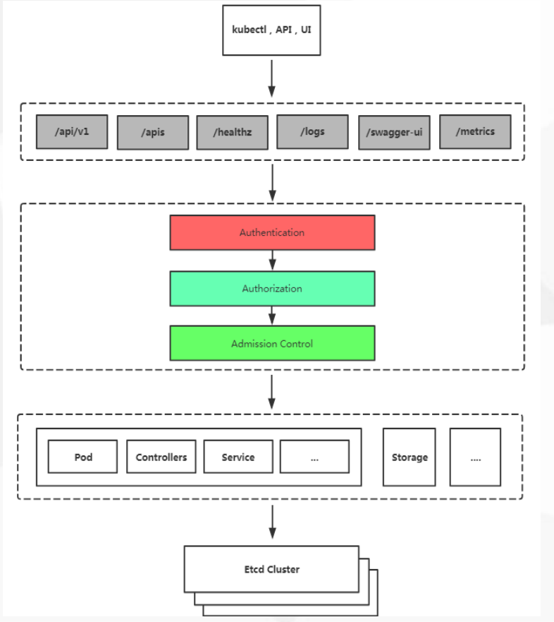

<center><h1>Kubernets 安全机制</h1></center>

## 1. 介绍

```
https://kubernetes.io/docs/reference/access-authn-authz/rbac/
```

```
1. Kubernetes的安全框架
2. 传输安全，认证，授权，准入控制
3. 使用RBAC授权
```

## 2. Kubernetes安全框架

- 访问K8S集群的资源需要过三关：认证、鉴权、准入控制
- 普通用户若要安全访问集群API Server，往往需要证书、Token或者用户名+密码；Pod访问，需要ServiceAccount
- K8S安全控制框架主要由下面3个阶段进行控制，每一个阶段都支持插件方式，通过API Server配置来启用插件。
    - 1. Authentication
    - 2. Authorization
    - 3. Admission Control

<center></center>

## 3. 传输安全

传输安全：告别8080，迎接6443

认证三种客户端身份认证：

- HTTPS 证书认证：基于CA证书签名的数字证书认证
- HTTP Token认证：通过一个Token来识别用
- HTTP Base认证：用户名+密码的方式认证


## 4. RBAC介绍
&#160; &#160; &#160; &#160;在Kubernetes中，授权有ABAC（基于属性的访问控制）、RBAC（基于角色的访问控制）、Webhook、Node、AlwaysDeny（一直拒绝）和AlwaysAllow（一直允许）这6种模式。从1.6版本起，Kubernetes 默认启用RBAC访问控制策略。从1.8开始，RBAC已作为稳定的功能。通过设置–authorization-mode=RBAC，启用RABC。在RABC API中，通过如下的步骤进行授权：

- 1）定义角色：在定义角色时会指定此角色对于资源的访问控制的规则
- 2）绑定角色：将主体与角色进行绑定，对用户进行访问授权。

<center></center>

### 4.1 角色和集群角色
&#160; &#160; &#160; &#160;在RBAC API中，角色包含代表权限集合的规则。在这里，权限只有被授予，而没有被拒绝的设置。在Kubernetes中有两类角色，即普通角色和集群角色。可以通过Role定义在一个命名空间中的角色，或者可以使用ClusterRole定义集群范围的角色。一个角色只能被用来授予访问单一命令空间中的资源。下面是在“default”命令空间中定义了一个名为“pod-reader”的角色，此角色能够对在“default”命名空间中访问Pod：

```
kind: Role
apiVersion: rbac.authorization.k8s.io/v1
metadata:
  namespace: default
  name: pod-reader
rules:
- apiGroups: [""] # "" indicates the core API group
  resources: ["pods"]
  verbs: ["get", "watch", "list"]
```
集群角色(ClusterRole)能够被授予如下资源的权限：

- 集群范围的资源（类似于Node）
- 非资源端点（类似于”/healthz”）
- 集群中所有命名空间的资源（类似Pod）

下面是授予集群角色读取秘密字典文件访问权限的例子：

```
kind:ClusterRole
apiVersion:rbac.authorization.k8s.io/v1
metadata:
  # "namespace" omitted since ClusterRoles are not namespaced
  name:secret-reader
rules:
- apiGroups:[""]
  resources:["secrets"] #明确资源类型
  verbs:["get","watch","list"]
```

### 4.2 角色绑定和集群角色绑定
&#160; &#160; &#160; &#160;角色绑定用于将角色与一个或一组用户进行绑定，从而实现将对用户进行授权的目的。主体分为用户、组和服务帐户。角色绑定也分为角色普通角色绑定和集群角色绑定。角色绑定只能引用同一个命名空间下的角色。在下面的例子中，在”default”命名空间中角色绑定将‘jane’用户和“pod-reader”角色进行了绑定，这就授予了“jane”能够访问“default”命名空间下的Pod。

```
# This role binding allows "jane" to read pods in the "default" namespace.
kind:RoleBinding
apiVersion:rbac.authorization.k8s.io/v1
metadata:
  name:read-pods
  namespace:default
subjects: #主体
- kind:User
  name:jane
  apiGroup:rbac.authorization.k8s.io
roleRef: #引用的角色
  kind:Role
  name:pod-reader
  apiGroup:rbac.authorization.k8s.io
```
&#160; &#160; &#160; &#160;角色绑定也可以通过引用集群角色授予访问权限，当主体对资源的访问仅限与本命名空间，这就允许管理员定义整个集群的公共角色集合，然后在多个命名空间中进行复用。例如，下面的角色绑定引用了集群角色，但是“dave”用户也仅仅只能读取“development”命名空间中的secrets资源：
```
# This role binding allows "dave" to read secrets in the "development" namespace.
kind:RoleBinding
apiVersion:rbac.authorization.k8s.io/v1
metadata:
  name:read-secrets
  namespace:development# This only grants permissions within the "development" namespace.
subjects:
- kind:User
  name:dave
  apiGroup:rbac.authorization.k8s.io
roleRef:
  kind:ClusterRole
  name:secret-reader
  apiGroup:rbac.authorization.k8s.io
```
&#160; &#160; &#160; &#160;集群角色可以被用来在集群层面和整个命名空间进行授权。下面的示例允许在“manager”组的用户能够访问所有命名空间中的保密字典资源。
```
# This cluster role binding allows anyone in the "manager" group to read secrets in any namespace.
kind:ClusterRoleBinding
apiVersion:rbac.authorization.k8s.io/v1
metadata:
  name:read-secrets-global
subjects:
- kind:Group
  name:manager
  apiGroup:rbac.authorization.k8s.io
roleRef:
  kind:ClusterRole
  name:secret-reader
  apiGroup:rbac.authorization.k8s.io
```

### 4.3 资源
&#160; &#160; &#160; &#160;在Kubernets中，主要的资源包括：Pods、Nodes、Services、Deployment、Replicasets、Statefulsets、Namespace、Persistents、Secrets和ConfigMaps等。另外，有些资源下面存在子资源，例如：Pod下就存在log子资源：
```
GET /api/v1/namespaces/{namespace}/pods/{name}/log
```
下面的例子显示，“pod-and-pod-logs-reader”角色能够对“pods”和“pods/log”进行访问：

```
kind:Role
apiVersion:rbac.authorization.k8s.io/v1
metadata:
 namespace:default
 name:pod-and-pod-logs-reader
rules:
- apiGroups:[""]
  resources:["pods","pods/log"]
  verbs:["get","list"]
```
也可以通过resourceNamess指定特定的资源实例，以限制角色只能够对实例进行访问控制：
```
kind:Role
apiVersion:rbac.authorization.k8s.io/v1
metadata:
  namespace:default
  name:configmap-updater
rules:
- apiGroups:[""]
  resources:["configmaps"]
  resourceNames:["my-configmap"]
  verbs:["update","get"]
```

### 4.4 主体
&#160; &#160; &#160; &#160;RBAC授权中的主体可以是组，用户或者服务帐户。用户通过字符串表示，比如“alice”、 “bob@example.com”等，具体的形式取决于管理员在认证模块中所配置的用户名。system:被保留作为用来Kubernetes系统使用，因此不能作为用户的前缀。组也有认证模块提供，格式与用户类似。

在角色绑定主体的例子：名称为 “caimegzhi@example.com”用户：
```
subjects:
- kind:User
  name:"alice@example.com"
  apiGroup:rbac.authorization.k8s.io
```
名称为“frontend-admins”的组：
```
subjects:
- kind:Group
  name:"frontend-admins"
  apiGroup:rbac.authorization.k8s.io
```
在kube-system命名空间中，名称为“default”的服务帐户：
```
subjects:
- kind:ServiceAccount
  name:default
  namespace:kube-system
```
在“qa”命名空间中，所有的服务帐户：
```
subjects:
- kind:Group
  name:system:serviceaccounts:qa
  apiGroup:rbac.authorization.k8s.io
```
所有的服务帐户：
```
subjects:
- kind:Group
  name:system:serviceaccounts
  apiGroup:rbac.authorization.k8s.io
```
所有被认证的用户 (version 1.5+):
```
subjects:
- kind:Group
  name:system:authenticated
  apiGroup:rbac.authorization.k8s.io
```
所有未被认证的用户 (version 1.5+):
```
subjects:
- kind:Group
  name:system:unauthenticated
  apiGroup:rbac.authorization.k8s.io
```
所有用户(version 1.5+):
```
subjects:
- kind:Group
  name:system:authenticated
  apiGroup:rbac.authorization.k8s.io
- kind:Group
  name:system:unauthenticated
  apiGroup:rbac.authorization.k8s.io
```

## 5. 命令工具
Kubernetes可以通过命令工具进行角色绑定。

### 5.1 kubectl create rolebinding
在指定的命名空间中进行角色绑定：

- 在“acme”命名空间中，将“admin”集群角色授予“caimengzhi”用户：

```
kubectl create rolebinding bob-admin-binding \
--clusterrole=admin \
--user=caimengzhi \
--namespace=acme
```

- 在“acme”命名空间中，将“admin”集群角色授予“acme:myapp”服务帐户：

```
kubectl create rolebinding myapp-view-binding \
--clusterrole=view \
--serviceaccount=acme:myapp \
--namespace=acme
```

### 5.2 kubectl create clusterrolebinding
在整个集群中进行角色绑定：

- 在整个集群中，授予”cluster-admin”集群角色给”root”用户：

```
kubectl create clusterrolebinding root-cluster-admin-binding \
--clusterrole=cluster-admin \
--user=root
```

- 在整个集群中，授予”system:node”集群角色给“kubelet”用户：

```
kubectl create clusterrolebinding kubelet-node-binding \
--clusterrole=system:node \
--user=kubelet
```

- 在整个集群中，授予”view”集群角色给”acme:myapp”服务帐户：

```
kubectl create clusterrolebinding myapp-view-binding \
--clusterrole=view \
--serviceaccount=acme:myapp
```

## 6. 服务账号权限
&#160; &#160; &#160; &#160;默认情况下，RBAC策略授予控制板组件、Node和控制器作用域的权限，但是未授予“kube-system”命名空间外服务帐户的访问权限。这就允许管理员按照需要将特定角色授予服务帐户。

&#160; &#160; &#160; &#160;从最安全到最不安全的顺序，方法如下：

- 授予角色给一个指定应用的服务帐户(最佳实践)

&#160; &#160; &#160; &#160;这要求在Pod规格中指定serviveAccountName，同时此服务帐户已被创建(通过API、kubectl create serviceaccount等)。例如，在“my-namespace”命名空间内，授予”my-sa”服务帐户“view”集群角色：
```
kubectl create rolebinding my-sa-view \ 
--clusterrole=view \ 
--serviceaccount=my-namespace:my-sa \ 
--namespace=my-namespace 
```

- 在一个命名空间授予“view”集群角色给“default”服务帐户

&#160; &#160; &#160; &#160;如果应用没有指定serviceAccountName，它将使用”default” 服务帐户。例如，例如，在“my-namespace”命名空间内，授予”default”服务帐户“view”集群角色：
```
kubectl create rolebinding default-view \ 
--clusterrole=view \ 
--serviceaccount=my-namespace:default \ 
--namespace=my-namespace 
```
&#160; &#160; &#160; &#160;当前，在”kube-system“命名空间中，很多插件作为”default“服务帐户进行运行。为了允许超级用户访问这些插件，在“kube-system”命名空间中授予”cluster-admin“角色给”default”帐户。
```
kubectl create clusterrolebinding add-on-cluster-admin \ 
--clusterrole=cluster-admin \ 
--serviceaccount=kube-system:default 
```

- 在一个命名空间中，授予角色给所有的服务帐户：

&#160; &#160; &#160; &#160;如果希望在一个命名空间中的所有应用都拥有一个角色，而不管它们所使用的服务帐户，可以授予角色给服务帐户组。例如，在“my-namespace”命名空间中，将”view“集群角色授予“system:serviceaccounts:my-namespace“组：
```
$ kubectl create rolebinding serviceaccounts-view \ 
--clusterrole=view \ 
--group=system:serviceaccounts:my-namespace \ 
--namespace=my-namespace 
```

- 在整个集群中授予一个角色给所有的服务帐户 (不推荐)

&#160; &#160; &#160; &#160;如果不想按照每个命名空间管理权限，可以在整个集群的访问进行授权。例如，在整个集群层面，将”view“集群角色授予“sytem:serviceaccounts“：
```
kubectl create clusterrolebinding serviceaccounts-view \ 
--clusterrole=view \ 
--group=system:serviceaccounts 
```

- 在整个集群中授予超级用户访问所有的服务帐户 (强烈不推荐)

&#160; &#160; &#160; &#160;如果对访问权限不太重视，可以授予超级用户访问所有的服务帐户。
```
 kubectl create clusterrolebinding serviceaccounts-cluster-admin \ 
--clusterrole=cluster-admin \ 
--group=system:serviceaccounts 
```


## 7. 完整例子

??? note "rabc-user.sh"
    ```
    # [root@k8s-master01 cmz]# cat rabc-user.sh 
    cat > caimengzhi-csr.json <<EOF
    {
      "CN": "caimengzhi",
      "hosts": [],
      "key": {
        "algo": "rsa",
        "size": 2048
      },
      "names": [
        {
          "C": "CN",
          "L": "BeiJing",
          "ST": "BeiJing"
        }
      ]
    }
    EOF
    
    cfssl gencert \
    -ca=/root/k8s/k8s-cert/ca.pem \
    -ca-key=/root/k8s/k8s-cert/ca-key.pem \
    -config=/root/k8s/k8s-cert/ca-config.json \
    -profile=kubernetes caimengzhi-csr.json | cfssljson -bare caimengzhi 
    
    
    kubectl config set-cluster kubernetes \
      --certificate-authority=/root/k8s/k8s-cert/ca.pem \
      --embed-certs=true \
      --server=https://192.168.186.139:6443 \ 
      --kubeconfig=caimengzhi-kubeconfig
      
    kubectl config set-credentials caimengzhi \
      --client-key=caimengzhi-key.pem \
      --client-certificate=caimengzhi.pem \
      --embed-certs=true \
      --kubeconfig=caimengzhi-kubeconfig
    
    kubectl config set-context default \
      --cluster=kubernetes \
      --user=caimengzhi \
      --kubeconfig=caimengzhi-kubeconfig
    
    kubectl config use-context default --kubeconfig=caimengzhi-kubeconfig
    ```


??? note "rbac.yaml"
    ```
    # [root@k8s-master01 cmz]# cat rbac.yaml 
    kind: Role
    apiVersion: rbac.authorization.k8s.io/v1
    metadata:
      namespace: default
      name: pod-reader
    rules:
    - apiGroups: [""]
      resources: ["pods"]
      verbs: ["get", "watch", "list"]
    
    ---
    
    kind: RoleBinding
    apiVersion: rbac.authorization.k8s.io/v1
    metadata:
      name: read-pods
      namespace: default
    subjects:
    - kind: User
      name: caimengzhi
      apiGroup: rbac.authorization.k8s.io
    roleRef:
      kind: Role
      name: pod-reader
      apiGroup: rbac.authorization.k8s.io
    ```
    
!!! note "rabc-user.sh 注意点"
    ```
    1. server=https://192.168.186.139:6443 ,一定要指定你master的ip
    2. 用户 caimengzhi 一定要和rbac.yaml中的角色name一样，因为你是单独为这个用户创建的权限
    ```

```
[root@k8s-master01 demo]# mkdir rbac
[root@k8s-master01 demo]# mv rbac.yaml rbac
[root@k8s-master01 demo]# mv rabc-user.sh rbac/
[root@k8s-master01 demo]# cd rbac/
[root@k8s-master01 rbac]# ls
rabc-user.sh  rbac.yaml
[root@k8s-master01 cmz]# bash rabc-user.sh 
2019/04/25 11:48:24 [INFO] generate received request
2019/04/25 11:48:24 [INFO] received CSR
2019/04/25 11:48:24 [INFO] generating key: rsa-2048
2019/04/25 11:48:25 [INFO] encoded CSR
2019/04/25 11:48:25 [INFO] signed certificate with serial number 481681484424156576608365341498931002553155053069
2019/04/25 11:48:25 [WARNING] This certificate lacks a "hosts" field. This makes it unsuitable for
websites. For more information see the Baseline Requirements for the Issuance and Management
of Publicly-Trusted Certificates, v.1.1.6, from the CA/Browser Forum (https://cabforum.org);
specifically, section 10.2.3 ("Information Requirements").
Cluster "kubernetes" set.
User "caimengzhi" set.
Context "default" created.
Switched to context "default".

传送到要链接的机器上
[root@k8s-master01 cmz]# scp -r caimengzhi-kubeconfig root@192.168.186.141:~
root@192.168.186.141's password: 
caimengzhi-kubeconfig         100% 6203     3.9MB/s   00:00    

测试
[root@k8s-node01 ~]# kubectl --kubeconfig=./caimengzhi-kubeconfig  get pods -o wide
NAME                                READY   STATUS             RESTARTS   AGE     IP             NODE              NOMINATED NODE   READINESS GATES
agent-rxgp9                         1/1     Running            1          2d      172.17.22.7    192.168.186.142   <none>           <none>
agent-twh7c                         1/1     Running            1          2d      172.17.67.2    192.168.186.141   <none>           <none>
frontend                            1/2     CrashLoopBackOff   290        2d16h   172.17.22.3    192.168.186.142   <none>           <none>
hello-1556024580-994rw              0/1     Completed          0          39h     172.17.22.26   192.168.186.142   <none>           <none>
hello-1556024640-54b7k              0/1     Completed          0          39h     172.17.67.9    192.168.186.141   <none>           <none>
hello-1556024700-rkw4f              0/1     Completed          0          39h     172.17.22.9    192.168.186.142   <none>           <none>
liveness-exec                       1/1     Running            371        2d16h   172.17.22.17   192.168.186.142   <none>           <none>
mypod                               1/1     Running            1          44h     172.17.22.5    192.168.186.142   <none>           <none>
mypod2                              1/1     Running            1          44h     172.17.22.18   192.168.186.142   <none>           <none>
mypod4                              0/1     Completed          0          43h     172.17.8.9     192.168.186.142   <none>           <none>
nginx-57b495474c-79mv7              0/1     ImagePullBackOff   0          23h     172.17.22.4    192.168.186.142   <none>           <none>
nginx-deployment-5997b94b5c-74bm4   1/1     Running            0          23h     172.17.67.20   192.168.186.141   <none>           <none>
nginx-deployment-5997b94b5c-9fft9   1/1     Running            0          23h     172.17.67.21   192.168.186.141   <none>           <none>
nginx-deployment-5997b94b5c-r88k8   1/1     Running            0          23h     172.17.67.22   192.168.186.141   <none>           <none>
pi-4bz86                            0/1     Completed          0          45h     172.17.8.7     192.168.186.142   <none>           <none>
[root@k8s-node01 ~]# kubectl --kubeconfig=./caimengzhi-kubeconfig  get node
Error from server (Forbidden): nodes is forbidden: User "caimengzhi" cannot list resource "nodes" in API group "" at the cluster scope
[root@k8s-node01 ~]# kubectl --kubeconfig=./caimengzhi-kubeconfig  get svc
Error from server (Forbidden): services is forbidden: User "caimengzhi" cannot list resource "services" in API group "" in the namespace "default"
```
> 可见rabc起作用。


