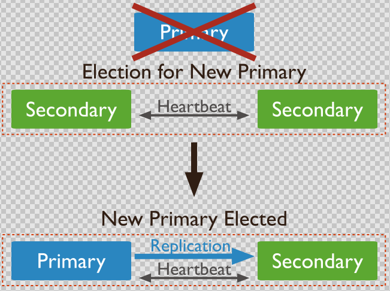

<center><h1>mongod副本集</h1></center>

## 1. 介绍
&#160; &#160; &#160; &#160;MongoDB 副本集（Replica Set）是有自动故障恢复功能的主从集群，有一个Primary节点和一个或多个Secondary节点组成。类似于MySQL的MMM架构。更多关于副本集的介绍请见[官网](https://docs.mongodb.com/manual/replication/)。也可以在google、baidu上查阅。mongodb是一款优秀的nosql软件。因为起点晚，吸取了前辈们的优点，


## 2. 原理
&#160; &#160; &#160; &#160;副本集中数据同步过程：Primary节点写入数据，Secondary通过读取Primary的oplog得到复制信息，开始复制数据并且将复制信息写入到自己的oplog。如果某个操作失败，则备份节点停止从当前数据源复制数据。如果某个备份节点由于某些原因挂掉了，当重新启动后，就会自动从oplog的最后一个操作开始同步，同步完成后，将信息写入自己的oplog，由于复制操作是先复制数据，复制完成后再写入oplog，有可能相同的操作会同步两份，不过MongoDB在设计之初就考虑到这个问题，将oplog的同一个操作执行多次，与执行一次的效果是一样的。简单的说就是：

当Primary节点完成数据操作后，Secondary会做出一系列的动作保证数据的同步

- 1：检查自己local库的oplog.rs集合找出最近的时间戳。
- 2：检查Primary节点local库oplog.rs集合，找出大于此时间戳的记录。
- 3：将找到的记录插入到自己的oplog.rs集合中，并执行这些操作。

&#160; &#160; &#160; &#160;副本集的同步和主从同步一样，都是异步同步的过程，不同的是副本集有个自动故障转移的功能。其原理是：slave端从primary端获取日志，然后在自己身上完全顺序的执行日志所记录的各种操作（该日志是不记录查询操作的），这个日志就是local数据 库中的oplog.rs表，默认在64位机器上这个表是比较大的，占磁盘大小的5%，oplog.rs的大小可以在启动参数中设 定：--oplogSize 1000,单位是M。

> 注意：在副本集的环境中，要是所有的Secondary都宕机了，只剩下Primary。最后Primary会变成Secondary，不能提供服务。

### 2.1 自动切换
集群开始，如下


primary挂了以后




## 3. 部署搭建
### 3.1 环境准备

IP | 主机名|系统|安装软件
---|---|---|---
192.168.178.128 |node3|ubuntu16|mongodb
192.168.178.129 |node2|ubuntu16|mongodb
192.168.178.130 |node1|ubuntu16|mongodb

### 3.2 安装

[官网包](https://www.mongodb.com/download-center/community)

[离线安装文档](https://caimengzhi.github.io/books/linux/nosql/mongo/mongo.index/)

[在线安装文档](https://docs.mongodb.com/manual/tutorial/install-mongodb-on-ubuntu/)

安装
```
sudo apt-key adv --keyserver hkp://keyserver.ubuntu.com:80 --recv 9DA31620334BD75D9DCB49F368818C72E52529D4
echo "deb [ arch=amd64,arm64 ] https://repo.mongodb.org/apt/ubuntu xenial/mongodb-org/4.0 multiverse" | sudo tee /etc/apt/sources.list.d/mongodb-org-4.0.list
sudo apt-get update
sudo apt-get install -y mongodb-org
systemctl start mongod.service
cp /etc/mongod.conf /etc/mongod.conf.ori
sed -i 's/bindIp: 127.0.0.1/bindIp: 0.0.0.0/' /etc/mongod.conf
grep -i 'bindIp' /etc/mongod.conf
systemctl start mongod.service
```
卸载

```
sudo service mongod stop
sudo apt-get purge mongodb-org*
sudo rm -r /var/log/mongodb
sudo rm -r /var/lib/mongodb
```

安装过程

```
root@node1:~# sudo apt-key adv --keyserver hkp://keyserver.ubuntu.com:80 --recv 9DA31620334BD75D9DCB49F368818C72E52529D4
Executing: /tmp/tmp.KG9f1TH9ct/gpg.1.sh --keyserver
hkp://keyserver.ubuntu.com:80
--recv
9DA31620334BD75D9DCB49F368818C72E52529D4
gpg: requesting key E52529D4 from hkp server keyserver.ubuntu.com
gpg: key E52529D4: public key "MongoDB 4.0 Release Signing Key <packaging@mongodb.com>" imported
gpg: Total number processed: 1
gpg:               imported: 1  (RSA: 1)

root@node1:~# echo "deb [ arch=amd64,arm64 ] https://repo.mongodb.org/apt/ubuntu xenial/mongodb-org/4.0 multiverse" | sudo tee /etc/apt/sources.list.d/mongodb-org-4.0.list
deb [ arch=amd64,arm64 ] https://repo.mongodb.org/apt/ubuntu xenial/mongodb-org/4.0 multiverse

root@node1:~# sudo apt-get install -y mongodb-org
Reading package lists... Done
........

root@node1:~# systemctl start mongod.service
Display all 159 possibilities? (y or n)
root@node1:~# systemctl start mongod.service
root@node1:~# systemctl status mongod.service
● mongod.service - MongoDB Database Server
   Loaded: loaded (/lib/systemd/system/mongod.service; disabled; vendor preset: enabled)
   Active: active (running) since Wed 2019-04-03 09:56:57 CST; 6s ago
     Docs: https://docs.mongodb.org/manual
 Main PID: 3301 (mongod)
   CGroup: /system.slice/mongod.service
           └─3301 /usr/bin/mongod --config /etc/mongod.conf

Apr 03 09:56:57 node1 systemd[1]: Started MongoDB Database Server.


root@node1:~# mongo
MongoDB shell version v4.0.6
connecting to: mongodb://127.0.0.1:27017/?gssapiServiceName=mongodb
Implicit session: session { "id" : UUID("acf7e437-8b69-4892-8e8c-cba85de600a0") }
MongoDB server version: 4.0.8
Welcome to the MongoDB shell.
For interactive help, type "help".
For more comprehensive documentation, see
	http://docs.mongodb.org/
Questions? Try the support group
	http://groups.google.com/group/mongodb-user
Server has startup warnings:
2019-04-02T18:56:57.640-0700 I STORAGE  [initandlisten]
2019-04-02T18:56:57.640-0700 I STORAGE  [initandlisten] ** WARNING: Using the XFS filesystem is strongly recommended with the WiredTiger storage engine
2019-04-02T18:56:57.640-0700 I STORAGE  [initandlisten] **          See http://dochub.mongodb.org/core/prodnotes-filesystem
2019-04-02T18:56:58.353-0700 I CONTROL  [initandlisten]
2019-04-02T18:56:58.353-0700 I CONTROL  [initandlisten] ** WARNING: Access control is not enabled for the database.
2019-04-02T18:56:58.353-0700 I CONTROL  [initandlisten] **          Read and write access to data and configuration is unrestricted.
2019-04-02T18:56:58.353-0700 I CONTROL  [initandlisten]
---
Enable MongoDB's free cloud-based monitoring service, which will then receive and display
metrics about your deployment (disk utilization, CPU, operation statistics, etc).

The monitoring data will be available on a MongoDB website with a unique URL accessible to you
and anyone you share the URL with. MongoDB may use this information to make product
improvements and to suggest MongoDB products and deployment options to you.

To enable free monitoring, run the following command: db.enableFreeMonitoring()
To permanently disable this reminder, run the following command: db.disableFreeMonitoring()
---

>
bye
root@node1:~# mongo --help
MongoDB shell version v4.0.6
usage: mongo [options] [db address] [file names (ending in .js)]
db address can be:
  foo                   foo database on local machine
  192.168.0.5/foo       foo database on 192.168.0.5 machine
  192.168.0.5:9999/foo  foo database on 192.168.0.5 machine on port 9999
Options:
  --shell                             run the shell after executing files
  --nodb                              don't connect to mongod on startup - no
                                      'db address' arg expected
  --norc                              will not run the ".mongorc.js" file on
                                      start up
  --quiet                             be less chatty
  --port arg                          port to connect to
  --host arg                          server to connect to
  --eval arg                          evaluate javascript
  -h [ --help ]                       show this usage information
  --version                           show version information
  --verbose                           increase verbosity
  --ipv6                              enable IPv6 support (disabled by default)
  --disableJavaScriptJIT              disable the Javascript Just In Time
                                      compiler
  --enableJavaScriptJIT               enable the Javascript Just In Time
                                      compiler
  --disableJavaScriptProtection       allow automatic JavaScript function
                                      marshalling
  --retryWrites                       automatically retry write operations upon
                                      transient network errors
  --disableImplicitSessions           do not automatically create and use
                                      implicit sessions
  --jsHeapLimitMB arg                 set the js scope's heap size limit

Authentication Options:
  -u [ --username ] arg               username for authentication
  -p [ --password ] arg               password for authentication
  --authenticationDatabase arg        user source (defaults to dbname)
  --authenticationMechanism arg       authentication mechanism
  --gssapiServiceName arg (=mongodb)  Service name to use when authenticating
                                      using GSSAPI/Kerberos
  --gssapiHostName arg                Remote host name to use for purpose of
                                      GSSAPI/Kerberos authentication

file names: a list of files to run. files have to end in .js and will exit after unless --shell is specified
root@node1:~# mongo --quiet   # 静态输出，减少打印
> show dbs;
admin   0.000GB
config  0.000GB
local   0.000GB

root@node1:~# cp /etc/mongod.conf /etc/mongod.conf.ori
root@node1:~# egrep -v '#|^$' /etc/mongod.conf
storage:
  dbPath: /var/lib/mongodb
  journal:
    enabled: true
systemLog:
  destination: file
  logAppend: true
  path: /var/log/mongodb/mongod.log
net:
  port: 27017
  bindIp: 127.0.0.1
processManagement:
  timeZoneInfo: /usr/share/zoneinfo
root@node1:~# sed -i 's/bindIp: 127.0.0.1/bindIp: 0.0.0.0/' /etc/mongod.conf
root@node1:~# grep -i 'bindIp' /etc/mongod.conf
  bindIp: 0.0.0.0
root@node1:~# systemctl restart mongod
```
安装mingodb每个机器都要安装。其他机器安装省略。

### 3.3 配置
#### 3.3.1 配置文件
配置文件最后加
```
replication:
  replSetName: repset
```
mongodb通过这个来组成集群。

!!! note "填坑"
    ```python
    1. mongod的配置文件，有yaml格式也有普通的=格式。
    2. yaml格式的参考 https://docs.mongodb.com/manual/reference/configuration-options/#replication.replSetName
    ```


??? note "node1 配置文件"
    ```python
    root@node1:~# egrep -v '#|^$' /etc/mongod.conf
    storage:
      dbPath: /var/lib/mongodb
      journal:
        enabled: true
    systemLog:
      destination: file
      logAppend: true
      path: /var/log/mongodb/mongod.log
    net:
      port: 27017
      bindIp: 0.0.0.0
    processManagement:
      timeZoneInfo: /usr/share/zoneinfo
    replication:
      replSetName: repset
    ```

??? note "node2 配置文件"
    ```python
    root@node2:~# egrep -v '#|^$' /etc/mongod.conf
    storage:
      dbPath: /var/lib/mongodb
      journal:
        enabled: true
    systemLog:
      destination: file
      logAppend: true
      path: /var/log/mongodb/mongod.log
    net:
      port: 27017
      bindIp: 0.0.0.0
    processManagement:
      timeZoneInfo: /usr/share/zoneinfo
    replication:
      replSetName: repset
    ```

??? note "node3 配置文件"
    ```python
    root@node3:/usr/local/mongo/conf# egrep -v '#|^$' /etc/mongod.conf
    storage:
      dbPath: /var/lib/mongodb
      journal:
        enabled: true
    systemLog:
      destination: file
      logAppend: true
      path: /var/log/mongodb/mongod.log
    net:
      port: 27017
      bindIp: 0.0.0.0
    processManagement:
      timeZoneInfo: /usr/share/zoneinfo
    replication:
      replSetName: repset
    ```
#### 3.3.2 初始化
快速命令
```
rs.initiate() 
rs.conf()
rs.add("node1:27017")  # 集群中添加机器
rs.add("node3:27017")
```
详细过程

```
> rs.initiate()
{
	"info2" : "no configuration specified. Using a default configuration for the set",
	"me" : "node2:27017",
	"ok" : 1,
	"operationTime" : Timestamp(1554258330, 1),
	"$clusterTime" : {
		"clusterTime" : Timestamp(1554258330, 1),
		"signature" : {
			"hash" : BinData(0,"AAAAAAAAAAAAAAAAAAAAAAAAAAA="),
			"keyId" : NumberLong(0)
		}
	}
}
repset:SECONDARY> rs.conf()
{
	"_id" : "repset",
	"version" : 1,
	"protocolVersion" : NumberLong(1),
	"writeConcernMajorityJournalDefault" : true,
	"members" : [
		{
			"_id" : 0,
			"host" : "node2:27017",
			"arbiterOnly" : false,
			"buildIndexes" : true,
			"hidden" : false,
			"priority" : 1,
			"tags" : {

			},
			"slaveDelay" : NumberLong(0),
			"votes" : 1
		}
	],
	"settings" : {
		"chainingAllowed" : true,
		"heartbeatIntervalMillis" : 2000,
		"heartbeatTimeoutSecs" : 10,
		"electionTimeoutMillis" : 10000,
		"catchUpTimeoutMillis" : -1,
		"catchUpTakeoverDelayMillis" : 30000,
		"getLastErrorModes" : {

		},
		"getLastErrorDefaults" : {
			"w" : 1,
			"wtimeout" : 0
		},
		"replicaSetId" : ObjectId("5ca419993f98997dbf343825")
	}
}
repset:PRIMARY> rs.add("node1:27017")
{
	"ok" : 1,
	"operationTime" : Timestamp(1554258349, 1),
	"$clusterTime" : {
		"clusterTime" : Timestamp(1554258349, 1),
		"signature" : {
			"hash" : BinData(0,"AAAAAAAAAAAAAAAAAAAAAAAAAAA="),
			"keyId" : NumberLong(0)
		}
	}
}
repset:PRIMARY> rs.add("node3:27017")
{
	"ok" : 1,
	"operationTime" : Timestamp(1554258369, 1),
	"$clusterTime" : {
		"clusterTime" : Timestamp(1554258369, 1),
		"signature" : {
			"hash" : BinData(0,"AAAAAAAAAAAAAAAAAAAAAAAAAAA="),
			"keyId" : NumberLong(0)
		}
	}
}
repset:PRIMARY> rs.status()
{
	"set" : "repset",
	"date" : ISODate("2019-04-03T02:26:16.610Z"),
	"myState" : 1,
	"term" : NumberLong(1),
	"syncingTo" : "",
	"syncSourceHost" : "",
	"syncSourceId" : -1,
	"heartbeatIntervalMillis" : NumberLong(2000),
	"optimes" : {
		"lastCommittedOpTime" : {
			"ts" : Timestamp(1554258369, 1),
			"t" : NumberLong(1)
		},
		"readConcernMajorityOpTime" : {
			"ts" : Timestamp(1554258369, 1),
			"t" : NumberLong(1)
		},
		"appliedOpTime" : {
			"ts" : Timestamp(1554258369, 1),
			"t" : NumberLong(1)
		},
		"durableOpTime" : {
			"ts" : Timestamp(1554258369, 1),
			"t" : NumberLong(1)
		}
	},
	"lastStableCheckpointTimestamp" : Timestamp(1554258332, 2),
	"members" : [
		{
			"_id" : 0,
			"name" : "node2:27017",
			"health" : 1,
			"state" : 1,
			"stateStr" : "PRIMARY",
			"uptime" : 82,
			"optime" : {
				"ts" : Timestamp(1554258369, 1),
				"t" : NumberLong(1)
			},
			"optimeDate" : ISODate("2019-04-03T02:26:09Z"),
			"syncingTo" : "",
			"syncSourceHost" : "",
			"syncSourceId" : -1,
			"infoMessage" : "could not find member to sync from",
			"electionTime" : Timestamp(1554258330, 2),
			"electionDate" : ISODate("2019-04-03T02:25:30Z"),
			"configVersion" : 3,
			"self" : true,
			"lastHeartbeatMessage" : ""
		},
		{
			"_id" : 1,
			"name" : "node1:27017",
			"health" : 1,
			"state" : 2,
			"stateStr" : "SECONDARY",
			"uptime" : 26,
			"optime" : {
				"ts" : Timestamp(1554258369, 1),
				"t" : NumberLong(1)
			},
			"optimeDurable" : {
				"ts" : Timestamp(1554258369, 1),
				"t" : NumberLong(1)
			},
			"optimeDate" : ISODate("2019-04-03T02:26:09Z"),
			"optimeDurableDate" : ISODate("2019-04-03T02:26:09Z"),
			"lastHeartbeat" : ISODate("2019-04-03T02:26:15.703Z"),
			"lastHeartbeatRecv" : ISODate("2019-04-03T02:26:16.227Z"),
			"pingMs" : NumberLong(1),
			"lastHeartbeatMessage" : "",
			"syncingTo" : "",
			"syncSourceHost" : "",
			"syncSourceId" : -1,
			"infoMessage" : "",
			"configVersion" : 3
		},
		{
			"_id" : 2,
			"name" : "node3:27017",
			"health" : 1,
			"state" : 2,
			"stateStr" : "SECONDARY",
			"uptime" : 6,
			"optime" : {
				"ts" : Timestamp(1554258369, 1),
				"t" : NumberLong(1)
			},
			"optimeDurable" : {
				"ts" : Timestamp(1554258369, 1),
				"t" : NumberLong(1)
			},
			"optimeDate" : ISODate("2019-04-03T02:26:09Z"),
			"optimeDurableDate" : ISODate("2019-04-03T02:26:09Z"),
			"lastHeartbeat" : ISODate("2019-04-03T02:26:15.704Z"),
			"lastHeartbeatRecv" : ISODate("2019-04-03T02:26:16.231Z"),
			"pingMs" : NumberLong(1),
			"lastHeartbeatMessage" : "",
			"syncingTo" : "",
			"syncSourceHost" : "",
			"syncSourceId" : -1,
			"infoMessage" : "",
			"configVersion" : 3
		}
	],
	"ok" : 1,
	"operationTime" : Timestamp(1554258369, 1),
	"$clusterTime" : {
		"clusterTime" : Timestamp(1554258369, 1),
		"signature" : {
			"hash" : BinData(0,"AAAAAAAAAAAAAAAAAAAAAAAAAAA="),
			"keyId" : NumberLong(0)
		}
	}
}
repset:PRIMARY>
bye
```

!!! note "解释"
    ```python
    "_id": 副本集的名称
    "members": 副本集的服务器列表
    "_id": 服务器的唯一ID
    "host": 服务器主机
    "priority": 是优先级，默认为1，优先级0为被动节点，不能成为活跃节点。优先级不位0则按照有大到小选出活跃节点。
    "arbiterOnly": 仲裁节点，只参与投票，不接收数据，也不能成为活跃节点。
    ```

#### 3.3.3 其他命令

```
repset:PRIMARY> rs.
rs.add(                        rs.conf(                       rs.help(                       rs.prototype                   rs.syncFrom(
rs.addArb(                     rs.config(                     rs.initiate(                   rs.reconfig(                   rs.toLocaleString(
rs.apply(                      rs.constructor                 rs.isMaster(                   rs.remove(                     rs.toString(
rs.bind(                       rs.debug                       rs.printReplicationInfo(       rs.slaveOk(                    rs.valueOf(
rs.call(                       rs.freeze(                     rs.printSlaveReplicationInfo(  rs.status(
rs.compareOpTimes(             rs.hasOwnProperty(             rs.propertyIsEnumerable(       rs.stepDown(
repset:PRIMARY> rs.help()
	rs.status()                                { replSetGetStatus : 1 } checks repl set status
	rs.initiate()                              { replSetInitiate : null } initiates set with default settings
	rs.initiate(cfg)                           { replSetInitiate : cfg } initiates set with configuration cfg
	rs.conf()                                  get the current configuration object from local.system.replset
	rs.reconfig(cfg)                           updates the configuration of a running replica set with cfg (disconnects)
	rs.add(hostportstr)                        add a new member to the set with default attributes (disconnects)
	rs.add(membercfgobj)                       add a new member to the set with extra attributes (disconnects)
	rs.addArb(hostportstr)                     add a new member which is arbiterOnly:true (disconnects)
	rs.stepDown([stepdownSecs, catchUpSecs])   step down as primary (disconnects)
	rs.syncFrom(hostportstr)                   make a secondary sync from the given member
	rs.freeze(secs)                            make a node ineligible to become primary for the time specified
	rs.remove(hostportstr)                     remove a host from the replica set (disconnects)
	rs.slaveOk()                               allow queries on secondary nodes

	rs.printReplicationInfo()                  check oplog size and time range
	rs.printSlaveReplicationInfo()             check replica set members and replication lag
	db.isMaster()                              check who is primary

	reconfiguration helpers disconnect from the database so the shell will display
	an error, even if the command succeeds.
```


### 3.4 测试
#### 3.4.1 简单测试
修改配置文件后，重启mongo。登录测试。

```
root@node1:~# mongo --quiet
repset:SECONDARY>

root@node2:~# mongo --quiet
repset:PRIMARY>

root@node3:~# mongo --quiet
repset:SECONDARY>
```
可以看出node2是primary，也就是主。其他两个node1，node3是secondary也就是从。接下来测试。

#### 3.4.3 副本测试

主添加数据，不选择库，默认添加到test库中。

```
repset:PRIMARY> show dbs;
admin   0.000GB
config  0.000GB
local   0.000GB
test    0.000GB
repset:PRIMARY> use test;
switched to db test
repset:PRIMARY> for(var i=0;i<10000;i++){db.test.insert({"name":"caimengzhi"+i,"age":123})}
WriteResult({ "nInserted" : 1 })
repset:PRIMARY> show tables;
col2
test
repset:PRIMARY> db.test.count()
10000
```


从查看
```
repset:SECONDARY> use test;
switched to db test
repset:SECONDARY>  db.test.count()
2019-04-03T13:19:39.080+0800 E QUERY    [js] Error: count failed: {
	"operationTime" : Timestamp(1554268771, 1),
	"ok" : 0,
	"errmsg" : "not master and slaveOk=false",
	"code" : 13435,
	"codeName" : "NotMasterNoSlaveOk",
	"$clusterTime" : {
		"clusterTime" : Timestamp(1554268771, 1),
		"signature" : {
			"hash" : BinData(0,"AAAAAAAAAAAAAAAAAAAAAAAAAAA="),
			"keyId" : NumberLong(0)
		}
	}
} :
_getErrorWithCode@src/mongo/shell/utils.js:25:13
DBQuery.prototype.count@src/mongo/shell/query.js:383:11
DBCollection.prototype.count@src/mongo/shell/collection.js:1431:12
@(shell):1:1
repset:SECONDARY> rs.slaveOk()
repset:SECONDARY> db.test.count()
10000
```

??? danger "注意"
    ```python
    默认从，不能读和写的[rs.slaveOk()  从才可以读]，否则报错如下:
    repset:SECONDARY> show dbs;
    2019-04-02T19:46:28.450-0700 E QUERY    [js] Error: listDatabases failed:{
    	"operationTime" : Timestamp(1554259582, 1),
    	"ok" : 0,
    	"errmsg" : "not master and slaveOk=false",
    	"code" : 13435,
    	"codeName" : "NotMasterNoSlaveOk",
    	"$clusterTime" : {
    		"clusterTime" : Timestamp(1554259582, 1),
    		"signature" : {
    			"hash" : BinData(0,"AAAAAAAAAAAAAAAAAAAAAAAAAAA="),
    			"keyId" : NumberLong(0)
    		}
    	}
    } :
    _getErrorWithCode@src/mongo/shell/utils.js:25:13
    Mongo.prototype.getDBs@src/mongo/shell/mongo.js:139:1
    shellHelper.show@src/mongo/shell/utils.js:882:13
    shellHelper@src/mongo/shell/utils.js:766:15
    @(shellhelp2):1:1
    ```


#### 3.4.3 高可用测试
关闭primary mongo

```
repset:PRIMARY> db.col2.find()
{ "_id" : ObjectId("5ca41e317b1bb7f26e3fb62b"), "name" : "caimengzhi" }
repset:PRIMARY>
root@node2:~# systemctl stop mongod.service
```
查看其他的，期中node1上mongodb自动切换为primary了。node3还是SECONDARY。
```
repset:SECONDARY> show dbs;
admin   0.000GB
config  0.000GB
local   0.000GB
test    0.000GB
repset:PRIMARY>
```
继续测试

```
repset:PRIMARY> db.col2.insert({"name":"可可"})
WriteResult({ "nInserted" : 1 })
repset:PRIMARY> db.col2.find()
{ "_id" : ObjectId("5ca41e317b1bb7f26e3fb62b"), "name" : "caimengzhi" }
{ "_id" : ObjectId("5ca4234d03595133e357b7e7"), "name" : "可可" }

repset:SECONDARY> db.col2.find()
{ "_id" : ObjectId("5ca41e317b1bb7f26e3fb62b"), "name" : "caimengzhi" }
{ "_id" : ObjectId("5ca4234d03595133e357b7e7"), "name" : "可可" }
```
说明完美自动切换了。我再起起点之前的primary mongo，自动会变成secondary。

secondary mongo是不允许写数据的

```
root@node2:~# mongo --quiet
repset:SECONDARY> db.col2.insert({"name":"数据来自secondary"})
WriteCommandError({
	"operationTime" : Timestamp(1554262271, 1),
	"ok" : 0,
	"errmsg" : "not master",
	"code" : 10107,
	"codeName" : "NotMaster",
	"$clusterTime" : {
		"clusterTime" : Timestamp(1554262271, 1),
		"signature" : {
			"hash" : BinData(0,"AAAAAAAAAAAAAAAAAAAAAAAAAAA="),
			"keyId" : NumberLong(0)
		}
	}
})
repset:SECONDARY> db.col2.find()
Error: error: {
	"operationTime" : Timestamp(1554262281, 1),
	"ok" : 0,
	"errmsg" : "not master and slaveOk=false",
	"code" : 13435,
	"codeName" : "NotMasterNoSlaveOk",
	"$clusterTime" : {
		"clusterTime" : Timestamp(1554262281, 1),
		"signature" : {
			"hash" : BinData(0,"AAAAAAAAAAAAAAAAAAAAAAAAAAA="),
			"keyId" : NumberLong(0)
		}
	}
}
repset:SECONDARY> rs.slaveOk()
repset:SECONDARY> db.col2.find()
{ "_id" : ObjectId("5ca41e317b1bb7f26e3fb62b"), "name" : "caimengzhi" }
{ "_id" : ObjectId("5ca4234d03595133e357b7e7"), "name" : "可可" }

```

## 4. 其他测试
### 4.1 删除

```
rs.remove('node2:27017')
```
操作

```
repset:PRIMARY> rs.remove('node2:27017')
{
	"ok" : 1,
	"operationTime" : Timestamp(1554262658, 1),
	"$clusterTime" : {
		"clusterTime" : Timestamp(1554262658, 1),
		"signature" : {
			"hash" : BinData(0,"AAAAAAAAAAAAAAAAAAAAAAAAAAA="),
			"keyId" : NumberLong(0)
		}
	}
}
repset:PRIMARY> rs.status()
{
	"set" : "repset",
	"date" : ISODate("2019-04-03T03:37:41.088Z"),
	"myState" : 1,
	"term" : NumberLong(2),
	"syncingTo" : "",
	"syncSourceHost" : "",
	"syncSourceId" : -1,
	"heartbeatIntervalMillis" : NumberLong(2000),
	"optimes" : {
		"lastCommittedOpTime" : {
			"ts" : Timestamp(1554262658, 1),
			"t" : NumberLong(2)
		},
		"readConcernMajorityOpTime" : {
			"ts" : Timestamp(1554262658, 1),
			"t" : NumberLong(2)
		},
		"appliedOpTime" : {
			"ts" : Timestamp(1554262658, 1),
			"t" : NumberLong(2)
		},
		"durableOpTime" : {
			"ts" : Timestamp(1554262658, 1),
			"t" : NumberLong(2)
		}
	},
	"lastStableCheckpointTimestamp" : Timestamp(1554262621, 1),
	"members" : [
		{
			"_id" : 1,
			"name" : "node1:27017",
			"health" : 1,
			"state" : 1,
			"stateStr" : "PRIMARY",
			"uptime" : 4382,
			"optime" : {
				"ts" : Timestamp(1554262658, 1),
				"t" : NumberLong(2)
			},
			"optimeDate" : ISODate("2019-04-03T03:37:38Z"),
			"syncingTo" : "",
			"syncSourceHost" : "",
			"syncSourceId" : -1,
			"infoMessage" : "",
			"electionTime" : Timestamp(1554260529, 1),
			"electionDate" : ISODate("2019-04-03T03:02:09Z"),
			"configVersion" : 4,
			"self" : true,
			"lastHeartbeatMessage" : ""
		},
		{
			"_id" : 2,
			"name" : "node3:27017",
			"health" : 1,
			"state" : 2,
			"stateStr" : "SECONDARY",
			"uptime" : 2822,
			"optime" : {
				"ts" : Timestamp(1554262658, 1),
				"t" : NumberLong(2)
			},
			"optimeDurable" : {
				"ts" : Timestamp(1554262658, 1),
				"t" : NumberLong(2)
			},
			"optimeDate" : ISODate("2019-04-03T03:37:38Z"),
			"optimeDurableDate" : ISODate("2019-04-03T03:37:38Z"),
			"lastHeartbeat" : ISODate("2019-04-03T03:37:40.489Z"),
			"lastHeartbeatRecv" : ISODate("2019-04-03T03:37:40.999Z"),
			"pingMs" : NumberLong(1),
			"lastHeartbeatMessage" : "",
			"syncingTo" : "",
			"syncSourceHost" : "",
			"syncSourceId" : -1,
			"infoMessage" : "",
			"configVersion" : 4
		}
	],
	"ok" : 1,
	"operationTime" : Timestamp(1554262658, 1),
	"$clusterTime" : {
		"clusterTime" : Timestamp(1554262658, 1),
		"signature" : {
			"hash" : BinData(0,"AAAAAAAAAAAAAAAAAAAAAAAAAAA="),
			"keyId" : NumberLong(0)
		}
	}
}
```

### 4.2 添加
要是新的机器想添加到集群中，只有配置好配置文件，然后启动在primary mongodb上加入该机器即可。
上节吧node2剔除集群了。现在我们假设node2是新的机器。然后加入集群即可。
```
rs.add("node2:27017")
```


操作
```
repset:PRIMARY> rs.add("node2:27017")
{
	"ok" : 1,
	"operationTime" : Timestamp(1554262759, 1),
	"$clusterTime" : {
		"clusterTime" : Timestamp(1554262759, 1),
		"signature" : {
			"hash" : BinData(0,"AAAAAAAAAAAAAAAAAAAAAAAAAAA="),
			"keyId" : NumberLong(0)
		}
	}
}

repset:PRIMARY> rs.status()
{
	"set" : "repset",
	"date" : ISODate("2019-04-03T03:39:21.715Z"),
	"myState" : 1,
	"term" : NumberLong(2),
	"syncingTo" : "",
	"syncSourceHost" : "",
	"syncSourceId" : -1,
	"heartbeatIntervalMillis" : NumberLong(2000),
	"optimes" : {
		"lastCommittedOpTime" : {
			"ts" : Timestamp(1554262751, 1),
			"t" : NumberLong(2)
		},
		"appliedOpTime" : {
			"ts" : Timestamp(1554262759, 1),
			"t" : NumberLong(2)
		},
		"durableOpTime" : {
			"ts" : Timestamp(1554262759, 1),
			"t" : NumberLong(2)
		}
	},
	"lastStableCheckpointTimestamp" : Timestamp(1554262741, 1),
	"members" : [
		{
			"_id" : 1,
			"name" : "node1:27017",
			"health" : 1,
			"state" : 1,
			"stateStr" : "PRIMARY",
			"uptime" : 4482,
			"optime" : {
				"ts" : Timestamp(1554262759, 1),
				"t" : NumberLong(2)
			},
			"optimeDate" : ISODate("2019-04-03T03:39:19Z"),
			"syncingTo" : "",
			"syncSourceHost" : "",
			"syncSourceId" : -1,
			"infoMessage" : "",
			"electionTime" : Timestamp(1554260529, 1),
			"electionDate" : ISODate("2019-04-03T03:02:09Z"),
			"configVersion" : 5,
			"self" : true,
			"lastHeartbeatMessage" : ""
		},
		{
			"_id" : 2,
			"name" : "node3:27017",
			"health" : 1,
			"state" : 2,
			"stateStr" : "SECONDARY",
			"uptime" : 2923,
			"optime" : {
				"ts" : Timestamp(1554262751, 1),
				"t" : NumberLong(2)
			},
			"optimeDurable" : {
				"ts" : Timestamp(1554262751, 1),
				"t" : NumberLong(2)
			},
			"optimeDate" : ISODate("2019-04-03T03:39:11Z"),
			"optimeDurableDate" : ISODate("2019-04-03T03:39:11Z"),
			"lastHeartbeat" : ISODate("2019-04-03T03:39:19.762Z"),
			"lastHeartbeatRecv" : ISODate("2019-04-03T03:39:21.274Z"),
			"pingMs" : NumberLong(18),
			"lastHeartbeatMessage" : "",
			"syncingTo" : "node1:27017",
			"syncSourceHost" : "node1:27017",
			"syncSourceId" : 1,
			"infoMessage" : "",
			"configVersion" : 4
		},
		{
			"_id" : 3,
			"name" : "node2:27017",
			"health" : 0,
			"state" : 8,
			"stateStr" : "(not reachable/healthy)",
			"uptime" : 0,
			"optime" : {
				"ts" : Timestamp(0, 0),
				"t" : NumberLong(-1)
			},
			"optimeDurable" : {
				"ts" : Timestamp(0, 0),
				"t" : NumberLong(-1)
			},
			"optimeDate" : ISODate("1970-01-01T00:00:00Z"),
			"optimeDurableDate" : ISODate("1970-01-01T00:00:00Z"),
			"lastHeartbeat" : ISODate("2019-04-03T03:39:19.765Z"),
			"lastHeartbeatRecv" : ISODate("2019-04-03T03:39:21.534Z"),
			"pingMs" : NumberLong(0),
			"lastHeartbeatMessage" : "Our replica set configuration is invalid or does not include us",
			"syncingTo" : "",
			"syncSourceHost" : "",
			"syncSourceId" : -1,
			"infoMessage" : "",
			"configVersion" : -1
		}
	],
	"ok" : 1,
	"operationTime" : Timestamp(1554262759, 1),
	"$clusterTime" : {
		"clusterTime" : Timestamp(1554262759, 1),
		"signature" : {
			"hash" : BinData(0,"AAAAAAAAAAAAAAAAAAAAAAAAAAA="),
			"keyId" : NumberLong(0)
		}
	}
}
```

### 4.3 查看复制的情况
```
repset:PRIMARY>  db.printSlaveReplicationInfo()
source: node3:27017
	syncedTo: Wed Apr 03 2019 13:10:21 GMT+0800 (CST)
	0 secs (0 hrs) behind the primary
source: node2:27017
	syncedTo: Wed Apr 03 2019 13:10:21 GMT+0800 (CST)
	0 secs (0 hrs) behind the primary
```

!!! note "解释"
    ```python
    source：从库的ip和端口。
    syncedTo：目前的同步情况，以及最后一次同步的时间。
    从上面可以看出，在数据库内容不变的情况下他是不同步的，数据库变动就会马上同步
    ```


### 4.4 查看副本集配置
```
repset:PRIMARY> rs.conf()
{
	"_id" : "repset",
	"version" : 5,
	"protocolVersion" : NumberLong(1),
	"writeConcernMajorityJournalDefault" : true,
	"members" : [
		{
			"_id" : 1,
			"host" : "node1:27017",
			"arbiterOnly" : false,
			"buildIndexes" : true,
			"hidden" : false,
			"priority" : 1,
			"tags" : {

			},
			"slaveDelay" : NumberLong(0),
			"votes" : 1
		},
		{
			"_id" : 2,
			"host" : "node3:27017",
			"arbiterOnly" : false,
			"buildIndexes" : true,
			"hidden" : false,
			"priority" : 1,
			"tags" : {

			},
			"slaveDelay" : NumberLong(0),
			"votes" : 1
		},
		{
			"_id" : 3,
			"host" : "node2:27017",
			"arbiterOnly" : false,
			"buildIndexes" : true,
			"hidden" : false,
			"priority" : 1,
			"tags" : {

			},
			"slaveDelay" : NumberLong(0),
			"votes" : 1
		}
	],
	"settings" : {
		"chainingAllowed" : true,
		"heartbeatIntervalMillis" : 2000,
		"heartbeatTimeoutSecs" : 10,
		"electionTimeoutMillis" : 10000,
		"catchUpTimeoutMillis" : -1,
		"catchUpTakeoverDelayMillis" : 30000,
		"getLastErrorModes" : {

		},
		"getLastErrorDefaults" : {
			"w" : 1,
			"wtimeout" : 0
		},
		"replicaSetId" : ObjectId("5ca419993f98997dbf343825")
	}
}
```

### 4.5 注意
```
所有的Secondary都宕机、或则副本集中只剩下一个节点，则该节点只能为Secondary节点，也就意味着整个集群智能进行读操作而不能进行写操作，当其他的恢复时，之前的primary节点仍然是primary节点。
当某个节点宕机后重新启动该节点会有一段的时间（时间长短视集群的数据量和宕机时间而定）导致整个集群中所有节点都成为secondary而无法进行写操作（如果应用程序没有设置相应的ReadReference也可能不能进行读取操作）。
官方推荐的最小的副本集也应该具备一个primary节点和两个secondary节点。两个节点的副本集不具备真正的故障转移能力。
```

## 5. 应用
### 5.1 手动切换
手动切换Primary节点到自己给定的节点，上面已经提到过了优先集priority，因为默认的都是1，所以只需要把给定的服务器的priority加到最大即可。

??? note "查看priority"
    ```python
    repset:SECONDARY> rs.conf()
    {
    	"_id" : "repset",
    	"version" : 5,
    	"protocolVersion" : NumberLong(1),
    	"writeConcernMajorityJournalDefault" : true,
    	"members" : [
    		{
    			"_id" : 1,
    			"host" : "node1:27017",
    			"arbiterOnly" : false,
    			"buildIndexes" : true,
    			"hidden" : false,
    			"priority" : 1,
    			"tags" : {
    
    			},
    			"slaveDelay" : NumberLong(0),
    			"votes" : 1
    		},
    		{
    			"_id" : 2,
    			"host" : "node3:27017",
    			"arbiterOnly" : false,
    			"buildIndexes" : true,
    			"hidden" : false,
    			"priority" : 1,
    			"tags" : {
    
    			},
    			"slaveDelay" : NumberLong(0),
    			"votes" : 1
    		},
    		{
    			"_id" : 3,
    			"host" : "node2:27017",
    			"arbiterOnly" : false,
    			"buildIndexes" : true,
    			"hidden" : false,
    			"priority" : 1,
    			"tags" : {
    
    			},
    			"slaveDelay" : NumberLong(0),
    			"votes" : 1
    		}
    	],
    	"settings" : {
    		"chainingAllowed" : true,
    		"heartbeatIntervalMillis" : 2000,
    		"heartbeatTimeoutSecs" : 10,
    		"electionTimeoutMillis" : 10000,
    		"catchUpTimeoutMillis" : -1,
    		"catchUpTakeoverDelayMillis" : 30000,
    		"getLastErrorModes" : {
    
    		},
    		"getLastErrorDefaults" : {
    			"w" : 1,
    			"wtimeout" : 0
    		},
    		"replicaSetId" : ObjectId("5ca419993f98997dbf343825")
    	}
    }
    ```

先查看谁是primary

??? note "查看谁是primary"
    ```python
    repset:SECONDARY> rs.isMaster()
    {
    	"hosts" : [
    		"node1:27017",
    		"node3:27017",
    		"node2:27017"
    	],
    	"setName" : "repset",
    	"setVersion" : 5,
    	"ismaster" : false,
    	"secondary" : true,
    	"primary" : "node1:27017",
    	"me" : "node2:27017",
    	"lastWrite" : {
    		"opTime" : {
    			"ts" : Timestamp(1554269251, 1),
    			"t" : NumberLong(2)
    		},
    		"lastWriteDate" : ISODate("2019-04-03T05:27:31Z"),
    		"majorityOpTime" : {
    			"ts" : Timestamp(1554269251, 1),
    			"t" : NumberLong(2)
    		},
    		"majorityWriteDate" : ISODate("2019-04-03T05:27:31Z")
    	},
    	"maxBsonObjectSize" : 16777216,
    	"maxMessageSizeBytes" : 48000000,
    	"maxWriteBatchSize" : 100000,
    	"localTime" : ISODate("2019-04-03T05:27:34.165Z"),
    	"logicalSessionTimeoutMinutes" : 30,
    	"minWireVersion" : 0,
    	"maxWireVersion" : 7,
    	"readOnly" : false,
    	"ok" : 1,
    	"operationTime" : Timestamp(1554269251, 1),
    	"$clusterTime" : {
    		"clusterTime" : Timestamp(1554269251, 1),
    		"signature" : {
    			"hash" : BinData(0,"AAAAAAAAAAAAAAAAAAAAAAAAAAA="),
    			"keyId" : NumberLong(0)
    		}
    	}
    }
    可以看出node1此时为primary身份。
    ```
此时我们让手动让node2位primary

```
cfg=rs.conf()
cfg.members[2].priority=2
rs.reconfig(cfg) # 重新加载配置文件，强制了副本集进行一次选举，优先级高的成为Primary。在这之间整个集群的所有节点都是secondary
rs.status()
```
??? note "怎么分辨node2的是哪个"
    ```python
    1. cfg.members[2].priority=2 是修改node2的优先级是2[默认大家都是1]，这样node2是>1的话，优先级就高，这样就重新选举后node2会是parimary
    2. 怎么看出node2是2呢?
        rs.status() 查看结果的时候期中"members" 后面是数组，node2在第三位所以是2[下标是0开始计算]
    ```


操作过程

```
repset:PRIMARY> cfg=rs.conf()
{
	"_id" : "repset",
	"version" : 5,
	"protocolVersion" : NumberLong(1),
	"writeConcernMajorityJournalDefault" : true,
	"members" : [
		{
			"_id" : 1,
			"host" : "node1:27017",
			"arbiterOnly" : false,
			"buildIndexes" : true,
			"hidden" : false,
			"priority" : 1,
			"tags" : {

			},
			"slaveDelay" : NumberLong(0),
			"votes" : 1
		},
		{
			"_id" : 2,
			"host" : "node3:27017",
			"arbiterOnly" : false,
			"buildIndexes" : true,
			"hidden" : false,
			"priority" : 1,
			"tags" : {

			},
			"slaveDelay" : NumberLong(0),
			"votes" : 1
		},
		{
			"_id" : 3,
			"host" : "node2:27017",
			"arbiterOnly" : false,
			"buildIndexes" : true,
			"hidden" : false,
			"priority" : 1,
			"tags" : {

			},
			"slaveDelay" : NumberLong(0),
			"votes" : 1
		}
	],
	"settings" : {
		"chainingAllowed" : true,
		"heartbeatIntervalMillis" : 2000,
		"heartbeatTimeoutSecs" : 10,
		"electionTimeoutMillis" : 10000,
		"catchUpTimeoutMillis" : -1,
		"catchUpTakeoverDelayMillis" : 30000,
		"getLastErrorModes" : {

		},
		"getLastErrorDefaults" : {
			"w" : 1,
			"wtimeout" : 0
		},
		"replicaSetId" : ObjectId("5ca419993f98997dbf343825")
	}
}

repset:PRIMARY> cfg.members[2].priority=2
2

repset:PRIMARY> rs.reconfig(cfg)
{
	"ok" : 1,
	"operationTime" : Timestamp(1554270041, 1),
	"$clusterTime" : {
		"clusterTime" : Timestamp(1554270041, 1),
		"signature" : {
			"hash" : BinData(0,"AAAAAAAAAAAAAAAAAAAAAAAAAAA="),
			"keyId" : NumberLong(0)
		}
	}
}

repset:SECONDARY> rs.isMaster()
{
	"hosts" : [
		"node1:27017",
		"node3:27017",
		"node2:27017"
	],
	"setName" : "repset",
	"setVersion" : 6,
	"ismaster" : false,
	"secondary" : true,
	"primary" : "node2:27017",
	"me" : "node1:27017",
	"lastWrite" : {
		"opTime" : {
			"ts" : Timestamp(1554270083, 1),
			"t" : NumberLong(3)
		},
		"lastWriteDate" : ISODate("2019-04-03T05:41:23Z"),
		"majorityOpTime" : {
			"ts" : Timestamp(1554270083, 1),
			"t" : NumberLong(3)
		},
		"majorityWriteDate" : ISODate("2019-04-03T05:41:23Z")
	},
	"maxBsonObjectSize" : 16777216,
	"maxMessageSizeBytes" : 48000000,
	"maxWriteBatchSize" : 100000,
	"localTime" : ISODate("2019-04-03T05:41:31.133Z"),
	"logicalSessionTimeoutMinutes" : 30,
	"minWireVersion" : 0,
	"maxWireVersion" : 7,
	"readOnly" : false,
	"ok" : 1,
	"operationTime" : Timestamp(1554270083, 1),
	"$clusterTime" : {
		"clusterTime" : Timestamp(1554270083, 1),
		"signature" : {
			"hash" : BinData(0,"AAAAAAAAAAAAAAAAAAAAAAAAAAA="),
			"keyId" : NumberLong(0)
		}
	}
}
```
给定的node2服务器就成为了primary节点。


### 5.2 添加备份节点
hidden（成员用于支持专用功能）：这样设置后此机器在读写中都不可见，并且不会被选举为Primary，但是可以投票，一般用于备份数据。把node3节点删除，重启。再添加让其为hidden节点：

??? note "删除node3"
    ```pythn
    repset:PRIMARY> rs.status()
    {
    	"set" : "repset",
    	"date" : ISODate("2019-04-03T05:49:19.032Z"),
    	"myState" : 1,
    	"term" : NumberLong(3),
    	"syncingTo" : "",
    	"syncSourceHost" : "",
    	"syncSourceId" : -1,
    	"heartbeatIntervalMillis" : NumberLong(2000),
    	"optimes" : {
    		"lastCommittedOpTime" : {
    			"ts" : Timestamp(1554270553, 1),
    			"t" : NumberLong(3)
    		},
    		"readConcernMajorityOpTime" : {
    			"ts" : Timestamp(1554270553, 1),
    			"t" : NumberLong(3)
    		},
    		"appliedOpTime" : {
    			"ts" : Timestamp(1554270553, 1),
    			"t" : NumberLong(3)
    		},
    		"durableOpTime" : {
    			"ts" : Timestamp(1554270553, 1),
    			"t" : NumberLong(3)
    		}
    	},
    	"lastStableCheckpointTimestamp" : Timestamp(1554270513, 1),
    	"members" : [
    		{
    			"_id" : 1,
    			"name" : "node1:27017",
    			"health" : 1,
    			"state" : 2,
    			"stateStr" : "SECONDARY",
    			"uptime" : 7799,
    			"optime" : {
    				"ts" : Timestamp(1554270553, 1),
    				"t" : NumberLong(3)
    			},
    			"optimeDurable" : {
    				"ts" : Timestamp(1554270553, 1),
    				"t" : NumberLong(3)
    			},
    			"optimeDate" : ISODate("2019-04-03T05:49:13Z"),
    			"optimeDurableDate" : ISODate("2019-04-03T05:49:13Z"),
    			"lastHeartbeat" : ISODate("2019-04-03T05:49:17.784Z"),
    			"lastHeartbeatRecv" : ISODate("2019-04-03T05:49:18.505Z"),
    			"pingMs" : NumberLong(0),
    			"lastHeartbeatMessage" : "",
    			"syncingTo" : "node2:27017",
    			"syncSourceHost" : "node2:27017",
    			"syncSourceId" : 3,
    			"infoMessage" : "",
    			"configVersion" : 6
    		},
    		{
    			"_id" : 2,
    			"name" : "node3:27017",
    			"health" : 1,
    			"state" : 2,
    			"stateStr" : "SECONDARY",
    			"uptime" : 7799,
    			"optime" : {
    				"ts" : Timestamp(1554270553, 1),
    				"t" : NumberLong(3)
    			},
    			"optimeDurable" : {
    				"ts" : Timestamp(1554270553, 1),
    				"t" : NumberLong(3)
    			},
    			"optimeDate" : ISODate("2019-04-03T05:49:13Z"),
    			"optimeDurableDate" : ISODate("2019-04-03T05:49:13Z"),
    			"lastHeartbeat" : ISODate("2019-04-03T05:49:17.780Z"),
    			"lastHeartbeatRecv" : ISODate("2019-04-03T05:49:18.574Z"),
    			"pingMs" : NumberLong(1),
    			"lastHeartbeatMessage" : "",
    			"syncingTo" : "node2:27017",
    			"syncSourceHost" : "node2:27017",
    			"syncSourceId" : 3,
    			"infoMessage" : "",
    			"configVersion" : 6
    		},
    		{
    			"_id" : 3,
    			"name" : "node2:27017",
    			"health" : 1,
    			"state" : 1,
    			"stateStr" : "PRIMARY",
    			"uptime" : 8506,
    			"optime" : {
    				"ts" : Timestamp(1554270553, 1),
    				"t" : NumberLong(3)
    			},
    			"optimeDate" : ISODate("2019-04-03T05:49:13Z"),
    			"syncingTo" : "",
    			"syncSourceHost" : "",
    			"syncSourceId" : -1,
    			"infoMessage" : "",
    			"electionTime" : Timestamp(1554270051, 1),
    			"electionDate" : ISODate("2019-04-03T05:40:51Z"),
    			"configVersion" : 6,
    			"self" : true,
    			"lastHeartbeatMessage" : ""
    		}
    	],
    	"ok" : 1,
    	"operationTime" : Timestamp(1554270553, 1),
    	"$clusterTime" : {
    		"clusterTime" : Timestamp(1554270553, 1),
    		"signature" : {
    			"hash" : BinData(0,"AAAAAAAAAAAAAAAAAAAAAAAAAAA="),
    			"keyId" : NumberLong(0)
    		}
    	}
    }
    repset:PRIMARY> rs.remove('node3:27017')
    {
    	"ok" : 1,
    	"operationTime" : Timestamp(1554270578, 1),
    	"$clusterTime" : {
    		"clusterTime" : Timestamp(1554270578, 1),
    		"signature" : {
    			"hash" : BinData(0,"AAAAAAAAAAAAAAAAAAAAAAAAAAA="),
    			"keyId" : NumberLong(0)
    		}
    	}
    }
    repset:PRIMARY> rs.status()
    {
    	"set" : "repset",
    	"date" : ISODate("2019-04-03T05:49:40.382Z"),
    	"myState" : 1,
    	"term" : NumberLong(3),
    	"syncingTo" : "",
    	"syncSourceHost" : "",
    	"syncSourceId" : -1,
    	"heartbeatIntervalMillis" : NumberLong(2000),
    	"optimes" : {
    		"lastCommittedOpTime" : {
    			"ts" : Timestamp(1554270578, 1),
    			"t" : NumberLong(3)
    		},
    		"readConcernMajorityOpTime" : {
    			"ts" : Timestamp(1554270578, 1),
    			"t" : NumberLong(3)
    		},
    		"appliedOpTime" : {
    			"ts" : Timestamp(1554270578, 1),
    			"t" : NumberLong(3)
    		},
    		"durableOpTime" : {
    			"ts" : Timestamp(1554270578, 1),
    			"t" : NumberLong(3)
    		}
    	},
    	"lastStableCheckpointTimestamp" : Timestamp(1554270573, 1),
    	"members" : [
    		{
    			"_id" : 1,
    			"name" : "node1:27017",
    			"health" : 1,
    			"state" : 2,
    			"stateStr" : "SECONDARY",
    			"uptime" : 7820,
    			"optime" : {
    				"ts" : Timestamp(1554270573, 1),
    				"t" : NumberLong(3)
    			},
    			"optimeDurable" : {
    				"ts" : Timestamp(1554270573, 1),
    				"t" : NumberLong(3)
    			},
    			"optimeDate" : ISODate("2019-04-03T05:49:33Z"),
    			"optimeDurableDate" : ISODate("2019-04-03T05:49:33Z"),
    			"lastHeartbeat" : ISODate("2019-04-03T05:49:38.560Z"),
    			"lastHeartbeatRecv" : ISODate("2019-04-03T05:49:38.565Z"),
    			"pingMs" : NumberLong(0),
    			"lastHeartbeatMessage" : "",
    			"syncingTo" : "node2:27017",
    			"syncSourceHost" : "node2:27017",
    			"syncSourceId" : 3,
    			"infoMessage" : "",
    			"configVersion" : 6
    		},
    		{
    			"_id" : 3,
    			"name" : "node2:27017",
    			"health" : 1,
    			"state" : 1,
    			"stateStr" : "PRIMARY",
    			"uptime" : 8527,
    			"optime" : {
    				"ts" : Timestamp(1554270578, 1),
    				"t" : NumberLong(3)
    			},
    			"optimeDate" : ISODate("2019-04-03T05:49:38Z"),
    			"syncingTo" : "",
    			"syncSourceHost" : "",
    			"syncSourceId" : -1,
    			"infoMessage" : "",
    			"electionTime" : Timestamp(1554270051, 1),
    			"electionDate" : ISODate("2019-04-03T05:40:51Z"),
    			"configVersion" : 7,
    			"self" : true,
    			"lastHeartbeatMessage" : ""
    		}
    	],
    	"ok" : 1,
    	"operationTime" : Timestamp(1554270578, 1),
    	"$clusterTime" : {
    		"clusterTime" : Timestamp(1554270578, 1),
    		"signature" : {
    			"hash" : BinData(0,"AAAAAAAAAAAAAAAAAAAAAAAAAAA="),
    			"keyId" : NumberLong(0)
    		}
    	}
    }
    ```

添加备用节点[hidden隐藏]

```
repset:PRIMARY> rs.add({"host":"node3:27017","priority":0,"hidden":true})
{
	"ok" : 1,
	"operationTime" : Timestamp(1554270639, 1),
	"$clusterTime" : {
		"clusterTime" : Timestamp(1554270639, 1),
		"signature" : {
			"hash" : BinData(0,"AAAAAAAAAAAAAAAAAAAAAAAAAAA="),
			"keyId" : NumberLong(0)
		}
	}
}
```
查看状态

```
repset:PRIMARY> rs.conf()
{
	"_id" : "repset",
	"version" : 8,
	"protocolVersion" : NumberLong(1),
	"writeConcernMajorityJournalDefault" : true,
	"members" : [
		{
			"_id" : 1,
			"host" : "node1:27017",
			"arbiterOnly" : false,
			"buildIndexes" : true,
			"hidden" : false,
			"priority" : 1,
			"tags" : {

			},
			"slaveDelay" : NumberLong(0),
			"votes" : 1
		},
		{
			"_id" : 3,
			"host" : "node2:27017",
			"arbiterOnly" : false,
			"buildIndexes" : true,
			"hidden" : false,
			"priority" : 2,
			"tags" : {

			},
			"slaveDelay" : NumberLong(0),
			"votes" : 1
		},
		{
			"_id" : 4,
			"host" : "node3:27017",
			"arbiterOnly" : false,
			"buildIndexes" : true,
			"hidden" : true,
			"priority" : 0,
			"tags" : {

			},
			"slaveDelay" : NumberLong(0),
			"votes" : 1
		}
	],
	"settings" : {
		"chainingAllowed" : true,
		"heartbeatIntervalMillis" : 2000,
		"heartbeatTimeoutSecs" : 10,
		"electionTimeoutMillis" : 10000,
		"catchUpTimeoutMillis" : -1,
		"catchUpTakeoverDelayMillis" : 30000,
		"getLastErrorModes" : {

		},
		"getLastErrorDefaults" : {
			"w" : 1,
			"wtimeout" : 0
		},
		"replicaSetId" : ObjectId("5ca419993f98997dbf343825")
	}
}
```
测试其能否参与投票：关闭当前的Primary，查看是否自动转移Primary

```
repset:PRIMARY> use admin
switched to db admin
repset:PRIMARY> db.shutdownServer()
server should be down...
2019-04-03T13:57:22.020+0800 I NETWORK  [js] trying reconnect to 127.0.0.1:27017 failed
2019-04-03T13:57:22.601+0800 I NETWORK  [js] reconnect 127.0.0.1:27017 failed failed
2019-04-03T13:57:22.604+0800 I NETWORK  [js] trying reconnect to 127.0.0.1:27017 failed
2019-04-03T13:57:22.604+0800 I NETWORK  [js] reconnect 127.0.0.1:27017 failed failed
```

链接另一个服务器[随便哪个secondary节点]看看

??? note "查看node1"
    ```python
    repset:SECONDARY> rs.status()
    {
    	"set" : "repset",
    	"date" : ISODate("2019-04-03T05:57:43.329Z"),
    	"myState" : 1,
    	"term" : NumberLong(4),
    	"syncingTo" : "",
    	"syncSourceHost" : "",
    	"syncSourceId" : -1,
    	"heartbeatIntervalMillis" : NumberLong(2000),
    	"optimes" : {
    		"lastCommittedOpTime" : {
    			"ts" : Timestamp(1554271063, 1),
    			"t" : NumberLong(4)
    		},
    		"readConcernMajorityOpTime" : {
    			"ts" : Timestamp(1554271063, 1),
    			"t" : NumberLong(4)
    		},
    		"appliedOpTime" : {
    			"ts" : Timestamp(1554271063, 1),
    			"t" : NumberLong(4)
    		},
    		"durableOpTime" : {
    			"ts" : Timestamp(1554271063, 1),
    			"t" : NumberLong(4)
    		}
    	},
    	"lastStableCheckpointTimestamp" : Timestamp(1554271023, 1),
    	"members" : [
    		{
    			"_id" : 1,
    			"name" : "node1:27017",
    			"health" : 1,
    			"state" : 1,
    			"stateStr" : "PRIMARY",
    			"uptime" : 12784,
    			"optime" : {
    				"ts" : Timestamp(1554271063, 1),
    				"t" : NumberLong(4)
    			},
    			"optimeDate" : ISODate("2019-04-03T05:57:43Z"),
    			"syncingTo" : "",
    			"syncSourceHost" : "",
    			"syncSourceId" : -1,
    			"infoMessage" : "",
    			"electionTime" : Timestamp(1554271042, 1),
    			"electionDate" : ISODate("2019-04-03T05:57:22Z"),
    			"configVersion" : 8,
    			"self" : true,
    			"lastHeartbeatMessage" : ""
    		},
    		{
    			"_id" : 3,
    			"name" : "node2:27017",
    			"health" : 0,
    			"state" : 8,
    			"stateStr" : "(not reachable/healthy)",
    			"uptime" : 0,
    			"optime" : {
    				"ts" : Timestamp(0, 0),
    				"t" : NumberLong(-1)
    			},
    			"optimeDurable" : {
    				"ts" : Timestamp(0, 0),
    				"t" : NumberLong(-1)
    			},
    			"optimeDate" : ISODate("1970-01-01T00:00:00Z"),
    			"optimeDurableDate" : ISODate("1970-01-01T00:00:00Z"),
    			"lastHeartbeat" : ISODate("2019-04-03T05:57:42.073Z"),
    			"lastHeartbeatRecv" : ISODate("2019-04-03T05:57:21.280Z"),
    			"pingMs" : NumberLong(0),
    			"lastHeartbeatMessage" : "Error connecting to node2:27017 (192.168.178.129:27017) :: caused by :: Connection refused",
    			"syncingTo" : "",
    			"syncSourceHost" : "",
    			"syncSourceId" : -1,
    			"infoMessage" : "",
    			"configVersion" : -1
    		},
    		{
    			"_id" : 4,
    			"name" : "node3:27017",
    			"health" : 1,
    			"state" : 2,
    			"stateStr" : "SECONDARY",
    			"uptime" : 423,
    			"optime" : {
    				"ts" : Timestamp(1554271053, 1),
    				"t" : NumberLong(4)
    			},
    			"optimeDurable" : {
    				"ts" : Timestamp(1554271053, 1),
    				"t" : NumberLong(4)
    			},
    			"optimeDate" : ISODate("2019-04-03T05:57:33Z"),
    			"optimeDurableDate" : ISODate("2019-04-03T05:57:33Z"),
    			"lastHeartbeat" : ISODate("2019-04-03T05:57:42.033Z"),
    			"lastHeartbeatRecv" : ISODate("2019-04-03T05:57:42.614Z"),
    			"pingMs" : NumberLong(0),
    			"lastHeartbeatMessage" : "",
    			"syncingTo" : "node1:27017",
    			"syncSourceHost" : "node1:27017",
    			"syncSourceId" : 1,
    			"infoMessage" : "",
    			"configVersion" : 8
    		}
    	],
    	"ok" : 1,
    	"operationTime" : Timestamp(1554271063, 1),
    	"$clusterTime" : {
    		"clusterTime" : Timestamp(1554271063, 1),
    		"signature" : {
    			"hash" : BinData(0,"AAAAAAAAAAAAAAAAAAAAAAAAAAA="),
    			"keyId" : NumberLong(0)
    		}
    	}
    }
    ```
上面说明Primary已经转移，说明hidden具有投票的权利，继续查看是否有数据复制的功能。

在看下是否复制

```
repset:PRIMARY> db.test.count()
10000
repset:PRIMARY> use test
switched to db test
repset:PRIMARY> for(var i=0;i<90;i++){db.test.insert({"name":"keke"+i,"age":123})}
WriteResult({ "nInserted" : 1 })
repset:PRIMARY>  db.test.count()
10090

查看
repset:SECONDARY> use test;
switched to db test
repset:SECONDARY> db.test.count()
10090
```
上面说明hidden具有数据复制的功能。


### 5.3 添加延时节点
#### 5.3.1 操作
Delayed（成员用于支持专用功能）：可以指定一个时间延迟从primary节点同步数据。主要用于处理误删除数据马上同步到从节点导致的不一致问题。

我们把node3，也就是上面的隐藏节点删除，然后再以延时节点添加进来。

??? note "删除node3"
    ```python
    repset:PRIMARY> rs.remove('node3:27017')
    {
    	"ok" : 1,
    	"operationTime" : Timestamp(1554271650, 1),
    	"$clusterTime" : {
    		"clusterTime" : Timestamp(1554271650, 1),
    		"signature" : {
    			"hash" : BinData(0,"AAAAAAAAAAAAAAAAAAAAAAAAAAA="),
    			"keyId" : NumberLong(0)
    		}
    	}
    }
    repset:PRIMARY> rs.conf()
    {
    	"_id" : "repset",
    	"version" : 9,
    	"protocolVersion" : NumberLong(1),
    	"writeConcernMajorityJournalDefault" : true,
    	"members" : [
    		{
    			"_id" : 1,
    			"host" : "node1:27017",
    			"arbiterOnly" : false,
    			"buildIndexes" : true,
    			"hidden" : false,
    			"priority" : 1,
    			"tags" : {
    
    			},
    			"slaveDelay" : NumberLong(0),
    			"votes" : 1
    		},
    		{
    			"_id" : 3,
    			"host" : "node2:27017",
    			"arbiterOnly" : false,
    			"buildIndexes" : true,
    			"hidden" : false,
    			"priority" : 2,
    			"tags" : {
    
    			},
    			"slaveDelay" : NumberLong(0),
    			"votes" : 1
    		}
    	],
    	"settings" : {
    		"chainingAllowed" : true,
    		"heartbeatIntervalMillis" : 2000,
    		"heartbeatTimeoutSecs" : 10,
    		"electionTimeoutMillis" : 10000,
    		"catchUpTimeoutMillis" : -1,
    		"catchUpTakeoverDelayMillis" : 30000,
    		"getLastErrorModes" : {
    
    		},
    		"getLastErrorDefaults" : {
    			"w" : 1,
    			"wtimeout" : 0
    		},
    		"replicaSetId" : ObjectId("5ca419993f98997dbf343825")
    	}
    }
    ```

添加node3以延时节点方式添加到集群

```
rs.add({"host":"node3:27017","priority":0,"hidden":false,"slaveDelay":120})
```
期中priority必须为0,否则会报错。报错如下

> "errmsg" : "priority must be 0 when slaveDelay is used"


??? note "添加延时node3节点"
    ```pyhon
    repset:PRIMARY> rs.add({"host":"node3:27017","priority":0,"hidden":false,"slaveDelay":120})
    {
    	"ok" : 1,
    	"operationTime" : Timestamp(1554271789, 1),
    	"$clusterTime" : {
    		"clusterTime" : Timestamp(1554271789, 1),
    		"signature" : {
    			"hash" : BinData(0,"AAAAAAAAAAAAAAAAAAAAAAAAAAA="),
    			"keyId" : NumberLong(0)
    		}
    	}
    }
    repset:PRIMARY> rs.conf()
    {
    	"_id" : "repset",
    	"version" : 10,
    	"protocolVersion" : NumberLong(1),
    	"writeConcernMajorityJournalDefault" : true,
    	"members" : [
    		{
    			"_id" : 1,
    			"host" : "node1:27017",
    			"arbiterOnly" : false,
    			"buildIndexes" : true,
    			"hidden" : false,
    			"priority" : 1,
    			"tags" : {
    
    			},
    			"slaveDelay" : NumberLong(0),
    			"votes" : 1
    		},
    		{
    			"_id" : 3,
    			"host" : "node2:27017",
    			"arbiterOnly" : false,
    			"buildIndexes" : true,
    			"hidden" : false,
    			"priority" : 2,
    			"tags" : {
    
    			},
    			"slaveDelay" : NumberLong(0),
    			"votes" : 1
    		},
    		{
    			"_id" : 4,
    			"host" : "node3:27017",
    			"arbiterOnly" : false,
    			"buildIndexes" : true,
    			"hidden" : false,
    			"priority" : 0,
    			"tags" : {
    
    			},
    			"slaveDelay" : NumberLong(120),
    			"votes" : 1
    		}
    	],
    	"settings" : {
    		"chainingAllowed" : true,
    		"heartbeatIntervalMillis" : 2000,
    		"heartbeatTimeoutSecs" : 10,
    		"electionTimeoutMillis" : 10000,
    		"catchUpTimeoutMillis" : -1,
    		"catchUpTakeoverDelayMillis" : 30000,
    		"getLastErrorModes" : {
    
    		},
    		"getLastErrorDefaults" : {
    			"w" : 1,
    			"wtimeout" : 0
    		},
    		"replicaSetId" : ObjectId("5ca419993f98997dbf343825")
    	}
    }
    ```
    
#### 5.3.2 测试
首先在primary上添加数据，然后去延时节点上查看。

primary上查看
```
repset:PRIMARY> db.test.count()
11000
```
此时立马查看secondary上信息

```
repset:SECONDARY> db.test.count()
11000
```
从上可见，secondary是primary一样数据，此时开始向primary怼数据。

```
repset:PRIMARY> for(var i=0;i<1000;i++){db.test.insert({"name":"cmz"+i,"age":10})}
WriteResult({ "nInserted" : 1 })
repset:PRIMARY> db.test.count()
12000
```
时查看没有延时节点secondary数据
```
repset:SECONDARY> db.test.count()
12000
```
说明数据立马同步过来了。


紧接着此时立马查看延时节点的secondary数据。

```
repset:SECONDARY> db.test.count()
11000
```
没有立马同步。在等等吧，我上面配置了120秒数据才同步。时间到了再次查看延时节点。

```
repset:SECONDARY> db.test.count()
12000
```
&#160; &#160; &#160; &#160;nice，时间到了，数据过来了。上面说明delayed能够成功的把同步操作延迟120秒执行。除了上面的成员之外，

- Secondary-Only:不能成为primary节点，只能作为secondary副本节点，防止一些性能不高的节点成为主节点。
- Non-Voting：没有选举权的secondary节点，纯粹的备份数据节点。

具体成员信息如下：

功能|成为primary|对客户端可见|参与投票|延迟同步|复制数据
---|---|---|---|---|---
Default|√|√|√|∕|√
Secondary-Only|/|√|√|∕|√
Hidden|/|/|√|∕|√
Delayed|/|√|√|√|√
Arbiters|/|/|√|∕|/
Non-Voting|√|√|/|∕|√


### 5.4 读写分离
&#160; &#160; &#160; &#160;MongoDB副本集对读写分离的支持是通过Read Preferences特性进行支持的，这个特性非常复杂和灵活。

&#160; &#160; &#160; &#160;应用程序驱动通过read reference来设定如何对副本集进行读取操作，默认的,客户端驱动所有的读操作都是直接访问primary节点的，从而保证了数据的严格一致性。

支持五种的read preference模式 [官网传送门](https://docs.mongodb.com/manual/applications/replication/#replica-set-read-preference)


```
primary ： 主节点，默认模式，读操作只在主节点，如果主节点不可用，报错或者抛出异常。
primaryPreferred ： 首选主节点，大多情况下读操作在主节点，如果主节点不可用，如故障转移，读操作在从节点。
secondary ：从节点，读操作只在从节点， 如果从节点不可用，报错或者抛出异常。
secondaryPreferred ： 首选从节点，大多情况下读操作在从节点，特殊情况（如单主节点架构）读操作在主节点。
nearest ： 最邻近节点，读操作在最邻近的成员，可能是主节点或者从节点，关于最邻近的成员请参考
```
