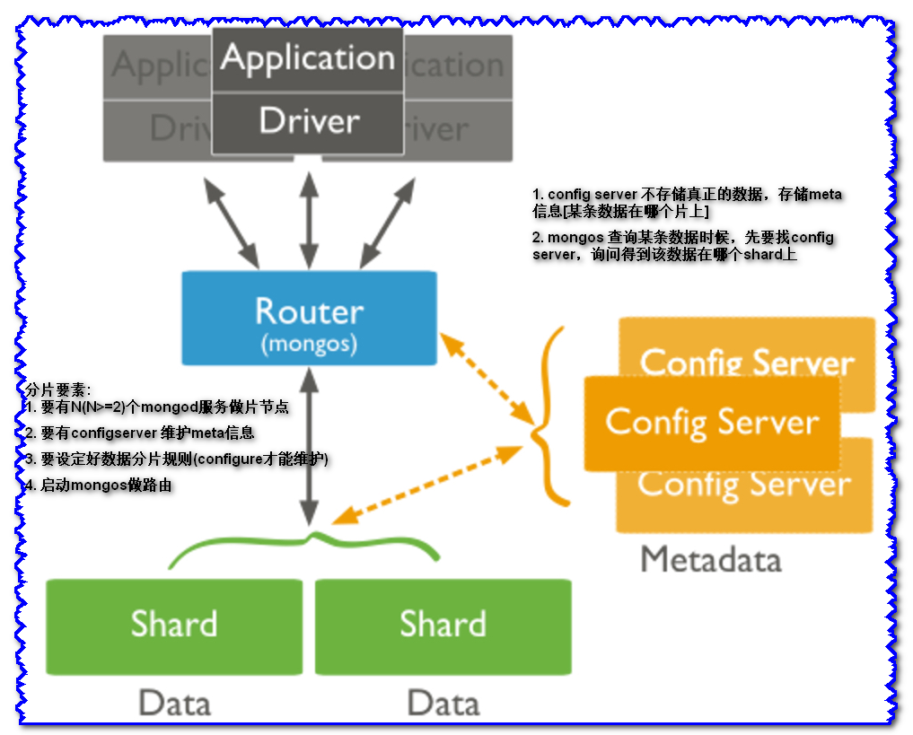

<center><h1>mongod sharding</h1></center>

## 1. 介绍
&#160; &#160; &#160; &#160;MongoDB的另一个集群就是sharding。所谓sharding就是将同一个集合的不同子集分发存储到不同的机器（shard）上，Mongodb使用sharding机制来支持超大数据量，将不同的CRUD路由到不同的机器上执行，提到了数据库的吞吐性能。由此可见，sharding是非常常见的scale out方法。


&#160; &#160; &#160; &#160;如上图所示，一个集合（Collection1）有1T的数据，原本放在一个单独的数据库中，通过sharding，将这个集合的数据放在四个独立的shard中，每一个shard存储这个集合256G的数据。每个shard物理上是独立的数据库，但逻辑上共同组成一个数据库。

&#160; &#160; &#160; &#160;一个sharded cluster由一下三部分组成：config server，shards，router。如图所示：



## 1.1 角色划分
### 1.1.1 数据分片[shards]
&#160; &#160; &#160; &#160;存储数据，可以是单个的mongod，也可以是replica set。在生产环境中，为了提高高可用性，都会使用replica set。存储在mongod上的数据以chunk为基本单位，默认的大小为64M，后面会介绍shard上数据的分裂（split）与迁移（migration）,一台机器的一个数据表 Collection1 存储了 1T 数据，压力太大了！在分给4个机器后，每个机器都是256G，则分摊了集中在一台机器的压力。也许有人问一台机器硬盘加大一点不就可以了，为什么要分给四台机器呢？不要光想到存储空间，实际运行的数据库还有硬盘的读写、网络的IO、CPU和内存的瓶颈。在mongodb集群只要设置好了分片规则，通过mongos操作数据库就能自动把对应的数据操作请求转发到对应的分片机器上。在生产环境中分片的片键可要好好设置，这个影响到了怎么把数据均匀分到多个分片机器上，不要出现其中一台机器分了1T，其他机器没有分到的情况，这样还不如不分片！

### 1.1.2 配置服务器[configserver]
&#160; &#160; &#160; &#160;顾名思义为配置服务器，存储所有数据库元信息（路由、分片）的配置。mongos本身没有物理存储分片服务器和数据路由信息，只是缓存在内存里，配置服务器则实际存储这些数据。mongos第一次启动或者关掉重启就会从 config server 加载配置信息，以后如果配置服务器信息变化会通知到所有的 mongos 更新自己的状态，这样 mongos 就能继续准确路由。在生产环境通常有多个 config server 配置服务器，因为它存储了分片路由的元数据，这个可不能丢失！就算挂掉其中一台，只要还有存货， mongodb集群就不会挂掉。存储集群的元数据（metadata），即数据的哪一部分放在哪一个shard上，router将会利用这些元数据将请求分发到对应的shards上，shards上chunk的迁移也是config server来控制的。

### 1.1.3 查询路由router[mongos]
&#160; &#160; &#160; &#160;mongos实例，在一个集群中直接为应用程序提供服务，利用config server上的元数据来制定最佳的查询计划。数据路由,和客户端打交道的模块,mongos自身没有任何数据,也不知道该如何处理数据,这些都需要config-server来告诉他。

## 1.2 路由

- 当数据写入时,MongoDB Cluster根据分片键设计写入数据
- 当外部语句发起数据查询时,MongoDB根据数据分布自动路由至指定节点返回数据

## 1.3 集群中数据的分布
### 1.3.1 Chunk
&#160; &#160; &#160; &#160;在一个shard-server内部,MongoDB还是会把数据分为chunks,每个chunk代表这个shard-server内部一分部数据,chunk的产生,会有以下两个用途:

- Splitting 

&#160; &#160; &#160; &#160;当一个chunk的大小超过配置中的chunk size时,MongoDB的后台进程会把这个chunk切分成更小的chunk,从而避免chunk过大的情况

- Balancing

&#160; &#160; &#160; &#160;当MongoDB中,balance是一个后台进程,负责chunk的迁移,从而均衡各个shard-server负载,系统初识1个chunk,chunk size默认值是64M,生产库上选择适合业务的chunk size是最好的,MongoDB会自动拆分和迁移chunks

### 1.3.2 shard节点

- 使用chunk来存储数据
- 进程搭建完成之后,默认开启一个chunk,大小是64M
- 存储需求超过64M,chunk会进行分列,如果单位时间存储需求很大,设置更大的chunk
- chunk会自动均衡迁移

## 1.4 chunk size
&#160; &#160; &#160; &#160;适合业务的chunk size是最好的，chunk的分裂和迁移非常消耗IO资源,chunk分裂的时机:在插入和更新,读数据不会分裂

### 1.4.1 chunk size选择

- 小的chunk size : 数据均衡时迁移快,数据分布更加均匀,数据分裂频繁,路由节点消耗更多资源
- 大的chunk size : 数据分裂少,数据块移动集中消耗IO资源,通常100-200M

### 1.4.2 chunk分裂和迁移
&#160; &#160; &#160; &#160;随着数据的增长,其中的数据大小超过了配合的chunk size,默认值时64M,则这个chunk分裂成两个,数据的增长会让chunk分裂的越来越多


这时候,各个shard上的chunk数量会不平衡，mongos中的一个组件balancer就会执行自动平衡,把chunk从chunk数量最多的shard节点挪动到数量最少的节点


chunkSize 对分裂及迁移的影响

&#160; &#160; &#160; &#160;MongoDB 默认的 chunkSize 为64MB，如无特殊需求，建议保持默认值；chunkSize 会直接影响到 chunk 分裂、迁移的行为。

&#160; &#160; &#160; &#160;chunkSize 越小，chunk 分裂及迁移越多，数据分布越均衡；反之，chunkSize 越大，chunk 分裂及迁移会更少，但可能导致数据分布不均。

&#160; &#160; &#160; &#160;chunkSize 太小，容易出现 jumbo chunk（即shardKey 的某个取值出现频率很高，这些文档只能放到一个 chunk 里，无法再分裂）而无法迁移；chunkSize 越大，则可能出现 chunk 内文档数太多（chunk 内文档数不能超过 250000 ）而无法迁移。

&#160; &#160; &#160; &#160;chunk 自动分裂只会在数据写入时触发，所以如果将 chunkSize 改小，系统需要一定的时间来将 chunk 分裂到指定的大小。

&#160; &#160; &#160; &#160;chunk 只会分裂，不会合并，所以即使将 chunkSize 改大，现有的 chunk 数量不会减少，但 chunk 大小会随着写入不断增长，直到达到目标大小。

## 1.5 分片键shard key

&#160; &#160; &#160; &#160;MongoDB中数据的分片是、以集合为基本单位的，集合中的数据通过片键（Shard key）被分成多部分。其实片键就是在集合中选一个键，用该键的值作为数据拆分的依据。所以一个好的片键对分片至关重要。片键必须是一个索引，通过sh.shardCollection加会自动创建索引（前提是此集合不存在的情况下）。一个自增的片键对写入和数据均匀分布就不是很好，因为自增的片键总会在一个分片上写入，后续达到某个阀值可能会写到别的分片。但是按照片键查询会非常高效。

&#160; &#160; &#160; &#160;随机片键对数据的均匀分布效果很好。注意尽量避免在多个分片上进行查询。在所有分片上查询，mongos会对结果进行归并排序。

&#160; &#160; &#160; &#160;对集合进行分片时，你需要选择一个片键，片键是每条记录都必须包含的，且建立了索引的单个字段或复合字段，MongoDB按照片键将数据划分到不同的数据块中，并将数据块均衡地分布到所有分片中。

&#160; &#160; &#160; &#160;为了按照片键划分数据块，MongoDB使用基于范围的分片方式或者 基于哈希的分片方式。
　　
!!! note "注意"
    ```python
    1. 分片键是不可变。
    2. 分片键必须有索引。
    3. 分片键大小限制512bytes。
    4. 分片键用于路由查询。
    5. MongoDB不接受已进行collection级分片的collection上插入无分片
    6. 键的文档（也不支持空值插入）
    ```

## 1.6 数据分割
&#160; &#160; &#160; &#160;从前文知道，MongoDB在collection这个级别进行数据的切块，称之为sharding。块的最小粒度是chunk，其大小（chunkSize）默认为64M。

&#160; &#160; &#160; &#160;当一个集合的数据量超过chunkSize的时候，就会被拆分成两个chunk，这个过程称为splitting。那么按照什么原则将一个chunk上的数据拆分成两个chunk，这就是Sharding key的作用，Sharding key是被索引的字段，通过sharding key，就可以把数据均分到两个chunk，每一个document在哪一个chunk上，这就是元数据信息。元数据信息存放在config server上，方便router使用。

&#160; &#160; &#160; &#160;如果sharding cluster中有多个shard，那么不同shard上的chunk数目可能是不一致的，这个时候会有一个后台进程（balancer）来迁移（migrate）chunk，从chunk数目最多的shard迁移到chunk数目最少的chunk，直到达到均衡的状态。迁移的过程对应用程序来说是透明的。

&#160; &#160; &#160; &#160;如下图所示，迁移之前ShardA ShardB上都有3个chunk，而Shard C上只有一个Chunk。通过从ShardB上迁移一个chunk到ShardC，就达到了一个均衡的状态。


&#160; &#160; &#160; &#160;splitting和migration 的目的是为了让数据在shards之间均匀分布，其根本目标是为了将对数据的CRUD操作均衡地分发到各个shard，提高集群的并发性能。

