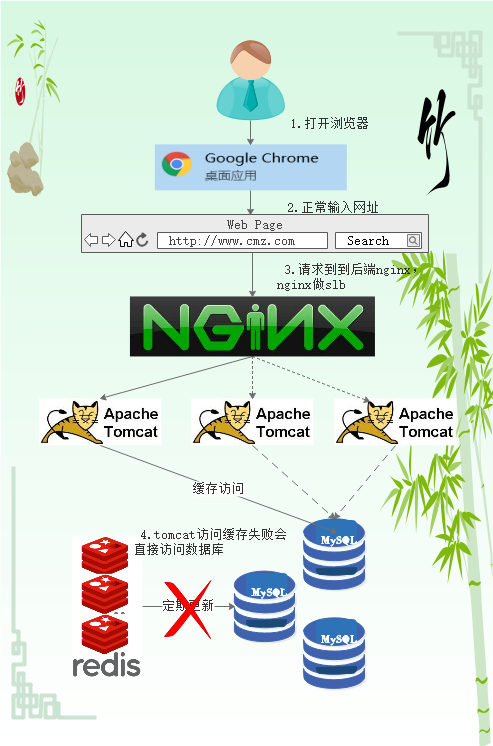

<h1> Redis 雪崩 </h1>

## 1. 介绍
&#160; &#160; &#160; &#160; 缓存雪崩通俗简单的理解就是：由于原有缓存失效（或者数据未加载到缓存中），新缓存未到期间（缓存正常从Redis中获取，如下图）所有原本应该访问缓存的请求都去查询数据库了，而对数据库CPU和内存造成巨大压力，严重的会造成数据库宕机，造成系统的崩溃。

正常访问:

   
 

缓存失效访问:

  
 

## 2. 分析
缓存失效时的雪崩效应对底层系统的冲击非常可怕！那有什么办法来解决这个问题呢？基本解决思路如下：

&#160; &#160; &#160; &#160;第一，大多数系统设计者考虑用加锁或者队列的方式保证来保证不会有大量的线程对数据库一次性进行读写，避免缓存失效时对数据库造成太大的压力，虽然能够在一定的程度上缓解了数据库的压力但是与此同时又降低了系统的吞吐量。

 &#160; &#160; &#160; &#160;第二，分析用户的行为，尽量让缓存失效的时间均匀分布。

 &#160; &#160; &#160; &#160;第三，如果是因为某台缓存服务器宕机，可以考虑做主备，比如：redis主备，但是双缓存涉及到更新事务的问题，update可能读到脏数据，需要好好解决。
 

## 3. 解决方案
 &#160; &#160; &#160; &#160;1. 在缓存失效后，通过加锁或者队列来控制读数据库写缓存的线程数量。比如对某个key只允许一个线程查询数据和写缓存，其他线程等待。

 &#160; &#160; &#160; &#160;  注意:加锁排队只是为了减轻数据库的压力，并没有提高系统吞吐量。假设在高并发下，缓存重建期间key是锁着的，这是过来1000个请求999个都在阻塞的。同样会导致用户等待超时，这是个治标不治本的方法。

 &#160; &#160; &#160; &#160;2. 不同的key，设置不同的过期时间，让缓存失效的时间点尽量均匀。

 &#160; &#160; &#160; &#160;3. 做二级缓存，A1为原始缓存，A2为拷贝缓存，A1失效时，可以访问A2，A1缓存失效时间设置为短期，A2设置为长期。

