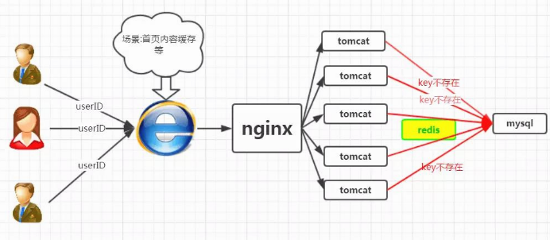

<center><h1> Redis 缓存击穿 </h1></center>

## 1. 介绍
&#160; &#160; &#160; &#160; 在谈论缓存击穿之前，我们先来回忆下从缓存中加载数据的逻辑，如下图所示


&#160; &#160; &#160; &#160;因此，如果黑客每次故意查询一个在缓存内必然不存在的数据，导致每次请求都要去存储层去查询，这样缓存就失去了意义。如果在大流量下数据库可能挂掉。这就是缓存击穿。

&#160; &#160; &#160; &#160; 场景如下图所示




我们正常人在登录首页的时候，都是根据userID来命中数据，然而黑客的目的是破坏你的系统，黑客可以随机生成一堆userID,然后将这些请求怼到你的服务器上，这些请求在缓存中不存在，就会穿过缓存，直接怼到数据库上,从而造成数据库连接异常。


## 2. 解决方案

```
在这里我们给出三套解决方案，大家根据项目中的实际情况，选择使用.

讲下述三种方案前，我们先回忆下redis的setnx方法

SETNX key value

将 key 的值设为 value ，当且仅当 key 不存在。

若给定的 key 已经存在，则 SETNX 不做任何动作。

SETNX 是『SET if Not eXists』(如果不存在，则 SET)的简写。

可用版本：>= 1.0.0

时间复杂度： O(1)

返回值： 设置成功，返回 1。设置失败，返回 0 。

```

### 2.1 方法1-互斥锁

该方法是比较普遍的做法，即，在根据key获得的value值为空时，先锁上，再从数据库加载，加载完毕，释放锁。若其他线程发现获取锁失败，则睡眠50ms后重试，至于锁的类型，单机环境用并发包的Lock类型就行，集群环境则使用分布式锁( redis的setnx)

### 2.2 方法2-异步构建缓存
在这种方案下，构建缓存采取异步策略，会从线程池中取线程来异步构建缓存，从而不会让所有的请求直接怼到数据库上。该方案redis自己维护一个timeout，当timeout小于System.currentTimeMillis()时，则进行缓存更新，否则直接返回value值。


### 2.3 方法3-布隆过滤器
布隆过滤器的巨大用处就是，能够迅速判断一个元素是否在一个集合中
