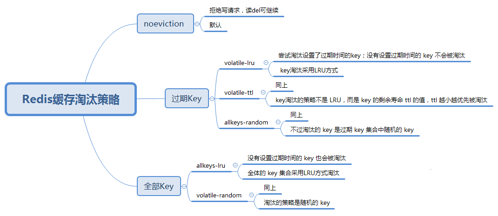

<center><h1>Redis缓存淘汰策略</h1></center>
## 1. 介绍
[参考官网](https://redis.io/topics/lru-cache)
&#160; &#160; &#160; &#160;当实际内存超出 maxmemory 时，Redis 提供了几种可选策略 (maxmemory-policy) 来让用户自己决定淘汰哪些key。总结如下：



&#160; &#160; &#160; &#160;maxmemory 用于指定 Redis 能使用的最大内存。既可以在 redis.conf 文件中设置, 也可以在运行过程中通过 CONFIG SET 命令动态修改。例如, 要设置 100MB 的内存限制, 可以在 redis.conf 文件中这样配置：

```
maxmemory 100mb
```
将maxmemory设置为0, 则表示不进行内存限制。当然, 对32位系统来说有一个隐性的限制条件: 最多 3GB 内存。

当内存使用达到最大限制时, 如果需要存储新数据, 根据配置的策略(policies)的不同, Redis可能直接返回错误信息, 或者删除部分老的数据。

## 2. 策略
&#160; &#160; &#160; &#160;Redis提供了下面几种淘汰策略供用户选择，其中默认的策略为noeviction策略：

- noeviction：当内存使用达到阈值的时候，所有引起申请内存的命令会报错。
- allkeys-lru：在主键空间中，优先移除最近未使用的key。
- volatile-lru：在设置了过期时间的键空间中，优先移除最近未使用的key。
- allkeys-random：在主键空间中，随机移除某个key。
- volatile-random：在设置了过期时间的键空间中，随机移除某个key。
- volatile-ttl：在设置了过期时间的键空间中，具有更早过期时间的key优先移除。
- allkeys-lru：如果我们的应用对缓存的访问符合幂律分布（也就是存在相对热点数据），或者我们不太清楚我们应用的缓存访问分布状况，我们可以选择allkeys-lru策略。
- allkeys-random：如果我们的应用对于缓存key的访问概率相等，则可以使用这个策略。
- volatile-ttl：这种策略使得我们可以向Redis提示哪些key更适合被eviction。
- volatile-lru策略和volatile-random策略适合我们将一个Redis实例既应用于缓存和又应用于持久化存储的时候，然而我们也可以通过使用两个Redis实例来达到相同的效果，值得一提的是将key设置过期时间实际上会消耗更多的内存，因此我们建议使用allkeys-lru策略从而更有效率的使用内存。

如果没有设置`expire`的key, 不满足先决条件(prerequisites); 那么`volatile-lru`,`volatile-random`和`volatile-ttl`策略的行为, 和`noeviction`(不删除)基本上一致。

&#160; &#160; &#160; &#160;您需要根据系统的特征, 来选择合适的驱逐策略。 当然, 在运行过程中也可以通过命令动态设置驱逐策略, 并通过`INFO`命令监控缓存的 miss 和 hit, 来进行调优。

一般来说:

- 如果分为热数据与冷数据, 推荐使用`allkeys-lru`策略。 也就是, 其中一部分key经常被读写. 如果不确定具体的业务特征, 那么`allkeys-lru`是一个很好的选择。
- 如果需要循环读写所有的key, 或者各个key的访问频率差不多, 可以使用`allkeys-random`策略, 即读写所有元素的概率差不多。
- 假如要让 Redis 根据 TTL 来筛选需要删除的key, 请使用`volatile-ttl`策略。

```
volatile-lru和volatile-random策略主要应用场景是: 既有缓存,又有持久key的实例中。 一般来说, 像这类场景, 应该使用两个单独的 Redis 实例。

值得一提的是, 设置expire会消耗额外的内存, 所以使用allkeys-lru策略, 可以更高效地利用内存, 因为这样就可以不再设置过期时间了。
```

## 3. 缓存更新策略
### 3.1 LRU/LFU/FIFO算法剔除
&#160; &#160; &#160; &#160;使用场景。 剔除算法通常用于缓存使用量超过了预设的最大值时候， 如
何对现有的数据进行剔除。 例如Redis使用maxmemory-policy这个配置作为内
存最大值后对于数据的剔除策略。

&#160; &#160; &#160; &#160;一致性。 要清理哪些数据是由具体算法决定， 开发人员只能决定使用哪
种算法， 所以数据的一致性是最差的。

&#160; &#160; &#160; &#160;维护成本。 算法不需要开发人员自己来实现， 通常只需要配置最大
maxmemory和对应的策略即可。 开发人员只需要知道每种算法的含义， 选择
适合自己的算法即可。

### 3.2 超时剔除
&#160; &#160; &#160; &#160;使用场景。 超时剔除通过给缓存数据设置过期时间， 让其在过期时间后
自动删除， 例如Redis提供的expire命令。 如果业务可以容忍一段时间内， 缓
存层数据和存储层数据不一致， 那么可以为其设置过期时间。 在数据过期
后， 再从真实数据源获取数据， 重新放到缓存并设置过期时间。 例如一个视

&#160; &#160; &#160; &#160;频的描述信息， 可以容忍几分钟内数据不一致， 但是涉及交易方面的业务，
后果可想而知。

&#160; &#160; &#160; &#160;一致性。 一段时间窗口内（取决于过期时间长短） 存在一致性问题， 即
缓存数据和真实数据源的数据不一致。
维护成本。 维护成本不是很高， 只需设置expire过期时间即可， 当然前
提是应用方允许这段时间可能发生的数据不一致。


### 3.3 主动更新
&#160; &#160; &#160; &#160;使用场景。 应用方对于数据的一致性要求高， 需要在真实数据更新后，
立即更新缓存数据。 例如可以利用消息系统或者其他方式通知缓存更新。

&#160; &#160; &#160; &#160;一致性。 一致性最高， 但如果主动更新发生了问题， 那么这条数据很可
能很长时间不会更新， 所以建议结合超时剔除一起使用效果会更好。
维护成本。 维护成本会比较高， 开发者需要自己来完成更新， 并保证更
新操作的正确性 
&#160; &#160; &#160; &#160;
