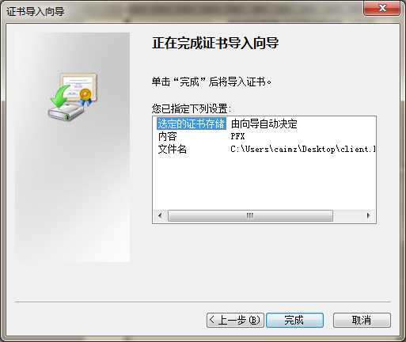
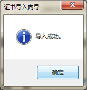
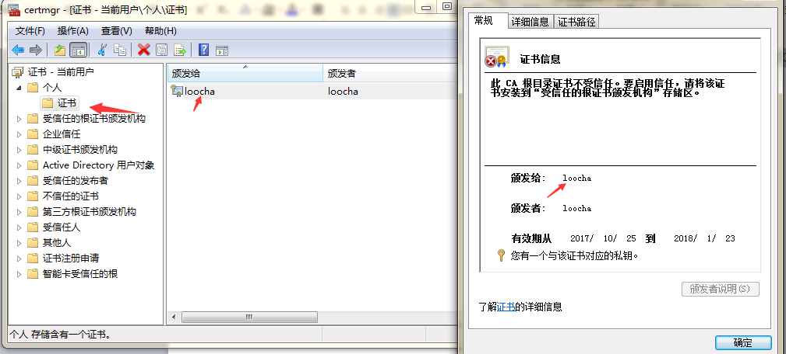
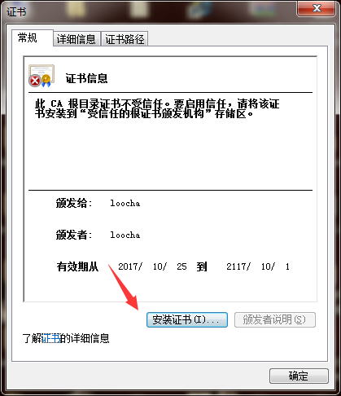
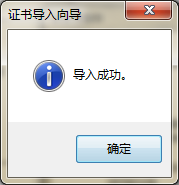
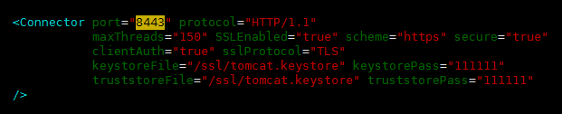

<center><h1>Tomcat生成https+ssl双向证书认证</h1></center>
## 1. 介绍
Q: 什么是https?

A: 百度百科足够解释它：http://baike.baidu.com/view/14121.htm

## 2. 环境准备
工具：keytool （java自带的工具）

环境：CentOS release 6.9 jdk1.8

## 3. 为服务器生成证书

```
root@lt4:/ssl# keytool -genkey -v -alias tomcat -keyalg RSA -keystore /ssl/tomcat.keystore -validity 36500
Enter keystore password:     #输入密码111111
Re-enter new password:       #输入密码111111
What is your first and last name?
  [Unknown]:  loocha
What is the name of your organizational unit?
  [Unknown]:  loocha
What is the name of your organization?
  [Unknown]:  loocha
What is the name of your City or Locality?
  [Unknown]:  js
What is the name of your State or Province?
  [Unknown]:  js
What is the two-letter country code for this unit?
  [Unknown]:  cn
Is CN=loocha, OU=loocha, O=loocha, L=js, ST=js, C=cn correct?
  [no]:  y

Generating 2,048 bit RSA key pair and self-signed certificate (SHA256withRSA) with a validity of 36,500 days
	for: CN=loocha, OU=loocha, O=loocha, L=js, ST=js, C=cn
Enter key password for <tomcat>
	(RETURN if same as keystore password):   #输入密码111111
[Storing /ssl/tomcat.keystore]               #输入密码111111
```

!!! warning  "注意证书有效期"
    /ssl/tomcat.keystore含义是将证书文件的保存路径，证书文件名称是tomcat.keystore(可自定义名称)；
    -validity 36500 含义是证书有效期，36500表示100年，默认值是90天；
    
## 4. 为客户端生成证书

```
root@lt4:/ssl# keytool -genkey -v -alias mykey -keyalg RSA -storetype PKCS12 -keystore /ssl/client.key.p12  -validity 36500
Enter keystore password:  
Re-enter new password: 
What is your first and last name?
  [Unknown]:  loocha
What is the name of your organizational unit?
  [Unknown]:  loocha     
What is the name of your organization?
  [Unknown]:  loocha
What is the name of your City or Locality?
  [Unknown]:  js
What is the name of your State or Province?
  [Unknown]:  js
What is the two-letter country code for this unit?
  [Unknown]:  cn
Is CN=loocha, OU=loocha, O=loocha, L=js, ST=js, C=cn correct?
  [no]:  y

Generating 2,048 bit RSA key pair and self-signed certificate (SHA256withRSA) with a validity of 90 days
	for: CN=loocha, OU=loocha, O=loocha, L=js, ST=js, C=cn
[Storing /ssl/client.key.p12]
root@lt4:/ssl# ll
total 16
drwxr-xr-x  2 root root 4096 Oct 25 13:24 ./
drwxr-xr-x 25  999 root 4096 Oct 25 13:23 ../
-rw-r--r--  1 root root 2546 Oct 25 13:24 client.key.p12
-rw-r--r--  1 root root 2209 Oct 25 13:24 tomcat.keystore
```

## 5. 客户端安装
找一个机器安装，浏览器证书





查看安装的证书,开始（win+R 快捷按键）运行中输入certmgr.msc




## 6. 让服务器信任客户端证书
### 6.1 客户端证书导出为CER文件

由于是双向SSL认证，服务器必须要信任客户端证书，因此，必须把客户端证书添加为服务器的信任认证。因不能直接将PKCS12格式的证书库导入服务器证书库，将客户端证书导出为一个单独的CER文件

```
root@lt4:/ssl# keytool -export -alias mykey -keystore /ssl/client.key.p12 -storetype PKCS12 -storepass 111111 -rfc -file /ssl/client.key.cer
Certificate stored in file </ssl/client.key.cer>
```

!!! info  "证书密码"
    password为客户端证书的密码
    
### 6.2 CER文件导入服务器证书库

```
root@lt4:/ssl# keytool -import -v -file /ssl/client.key.cer -keystore /ssl/tomcat.keystore 
Enter keystore password:  #输入密码111111
Owner: CN=loocha, OU=loocha, O=loocha, L=js, ST=js, C=cn
Issuer: CN=loocha, OU=loocha, O=loocha, L=js, ST=js, C=cn
Serial number: 22ec582e
Valid from: Wed Oct 25 13:24:37 CST 2017 until: Tue Jan 23 13:24:37 CST 2018
Certificate fingerprints:
	 MD5:  1C:BC:C9:7E:BA:06:1C:4F:37:78:96:3D:7B:76:5B:F8
	 SHA1: E9:A0:65:DB:60:B6:87:0F:60:85:47:8D:41:57:0F:FC:99:E2:6C:4E
	 SHA256: CC:2D:B9:41:C1:70:60:F2:E6:11:B8:E5:6A:E9:1D:D9:EB:52:38:69:30:F9:8D:B2:A0:E1:9D:10:09:42:F9:EF
	 Signature algorithm name: SHA256withRSA
	 Version: 3

Extensions: 

#1: ObjectId: 2.5.29.14 Criticality=false
SubjectKeyIdentifier [
KeyIdentifier [
0000: 30 3C 89 80 90 44 88 DD   33 29 A5 3C EF 52 6C 79  0<...D..3).<.Rly
0010: 20 C4 F0 A4                                         ...
]
]

Trust this certificate? [no]:  y
Certificate was added to keystore
[Storing /ssl/tomcat.keystore]
```

## 7. 检查
通过list命令查看服务器的证书库，可以看到两个证书，一个是服务器证书，一个是受信任的客户端证书

```
keytool -list -keystore /ssl/tomcat.keystore (tomcat为你设置服务器端的证书名)。
```

## 8. 服务器端信任客户端证书

```
root@lt4:/ssl# keytool -list -keystore /ssl/tomcat.keystore 
Enter keystore password:   #输入密码111111

Keystore type: JKS
Keystore provider: SUN

Your keystore contains 2 entries

tomcat, Oct 25, 2017, PrivateKeyEntry, 
Certificate fingerprint (SHA1): 2E:3B:52:F3:6C:B8:E7:4E:67:F5:15:55:80:70:24:58:57:F6:79:29
mykey, Oct 25, 2017, trustedCertEntry, 
Certificate fingerprint (SHA1): E9:A0:65:DB:60:B6:87:0F:60:85:47:8D:41:57:0F:FC:99:E2:6C:4E
```

### 8.1 服务器证书导出为CER文件
由于是双向SSL认证，客户端也要验证服务器证书，因此，必须把服务器证书添加到浏览的“受信任的根证书颁发机构”。由于不能直接将keystore格式的证书库导入，必须先把服务器证书导出为一个单独的CER文件，使用如下命令：

```
keytool -keystore /ssl/tomcat.keystore -export -alias tomcat -file /ssl/tomcat.cer
```
    
!!! info  "证书名"
    tomcat为你设置服务器端的证书名
    
    

```
root@lt4:/ssl# keytool -keystore /ssl/tomcat.keystore -export -alias tomcat -file /ssl/tomcat.cer
Enter keystore password:  #输入密码111111
Certificate stored in file </ssl/tomcat.cer>
root@lt4:/ssl# ls
client.key.cer  client.key.p12  tomcat.cer  tomcat.keystore
root@lt4:/ssl# vim README.d
root@lt4:/ssl# cat README.d 
password=111111
```

### 8.2 检查结果
通过list命令查看服务器的证书库，可以看到两个证书，一个是服务器证书，一个是受信任的客户端证书

```
root@lt4:/ssl# keytool -list -keystore /ssl/tomcat.keystore (tomcat为你设置服务器端的证书名)。

root@lt4:/ssl# keytool -list -keystore /ssl/tomcat.keystore 
Enter keystore password:   #输入密码111111

Keystore type: JKS
Keystore provider: SUN

Your keystore contains 2 entries

tomcat, Oct 25, 2017, PrivateKeyEntry, 
Certificate fingerprint (SHA1): 2E:3B:52:F3:6C:B8:E7:4E:67:F5:15:55:80:70:24:58:57:F6:79:29
mykey, Oct 25, 2017, trustedCertEntry, 
Certificate fingerprint (SHA1): E9:A0:65:DB:60:B6:87:0F:60:85:47:8D:41:57:0F:FC:99:E2:6C:4E
```

## 9. 客户端信任服务器证书
### 9.1 服务器证书导出为CER文件
由于是双向SSL认证，客户端也要验证服务器证书，因此，必须把服务器证书添加到浏览的“受信任的根证书颁发机构”。由于不能直接将keystore格式的证书库导入，必须先把服务器证书导出为一个单独的CER文件，使用如下命令：

```
keytool -keystore /ssl/tomcat.keystore -export -alias tomcat -file /ssl/tomcat.cer
```

!!! info '证书名'
    tomcat为你设置服务器端的证书名


```
root@lt4:/ssl# keytool -keystore /ssl/tomcat.keystore -export -alias tomcat -file /ssl/tomcat.cer
Enter keystore password:  #输入密码111111
Certificate stored in file </ssl/tomcat.cer>
root@lt4:/ssl# ls
client.key.cer  client.key.p12  tomcat.cer  tomcat.keystore
root@lt4:/ssl# vim README.d
root@lt4:/ssl# cat README.d 
password=111111
```

## 10. 在客户端安装服务器证书
双击tomcat.cer，按照提示安装证书，将证书填入到 '受信任的根证书颁发机构'。






## 11. 浏览器检查
IE -> Internet选项 -> 内容 -> 证书


## 12. tomcat服务配置    


server.xml 配置

```
<?xml version='1.0' encoding='utf-8'?>
<!--
  Licensed to the Apache Software Foundation (ASF) under one or more
  contributor license agreements.  See the NOTICE file distributed with
  this work for additional information regarding copyright ownership.
  The ASF licenses this file to You under the Apache License, Version 2.0
  (the "License"); you may not use this file except in compliance with
  the License.  You may obtain a copy of the License at

      http://www.apache.org/licenses/LICENSE-2.0

  Unless required by applicable law or agreed to in writing, software
  distributed under the License is distributed on an "AS IS" BASIS,
  WITHOUT WARRANTIES OR CONDITIONS OF ANY KIND, either express or implied.
  See the License for the specific language governing permissions and
  limitations under the License.
-->
<!-- Note:  A "Server" is not itself a "Container", so you may not
     define subcomponents such as "Valves" at this level.
     Documentation at /docs/config/server.html
 -->
<Server port="8005" shutdown="SHUTDOWN">
  <Listener className="org.apache.catalina.startup.VersionLoggerListener" />
  <!-- Security listener. Documentation at /docs/config/listeners.html
  <Listener className="org.apache.catalina.security.SecurityListener" />
  -->
  <!--APR library loader. Documentation at /docs/apr.html -->
  <Listener className="org.apache.catalina.core.AprLifecycleListener" SSLEngine="on" />
  <!--Initialize Jasper prior to webapps are loaded. Documentation at /docs/jasper-howto.html -->
  <Listener className="org.apache.catalina.core.JasperListener" />
  <!-- Prevent memory leaks due to use of particular java/javax APIs-->
  <Listener className="org.apache.catalina.core.JreMemoryLeakPreventionListener" />
  <Listener className="org.apache.catalina.mbeans.GlobalResourcesLifecycleListener" />
  <Listener className="org.apache.catalina.core.ThreadLocalLeakPreventionListener" />

  <!-- Global JNDI resources
       Documentation at /docs/jndi-resources-howto.html
  -->
  <GlobalNamingResources>
    <!-- Editable user database that can also be used by
         UserDatabaseRealm to authenticate users
    -->
    <Resource name="UserDatabase" auth="Container"
              type="org.apache.catalina.UserDatabase"
              description="User database that can be updated and saved"
              factory="org.apache.catalina.users.MemoryUserDatabaseFactory"
              pathname="conf/tomcat-users.xml" />
  </GlobalNamingResources>

  <!-- A "Service" is a collection of one or more "Connectors" that share
       a single "Container" Note:  A "Service" is not itself a "Container",
       so you may not define subcomponents such as "Valves" at this level.
       Documentation at /docs/config/service.html
   -->
  <Service name="Catalina">

    <!--The connectors can use a shared executor, you can define one or more named thread pools-->
    <!--
    <Executor name="tomcatThreadPool" namePrefix="catalina-exec-"
        maxThreads="150" minSpareThreads="4"/>
    -->


    <!-- A "Connector" represents an endpoint by which requests are received
         and responses are returned. Documentation at :
         Java HTTP Connector: /docs/config/http.html (blocking & non-blocking)
         Java AJP  Connector: /docs/config/ajp.html
         APR (HTTP/AJP) Connector: /docs/apr.html
         Define a non-SSL HTTP/1.1 Connector on port 8080
    -->
    <!-- <Connector port="8080" protocol="HTTP/1.1"
               connectionTimeout="20000"
               redirectPort="8443" />
    -->
    <!-- A "Connector" using the shared thread pool-->
    <!--
    <Connector executor="tomcatThreadPool"
               port="8080" protocol="HTTP/1.1"
               connectionTimeout="20000"
               redirectPort="8443" />
    -->
    <!-- Define a SSL HTTP/1.1 Connector on port 8443
         This connector uses the BIO implementation that requires the JSSE
         style configuration. When using the APR/native implementation, the
         OpenSSL style configuration is required as described in the APR/native
         documentation -->
    
    <Connector port="8443" protocol="HTTP/1.1"
               maxThreads="150" SSLEnabled="true" scheme="https" secure="true"
               clientAuth="true" sslProtocol="TLS" 
               keystoreFile="/ssl/tomcat.keystore" keystorePass="111111"
	       truststoreFile="/ssl/tomcat.keystore" truststorePass="111111"
    />
   

    <!-- Define an AJP 1.3 Connector on port 8009 -->
    <Connector port="8009" protocol="AJP/1.3" redirectPort="8443" />


    <!-- An Engine represents the entry point (within Catalina) that processes
         every request.  The Engine implementation for Tomcat stand alone
         analyzes the HTTP headers included with the request, and passes them
         on to the appropriate Host (virtual host).
         Documentation at /docs/config/engine.html -->

    <!-- You should set jvmRoute to support load-balancing via AJP ie :
    <Engine name="Catalina" defaultHost="localhost" jvmRoute="jvm1">
    -->
    <Engine name="Catalina" defaultHost="localhost">

      <!--For clustering, please take a look at documentation at:
          /docs/cluster-howto.html  (simple how to)
          /docs/config/cluster.html (reference documentation) -->
      <!--
      <Cluster className="org.apache.catalina.ha.tcp.SimpleTcpCluster"/>
      -->

      <!-- Use the LockOutRealm to prevent attempts to guess user passwords
           via a brute-force attack -->
      <Realm className="org.apache.catalina.realm.LockOutRealm">
        <!-- This Realm uses the UserDatabase configured in the global JNDI
             resources under the key "UserDatabase".  Any edits
             that are performed against this UserDatabase are immediately
             available for use by the Realm.  -->
        <Realm className="org.apache.catalina.realm.UserDatabaseRealm"
               resourceName="UserDatabase"/>
      </Realm>

      <Host name="localhost"  appBase="webapps"
            unpackWARs="true" autoDeploy="true">

        <!-- SingleSignOn valve, share authentication between web applications
             Documentation at: /docs/config/valve.html -->
        <!--
        <Valve className="org.apache.catalina.authenticator.SingleSignOn" />
        -->

        <!-- Access log processes all example.
             Documentation at: /docs/config/valve.html
             Note: The pattern used is equivalent to using pattern="common" -->
        <Valve className="org.apache.catalina.valves.AccessLogValve" directory="logs"
               prefix="localhost_access_log." suffix=".txt"
               pattern="%h %l %u %t &quot;%r&quot; %s %b" />

      </Host>
    </Engine>
  </Service>
</Server>
```
这里，密码和证书的位置根据个人的具体环境而设置，属性参数如下所述：

参数| 解释
---|---
clientAuth |如果设为true，表示Tomcat要求所有的SSL客户出示安全证书，对SSL客户进行身份验证
keystoreFile	|指定keystore文件的存放位置，可以指定绝对路径，也可以指定相对于<CATALINA_HOME>（Tomcat安装目录）环境变量 的相对路径。如果此项没有设定，默认情况下，Tomcat将从当前操作系统用户的用户目录下读取名为“.keystore”的文件。
keystorePass	|指定keystore的密码，如果此项没有设定，在默认情况下，Tomcat将使用“changeit”作为默认密码。
sslProtocol	|指定套接字（Socket）使用的加密/解密协议，默认值为TLS，用户不应该修改这个默认值。
ciphers	|指定套接字可用的用于加密的密码清单，多个密码间以逗号（,）分隔。如果此项没有设定，在默认情况下，套接字可以使用任意一个可用的密码。


## 13. 客服端测试


