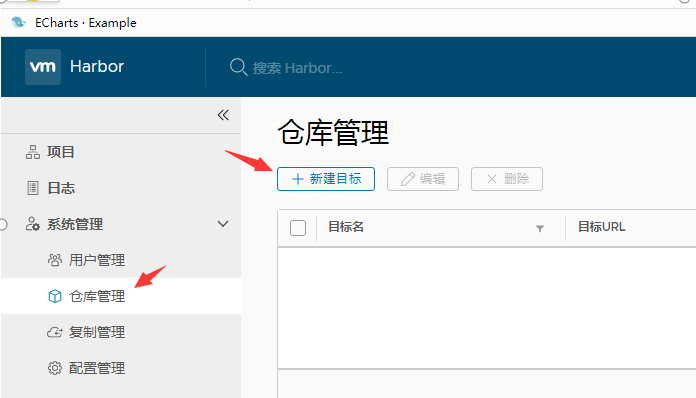
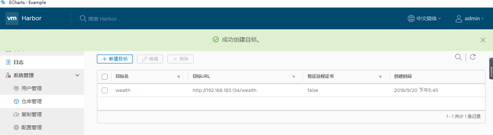
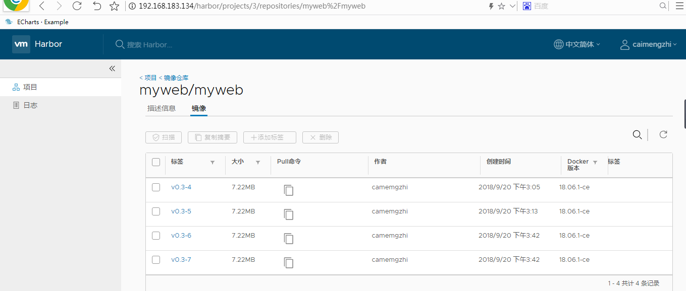
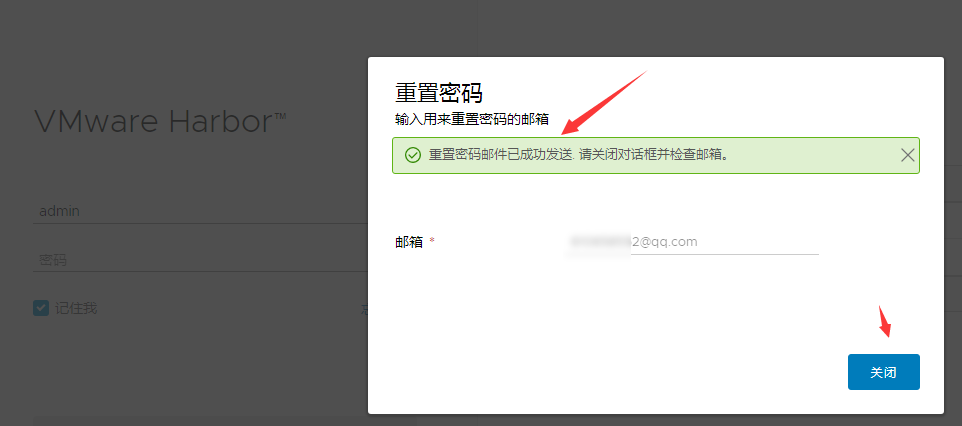
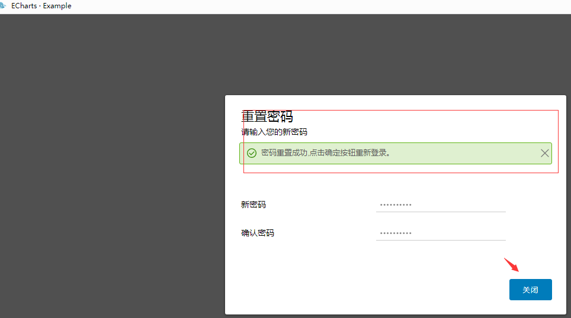

<center><h1Harbori> Docker企业级私有仓库</h1></center>
## 1. Harbor简介
&#160; &#160; &#160; &#160;Harbor是一个用于存储和分发Docker镜像的企业级Registry服务器。
镜像的存储harbor使用的是官方的docker registry(v2命名是distribution)服务去完成。harbor在docker distribution的基础上增加了一些安全、访问控制、管理的功能以满足企业对于镜像仓库的需求。harbor以docker-compose的规范形式组织各个组件，并通过docker-compose工具进行启停。
docker的registry是用本地存储或者s3都是可以的，harbor的功能是在此之上提供用户权限管理、镜像复制等功能，提高使用的registry的效率。Harbor的镜像拷贝功能是通过docker registry的API去拷贝，这种做法屏蔽了繁琐的底层文件操作、不仅可以利用现有docker registry功能不必重复造轮子，而且可以解决冲突和一致性的问题。

### 1.1 Harbor架构


主要组件包括:

- Proxy：对应启动组件nginx。它是一个nginx反向代理，代理Notary client（镜像认证）、Docker client（镜像上传下载等）和浏览器的访问请求（Core Service）给后端的各服务；
- UI（Core Service）：对应启动组件harbor-ui。底层数据存储使用mysql数据库，主要提供了四个子功能：
- UI：一个web管理页面ui；
- API：Harbor暴露的API服务；
- Auth：用户认证服务，decode后的token中的用户信息在这里进行认证；auth后端可以接db、ldap、uaa三种认证实现；
- Token服务（上图中未体现）：负责根据用户在每个project中的role来为每一个docker push/pull命令issuing一个token，如果从docker client发送给registry的请求没有带token，registry会重定向请求到token服务创建token。
- Registry：对应启动组件registry。负责存储镜像文件，和处理镜像的pull/push命令。Harbor对镜像进行强制的访问控制，Registry会将客户端的每个pull、push请求转发到token服务来获取有效的token。
- Admin Service：对应启动组件harbor-adminserver。是系统的配置管理中心附带检查存储用量，ui和jobserver启动时候需要加载adminserver的配置；
- Job Sevice：对应启动组件harbor-jobservice。负责镜像复制工作的，他和registry通信，从一个registry pull镜像然后push到另一个registry，并记录job_log；
- Log Collector：对应启动组件harbor-log。日志汇总组件，通过docker的log-driver把日志汇总到一起；
- Volnerability Scanning：对应启动组件clair。负责镜像扫描
- Notary：对应启动组件notary。负责镜像认证
- DB：对应启动组件harbor-db，负责存储project、 user、 role、replication、image_scan、access等的metadata数据。

### 1.2 Docker Registery 

- 1.Registry用于保存docker镜像，包括镜像的层次结构和元数据
- 2.用户可自建Registry，也可以使用官方的Docker Hub

Docker Registery 分类

- 1.Sponsor Registry 第三方Registry，供客户和Docker社区使用
- 2.Mirror Registry 第三方Registry，只让客户使用
- 3.Vendor Registry 由发布Docker镜像的供应商提供的Registry
- 4.Private Registry 通过设有防火墙和额外的安全层的私有实体提供的Registry

## 2. 系统部署基础

> 服务器的ip规划

机器 | IP| 系统
---|---|---
Docker Registry|192.168.183.134|Centos 7（随便你什么系统）
Docker Client|192.168.183.133|Centos 7（随便你什么系统）推送镜像
Docker Client|192.168.183.135|Centos 7（随便你什么系统）拉取镜像

> 名词解释

No | 名词 | 解释
---|---|---
1  | Docker Registry|Docker私有仓库（本地）
2  | Docker Client|上传和下载的docker客户端


## 3. Docker自带仓库 
### 3.1 安装官方自带仓库
#### 3.1.1 安装

```
[root@leco ~]# yum install docker-registry  
[root@leco ~]# yum info docker-registry
Loaded plugins: fastestmirror
Loading mirror speeds from cached hostfile
* base: mirrors.aliyun.com
* epel: mirrors.aliyun.com
* extras: mirrors.aliyun.com
* updates: mirrors.aliyun.com
Available Packages
Name : docker-registry
Arch : x86_64
Version : 0.9.1
Release : 7.el7
Size : 123 k
Repo : extras/7/x86_64
Summary : Registry server for Docker
URL : https://github.com/docker/docker-registry
License : ASL 2.0
Description : Registry server for Docker (hosting/delivering of repositories and images).
```


#### 3.1.2 查看安装信息

```
[root@leco ~]# rpm -ql docker-distribution
/etc/docker-distribution/registry/config.yml
/usr/bin/registry
/usr/lib/systemd/system/docker-distribution.service
/usr/share/doc/docker-distribution-2.6.2
/usr/share/doc/docker-distribution-2.6.2/AUTHORS
/usr/share/doc/docker-distribution-2.6.2/CONTRIBUTING.md
/usr/share/doc/docker-distribution-2.6.2/LICENSE
/usr/share/doc/docker-distribution-2.6.2/MAINTAINERS
/usr/share/doc/docker-distribution-2.6.2/README.md
/var/lib/registry
[root@leco registry]# pwd
/etc/docker-distribution/registry
[root@leco registry]# cat config.yml
version: 0.1
log:
fields:
service: registry
storage:
cache:
layerinfo: inmemory
filesystem:
rootdirectory: /var/lib/registry   # 仓库的存储路径，可以根据实际情况修改（找大点的空间配置）
http:                              # 仓库协议
addr: :5000                        # 仓库端口
```

#### 3.1.3 启动仓库

```
[root@leco registry]# systemctl start docker-distribution.service
```

#### 3.1.4 开机自启动

```
[root@leco registry]# systemctl enable docker-distribution.service
Created symlink from /etc/systemd/system/multi-user.target.wants/docker-distribution.service to /usr/lib/systemd/system/docker-distribution.service.
```

#### 3.1.5 查看服务

```
[root@leco registry]# ss -tnl
State Recv-Q Send-Q Local Address:Port Peer Address:Port
LISTEN 0 100 127.0.0.1:25 *:*
LISTEN 0 128 *:22 *:*
LISTEN 0 100 ::1:25 :::*
LISTEN 0 128 :::5000 :::*
LISTEN 0 128 :::22 :::*
```

### 3.2 Docker客户端操作
&#160; &#160; &#160; &#160;找一个新的docker客户端测试推拉

#### 3.2.1 打tag
&#160; &#160; &#160; &#160;现在客户端标签docker私有仓库地址。不打标签默认推送到docker github上

```
[root@localhost img4]# docker tag myweb:v0.3-11 192.168.183.134:5000/myweb:v0.3-11
```

#### 3.2.2 查看tag信息

```
[root@localhost img4]# docker images |grep 5000
192.168.183.134:5000/myweb v0.3-11 44ef73a3a19b 39 minutes ago 18MB
[root@localhost img4]# docker push 192.168.183.134:5000/myweb:v0.3-11
The push refers to repository [192.168.183.134:5000/myweb]
Get https://192.168.183.134:5000/v2/: http: server gave HTTP response to HTTPS client
此时要在客户端改变配置，变成http协议（docker 仓库默认是https协议，我们使用http协议）
[root@localhost img4]# cat !$
cat /etc/docker/daemon.json
{
"registry-mirrors": ["http://3e930982.m.daocloud.io"],
"insecure-registries":["192.168.183.134:5000"]
}
其中insecure-registries后面是docker仓库的地址和端口。
[root@localhost img4]# systemctl restart docker
```

#### 3.2.3 push
&#160; &#160; &#160; &#160;修改协议后重启docker然后在push镜像到私有仓库里面
 
```
[root@localhost img4]# docker push 192.168.183.134:5000/myweb:v0.3-11
The push refers to repository [192.168.183.134:5000/myweb]
347a19806329: Pushed
20555723c54b: Pushed
a79fe6dff072: Pushed
87deea508850: Pushed
90c4db1d5ef5: Pushed
cd7100a72410: Pushed
v0.3-11: digest: sha256:be593f8f6e45181416242b37183b3c5429745e3623424a1a9b672afab898714e size: 1568
```

#### 3.2.4 仓库查看
&#160; &#160; &#160; &#160;docker私有仓库端查看

```
[root@leco registry]# ls /var/lib/registry/docker/registry/v2/repositories/myweb/_layers/sha256/
44ef73a3a19b95ae6f7e0c4bf92f0fcc876dce929340455c591430203b4bc151
4b15fa862ac67691a8bc682937be38197ebebe580f01b1bcc0ee823fc43709aa
5e38f0c1e3e667d4fd01ac85ebcd4337579471d841a925d4be81bde53a482614
7d4e05a01906143afc15671a53151ea9755dac230db376a8b8364b21ca774dbc
8aeac9a3205fce5e21ab65ccce330fe389a9aaf47e4b682970b1772ae25a1d73
b430473be128c1302a75e8381dfbaa45182fec81db4f75b749e4896d7816c2ea
ff3a5c916c92643ff77519ffa742d3ec61b7f591b6b7504599d95a4a41134e28
可见从docker客户端push上的镜像已经推送过来，经过hash了。
```

#### 3.2.5 pull
&#160; &#160; &#160; &#160;在其他机器上测试（pull镜像）
 
```
[root@leco registry]# cat /etc/docker/daemon.json
{
"registry-mirrors": ["http://3e930982.m.daocloud.io"],
"bip": "10.0.0.1/16",
"insecure-registries":["192.168.183.134:5000"]
}
[root@leco registry]# systemctl restart docker
[root@leco registry]# docker pull 192.168.183.134:5000/myweb:v0.3-11
v0.3-11: Pulling from myweb
ff3a5c916c92: Pull complete
b430473be128: Pull complete
7d4e05a01906: Pull complete
8aeac9a3205f: Pull complete
5e38f0c1e3e6: Pull complete
4b15fa862ac6: Pull complete
Digest: sha256:be593f8f6e45181416242b37183b3c5429745e3623424a1a9b672afab898714e
Status: Downloaded newer image for 192.168.183.134:5000/myweb:v0.3-11
[root@leco registry]# docker images
REPOSITORY TAG IMAGE ID CREATED SIZE
192.168.183.134:5000/myweb v0.3-11 44ef73a3a19b About an hour ago 18MB
```

## 4. Harbor
### 4.1 参考文档
- [官方文档](https://github.com/goharbor/harbor)
- [安装步骤](https://github.com/goharbor/harbor/blob/master/docs/installation_guide.md)

### 4.2 下载安装


下载安装后上传到服务器上，解压配置安装。

#### 4.2.1 关闭仓库
&#160; &#160; &#160; &#160;关闭之前自带（github自己的）的镜像仓库

```
[root@leco ~]# netstat -lnp|grep 5000
tcp6 0 0 :::5000 :::* LISTEN 17540/registry
[root@leco ~]# systemctl stop docker-distribution
[root@leco ~]# netstat -lnp|grep 500
[root@leco opt]# ls
harbor-offline-installer-v1.5.3.tgz myimages.gz
[root@leco opt]# tar xf harbor-offline-installer-v1.5.3.tgz -C /usr/local/
[root@leco opt]# cd /usr/local/harbor/
[root@leco harbor]# pwd
/usr/local/harbor
[root@leco harbor]# ll
total 895716
drwxr-xr-x 4 root root        37 Sep 20 17:37 common
-rw-r--r-- 1 root root      1185 Sep 12 14:19 docker-compose.clair.yml
-rw-r--r-- 1 root root      1725 Sep 12 14:19 docker-compose.notary.yml
-rw-r--r-- 1 root root      3596 Sep 12 14:19 docker-compose.yml
drwxr-xr-x 3 root root       156 Sep 12 14:19 ha
-rw-r--r-- 1 root root      6955 Sep 20 17:32 harbor.cfg
-rw-r--r-- 1 root root      6956 Sep 20 17:31 harbor.cfg.ori
-rw-r--r-- 1 root root 915878468 Sep 12 14:21 harbor.v1.5.3.tar.gz
-rwxr-xr-x 1 root root      5773 Sep 12 14:19 install.sh
-rw-r--r-- 1 root root     10764 Sep 12 14:19 LICENSE
-rw-r--r-- 1 root root       482 Sep 12 14:19 NOTICE
-rw-r--r-- 1 root root   1247461 Sep 12 14:19 open_source_license
-rwxr-xr-x 1 root root     27840 Sep 12 14:19 prepare
[root@leco harbor]# cp harbor.cfg harbor.cfg.ori
```

#### 4.2.2 修改配置文件

```
[root@leco harbor]# diff harbor.cfg harbor.cfg.ori
7c7
< hostname = 192.168.183.134
---
> hostname = reg.mydomain.com
修改hostname，hostname是对外访问的的地址，可以域名可以ip地址，我们这使用ip（也就是docker的私有仓库地址）
```


#### 4.2.3 开始安装

```
[root@leco harbor]# sh install.sh

[Step 0]: checking installation environment ...

Note: docker version: 18.06.1
✖ Need to install docker-compose(1.7.1+) by yourself first and run this script again.
```


#### 4.2.4 安装编排工具
&#160; &#160; &#160; &#160;先要安装docker-compose 因为harbor使用通过docker-compose编排工具去安装

```
[root@leco harbor]# yum install -y docker-compose
[root@leco harbor]# sh install.sh

[Step 0]: checking installation environment ...

Note: docker version: 18.06.1

Note: docker-compose version: 1.18.0

[Step 1]: loading Harbor images ...
dba693fc2701: Loading layer [==================================================>] 133.4MB/133.4MB
5773887c4c41: Loading layer [==================================================>] 30.09MB/30.09MB
6fc2abbcae42: Loading layer [==================================================>] 15.37MB/15.37MB
d85f176a11ec: Loading layer [==================================================>] 15.37MB/15.37MB
Loaded image: vmware/harbor-adminserver:v1.5.3
462b14c85230: Loading layer [==================================================>] 410.1MB/410.1MB
c2e0c8cb2903: Loading layer [==================================================>] 9.216kB/9.216kB
11bdb24cded2: Loading layer [==================================================>] 9.216kB/9.216kB
5d8f974b49ef: Loading layer [==================================================>] 7.68kB/7.68kB
ee04f13f4147: Loading layer [==================================================>] 1.536kB/1.536kB
799db4dfe41a: Loading layer [==================================================>] 11.78kB/11.78kB
f7d813585bdd: Loading layer [==================================================>] 2.56kB/2.56kB
6300bbdbd7ab: Loading layer [==================================================>] 3.072kB/3.072kB
Loaded image: vmware/harbor-db:v1.5.3
1d7516778a05: Loading layer [==================================================>] 30.09MB/30.09MB
f7ec8d1b47d0: Loading layer [==================================================>] 20.91MB/20.91MB
22b0ad749c21: Loading layer [==================================================>] 20.91MB/20.91MB
Loaded image: vmware/harbor-jobservice:v1.5.3
2d449d67c05a: Loading layer [==================================================>] 89.58MB/89.58MB
0bfd4e706575: Loading layer [==================================================>] 3.072kB/3.072kB
6100e173c230: Loading layer [==================================================>] 59.9kB/59.9kB
86fe093d1358: Loading layer [==================================================>] 61.95kB/61.95kB
Loaded image: vmware/redis-photon:v1.5.3
Loaded image: photon:1.0
3bf3086a6569: Loading layer [==================================================>] 30.09MB/30.09MB
641d0f77d675: Loading layer [==================================================>] 10.95MB/10.95MB
89efbaabea87: Loading layer [==================================================>] 17.3MB/17.3MB
1276e51f4dc2: Loading layer [==================================================>] 15.87kB/15.87kB
49e187d04e78: Loading layer [==================================================>] 3.072kB/3.072kB
e62fbfea411d: Loading layer [==================================================>] 28.24MB/28.24MB
Loaded image: vmware/notary-signer-photon:v0.5.1-v1.5.3
Loaded image: vmware/mariadb-photon:v1.5.3
201f6ade61d8: Loading layer [==================================================>] 102.5MB/102.5MB
81221fbb5879: Loading layer [==================================================>] 6.656kB/6.656kB
2268e3c9e521: Loading layer [==================================================>] 2.048kB/2.048kB
9fca06f4b193: Loading layer [==================================================>] 7.68kB/7.68kB
Loaded image: vmware/postgresql-photon:v1.5.3
11d6e8a232c9: Loading layer [==================================================>] 30.09MB/30.09MB
42650b04d53d: Loading layer [==================================================>] 24.41MB/24.41MB
a1cd8af19e29: Loading layer [==================================================>] 7.168kB/7.168kB
4b1cda90ba19: Loading layer [==================================================>] 10.56MB/10.56MB
1351f0f3006a: Loading layer [==================================================>] 24.4MB/24.4MB
Loaded image: vmware/harbor-ui:v1.5.3
e335f4c3af7d: Loading layer [==================================================>] 79.93MB/79.93MB
2aea487bc2c4: Loading layer [==================================================>] 3.584kB/3.584kB
d2efec3de68b: Loading layer [==================================================>] 3.072kB/3.072kB
d0d71a5ce1dd: Loading layer [==================================================>] 4.096kB/4.096kB
19930367abf0: Loading layer [==================================================>] 3.584kB/3.584kB
03e5b7640db5: Loading layer [==================================================>] 9.728kB/9.728kB
Loaded image: vmware/harbor-log:v1.5.3
5aebe8cc938c: Loading layer [==================================================>] 11.97MB/11.97MB
Loaded image: vmware/nginx-photon:v1.5.3
ede6a57cbd7e: Loading layer [==================================================>] 30.09MB/30.09MB
4d6dd4fc1d87: Loading layer [==================================================>] 2.56kB/2.56kB
c86a69f49f60: Loading layer [==================================================>] 2.56kB/2.56kB
0cf6e04c5927: Loading layer [==================================================>] 2.048kB/2.048kB
6fbff4fe9739: Loading layer [==================================================>] 22.8MB/22.8MB
6f527a618092: Loading layer [==================================================>] 22.8MB/22.8MB
Loaded image: vmware/registry-photon:v2.6.2-v1.5.3
e29a8834501b: Loading layer [==================================================>] 12.16MB/12.16MB
aaf67f1da2c7: Loading layer [==================================================>] 17.3MB/17.3MB
8d5718232133: Loading layer [==================================================>] 15.87kB/15.87kB
fc89aca1dd12: Loading layer [==================================================>] 3.072kB/3.072kB
076eb5a76f6d: Loading layer [==================================================>] 29.46MB/29.46MB
Loaded image: vmware/notary-server-photon:v0.5.1-v1.5.3
454c81edbd3b: Loading layer [==================================================>] 135.2MB/135.2MB
e99db1275091: Loading layer [==================================================>] 395.4MB/395.4MB
051e4ee23882: Loading layer [==================================================>] 9.216kB/9.216kB
6cca4437b6f6: Loading layer [==================================================>] 9.216kB/9.216kB
1d48fc08c8bc: Loading layer [==================================================>] 7.68kB/7.68kB
0419724fd942: Loading layer [==================================================>] 1.536kB/1.536kB
543c0c1ee18d: Loading layer [==================================================>] 655.2MB/655.2MB
4190aa7e89b8: Loading layer [==================================================>] 103.9kB/103.9kB
Loaded image: vmware/harbor-migrator:v1.5.0
45878c64fc3c: Loading layer [==================================================>] 165.3MB/165.3MB
fc3d407ce98f: Loading layer [==================================================>] 10.93MB/10.93MB
d7a0785bb902: Loading layer [==================================================>] 2.048kB/2.048kB
a17e0f23bc84: Loading layer [==================================================>] 48.13kB/48.13kB
57c7181f2336: Loading layer [==================================================>] 10.97MB/10.97MB
Loaded image: vmware/clair-photon:v2.0.5-v1.5.3


[Step 2]: preparing environment ...
Generated and saved secret to file: /data/secretkey
Generated configuration file: ./common/config/nginx/nginx.conf
Generated configuration file: ./common/config/adminserver/env
Generated configuration file: ./common/config/ui/env
Generated configuration file: ./common/config/registry/config.yml
Generated configuration file: ./common/config/db/env
Generated configuration file: ./common/config/jobservice/env
Generated configuration file: ./common/config/jobservice/config.yml
Generated configuration file: ./common/config/log/logrotate.conf
Generated configuration file: ./common/config/jobservice/config.yml
Generated configuration file: ./common/config/ui/app.conf
Generated certificate, key file: ./common/config/ui/private_key.pem, cert file: ./common/config/registry/root.crt
The configuration files are ready, please use docker-compose to start the service.
Creating harbor-log ... done

[Step 3]: checking existing instance of Harbor ...

Creating registry ... done
Creating harbor-ui ... done
Creating network "harbor_harbor" with the default driver
Creating nginx ... done
Creating harbor-db ...
Creating registry ...
Creating harbor-adminserver ...
Creating redis ...
Creating harbor-ui ...
Creating harbor-jobservice ...
Creating nginx ...

✔ ----Harbor has been installed and started successfully.----

Now you should be able to visit the admin portal at http://192.168.183.134.
For more details, please visit https://github.com/vmware/harbor .
```
&#160; &#160; &#160; &#160;可以看到以上已经安装完了。我们通过web访问harbor，可以看到以上已经安装完了。
安装完毕后查看docker


&#160; &#160; &#160; &#160;Harbor其实也是加载docker镜像

### 4.3 Web操作
#### 4.3.1 简单介绍


&#160; &#160; &#160; &#160;默认账号和密码在配置文件中，

- 账号是: ==admin== 
- 密码是: ==Harbor12345==


#### 4.3.2 新建用户


&#160; &#160; &#160; &#160;因为harbor是多人的私有仓库，所以建立普通用户，对应建立私有的仓库，然后docker客户端通过使用这个新建的账号和密码登录harbor然后推送到自己的仓库中。


#### 4.3.3 新建私有仓库






#### 4.3.4 普通用户登录


#### 4.3.5 普通用户新建项目


### 4.4 客户端操作推送
#### 4.4.1 pull镜像

```
[root@localhost img4]# ifconfig ens33
ens33: flags=4163<UP,BROADCAST,RUNNING,MULTICAST> mtu 1500
inet 192.168.183.133 netmask 255.255.255.0 broadcast 192.168.183.255
ether 00:0c:29:9e:1f:67 txqueuelen 1000 (Ethernet)
RX packets 66573 bytes 17079495 (16.2 MiB)
RX errors 0 dropped 0 overruns 0 frame 0
TX packets 36722 bytes 16771887 (15.9 MiB)
TX errors 0 dropped 0 overruns 0 carrier 0 collisions 0
[root@localhost img4]# cat /etc/docker/daemon.json
{
"registry-mirrors": ["http://3e930982.m.daocloud.io"],
"insecure-registries":["192.168.183.134"]
}
[root@localhost img4]# systemctl restart docker
```
#### 4.4.2 客户端打tag
打tag的目的主要是推送的镜像到私有仓库而不是推送到dockerhub上（默认都是推送到dockerhub上）


```
[root@localhost img4]# docker tag myweb:v0.3-4 192.168.183.134/myweb/myweb:v0.3-4
[root@localhost img4]# docker tag myweb:v0.3-5 192.168.183.134/myweb/myweb:v0.3-5
[root@localhost img4]# docker tag myweb:v0.3-6 192.168.183.134/myweb/myweb:v0.3-6
[root@localhost img4]# docker tag myweb:v0.3-7 192.168.183.134/myweb/myweb:v0.3-7
```


#### 4.4.3 登录

```
[root@localhost img4]# docker login 192.168.183.134
Username: caimengzhi #账号是web登录的账号和密码
Password:
WARNING! Your password will be stored unencrypted in /root/.docker/config.json.
Configure a credential helper to remove this warning. See
https://docs.docker.com/engine/reference/commandline/login/#credentials-store
Login Succeeded
```

#### 4.4.4 推送镜像

```
[root@localhost img4]# docker push 192.168.183.134/myweb/myweb
<若是推送不指定镜像tag，会推送所有192.168.183.134/myweb/myweb的镜像>
The push refers to repository [192.168.183.134/myweb/myweb]
a8dcd6aa3279: Pushed
9a07ffbe3d7d: Pushed
955e7d7f7300: Pushed
95bb4e754f2d: Pushed
ebf12965380b: Pushed
v0.3-4: digest: sha256:bff4611d26ab5ea7df2a2038f5c806060343e8dcb72f4e7d9c8186f9f29ab1d2 size: 1360
02d539f1584f: Pushed
9a07ffbe3d7d: Layer already exists
955e7d7f7300: Layer already exists
95bb4e754f2d: Layer already exists
ebf12965380b: Layer already exists
v0.3-5: digest: sha256:d989d072b34649c6c3db1b90cc8e9da01fc0851db7154087f8c20d9276c6b19e size: 1360
cf1c42bcc62e: Pushed
31d53a6ec2f6: Pushed
9a07ffbe3d7d: Layer already exists
955e7d7f7300: Layer already exists
95bb4e754f2d: Layer already exists
ebf12965380b: Layer already exists
v0.3-6: digest: sha256:f001406ad67619ca5a20595f5392099f4c89aabc03a577a9e2b21951daa6625b size: 1567
cf1c42bcc62e: Layer already exists
31d53a6ec2f6: Layer already exists
9a07ffbe3d7d: Layer already exists
955e7d7f7300: Layer already exists
95bb4e754f2d: Layer already exists
ebf12965380b: Layer already exists
v0.3-7: digest: sha256:f001406ad67619ca5a20595f5392099f4c89aabc03a577a9e2b21951daa6625b size: 1567
```

#### 4.4.5  查看推送情况
推送完毕后在docker私有仓库上web查看之前推送的情况。



### 4.5 客户端操作拉
新找一个别的机器去拉去操作

#### 4.5.1 修改配置文件
修改配置文件（http）

```
[root@leco ~]# cat /etc/docker/daemon.json
{
"registry-mirrors": ["http://3e930982.m.daocloud.io"],
"insecure-registries":["192.168.183.134"]
}
```

#### 4.5.2 重启docker

```
[root@leco ~]# systemctl restart docker
[root@leco ~]# ifconfig ens33
ens33: flags=4163<UP,BROADCAST,RUNNING,MULTICAST> mtu 1500
inet 192.168.183.135 netmask 255.255.255.0 broadcast 192.168.183.255
ether 00:0c:29:5e:f3:38 txqueuelen 1000 (Ethernet)
RX packets 32850 bytes 2734678 (2.6 MiB)
RX errors 0 dropped 0 overruns 0 frame 0
TX packets 3833 bytes 375551 (366.7 KiB)
TX errors 0 dropped 0 overruns 0 carrier 0 collisions 0
```

#### 4.5.3 登录

```
[root@leco ~]# docker login 192.168.183.134
Username: caimengzhi
Password:
WARNING! Your password will be stored unencrypted in /root/.docker/config.json.
Configure a credential helper to remove this warning. See
https://docs.docker.com/engine/reference/commandline/login/#credentials-store

Login Succeeded
```


#### 4.5.4 地址
登录web界面找到pull的地址

```
[root@leco ~]# docker pull 192.168.183.134/myweb/myweb:v0.3-7
v0.3-7: Pulling from myweb/myweb
c67f3896b22c: Pull complete
428de5b8d58a: Pull complete
7efd417f3e28: Pull complete
61a56b170416: Pull complete
e7206a413d4c: Pull complete
54a1363d75f0: Pull complete
Digest: sha256:f001406ad67619ca5a20595f5392099f4c89aabc03a577a9e2b21951daa6625b
Status: Downloaded newer image for 192.168.183.134/myweb/myweb:v0.3-7
```
#### 4.5.5 查看本地镜像

```
[root@leco ~]# docker images
REPOSITORY TAG IMAGE ID CREATED SIZE
192.168.183.134/myweb/myweb v0.3-7 5799f549739a 3 hours ago 17.4MB
```

### 4.6 Harbor 服务操作
#### 4.6.1 暂停

```
[root@leco ~]# docker-compose pause
```

#### 4.6.2 停止

```
[root@leco ~]# docker-compose stop
```

#### 4.6.3 启动

```
[root@leco ~]# docker-compose start
```

```
[root@leco harbor]# pwd
/usr/local/harbor
[root@leco harbor]# ll
total 895716
drwxr-xr-x 4 root root        37 Sep 20 17:37 common
-rw-r--r-- 1 root root      1185 Sep 12 14:19 docker-compose.clair.yml
-rw-r--r-- 1 root root      1725 Sep 12 14:19 docker-compose.notary.yml
-rw-r--r-- 1 root root      3596 Sep 12 14:19 docker-compose.yml
drwxr-xr-x 3 root root       156 Sep 12 14:19 ha
-rw-r--r-- 1 root root      6955 Sep 20 17:32 harbor.cfg
-rw-r--r-- 1 root root      6956 Sep 20 17:31 harbor.cfg.ori
-rw-r--r-- 1 root root 915878468 Sep 12 14:21 harbor.v1.5.3.tar.gz
-rwxr-xr-x 1 root root      5773 Sep 12 14:19 install.sh
-rw-r--r-- 1 root root     10764 Sep 12 14:19 LICENSE
-rw-r--r-- 1 root root       482 Sep 12 14:19 NOTICE
-rw-r--r-- 1 root root   1247461 Sep 12 14:19 open_source_license
-rwxr-xr-x 1 root root     27840 Sep 12 14:19 prepare
以上操作都要在这个目录下，执行的时候会自动加载docker-compose.yml文件
```


### 4.7 Harbor 邮件
#### 4.7.1 邮件配置


我使用的163的邮箱请按照上述参数找到自己的配置信息，其他邮箱请百度自行配置。


配置完后。检验

#### 4.7.2 忘记登录密码






然后重新登录

### 4.8 QA
Q：Master-Slave的镜像架构中,如果Slave Registy中的镜像被删除了，会不会再次自动从Master Reg里面自动同步？

A：如果停止后再重新启动复制策略，可以同步被删除的镜像。

Q：对于多个投产地，多个仓库，哪种方式的高可用方案好么？第一种，共享存储存储可能会出现单点故障么？

A：共享存储只适合同一数据中心，多个产地延时太大，不适合共享存储。

Q：Registry之间同步是如何实现的？

A：Registry API。

Q：在存储这块考虑过提供插件方式可以调用外部模块，比如以插件方式支持s3这种对象存储？

A：Harbor支持其他存储方式，参见Harbor文档。
