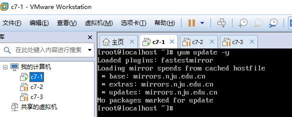
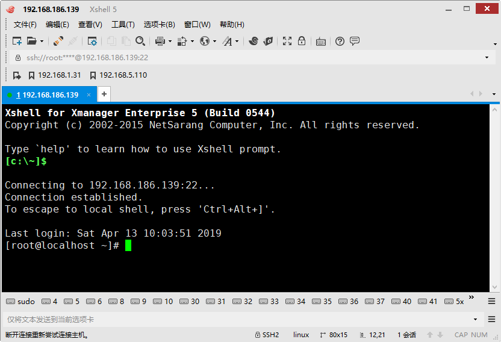

<center><h1>远程连接Linux</h1></center>


## 1. 介绍
&#160; &#160; &#160; &#160;我们都是在虚拟机操作的，会很麻烦，比如输入的时候不好复制和粘贴。那么怎么解决这问题呢，市面这样的链接linux机器的软件很多，如putty，SecureCRT，xshell，等等。我优先推荐你使用神器xshell。

&#160; &#160; &#160; &#160;在开始之前，我们在远程连接linux之前，我们来说说，我们是如何远程连接windows的电脑。如windows自带的远程桌面链接[一般都是内网使用]，像通过外网链接windows的有team或者向日葵，等等。

[内网远程连接windows](https://baijiahao.baidu.com/s?id=1622060458277420069&wfr=spider&for=pc)

[外网team链接windows](https://www.landui.com/help/show-5236.html)

&#160; &#160; &#160; &#160;上面讲述了windows的远程。那们此时继续讲述怎么连接linux机器。


## 2. 安装xshell

参考，安装xshell教程。
```
https://jingyan.baidu.com/article/1612d500af1c97e20e1eee25.html
```

## 3. 连接

&#160; &#160; &#160; &#160;通过我们在本地连接远程的Linux的时候，我们通常使用xshell这样的ssh链接远程机器前提条件如下:

- 被链接的服务器端ssh服务器必须开启
- 关闭防火墙
- 本地可以telnet服务器ssh端口
- 必须知道远程服务器的ssh登录账号和密码

以上缺一不可。

### 3.1 服务器端ssh服务
#### 3.1.1 更新
&#160; &#160; &#160; &#160;我们检查服务器端的ssh服务是否开启。上个章节。新安装的最小化的centos7.我以这个机器为例讲解。由于是新安装机器，需要先update一下[更细一下库]

```
yum udpate -y 
```



> 首次更细的时候。会费点时间，更细结束的时候，再次执行更细的时候，会如上图显示。更细结束。

#### 3.1.2 Linux
&#160; &#160; &#160; &#160;由于是最小化安装，很多软件都没安装，我们必须要自己安装需要的软件。我比如`telnet,netstat,ifconfig`等等

```
systemct disable firewalld
yum install -y net-tools
```

检查了Linux端的服务已经正常启动，防火墙也关闭了。
##### 3.1.3 windows
&#160; &#160; &#160; &#160;我们本地测试是否能ping通linux机器，这个是关键。

```
[c:\~]$ ping 192.168.186.139

正在 Ping 192.168.186.139 具有 32 字节的数据:
来自 192.168.186.139 的回复: 字节=32 时间<1ms TTL=64
来自 192.168.186.139 的回复: 字节=32 时间<1ms TTL=64
来自 192.168.186.139 的回复: 字节=32 时间=1ms TTL=64
来自 192.168.186.139 的回复: 字节=32 时间<1ms TTL=64

192.168.186.139 的 Ping 统计信息:
    数据包: 已发送 = 4，已接收 = 4，丢失 = 0 (0% 丢失)，
往返行程的估计时间(以毫秒为单位):
    最短 = 0ms，最长 = 1ms，平均 = 0ms
```
可以看出本地可以ping通的，说明网络是通的。

此时telnet linux ssh端口服务（22）

```
[c:\~]$ telnet 192.168.186.139 22


Connecting to 192.168.186.139:22...
Connection established.
To escape to local shell, press 'Ctrl+Alt+]'.
SSH-2.0-OpenSSH_7.4
```
出现以上说明本地可以telnet远程linux的ssh服务的22端口，那基本xshell链接是没的问题。说干就立马开始。

##### 3.1.4 链接

打开xshell，点击加号，新建一个链接。


配置好IP地址和名字


配置登录服务器的账号和密码后点击确定。


首次登录该服务器的时候，会提示保存账号信息。点击接受保存。



出现以上，就表明你从本地正确链接到Linux服务器上了。come on。
