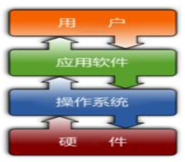

<h1>Linux历史</h1>

## 1. 计算机介绍
&#160; &#160; &#160; &#160;
计算机由硬件和软件组成结构

## 2. 硬件
&#160; &#160; &#160; &#160;1946年诞生于宾夕法尼亚州，占地170平米，重量达到30吨，名字叫做ENIAC(electronic numerical integrator and calculator)主要作用是为美国国防部防空系统计算飞弹轨迹。也是第一代计算机，在这里我们可以将计算机划分四个时代,分别是:

第一代计算机(1946-1957)电子管时代

第二代计算机(1958-1964)晶体管时代

第三代计算机(1965-1970) 集成电路时代

第四代计算机(1971-) 大规模集成电路时代

它们都有一个特点,都遵循冯诺依曼体系

## 3. 软件
&#160; &#160; &#160; &#160;软件是一系列按照特定顺序组织的计算机数据和指令的集合。一般来讲软件被划分为系统软件、应用软件和介于这两者之间的中间件。系统软件便是运行在硬件基础上，而应用软件则是运行在系统软件上的

## 4. Linux发展史

&#160; &#160; &#160; &#160;操作系统，英语Operating System简称为OS。说道操作系统就需要先讲一讲Unix，UNIX操作系统，是一个强大的多用户、多任务操作系统，支持多种处理器架构，按照操作系统的分类，属于分时操作系统，最早由KenThompson、Dennis Ritchie和Douglas McIlroy于1969年在AT&T的贝尔实验室开发。而linux就是一款类Unix系统。

&#160; &#160; &#160; &#160;通常人们对linux都有一个错误的认识，就是这个名词"linux操作系统",其实linux不是操作系统，linux是一个内核，linux系统构成包括：、Linux 内核、GNU 项目及其他项目的软件。当然，但人们已经习惯了用Linux来形容整个基于Linux内核，并且使用GNU 工程各种工具和数据库的操作系统。

&#160; &#160; &#160; &#160;Linux的开发者:林纳斯·本纳第克特·托瓦兹（Linus Benedict Torvalds, 1969年~ ），著名的电脑程序员、黑客。我等膜拜的顶级大神，Linux内核的发明人及该计划的合作者。托瓦兹利在大学读书期间创造出了这套当今全球最流行的操作系统（作业系统）内核之一。

## 5. Linux发展历史

&#160; &#160; &#160; &#160;Linux操作系统的诞生、发展和成长过程始终依赖着五个重要支柱：UNIX 操作系统、MINIX 操作系统、GNU计划、POSIX 标准和Internet 网络。1981 年IBM公司推出微型计算机IBM PC。

&#160; &#160; &#160; &#160;1991年，GNU计划已经开发出了许多工具软件，最受期盼的GNU C编译器已经出现，GNU的操作系统核心HURD一直处于实验阶段，没有任何可用性，实质上也没能开发出完整的GNU操作系统，但是GNU奠定了Linux用户基础和开发环境。

&#160; &#160; &#160; &#160;1991年初，林纳斯·托瓦兹开始在一台386sx兼容微机上学习minix操作系统。1991年4月，林纳斯·托瓦兹开始酝酿并着手编制自己的操作系统。

&#160; &#160; &#160; &#160;1991 年4 月13 日在comp.os.minix 上发布说自己已经成功地将bash 移植到了minix 上，而且已经爱不释手、不能离开这个shell软件了。

&#160; &#160; &#160; &#160;1991年7月3日，第一个与Linux有关的消息是在comp.os.minix上发布的（当然此时还不存在Linux这个名称，当时林纳斯·托瓦兹的脑子里想的可能是FREAX，FREAX的英文含义是怪诞的、怪物、异想天开等）。

&#160; &#160; &#160; &#160;1991年的10月5日，林纳斯·托瓦兹在comp.os.minix新闻组上发布消息，正式向外宣布Linux内核的诞生（Freeminix-like kernel sources for 386-AT）。

1993年，大约有100余名程序员参与了Linux内核代码编写/修改工作，其中核心组由5人组成，此时Linux 0.99的代码大约有十万行，用户大约有10万左右。

&#160; &#160; &#160; &#160;1994年3月，Linux1.0发布，代码量17万行，当时是按照完全自由免费的协议发布，随后正式采用GPL协议。

&#160; &#160; &#160; &#160;1995年1月，Bob Young创办了RedHat（小红帽），以GNU/Linux为核心，集成了400多个源代码开放的程序模块，搞出了一种冠以品牌的Linux，即RedHat Linux,称为Linux"发行版"，在市场上出售。这在经营模式上是一种创举。

&#160; &#160; &#160; &#160;1996年6月，Linux 2.0内核发布，此内核有大约40万行代码，并可以支持多个处理器。此时的Linux 已经进入了实用阶段，全球大约有350万人使用。

&#160; &#160; &#160; &#160;1998年2月，以Eric Raymond为首的一批年轻的"老牛羚骨干分子"终于认识到GNU/Linux体系的产业化道路的本质，并非是什么自由哲学，而是市场竞争的驱动，创办了"Open Source Intiative"（开放源代码促进会）"复兴"的大旗，在互联网世界里展开了一场历史性的Linux产业化运动。

&#160; &#160; &#160; &#160;2001年1月，Linux 2.4发布，它进一步地提升了SMP系统的扩展性，同时它也集成了很多用于支持桌面系统的特性：USB，PC卡（PCMCIA）的支持，内置的即插即用，等等功能。

&#160; &#160; &#160; &#160;2003年12月，Linux 2.6版内核发布，相对于2.4版内核2.6在对系统的支持都有很大的变化。

&#160; &#160; &#160; &#160;2004年的第1月，SuSE嫁到了Novell，SCO继续顶着骂名四处强行“化缘”， Asianux， MandrakeSoft也在五年中首次宣布季度赢利。3月，SGI宣布成功实现了Linux操作系统支持256个Itanium 2处理器

## 6. Linux思想

- 一切都是一个文件（包括硬件）
- 小型，单一用途的程序
- 链接程序，共同完成复杂的任务
- 避免令人困惑的用户界面
- 配置数据存储在文本中

## 7. Linux特点
&#160; &#160; &#160; &#160;inux支持多用户，各个用户对于自己的文件设备有自己特殊的权利，保证了各用户之间互不影响。多任务则是现在电脑最主要的一个特点，Linux可以使多个程序同时并独立地运行。

&#160; &#160; &#160; &#160;Linux可以运行在多种硬件平台上，如具有x86、680×0、SPARC、Alpha等处理器的平台。此外Linux还是一种嵌入式操作系统，可以运行在掌上电脑、机顶盒或游戏机上。2001年1月份发布的Linux 2.4版内核已经能够完全支持Intel 64位芯片架构。同时Linux也支持多处理器技术。多个处理器同时工作，使系统性能大大提高。

## 8. Linux 发行版

[10大主流发行版](http://baijiahao.baidu.com/s?id=1597911999197622652&wfr=spider&for=pc/)
