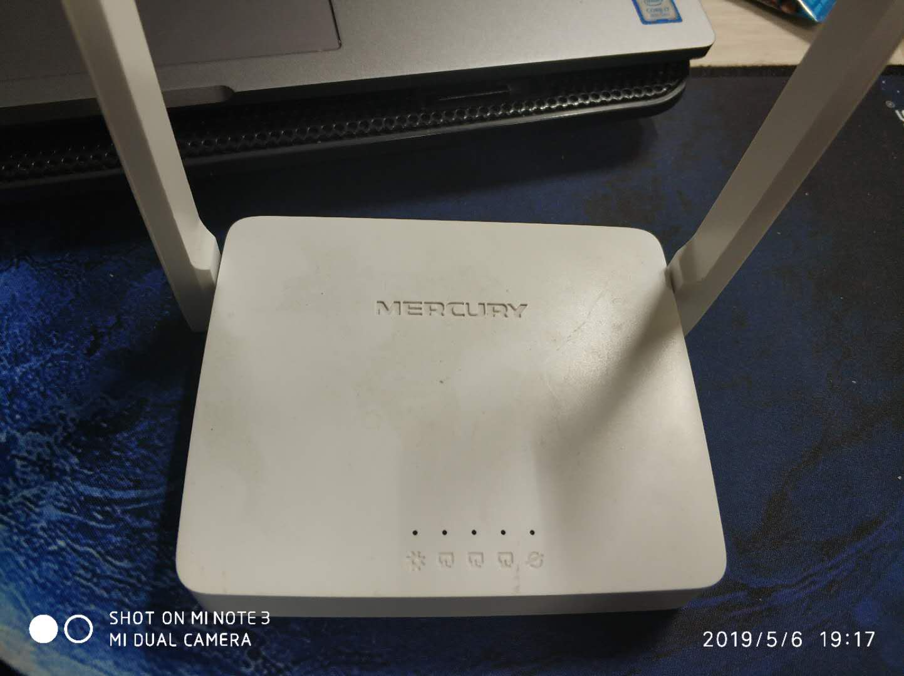
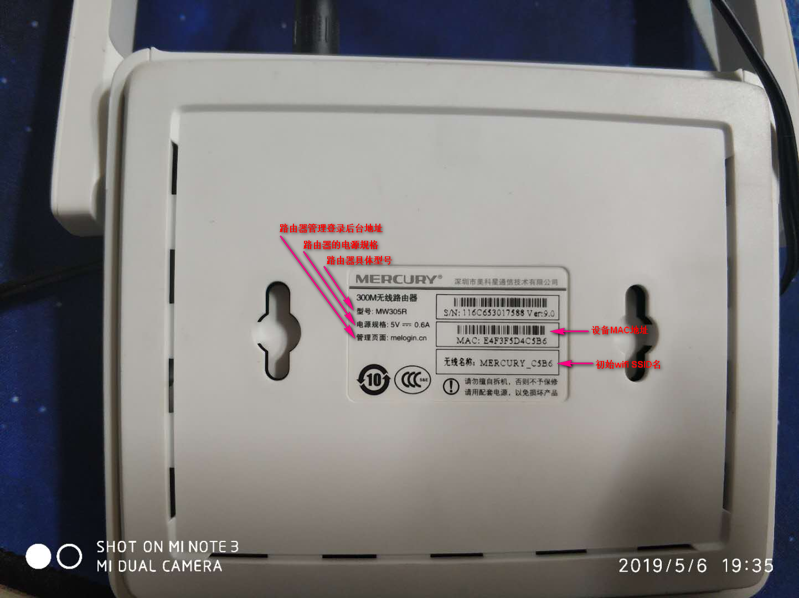
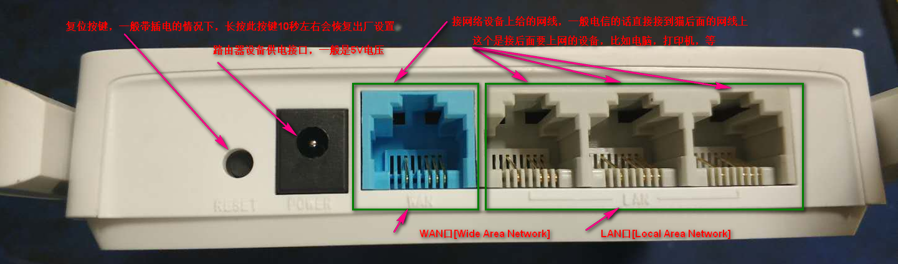
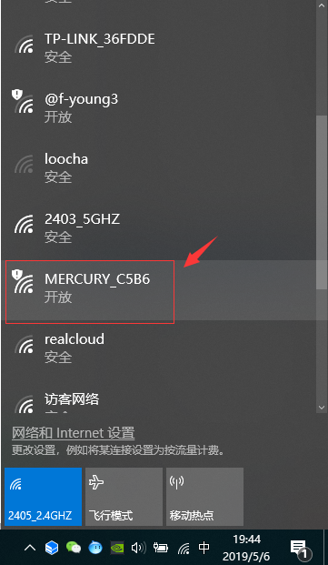
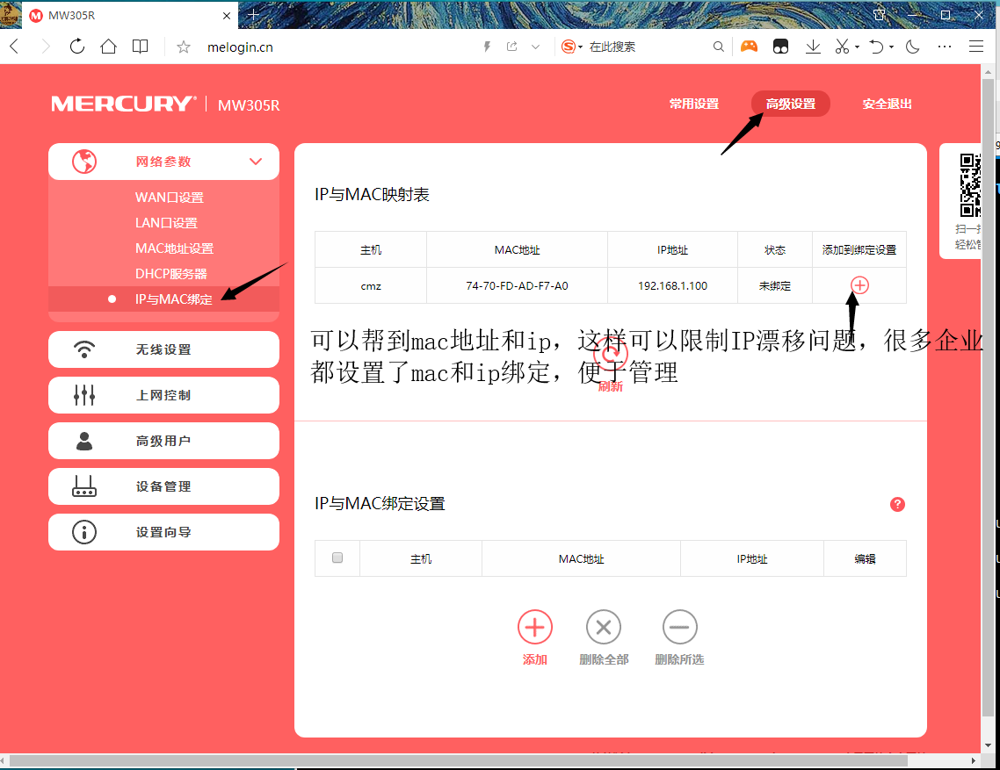
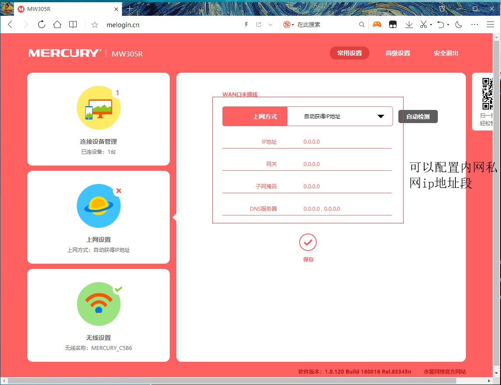
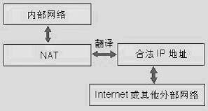
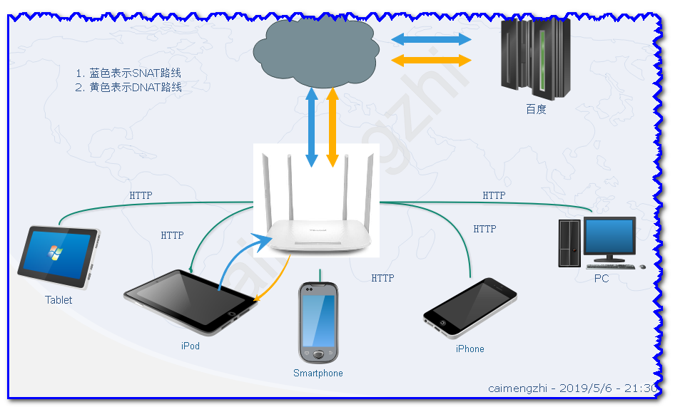

<h1>路由器</h1>

## 1. 准备环境
&#160; &#160; &#160; &#160;当我们在电信或者移动或者联通办理了宽带业务，电信或者移动或联通通会给我们一个账户和密码，这个密码是动态生成的，业务人员会帮我们拉好光纤调试好光纤的网络，然后我们就可以直接通过光纤上网了，如果是电信的网络还需要配置一个光纤调制解调器，调制解调器的作用是将光纤上面的光信号转换成数字信号，因为我们电脑只能处理数字信号，这个调制解调器就是我们平常说的“光猫”，现在电信叫这个设备为：光纤接入端用户设备。我们可以直接把网线插在光纤调制解调器然后连接我们电脑上网，但是这样只能一个设备上网，如果我们需要更多设备能够共享我们的网络，比如，多台电脑和手机，我们就需要一个无线路由器，我们只需要简单设置无线路由器共享名称和密码就可以通过路由器上网了。

## 2. 账号和密码
&#160; &#160; &#160; &#160;首先，我们一定要记住电信业务员给我们的账号和密码，很多公司和个人没有记住这个密码和账号，或者没有搞明白有这么一个账户和密码，因为当时都是业务员设置好的，后面一下子把路由器重置了，然后连不上网，一直不知道是怎么回事，后面讲到路由器设置的时候,路由器需要通过这个电信账号和密码才能连接到电信的因特网服务商ISP，或者知道需要通过这个电信密码设置路由器，但是当时没有记录，长时间太长忘记了，电信的上网账号类似：`18851878888`一般是你手机号码，密码是：`12345678`，一定要用手机记事本记住，不过到时候忘记了也无妨，直接拨打电信`10000`[移动拨打10086，联通拨打10010]号报身份证号码让客服给你修改密码就可以了。很多时候忘记不要紧，最重要的是没有方向，不知道向谁求助。

## 3. 路由器上网配置
&#160; &#160; &#160; &#160;上面记住电信给我们的账号和密码后，第二步就是要用网线连接光猫的和路由器，用一根网线连接光猫的"千兆"接口和路由器上面的"WAN"口，如果你想信号稳定点，可以用另外一根网线连接路由器`1`,`2`,`3`任何一个接口和电脑，也可以不用网线直接设置路由器WiFi，让电脑连接网线网络上网，都可以。

> 以上就是相关路由器的配置上网和一些简单实用功能设置。

## 4. NAT
&#160; &#160; &#160; &#160;NAT英文全称是“Network Address Translation”，中文意思是“网络地址转换”，它是一个IETF(Internet Engineering Task Force, Internet工程任务组)标准，允许一个整体机构以一个公用IP（Internet Protocol）地址出现在Internet上。顾名思义，它是一种把内部私有网络地址（IP地址）翻译成合法网络IP地址的技术。

&#160; &#160; &#160; &#160;简单地说，NAT就是在局域网内部网络中使用内部地址，而当内部节点要与外部网络进行通讯时，就在网关（可以理解为出口，打个比方就像院子的门一样）处，将内部地址替换成公用地址，从而在外部公网（internet）上正常使用，NAT可以使多台计算机共享Internet连接，这一功能很好地解决了公共IP地址紧缺的问题。通过这种方法，您可以只申请一个合法IP地址，就把整个局域网中的计算机接入Internet中。这时，NAT屏蔽了内部网络，所有内部网计算机对于公共网络来说是不可见的，而内部网计算机用户通常不会意识到NAT的存在。如图2所示。这里提到的内部地址，是指在内部网络中分配给节点 的私有IP地址，这个地址只能在内部网络中使用，不能被路由（一种网络技术，可以实现不同路径转发）。虽然内部地址可以随机挑选，但是通常使用的是下面的地址：10.0.0.0~10.255.255.255，172.16.0.0~172.16.255.255， 192.168.0.0~192.168.255.255。NAT将这些无法在互联网上使用的保留IP地址翻译成可以在互联网上使用的合法IP地址。而全 局地址，是指合法的IP地址，它是由NIC（网络信息中心）或者ISP(网络服务提供商)分配的地址，对外代表一个或多个内部局部地址，是全球统一的可寻 址的地址。

&#160; &#160; &#160; &#160;NAT功能通常被集成到路由器、防火墙、ISDN路由器或者单独的NAT设备中。比如Cisco路由器中已经加入这一功能，网络管理员只需在路由器的IOS中设 置NAT功能，就可以实现对内部网络的屏蔽。再比如防火墙将WEB Server的内部地址192.168.1.1映射为外部地址202.96.23.11，外部访问202.96.23.11地址实际上就是访问访问 192.168.1.1。另外资金有限的小型企业来说，现在通过软件也可以实现这一功能。Windows 98 SE、Windows 2000 都包含了这一功能。

### 4.1 NAT分类
&#160; &#160; &#160; &#160;NAT有三种类型：静态NAT(Static NAT)、动态地址NAT(Pooled NAT)、网络地址端口转换NAPT（Port－Level NAT）。

&#160; &#160; &#160; &#160;借助于NAT，私有（保留）地址的"内部"网络通过路由器发送数据包时，私有地址被转换成合法的IP地址，一个局域网只需使用少量IP地址（甚至是1个）即可实现私有地址网络内所有计算机与Internet的通信需求。
NAT将自动修改IP报文的源IP地址和目的IP地址，Ip地址校验则在NAT处理过程中自动完成。有些应用程序将源IP地址嵌入到IP报文的数据部分中，所以还需要同时对报文的数据部分进行修改，以匹配IP头中已经修改过的源IP地址。否则，在报文数据部分嵌入IP地址的应用程序就不能正常工作。

### 4.2 SNAT
&#160; &#160; &#160; &#160;SNAT是指在数据包从网卡发送出去的时候，把数据包中的源地址部分替换为指定的IP，这样，接收方就认为数据包的来源是被替换的那个IP的主机，MASQUERADE是用发送数据的网卡上的IP来替换源IP，因此，对于那些IP不固定的场合，比如拨号网络或者通过dhcp分配IP的情况下，就得用MASQUERADE

### 4.3 DNAT
&#160; &#160; &#160; &#160;DNAT，就是指数据包从网卡发送出去的时候，修改数据包中的目的IP，表现为如果你想访问百度，可是因为网关[一般家用情况是路由器充当了网关]做了DNAT，把所有访问百度的数据包的目的IP全部修改为路由器地址，那么，你实际上访问的是路由器，因为，路由是按照目的地址来选择的，因此，DNAT是在PREROUTING链上来进行的，而SNAT是在数据包发送出去的时候才进行，因此是在POSTROUTING链上进行的。

