
<h1>计算机硬件</h1>

## 1. 介绍
&#160; &#160; &#160; &#160;这一章节我们讲述有关计算机硬件相关所有基本知识，带你认识，计算机主板，计算机各种外设，各种接头，普通计算机和服务器有哪些区别，等等，为你保驾护航，为了急速开辟这计算机神秘的面纱。一起不为实际动手操作都是耍流氓。

## 2. 主板
### 2.1 普通主板
&#160; &#160; &#160; &#160;我以普通的台式机主板为例。看下图。

### 2.2 服务器主板
&#160; &#160; &#160; &#160;我以超微服务器的主板为例。看下图。

## 3. 电源

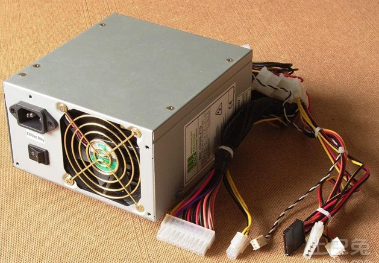

[引脚定义](http://www.elecfans.com/article/83/116/2017/20170302490845.html)

## 4. 硬盘
硬盘分机械硬盘和固态硬盘两大类。看下图内部构造。

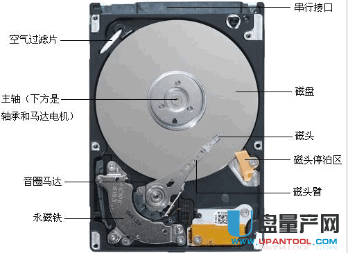

### 4.1 机械硬盘

[SAS/SATA/SSD/IDE硬盘介绍区别](https://www.cnblogs.com/uumiss/p/5322632.html)
#### 4.1.1 IDE硬盘

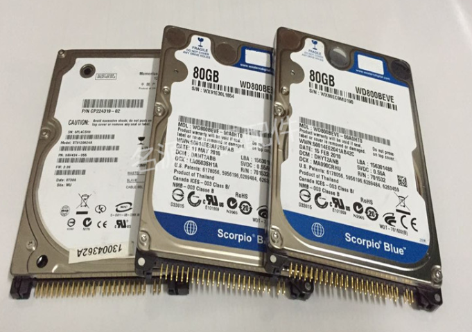
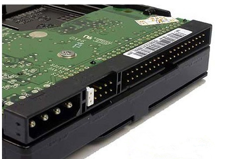

#### 4.1.2 SATA硬盘

### 4.2 固态硬盘
#### 4.2.1 sata接口

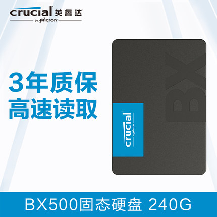

#### 4.2.1 m2接口

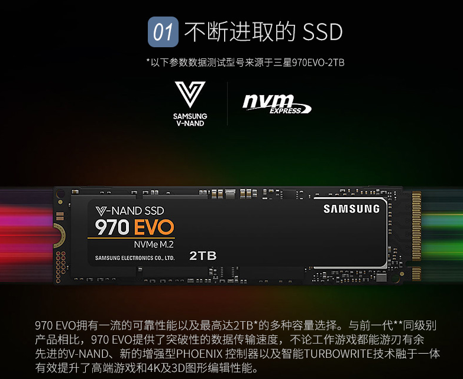

## 5. 内存

&#160; &#160; &#160; &#160;内存有叫DIMM， DIMM全称Dual-Inline-Memory-Modules，中文名叫双列直插式存储模块，是指奔腾CPU推出后出现的新型内存条，它提供了64位的数据通道。

&#160; &#160; &#160; &#160; 内存又分几代内存，目前主流是DDR4,DDR=Double Data Rate双倍速率,DDR SDRAM=双倍速率同步动态随机存储器，
人们习惯称为DDR，其中，SDRAM 是Synchronous Dynamic Random Access Memory的缩写，即同步动态随机存取存储器。而DDR SDRAM是Double Data Rate SDRAM的缩写，是双倍速率同步动态随机存储器的意思。DDR内存是在SDRAM内存基础上发展而来的，仍然沿用SDRAM生产体系，因此对于内存厂商而言，只需对制造普通SDRAM的设备稍加改进，即可实现DDR内存的生产，可有效的降低成本。

DDR SDRAM Standard| Bus clock(MHz)|Internal rate(MHz)	|Prefetch (min burst)|Transfer Rate (MT/s)|Voltage|DIMM pins|SO-DIMM pins|MicroDIMM 
---|---|---|---|---|---|---|---|---
DDR 	|100–200 	|100–200	|2n	|200–400 	|2.5 2.6|	184	|200	|172
DDR2	|200–533	|100–266	|4n	|400–1066	|1.8	|240	|200	|214
DDR3	|400–1066	|100–266	|8n	|800–2400	|1.5	|240	|204	|214
DDR4	|800–1200	|200–300	|8n	|1600–5067	|1.2	|288	|260	|214

## 6. RAID 卡
看我另一篇详细帖子，[点我](https://caimengzhi.github.io/books/linux/raid/raid.index)

## 7. 外设
### 7.1 USB
&#160; &#160; &#160; &#160; USB，是英文Universal Serial Bus（通用串行总线）的缩写，是一个外部总线标准，用于规范电脑与外部设备的连接和通讯。是应用在PC领域的接口技术。USB接口支持设备的即插即用和热插拔功能。USB是在1994年底由英特尔、康柏、IBM、Microsoft等多家公司联合提出的。

&#160; &#160; &#160; &#160; 下一代USB接口将会有改动方向，现在已经很多设备搭载Type-C接口。

&#160; &#160; &#160; &#160; USB接口，可支持正反两面插，并且传输数据信号强，但目前（2014年）生产商有限。
截至2015年12月26日，国内众多厂商已经大规模在自己生产的手机设备上使用基于该标准的数据线。

#### 7.1.1 USB2.0/3.0
&#160; &#160; &#160; &#160; 首先，针对电脑，有些比较破旧的电脑，本身就只有USB2.0的，但是如今新产的电脑，都是有USB2.0 和USB3.0插口的。很好区别。usb2.0里面不带蓝色的色块。USB2.0 3.0最大的区别是3.0多一组差分线，数据传输更快。

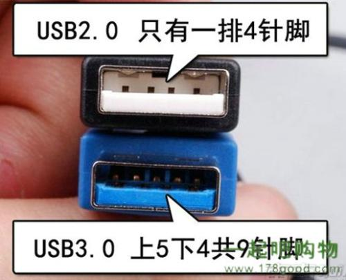

#### 7.1.2 USB 接口种类
usb又细分很多种类。根据形状大小细分。

### 7.2 PCIE

&#160; &#160; &#160; &#160; PCI-Express(peripheral component interconnect express)是一种高速串行计算机扩展总线标准，它原来的名称为“3GIO”，是由英特尔在2001年提出的，旨在替代旧的PCI，PCI-X和AGP总线标准。PCIe属于高速串行点对点双通道高带宽传输，所连接的设备分配独享通道带宽，不共享总线带宽，主要支持主动电源管理，错误报告，端对端的可靠性传输，热插拔以及服务质量(QOS)等功能。PCIe交由PCI-SIG（PCI特殊兴趣组织）认证发布后才改名为“PCI-Express”，简称“PCI-e”。它的主要优势就是数据传输速率高，目前最高的16X 2.0版本可达到10GB/s，而且还有相当大的发展潜力。PCI Express也有多种规格，从PCI Express x1到PCI Express x32，能满足将来一定时间内出现的低速设备和高速设备的需求。PCI-Express最新的接口是PCIe 3.0接口，其比特率为8Gbps，约为上一代产品带宽的两倍，并且包含发射器和接收器均衡、PLL改善以及时钟数据恢复等一系列重要的新功能，用以改善数据传输和数据保护性能。PCIe闪存卡的供应商包括：INTEL、IBM、LSI、OCZ、三星(计划中)、SanDisk、STEC、SuperTalent和东芝(计划中)等，而针对海量的数据增长使得用户对规模更大、可扩展性更强的系统所应用，PCIe 3.0技术的加入最新的LSI MegaRAID控制器及HBA产品的出色性能，就可以实现更大的系统设计灵活性。截止2019年1月份，当前主流主板均支持pcie 3.0

PCIE规格

传输通道数|脚Pin总数|主接口区Pin数|总 长 度|主接口区 长度
---|---|---|---|---
1|36|14|25 mm|7.65 mm
4|64|42|39 mm|21.65 mm
8|98|76|56 mm|38.65 mm
16|164|142|89 mm|71.65 mm

---

规格|总线宽度|工作时脉|传输速率
---|---|---|---
PCI-E x1|8 位|2.5 GHz|512 MiB/s
PCI-E x2|8 位|2.5 GHz|1.0 GiB/s
PCI-E x4|8 位|2.5 GHz|2.0 GiB/s
PCI-E x8|8 位|2.5 GHz|4.0 GiB/s
PCI-E x16|8 位|2.5 GHz|8.0 GiB/s

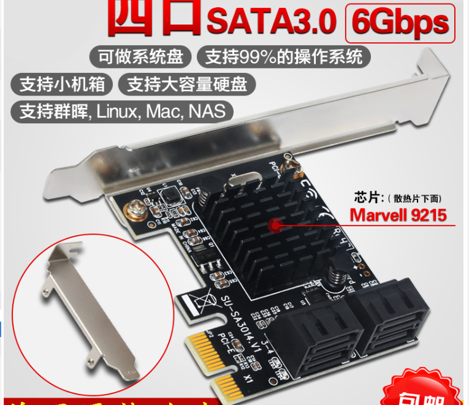
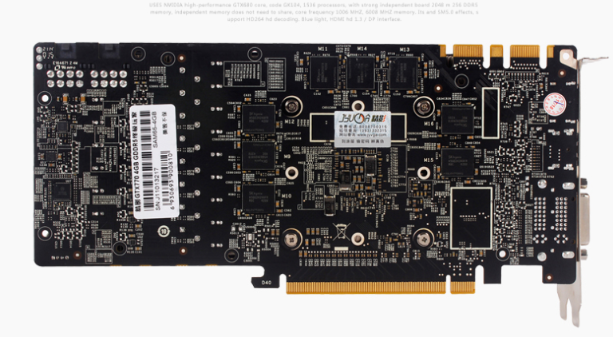

### 7.3 网卡
&#160; &#160; &#160; &#160;网络接口控制器（英语：network interface controller，NIC），又称网络接口控制器，网络适配器（network adapter），网卡（network interface card），或局域网接收器（LAN adapter），是一块被设计用来允许计算机在计算机网络上进行通讯的计算机硬件。由于其拥有MAC地址，因此属于OSI模型的第1层。它使得用户可以通过电缆或无线相互连接。每一个网卡都有一个被称为MAC地址的独一无二的48位串行号，它被写在卡上的一块ROM中。在网络上的每一个计算机都必须拥有一个独一无二的MAC地址。没有任何两块被生产出来的网卡拥有同样的地址。这是因为电气电子工程师协会（IEEE）负责为网络接口控制器销售商分配唯一的MAC地址。

&#160; &#160; &#160; &#160;网卡以前是作为扩展卡插到计算机总线上的，但是由于其价格低廉而且以太网标准普遍存在，大部分新的计算机都在主板上集成了网络接口。这些主板或是在主板芯片中集成了以太网的功能，或是使用一块通过PCI (或者更新的PCI-Express总线)连接到主板上的廉价网卡。除非需要多接口或者使用其它种类的网络，否则不再需要一块独立的网卡。甚至更新的主板可能含有内置的双网络（以太网）接口。

### 7.4 串口
&#160; &#160; &#160; &#160;串行接口简称串口，也称串行通信接口或串行通讯接口（通常指COM接口），是采用串行通信方式的扩展接口。串行接口 (Serial Interface) 是指数据一位一位地顺序传送，其特点是通信线路简单，只要一对传输线就可以实现双向通信（可以直接利用电话线作为传输线），从而大大降低了成本，特别适用于远距离通信，但传送速度较慢。

#### 7.4.1 接口划分标准
##### 7.4.1.1 RS-232
&#160; &#160; &#160; &#160;也称标准串口，最常用的一种串行通讯接口。它是在1970年由美国电子工业协会（EIA）联合贝尔系统、调制解调器厂家及计算机终端生产厂家共同制定的用于串行通讯的标准。它的全名是“ [1]  数据终端设备（DTE）和数据通讯设备（DCE）之间串行二进制数据交换接口技术标准”。传统的RS-232-C接口标准有22根线，采用标准25芯D型插头座（DB25），后来使用简化为9芯D型插座（DB9），现在应用中25芯插头座已很少采用。

&#160; &#160; &#160; &#160;RS-232采取不平衡传输方式，即所谓单端通讯。由于其发送电平与接收电平的差仅为2V至3V左右，所以其共模抑制能力差，再加上双绞线上的分布电容，其传送距离最大为约15米，最高速率为20kb/s。RS-232是为点对点（即只用一对收、发设备）通讯而设计的，其驱动器负载为3～7kΩ。所以RS-232适合本地设备之间的通信

##### 7.4.1.2 RS-422
&#160; &#160; &#160; &#160;标准全称是“平衡电压数字接口电路的电气特性”，它定义了接口电路的特性。典型的RS-422是四线接口。实际上还有一根信号地线，共5根线。其DB9连接器引脚定义。由于接收器采用高输入阻抗和发送驱动器比RS232更强的驱动能力，故允许在相同传输线上连接多个接收节点，最多可接10个节点。即一个主设备（Master），其余为从设备（Slave），从设备之间不能通信，所以RS-422支持点对多的双向通信。接收器输入阻抗为4k，故发端最大负载能力是10×4k+100Ω（终接电阻）。RS-422四线接口由于采用单独的发送和接收通道，因此不必控制数据方向，各装置之间任何必须的信号交换均可以按软件方式（XON/XOFF握手）或硬件方式（一对单独的双绞线）实现。

&#160; &#160; &#160; &#160;RS-422的最大传输距离为1219米，最大传输速率为10Mb/s。其平衡双绞线的长度与传输速率成反比，在100kb/s速率以下，才可能达到最大传输距离。只有在很短的距离下才能获得最高速率传输。一般100米长的双绞线上所能获得的最大传输速率仅为1Mb/s。

##### 7.4.1.1 RS-485
&#160; &#160; &#160; &#160;是从RS-422基础上发展而来的，所以RS-485许多电气规定与RS-422相仿。如都采用平衡传输方式、都需要在传输线上接终接电阻等。RS-485可以采用二线与四线方式，二线制可实现真正的多点双向通信，而采用四线连接时，与RS-422一样只能实现点对多的通信，即只能有一个主（Master）设备，其余为从设备，但它比RS-422有改进，无论四线还是二线连接方式总线上可多接到32个设备。

&#160; &#160; &#160; &#160;RS-485与RS-422的不同还在于其共模输出电压是不同的，RS-485是-7V至+12V之间，而RS-422在-7V至+7V之间，RS-485接收器最小输入阻抗为12kΩ、RS-422是4kΩ；由于RS-485满足所有RS-422的规范，所以RS-485的驱动器可以在RS-422网络中应用。

&#160; &#160; &#160; &#160;RS-485与RS-422一样，其最大传输距离约为1219米，最大传输速率为10Mb/s。平衡双绞线的长度与传输速率成反比，在100kb/s速率以下，才可能使用规定最长的电缆长度。只有在很短的距离下才能获得最高速率传输。一般100米长双绞线最大传输速率仅为1Mb/s。

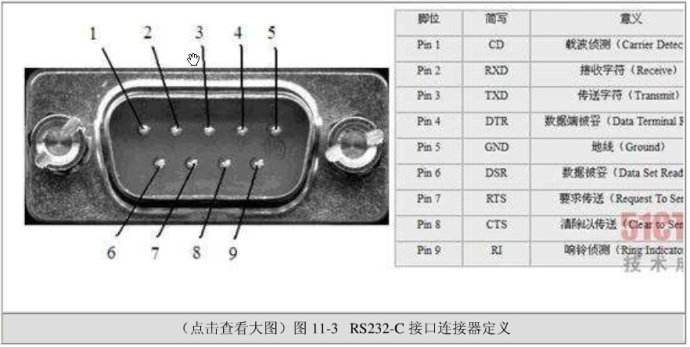

### 7.5 并行接口
&#160; &#160; &#160; &#160;并行接口，指采用并行传输方式来传输数据的接口标准。从最简单的一个并行数据寄存器或专用接口集成电路芯片如8255、6820等，一直至较复杂的SCSI或IDE并行接口，种类有数十种。一个并行接口的接口特性可以从两个方面加以描述：1. 以并行方式传输的数据通道的宽度，也称接口传输的位数；2. 用于协调并行数据传输的额外接口控制线或称交互信号的特性。 数据的宽度可以从1～128位或者更宽，最常用的是8位，可通过接口一次传送8个数据位。在计算机领域最常用的并行接口是通常所说的LPT接口。

### 7.6 视频接口
#### 7.6.1 VGA
&#160; &#160; &#160; &#160;VGA（Video Graphics Array）视频图形阵列是IBM于1987年提出的一个使用模拟信号的电脑显示标准。VGA接口即电脑采用VGA标准输出数据的专用接口。VGA接口共有15针，分成3排，每排5个孔，显卡上应用最为广泛的接口类型，绝大多数显卡都带有此种接口。它传输红、绿、蓝模拟信号以及同步信号(水平和垂直信号)。VGA接头：针数为15的视频接口，主要用于老式的电脑输出。VGA输出和传递的是模拟信号。大家都知道计算机显卡产生的是数字信号，显示器使用的也是数字信号。所以使用VGA的视频接口相当于是经历了一个数模转换和一次模数转换。信号损失，显示较为模糊。

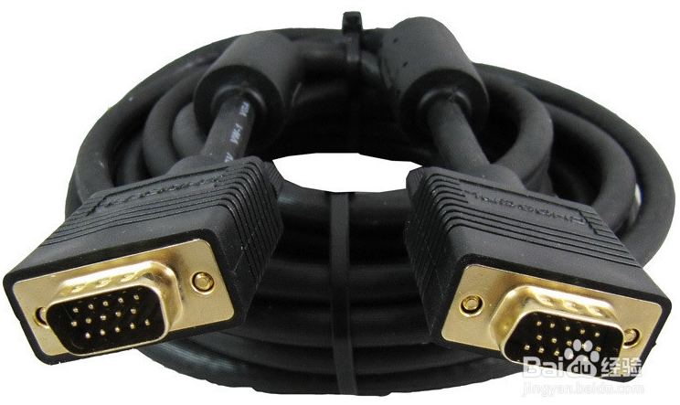

#### 7.6.2 DVI
&#160; &#160; &#160; &#160;DVI接口：DVI接口有两个标准，25针和29针，如下图所示。直观来说，这两种接口没有区别。DVI接口传输的是数字信号，可以传输大分辨率的视频信号。DVI连接计算机显卡和显示器时不用发生转换，所以信号没有损失。DVI（Digital Visual Interface），即数字视频接口。它是1998年9月，在Intel开发者论坛上成立的，由Silicon Image、Intel（英特尔）、Compaq（康柏）、IBM、HP（惠普）、NEC、Fujitsu(富士通)等公司共同组成的DDWG（Digital Display Working Group，数字显示工作组）推出的接口标准。

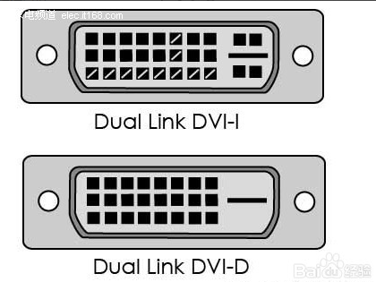

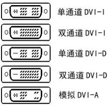

#### 7.6.3 HDMI
&#160; &#160; &#160; &#160;HDMI接口：HDMI接口传输的也是数字信号，所以在视频质量上和DVI接口传输所实现的效果基本相同。HDMI接口还能够传送音频信号。假如显示器除了有显示功能，还带有音响时，HDMI的接口可以同时将电脑视频和音频的信号传递给显示器。HDMI有三个接口。主要考虑到设备的需要。如数码相机的体积小，需要小的接口，就使用micro HDMI。三种接口只是在体积上有区别，功能相同

#### 7.6.4 DP
&#160; &#160; &#160; &#160;DisplayPort（简称DP）是一个由PC及芯片制造商联盟开发，视频电子标准协会（VESA）标准化的数字式视频接口标准。该接口免认证、免授权金，主要用于视频源与显示器等设备的连接，并也支持携带音频、USB和其他形式的数据。此接口的设计是为取代传统的VGA、DVI和FPD-Link（LVDS）接口。通过主动或被动适配器，该接口可与传统接口（如HDMI和DVI）向后兼容。

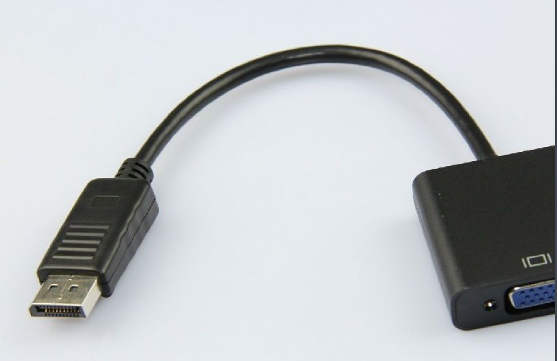
