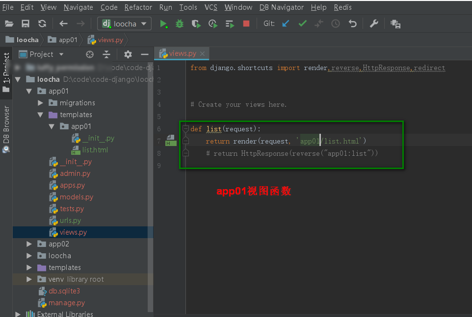

<center><h1>django 多app 相同URL</h1></center>

## 1. 介绍
&#160; &#160; &#160; &#160;在Django开发过程中，经常会用到路由别名（即url中的name）

```
urlpatterns = [
    url(r'^list/', views.list, name='list'),
]
```
&#160; &#160; &#160; &#160;但在一个Django项目中通常会存在多个app也就是说会存在多个urls.py文件，而每个urls.py文件中会存在多条路由，这就难免会存在相同的别名，而在调用别名时，如果不对sessing.py文件进行设置的话，就会出现找错别名的问题，可能会找到的是别的app下的别名。这时需要对对sessing.py文件进行设置。

## 1.1 设置settings.py
在sessing.py文件中找到 TEMPLATES 做如下修改：

```
TEMPLATES = [
    {
        'BACKEND': 'django.template.backends.django.DjangoTemplates',
        'DIRS': [os.path.join(BASE_DIR, 'templates')],
        'APP_DIRS': True,
        'OPTIONS': {
            'context_processors': [
                'django.template.context_processors.debug',
                'django.template.context_processors.request',
                'django.contrib.auth.context_processors.auth',
                'django.contrib.messages.context_processors.messages',
            ],
        },
    },
]
```

!!! note "注意"
    ```python
    'APP_DIRS': True,
        True：表示优先在当前app下进行查找别名
        False:表示在全局（整个项目）进行别名查找
    ```

## 1.2 配置和引用

```
在app下新建文件夹templates,在templates里面建立app同名文件夹,再放入html模版 
引用模版的时候,采用appname/index.html 这种方式即可
```


## 2. 实例
### 2.1 修改APP_DIRS
找到django的项目名称下的settings.py文件。修改

```
'APP_DIRS': True,
```


urls.py

```
from django.contrib import admin
from django.urls import path
from django.conf.urls import include,url

urlpatterns = [
    path('admin/', admin.site.urls),
    # url(r'^rbac/', include(('rbac.urls', "rbac"), namespace='rbac')),
    url(r'^app01/', include(('app01.urls', "app01"), namespace='app01')),
    url(r'^app02/', include(('app02.urls', "app02"), namespace='app02')),
]
```
把两app的各自路由都分配到自己的app下，然后在项目的urls.py 添加


### 2.2 app01
#### 2.2.1 urls

```
from django.conf.urls import include, url
from app01 import views

urlpatterns = [
    url(r'^list/', views.list, name='list'),
]
```


#### 2.2.2 views

```
def list(request):
    return render(request, 'app02/list.html')
    # return HttpResponse(reverse("app01:list"))
```



#### 2.2.3 html

```
<!DOCTYPE html>
<html lang="en">
<head>
    <meta charset="UTF-8">
    <title>Title</title>
</head>
<body>
<h1>from app01 list</h1>
</body>
</html>
```


### 2.3 app02
#### 2.3.1 url

```
from django.conf.urls import include, url
from app02 import views

urlpatterns = [
    url(r'^list/', views.list, name='list'),
    url(r'^app02_list/', views.app02_list, name='app02_list'),
]
```


#### 2.3.2 views

```
def list(request):
    return render(request, 'app02/list.html')
```


#### 2.3.3 html

```
<!DOCTYPE html>
<html lang="en">
<head>
    <meta charset="UTF-8">
    <title>Title</title>
</head>
<body>
<h1>from app02 bak</h1>
</body>
</html>
```


### 2.4 测试
我们分别输入app01/list app02/list 查看结果


!!! note "总结"
    ```python
    为了解决多app同名url name的时候，最好的办好就是在各自的app的下面的templates下面再建立一个以app名字的文件。然后再写视图模板的html网页
    ```
    

