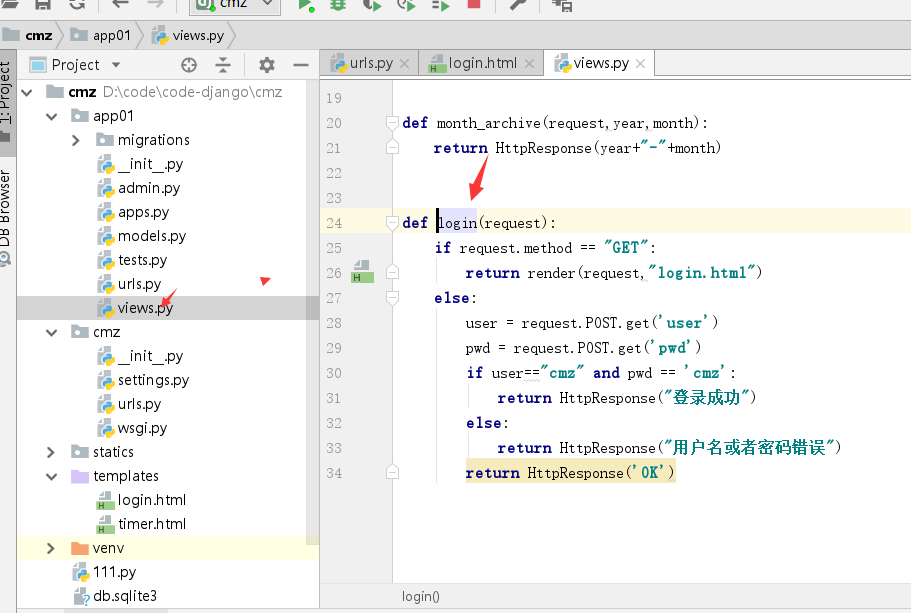
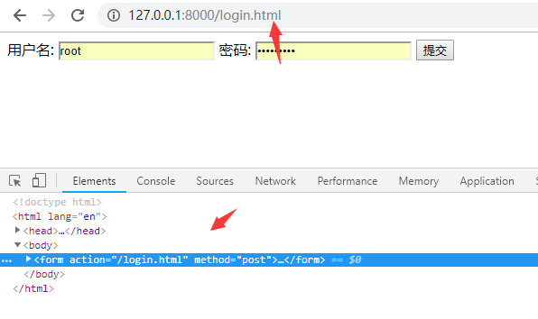
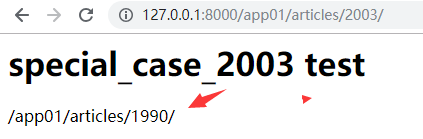

<center><h1>Django 反向解析</h1></center>

## 1. 介绍
Django中提供了一个关于URL的映射的解决方案，你可以做两个方向的使用:

- 1.有客户端的浏览器发起一个url请求，Django根据URL解析，把url中的参数捕获，调用相应的试图，
获取相应的数据，然后返回给客户端显示

- 2.通过一个视图的名字，再加上一些参数和值，逆向获取相应的URL

第一个就是平常的请求有URLconf来解析的过程，第二个叫做，url的逆向解析，url逆向匹配，url的逆向查阅等

Django提供了不同的层级的url逆向处理工具：

- 1.在模板templates中，使用url标记，如：
- 2.在Python代码中，使用django.core.urlresolvers.reverse()方法

## 2. 反向解析url
### 2.1 url
```
urlpatterns = [
    path('admin/', admin.site.urls),
    path("login",views.login,name="Log")
]
```


### 2.2 views
```
def login(request):
    if request.method == "GET":
        return render(request,"login.html")
    else:
        user = request.POST.get('user')
        pwd = request.POST.get('pwd')
        if user=="cmz" and pwd == 'cmz':
            return HttpResponse("登录成功")
        else:
            return HttpResponse("用户名或者密码错误")
        return HttpResponse('OK')
```



### 2.3 html
```
<!DOCTYPE html>
<html lang="en">
<head>
    <meta charset="UTF-8">
    <title>login</title>
</head>
<body>

{#<form action="http://127.0.0.1:8000/login" method="post">#}
<form action="" method="post">
{#<form action="" method="post">#}
    用户名: <input type="text" name="user">
    密码: <input type="password" name="pwd">
    <input type="submit" name="提交">
</form>
</body>
</html>
```


### 2.4 测试


### 2.4.1 改变url
接下来，我改变将之前的"login"改为"login.html"
```
path("login.html",views.login,name="Log")
```


我在（保存后pycharm自动重启django）重新访问。



```
这个地方会自动关联（绑定了这种关系）就是通过name="Log"来实现。
path("login.html",views.login,name="Log")
这种就是反向解析
```


## 3. 反向解析 python
反向解析除了在html的模板中使用，还可以在python中使用


测试访问


带有正则的必须要传入参数




> reverse的第一个参数是urls.py的url中的name。比如上面的s_c_2003 y_a
