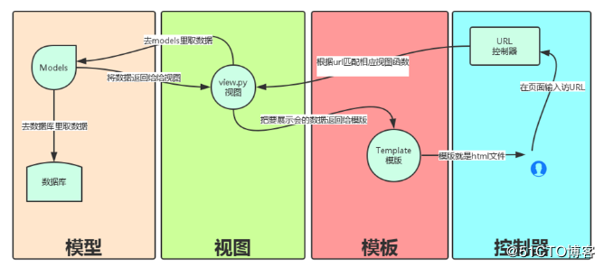

<center><h1>flask 路由</h1></center>
&#160; &#160; &#160; &#160; 现代 Web 应用的 URL 十分优雅，易于人们辨识记忆，这一点对于那些面向使用低速网络连接移动设备访问的应用特别有用。如果可以不访问索引页，而是直接访问想要的那个页面，他们多半会笑逐颜开而再度光顾。

&#160; &#160; &#160; &#160; flask的 route() 装饰器把一个函数绑定到对应的 URL 上。

## 1. MTV
&#160; &#160; &#160; &#160;在开始flask的路由之前，我们先说下，著名的MVC模式：所谓MVC就是把web应用分为模型(M),控制器(C),视图(V)三层；他们之间以一种插件似的，松耦合的方式连接在一起。
模型负责业务对象与数据库的对象(ORM),视图负责与用户的交互(页面)，控制器(C)接受用户的输入调用模型和视图完成用户的请求。

&#160; &#160; &#160; &#160;一个视图函数（类），简称视图，是一个简单的Python 函数（类），它接受Web请求并且返回Web响应。响应可以是一张网页的HTML内容，一个重定向，一个404错误，一个XML文档，或者一张图片。无论视图本身包含什么逻辑，都要返回响应。代码写在哪里也无所谓，只要它在你当前项目目录下面。除此之外没有更多的要求了——可以说“没有什么神奇的地方”。


### 1.1 MTV
&#160; &#160; &#160; &#160; 以下是django的架构图。

- Model(模型)：负责业务对象与数据库的对象(ORM)
- Template(模版)：负责如何把页面展示给用户
- View(视图)：负责业务逻辑，并在适当的时候调用Model和Template



## 2. flask动态路由
&#160; &#160; &#160; &#160; Flask 的 URL 规则基于 Werkzeug 的路由模块。这个模块背后的思想是基于 Apache 以及更早的 HTTP 服务器主张的先例，保证优雅且唯一的 URL。
### 2.1 参数
&#160; &#160; &#160; &#160; 大致分以下几类

```
# 1. 接收字符串类型参数
@app.route('/user/<name>')

# 2. 接收整型数字参数
@app.route('/<int:age>')

# 3. 接收浮点型数字参数 
@app.route('/<float:salary>')

# 4. 接收URL链接类型参数 
@app.route('/<path:path>')
```

!!! note "解释"
    ```python
    int  	接受整数
    float	同 int ，但是接受浮点数
    path	和默认的相似，但也接受斜线
    要给 URL 添加变量部分，你可以把这些特殊的字段标记为 <variable_name> ， 这个部分将会作为命名参数传递到你的函数。规则可以用 <converter:variable_name> 指定一个可选的转换器。
    ```


### 2.2 code
```
#!/usr/bin/python
# _*_ coding: utf-8 _*_
"""
@Time    : 2019/3/3 22:12
@File    : url_demo.py
@Software: PyCharm
@author  : caimengzhi
"""

from flask import Flask

app = Flask(__name__)


@app.route('/<name>')   # 设置url传参数 http://127.0.0.1:7000/cmz
def first_flask(name):  # 视图必须有对应接收参数
    print(name)
    return 'Hello  {}'.format(name)


@app.route('/<int:age>/')  # 设置url传参数 http://127.0.0.1:7000/30
def second_flask(age):     # 视图必须有对应接收参数
    print(age)
    return 'my age is '.format(age)


@app.route('/<float:salary>/') # 设置url传参数 http://127.0.0.1:7000/88.88
def three_flask(salary):   # 视图必须有对应接收参数
    print(salary)
    return 'my salary is {}'.format(salary)


@app.route('/<path:url>/') # 设置url传参数 http://127.0.0.1:7000/http://www.jd.com
def four_flask(url):   # 视图必须有对应接收参数
    print(url)
    return 'my url {}'.format(url)


if __name__ == '__main__':
    app.run('0.0.0.0', 7000, debug=True)
```


### 2.3 测试

- 测试 name

    &#160; &#160; &#160; &#160; 当问我们 127.0.0.1:7000/cmz，flask匹配的是`@app.route('/<name>')`，此时候浏览器会显示 hello cmz，也就是后面的位置是string都是显示。

- 测试age

    &#160; &#160; &#160; &#160; 当问我们 127.0.0.1:7000/30，flask匹配的是`@app.route('/<int:age>')`，此时候浏览器会显示 my age 30，也就是后面的位置是整数数字都是显示
    
- 测试salary

    &#160; &#160; &#160; &#160; 当问我们 127.0.0.1:7000/88.88，flask匹配的是`@app.route('/<float:salary>')`，此时候浏览器会显示 my salary is 88.88，也就是后面的位置是浮点数字都是显示

- 测试url

    &#160; &#160; &#160; &#160; 当问我们 127.0.0.1:7000/http://www.jd.com，flask匹配的是`@app.route('/<path:url>')`，此时候浏览器会显示my url http://www.jd.com，也就是后面的位置是url地址
    
## 3. HTTP方法
&#160; &#160; &#160; &#160;HTTP （与 Web 应用会话的协议）有许多不同的访问 URL 方法。默认情况下，路由只回应 GET 请求，但是通过 route() 装饰器传递 methods 参数可以改变这个行为。这里有一些例子:

### 3.1 代码模拟
```
#!/usr/bin/python
# _*_ coding: utf-8 _*_
"""
@Time    : 2019/3/3 22:12
@File    : url_demo.py
@Software: PyCharm
@author  : caimengzhi
"""

from flask import Flask, request

app = Flask(__name__)


@app.route('/login', methods=['GET', 'POST'])
def login():
    if request.method == 'POST':
        return "POST"
    elif request.method == "GET":
        return "GET"
    else:
        return "NO POST,GET"


if __name__ == '__main__':
    app.run('0.0.0.0', 7000, debug=True)
```
&#160; &#160; &#160; &#160;如果存在 GET ，那么也会替你自动地添加 HEAD，无需干预。它会确保遵照 HTTP RFC （描述 HTTP 协议的文档）处理 HEAD 请求，所以你可以完全忽略这部分的 HTTP 规范。同样，自从 Flask 0.6 起， 也实现了 OPTIONS 的自动处理。以下是常见的：

方法| 描述
---|---
GET|浏览器告知服务器：只 获取 页面上的信息并发给我。这是最常用的方法。
HEAD|浏览器告诉服务器：欲获取信息，但是只关心 消息头 。应用应像处理 GET 请求一样来处理它，但是不分发实际内容。在 Flask 中你完全无需 人工 干预，底层的 Werkzeug 库已经替你打点好了。
POST|浏览器告诉服务器：想在 URL 上 发布 新信息。并且，服务器必须确保 数据已存储且仅存储一次。这是 HTML 表单通常发送数据到服务器的方法。
PUT|类似 POST 但是服务器可能触发了存储过程多次，多次覆盖掉旧值。你可 能会问这有什么用，当然这是有原因的。考虑到传输中连接可能会丢失，在 这种 情况下浏览器和服务器之间的系统可能安全地第二次接收请求，而 不破坏其它东西。因为 POST 它只触发一次，所以用 POST 是不可能的。
DELETE|删除给定位置的信息。


### 3.2 测试
```
root@leco:~/code/flask# curl 127.0.0.1:7000/login
GET

root@leco:~/code/flask# curl  127.0.0.1:7000/login -d 'title="cmz"'
POST
```
