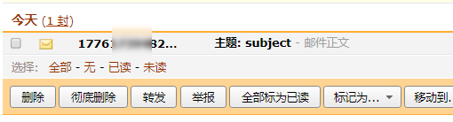

<center><h1> yagmail 实现发邮件 </h1></center>
## 1. 介绍
yagmail 可以更简单的来实现自动发邮件功能。

[github项目地址](https://github.com/kootenpv/yagmail)

## 2. 安装

```
pip install yagmail
```

## 3. 发邮件
### 3.1 不带附件

```
root@leco:~/code/email# cat demo.py
import yagmail

#链接邮箱服务器
yag = yagmail.SMTP(user="caimengzhi@163.com", password="caimengzhi", host='smtp.163.com')

# 邮箱正文
contents = ['邮件正文']

# 发送邮件
yag.send('caimengzhi@qq.com', '主题: subject', contents)
print("已发送邮件")
```




??? note "参数解释"
    ```python
    1. user      登录邮箱，邮箱账号
    2. password  163/126/qq 等邮箱的授权码
    3. host      邮件服务器主机名 
                    -  smtp.126.com
                    -  smtp.163.com
                    -  smtp.qq.com
    4. contents  邮件正文
    5. subject   邮件主题
    ```
    
### 3.2 带附件

### 3.2.1 单人接受邮件

```
root@leco:~/code/email# cat single.py
import yagmail

yag = yagmail.SMTP(user='caimengzhi@163.com', password='caimengzhi', host='smtp.163.com', port='465')
body = "邮件正文: 这是最近工作的文件，请查收。"
yag.send(to='caimengzhi@qq.com', subject='邮件标题: 工作文件', contents=[body, './linux.jpg', './lib_yagmail.py'])
print("已发送邮件")
```


### 3.2.2 多人接受邮件

```
root@leco:~/code/email# cat many.py
import yagmail

yag = yagmail.SMTP(user='caimengzhi@163.com', password='caimengzhi', host='smtp.163.com', port='465')
body = "邮件正文: 这是最近工作的文件，请查收。"
yag.send(['caimengzhi@qq.com','caimengzhi@163.com'], subject='邮件标题: 工作文件', contents=[body, './linux.jpg', './lib_yagmail.py'])
print("已发送邮件")
```


??? note "参数解释"

    ```python
    单人和多人接受的区别就是
    - 单人接受邮件，就写一个接受邮件人邮箱
    - 多人接受邮件，就写一个接受邮件人邮箱列表，把所有接受人邮箱写到这个列表里面
    ./linux.jpg ./lib_yagmail.py 要发送的邮件附件
    ```

!!! danger "注意"

    ```python
      以上所有code的个人信息，我都换成caimengzhi，根据自己的实际情况填写
    ```
