<center><h1> 利器GIT </h1></center>

## 1. 介绍

&#160; &#160; &#160; &#160; Git 是一个开源的分布式版本控制系统，用于敏捷高效地处理任何或小或大的项目。

&#160; &#160; &#160; &#160; Git 是 Linus Torvalds 为了帮助管理 Linux 内核开发而开发的一个开放源码的版本控制软件。

&#160; &#160; &#160; &#160; Git 与常用的版本控制工具 CVS, Subversion 等不同，它采用了分布式版本库的方式，不必服务器端软件支持。

### 1.2. Git 与 SVN 区别

&#160; &#160; &#160; &#160; Git 不仅仅是个版本控制系统，它也是个内容管理系统(CMS)，工作管理系统等。如果你是一个具有使用 SVN 背景的人，你需要做一定的思想转换，来适应 Git 提供的一些概念和特征。

Git 与 SVN 区别点：

- 1、Git 是分布式的，SVN 不是：这是 Git 和其它非分布式的版本控制系统，例如 SVN，CVS 等，最核心的区别。
- 2、Git 把内容按元数据方式存储，而 SVN 是按文件：所有的资源控制系统都是把文件的元信息隐藏在一个类似 .svn、.cvs 等的文件夹里。
- 3、Git 分支和 SVN 的分支不同：分支在 SVN 中一点都不特别，其实它就是版本库中的另外一个目录。
- 4、Git 没有一个全局的版本号，而 SVN 有：目前为止这是跟 SVN 相比 Git 缺少的最大的一个特征。
- 5、Git 的内容完整性要优于 SVN：Git 的内容存储使用的是 SHA-1 哈希算法。这能确保代码内容的完整性，确保在遇到磁盘故障和网络问题时降低对版本库的破坏。

 &#160; &#160; &#160; 总之Git和SVN是两个完全不同思维方式的版本管理，理解Git要完全抛弃SVN的思维和操作。

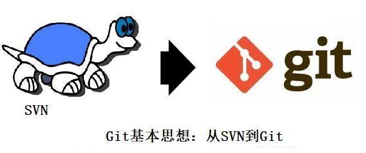

### 1.3 分布式

 &#160; &#160; &#160; 和SVN中心集中式文件管理的仓储管理不同，Git从设计到诞生就以融入了分布式基因。虽然Git也有服务器端的Github、Gitlab、Gogs等多种服务器端，但是Git所有操作都可以无服务器存在，你可以只在本地都能完成所有git操作，可以在目录之间实现clone、push和pull等需要服务器端的操作。设置权限和通讯方法后，Git客户端直接也完全可以实现这些操作。所以我们说Git是天然分布式，无需中心服务器 介入。Git服务器的引入一个好处就是把一些操作（比如添加证书，建立账号、仓库元信息）和通讯传输方法（http、ssh），及大量更多扩展功能在服务器端Web界面实现了，方便了用户的使用。分布式的一个好处是代码变化push好的仓库数据，最少保留两份：本地一份和服务器一份，不怕丢。

### 1.4 优点

 &#160; &#160; &#160; Git中仓库信息都是以hash健值方式保存文件相当于一个数据库，当用户子工作区做了add操作后，此后变化信息就成了Git对象数据库了（blob、commit、three对象）。通过git命令（git clone checkout rest）可以实现把git数据库（commit历史库和暂存区），变化成用户实际接触到文件和目录的工作区。

 &#160; &#160; &#160; 这是Git，独特之处和优势之处，也是很多初学者迷惑指出，尤其拿之前使用SVN的人无法理解的。Git的四个区（工作区、暂存区、本地仓库区和远程仓库区），五个状态转化流程如下：

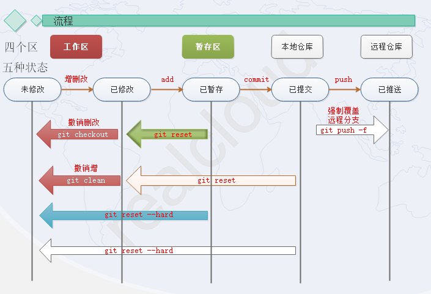

 &#160; &#160; 知道了这些Git就很多问题就都很好理解了。比如分支，比如标签tag，比如Head这些都是对特定commit的指针，所以对拉分支，分支间转化都很容易，不过把指针（分支，Head）指向某个commit，然后利用该commit ID再生成工作区而已，看上去就和在不同分支的文件目录下切换，而且非常迅速，因为Git的是按照差异对比来生成差异的目录和文件的。

### 1.5 工作原理


## 2.部署

### 2.1 安装客户端

&#160; &#160; 自行百度下载。

我以windows安装为例讲述。把以下三个软件下载。

```
Git-2.21.0-64-bit.exe 08-Apr-2019 15:34  44M   
TortoiseGit-2.8.0.0-64bit.msi 08-Apr-2019 15:24  19M   
TortoiseGit-LanguagePack-2.8.0.0-64bit-zh_CN.msi 08-Apr-2019 15:24  4.1M   
```

### 2.2 安装Git

```
Git-2.21.0-64-bit.exe
```

双击安装，不要做任何修改[除非你知道怎么安装]，安装完毕后，在windows桌面，右击可以看到以下两个命令。

```
Git GUI Here
Git Bash Here
```

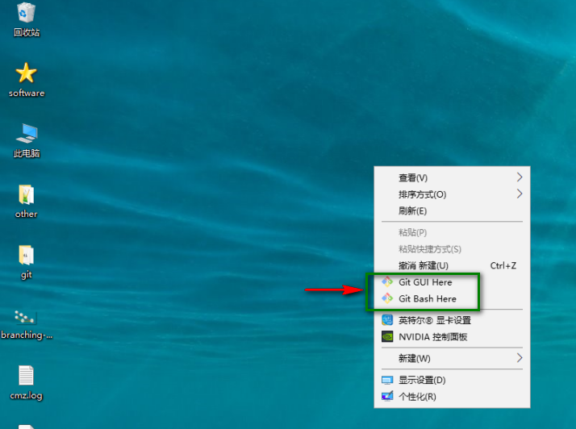

以上说明你git软件在windows端安装成功。

### 2.3 安装TortoiseGit

接下来安装安装git的windows图像化工具TortoiseGit[俗称git小乌龟]。双击安装。

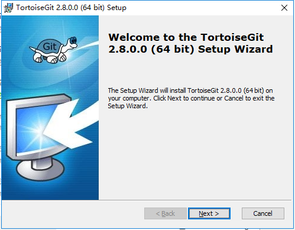

点击中间的Next按钮。

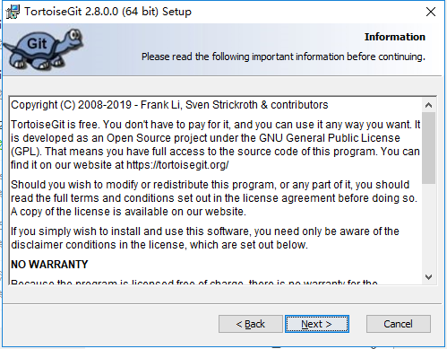

继续点击中间的Next按键。


保持默认。继续点击中间Next按键。


不要任何操作。除非你知道怎么安装。不知道的话，就点击那个Next按键。


点击中间的Install按键，等待安装完毕。


此时点击Finsh按键。

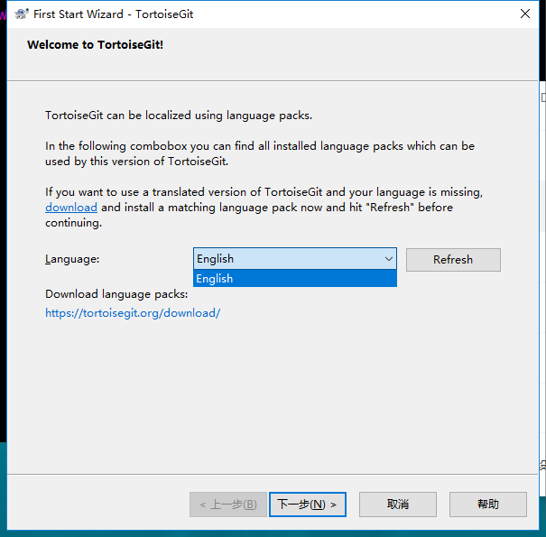

此时此页面不要着急关闭，去安装汉化包[不需要的可以直接点击下一步]

### 2.4 安装TortoiseGit汉化

双击安装汉化包。`TortoiseGit-LanguagePack-2.8.0.0-64bit-zh_CN.msi`


点击下一步按钮。


此时安装完毕，不要配置，点击完成按钮。

### 2.5 配置TortoiseGit汉化

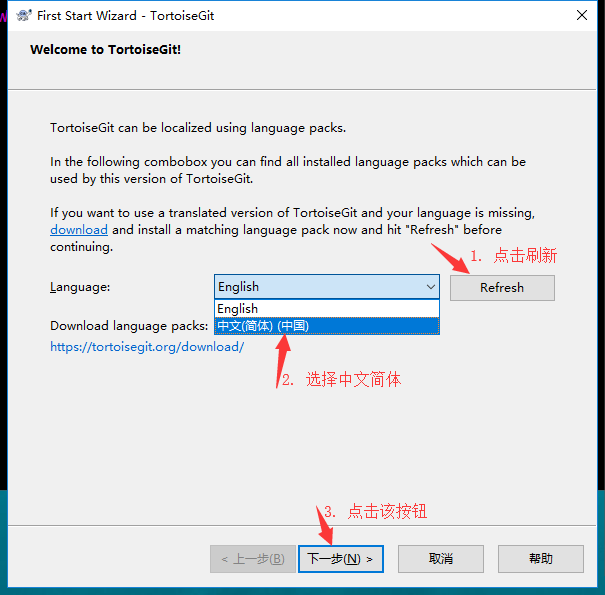


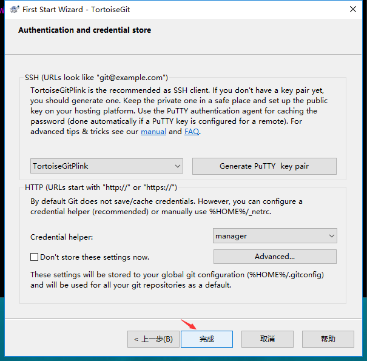

安装完毕。

### 2.6 配置全局变量

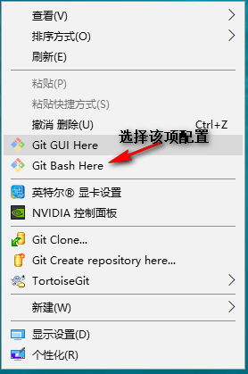

桌面右击，选择`Git Bash Here`  对git进行全局配置

```
git config --global credential.helper store
git config --global https.sslVerify false
```

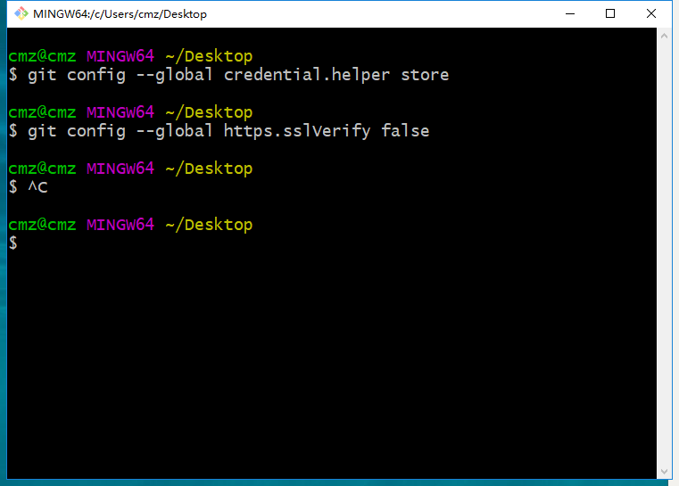

如上述操作。想知道这个干吗，自行去使用现代化工具[百度传送门](https://www.baidu.com/)

## 3. 克隆项目

### 3.1 存储

找到合适的项目存放地点，新建一个空文件夹，文件夹名字看你心情，接下来我创建一个server[我属于服务器组]文件夹。

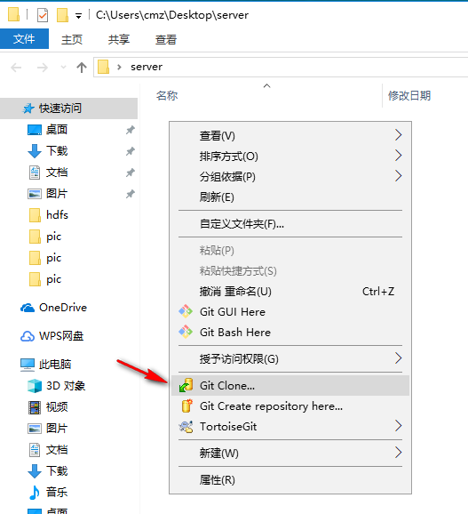

进入新建的server文件夹，右击 选择`Git Clone`选项，然后进项项目克隆[从远处的Git服务器仓库把隶属你的仓库项目克隆到你本地]。


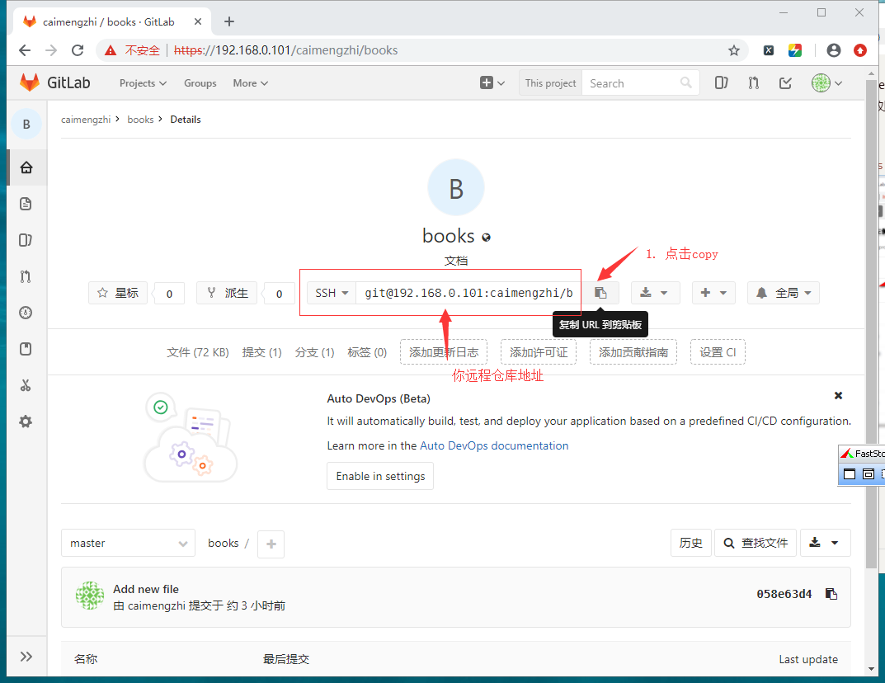

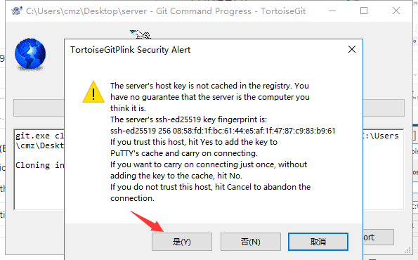

此时会弹出你验证。此时输入你的账号和密码[找hank申请]即可


到此为止，你从远处git仓库克隆项目到本地结束。


## 4. 简单实用

以下是我以这个GUI的小乌龟为例，讲述在工作中简单的如何使用。

### 4.1 项目下载

在你提交之前，==一定要先同步==

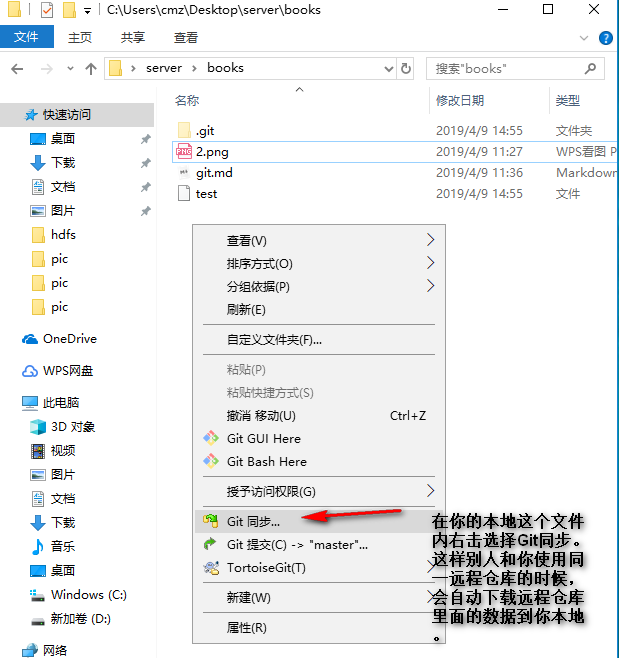


### 4.2 项目上传

进入books文件夹内，把你要上传的文件放在该文件夹内。期中

```
.git  这个文件夹千万别修改，除非你知道怎么修改
```

在你提交之前，==一定要先同步==


我把上传的两个文件2.png和git.md文件放在这个文件夹内。

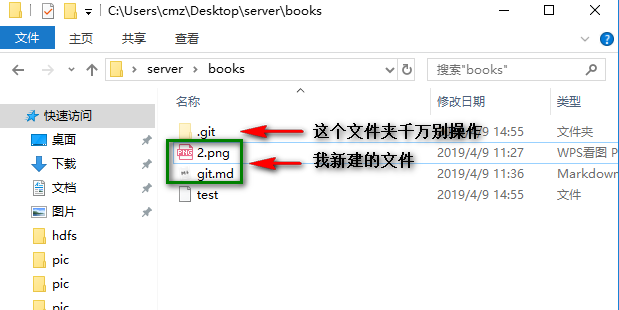


此时右击选择提交。

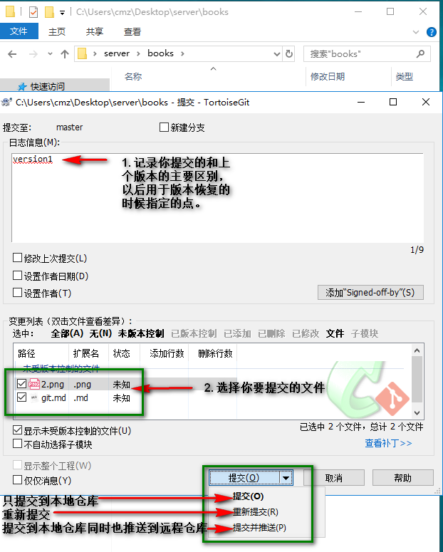

我说明一下提交的时候三个按钮的区别

```
1. 提交： 只提交到你本地的仓库，其他人是看不到你的信息，假如你电脑坏了，数据也就随之东去。
2. 重新提交: 你提交后，再次修改后，又可以在提交。
3. 提交并推送: 你把文件提交自己的仓库，同时也提交到远程仓库，这样别人就可以从远程拉取你的项目资料了。即使你本地电脑挂了，数据还可以还原。一般使用这个按钮。
```


我使用了，提交并推送。此时会弹出推送情况。会根据你提交的文件总大小和网络带宽显示进度条信息速度。

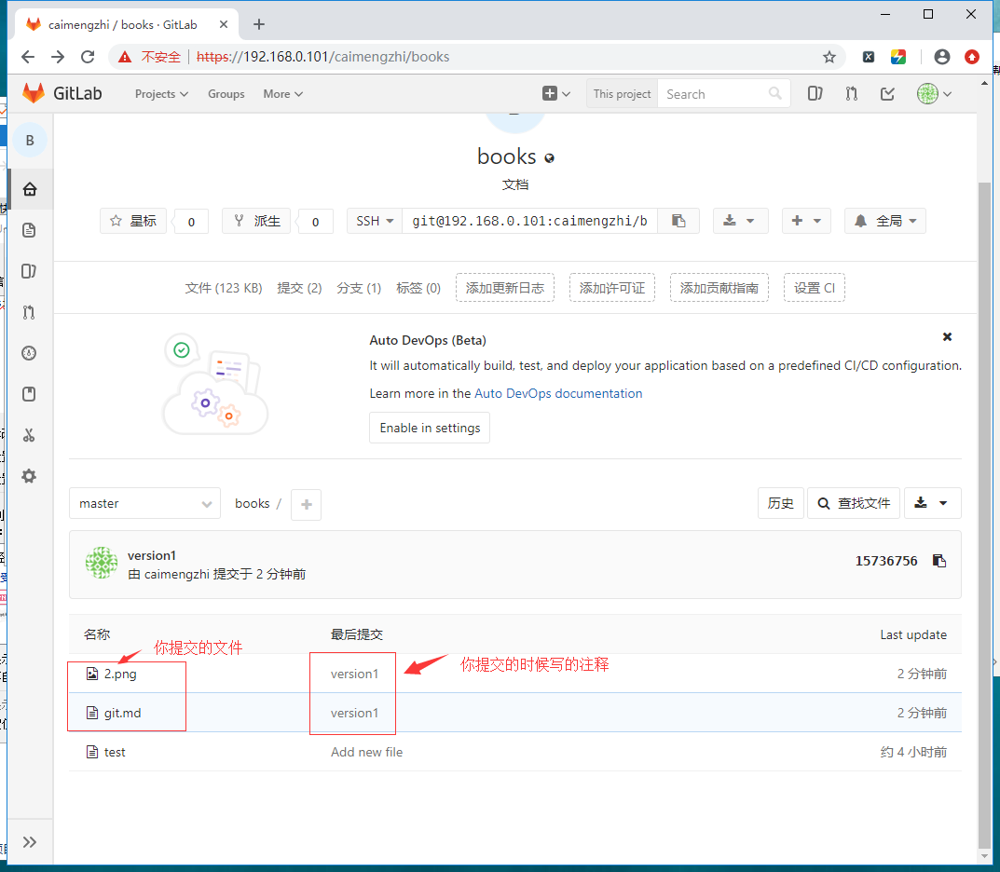

登录到你项目的后台[gitlab后台]，可以查看你提交的文件相关情况。然后你对文件修改，删除，等操作，都是上面的操作，先更新，然后提交，然后写注释，然后提交并推送，然后你就可以愉快的玩耍了。

