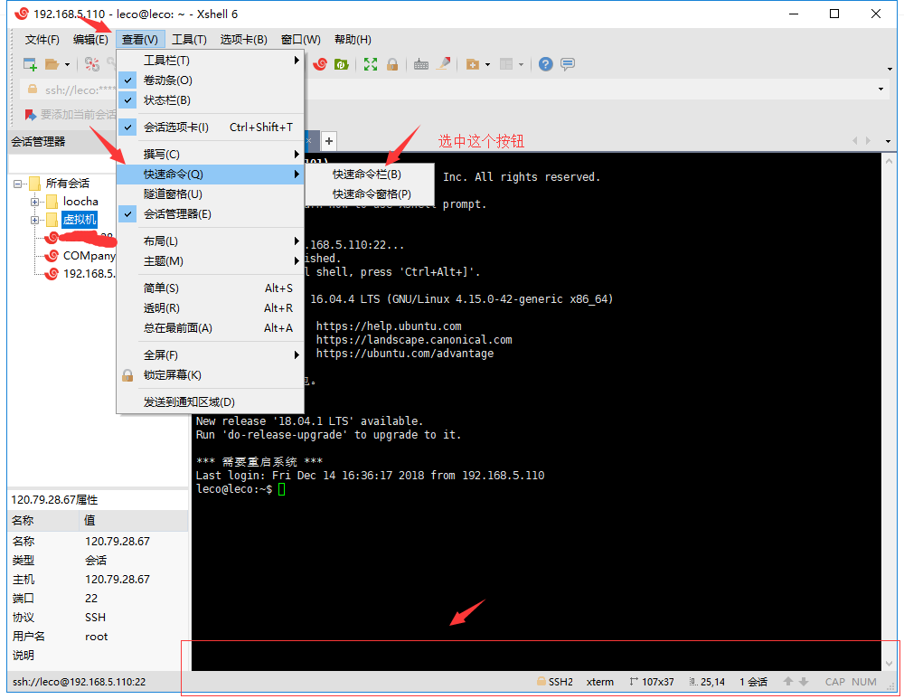

<center><h1> XSHELL 配置迁移 </h1></center>

## 1. 起因
&#160; &#160; &#160; &#160;xshell 重新安装的时候，或者在别的机器上安装新的xshell的时候，那么怎么迁移一台机器的配置的数据到另一个机器上呢？
本文是详细记录将一个机器上配置好的xshell的所有配置参数，导入到新安装的xshell机器上。


## 2. xshell快速命令数据导出
### 2.1 数据导出

&#160; &#160; &#160; &#160;迁移会话（当前服务器主机配置），当前服务器配置导出	
```
文件--》导出--》下一步
```


### 2.2 数据导入
新的服务器配导入上面备份的数据。
```
文件--》导入--》选择导入的.xts文件(之前导出的数据)
```


## 3. xshell服务器数据导出
### 3.1 数据导出
```
工具--》快速命令集--》选择当前的组导出
```


### 3.2 数据导入
新的服务器配导入上面备份的数据。
```
工具--》快速命令集--》
```


开关快速命令窗口


下面本来是没有快速命令窗口的，开启后就有了

