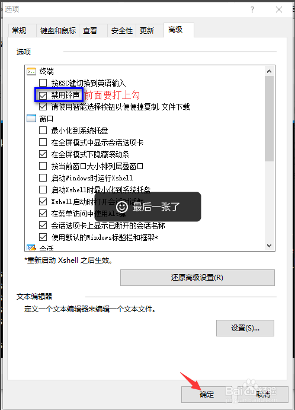
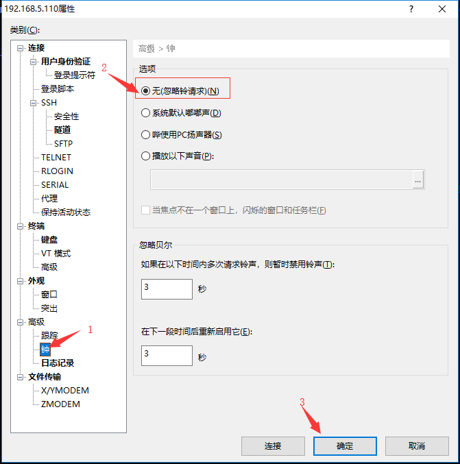

<h1> xshell 去除声音 </h1>

## 1. 介绍
&#160; &#160; &#160; &#160; 新安装的xshell会有默认的声音，对于我这样经常使用xshell的人来说这声音对我来说的确很特烦。动不动的就来个声音。下面记录，我彻底关闭xshell声音的步骤。xshell5和xshell6。地方不一样。

## 2. xshell5 

工具 --> 选项 --> 高级 --> 禁用铃声 

在禁用铃声前面打钩，选择该项，去掉默认的声音。

## 3. xshell6

文件 --> 属性 --> 高级  --> 钟 --> 选项 --> 无[忽略铃请求] 

在无[忽略铃请求]前面打钩，选择该项，去掉默认的声音。

